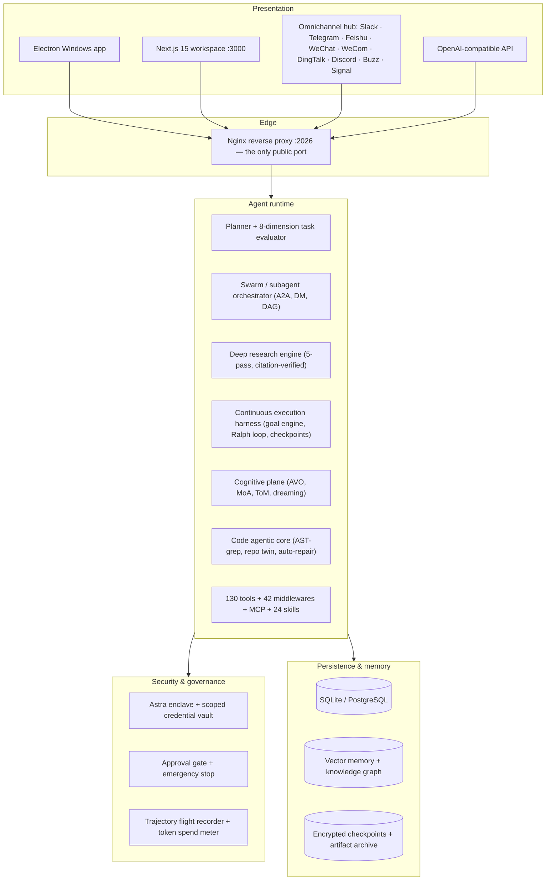

<div align="center">

# Alpha 🐺

### The Open-Source Autonomous Multi-Agent AI Operating System

**Alpha is a self-hosted, local-first AI agent platform that plans, executes, and
verifies long-horizon work.** It runs a LangGraph agent runtime behind a FastAPI
Gateway with a Next.js 15 web workspace and a Windows desktop app — combining deep
research, multi-agent swarms, sandboxed code execution, persistent memory, 130 native
tools, MCP extensions, and 24 public skills, with a single Nginx entry point and no
proprietary backend.

[](https://github.com/itsPremkumar/alpha/actions/workflows/backend-unit-tests.yml)
[](https://github.com/itsPremkumar/alpha/actions/workflows/lint-check.yml)
[](https://github.com/itsPremkumar/alpha/actions/workflows/frontend-unit-tests.yml)
[](https://github.com/itsPremkumar/alpha/actions/workflows/e2e-tests.yml)
[](https://github.com/itsPremkumar/alpha/actions/workflows/generated-drift-gate.yml)
[](https://github.com/itsPremkumar/alpha/actions/workflows/windows-installer.yml)
[](https://github.com/itsPremkumar/alpha/releases)
[](https://github.com/itsPremkumar/alpha/stargazers)
[](https://github.com/itsPremkumar/alpha/network/members)
[](https://github.com/itsPremkumar/alpha/issues)
[](https://opensource.org/licenses/MIT)

[](./backend/pyproject.toml)
[](./backend/pyproject.toml)
[](./backend/pyproject.toml)
[](./frontend/package.json)
[](./frontend/package.json)
[](./Makefile)
[](./electron/README.md)
[](./docker/docker-compose.yaml)
[](./docs/EXTENSIONS.md)

**Quick links:** [60-Second Quickstart](#60-second-quickstart) ·
[Alpha vs. other agent frameworks](#alpha-vs-other-agent-frameworks) ·
[Use cases](#what-can-you-build-with-alpha) ·
[Documentation](#documentation) ·
[FAQ](#faq) ·
[`llms.txt`](./llms.txt) (for AI agents) ·
[Releases](https://github.com/itsPremkumar/alpha/releases)

**Author:** [Prem Kumar](https://github.com/itsPremkumar) ·
**Repository:** [github.com/itsPremkumar/alpha](https://github.com/itsPremkumar/alpha) ·
**License:** [MIT](./LICENSE)

</div>

---

## Table of contents

- [What is Alpha?](#what-is-alpha)
- [Alpha at a glance](#alpha-at-a-glance)
- [Why Alpha?](#why-alpha)
- [Alpha vs. other agent frameworks](#alpha-vs-other-agent-frameworks)
- [What can you build with Alpha?](#what-can-you-build-with-alpha)
- [60-second quickstart](#60-second-quickstart)
- [Feature catalog](#feature-catalog)
- [System architecture](#system-architecture)
- [Deployment options](#deployment-options)
- [Configuration](#configuration)
- [Documentation](#documentation)
- [Extending Alpha](#extending-alpha)
- [Quality gates](#quality-gates)
- [Alpha Network: agent-to-agent communication](#alpha-network-agent-to-agent-communication)
- [FAQ](#faq)
- [Contributing](#contributing)
- [Security](#security)
- [Project provenance](#project-provenance)
- [Citation](#citation)

---

## What is Alpha?

**Alpha is an open-source autonomous multi-agent AI operating system** — a
self-hosted platform where LLM agents plan, execute, and verify long-horizon tasks
against your real tools, files, and the web, instead of only answering a chat prompt.

It is **not** a chat wrapper and **not** a hosted SaaS. You run it on your own
machine or your own server, bring your own model API keys, and every artifact
(thread, memory, checkpoint, artifact, audit record) stays on infrastructure you
control.

In one sentence:

> Alpha is a LangGraph-based agent operating system: a Python/FastAPI Gateway runs
> the agent runtime and 130 native tools, a Next.js 15 workspace and an Electron
> Windows app are the front ends, and a single Nginx port is the only thing you
> expose.

### The 60-second version

| Question | Answer |
| :--- | :--- |
| **What does it do?** | Turns one prompt into a verified, multi-step execution: research, plan, delegate to subagents, run sandboxed code, write files, ship results to Slack/Telegram/Feishu. |
| **How is it different from a chatbot?** | It has a durable run lifecycle, a sandbox, a memory plane, budgets, approval gates, and a full audit trail — it keeps working after you close the laptop. |
| **How is it different from a coding CLI?** | It is not tied to a repo or a language. Research, ops, data, docs, and messaging are first-class, not afterthoughts. |
| **Do I need a paid backend?** | No. Apache-2.0/MIT throughout, no Alpha-operated cloud, no broker, no telemetry requirement. You pay only for the model provider you configure. |
| **Which models?** | Any provider you put in `config.yaml` — OpenRouter, OpenAI, Anthropic, Google, DeepSeek, Moonshot, Ollama, and self-hosted endpoints. |
| **Does it run offline?** | Local models, local speech (Whisper + Piper), and local SQLite/PostgreSQL are all supported. |
| **Is it a framework or an app?** | Both. Use it as a finished app, or import `agent-workspace-harness` (`import alpha.*`) and build your own agent runtime on the same engines. |

---

## Alpha at a glance

| | |
| :--- | :--- |
| **Current version** | `2.1.0` |
| **Language / runtime** | Python 3.12+ (backend), TypeScript (frontend) |
| **Agent runtime** | LangGraph (async, checkpointed, interruptible) |
| **Gateway** | FastAPI 0.115+ / Starlette / Uvicorn — 60 routers |
| **Frontend** | Next.js 15 (App Router) + React 19 + Tailwind |
| **Desktop app** | Electron (Windows), self-contained runtimes, one-click NSIS installer |
| **Edge** | Nginx reverse proxy on `:2026` (the only public port) |
| **Persistence** | SQLite or PostgreSQL, vector memory, AES-GCM-encrypted checkpoints |
| **Sandboxing** | Local subprocess, Docker container, or Kubernetes provisioner |
| **Native tools** | 130 (`contracts/feature_manifest.json`, generated) |
| **Middleware layers** | 42 |
| **Background supervisor loops** | 8 |
| **Public skills** | 24 in `skills/public/` |
| **Integrations** | Telegram, Slack, Feishu/Lark, WeChat, WeCom, DingTalk, Discord, Buzz, Signal, GitHub webhooks, MCP, generic REST |
| **API compatibility** | OpenAI-compatible `POST /api/compat/openai/chat/completions` |
| **Harness subsystems** | 99 engine packages under `backend/packages/harness/alpha/` |
| **Backend tests** | pytest suite under `backend/tests/` (1,000+ test modules) |
| **License** | MIT |

### Architecture in one diagram



---

## Why Alpha?

Most agent frameworks give you a loop and leave the hard parts to you. Alpha ships
the parts that decide whether an autonomous agent is usable in production.

| Production problem | How Alpha solves it |
| :--- | :--- |
| **The agent dies mid-task** | Durable Boulder checkpoints, worker-lease fencing, and automatic resume after a crash, expired lease, or model error. Browser refresh never cancels work. |
| **It hallucinates that it finished** | A Goal Engine with verifiable completion criteria plus a finish-first evidence matrix. A run can complete and still be honestly reported as *unverified*. |
| **It burns your budget** | Token, tool-call, wall-clock, task, and replan budgets per run; explicit `budget_exhausted` / `stalled` states; cache-aware spend telemetry. |
| **It runs dangerous commands** | A risk-scoring approval gate, an emergency stop (Estop), a scoped credential vault, and per-thread sandbox isolation. |
| **You can't tell what it did** | A trajectory flight recorder and end-to-end artifact lineage tracing — cryptographic provenance from prompt to output. |
| **It can't use your tools** | 130 native tools, MCP over stdio/HTTP/SSE, a documented extension contract, and an OpenAI-compatible endpoint for third-party clients. |
| **It forgets everything** | A layered memory plane: working memory, episodic replay, semantic knowledge graph, and idle-time dreaming consolidation. |
| **It only works in a terminal** | Web workspace, Windows desktop app, and eight messaging platforms — all driving the same agent runtime. |
| **You can't evaluate it** | A benchmarks registry, a skill quality reviewer, a 5-pass research citation contract, and a generated `feature_manifest.json` that fails CI on registry drift. |

**Alpha is honest about its limits.** Where a capability is a local projection
rather than a real execution, or where a guarantee is restart-recoverable for one
process but not cross-process, the documentation says so. That is a design
decision, not a gap in the docs.

---

## Alpha vs. other agent frameworks

If you are evaluating agent frameworks, this is the section to read. Alpha is
**not** a competitor to every row — it sits in the "finished, self-hostable agent
product" column, and it is a *superset* of the orchestration column.

| | **Alpha** | LangGraph | AutoGen | CrewAI | OpenHands | Dify |
| :--- | :--- | :--- | :--- | :--- | :--- | :--- |
| **Shape** | Full agent OS / app | Low-level graph library | Actor/actor library | Agent + flow framework | Coding-agent product | Low-code LLM app platform |
| **You get** | Running system, UI, deploy, docs | A graph primitive | Message-passing actors | Crews & Flows abstractions | A software-engineering agent | A visual builder + runtime |
| **Ready-to-run web UI** | ✅ Next.js 15 workspace | ❌ | ❌ (Studio separate) | ❌ | ✅ | ✅ |
| **Windows desktop app** | ✅ Electron, one-click installer | ❌ | ❌ | ❌ | ❌ | ❌ |
| **MCP client** | ✅ stdio / HTTP / SSE | Via LangChain | Community | ✅ | ✅ | ✅ |
| **Multi-agent swarms** | ✅ Lease-fenced DAG, budgets, consensus | Build it yourself | ✅ Core primitive | ✅ Crews | Limited | Workflow nodes |
| **Deep research with citation contract** | ✅ 5-pass built in | Build it | Build it | Build it | ❌ | ❌ |
| **Sandboxed code execution** | ✅ local / Docker / K8s | ❌ | ❌ | ❌ | ✅ Docker | ❌ |
| **Persistent memory + dreaming** | ✅ 9-tier memory plane | Basic checkpointer | Basic | Basic | Episodic | App memory |
| **Messaging channels** | ✅ 9 platforms | ❌ | ❌ | ❌ | ❌ | ❌ |
| **Durable long-running runs** | ✅ Boulder checkpoints + lease recovery | ✅ Durable execution | Partial | Partial | ✅ | Partial |
| **Approval gate + emergency stop** | ✅ | Build it | Build it | Build it | ✅ | Partial |
| **Audit / provenance trail** | ✅ Flight recorder + lineage | LangSmith (opt-in) | Logging | Logging | Event stream | Logs |
| **Self-host without a cloud account** | ✅ | ✅ | ✅ | ✅ | ✅ | ⚠️ optional tiers |
| **Language** | Python + TypeScript | Python + JS/TS | Python (+ .NET) | Python | Python + TS | TypeScript + Python |

### When to pick something else

Alpha is a large system. Choose a smaller tool when:

- **You only need a graph primitive inside an existing app** → use LangGraph
  directly, and optionally lift Alpha's harness engines as a library.
- **You want a low-code visual builder for non-engineers** → use Dify or Flowise.
- **Your only job is autonomous code review / PR fixing** → OpenHands is leaner.
- **You want a pure library with zero UI and zero services** → LangGraph, Pydantic
  AI, or Agno.

### When to pick Alpha

Pick Alpha when you need *several* of these at once, self-hosted, on your own
infrastructure: long-horizon autonomous execution · deep research with verifiable
citations · multi-agent delegation · sandboxed code · persistent memory across
sessions · a real UI · messaging-platform reach · budget and safety controls you
can audit.

> Detailed, cited comparison: **[docs/COMPARISON.md](docs/COMPARISON.md)**.

---

## What can you build with Alpha?

Concrete, end-to-end jobs that ship on this platform — each maps to a documented
subsystem.

| Goal | What Alpha does | Read |
| :--- | :--- | :--- |
| **Autonomous research reports** | 5-pass search (discovery → evidence → falsification → verification → synthesis), gap filling, and an explicit `[S1]`-style citation contract with per-source status | [docs/DEEP_RESEARCH.md](docs/DEEP_RESEARCH.md) |
| **Autonomous coding & repair** | AST-verified edits, git shadow checkpoints with 1-click rollback, test-and-repair loops, repo twin previewing, AST-grep search/rewrite | [docs/ARCHITECTURE.md](docs/ARCHITECTURE.md) |
| **A team of agents on one project** | Bot roster, SOUL protocol, private inboxes, DMs, group chat rooms, live Kanban board, project constitutions, ADRs, resource locks | [docs/WORKFORCE.md](docs/WORKFORCE.md) |
| **Scheduled / recurring agents** | Cron scheduler with wake gates, blueprints, incident tracking, and auto-pause; GitHub webhook triggers | [docs/PRODUCTION.md](docs/PRODUCTION.md) |
| **A support/ops agent on chat** | Telegram, Slack, Feishu/Lark, WeChat, WeCom, DingTalk, Discord, Buzz, Signal | [docs/API.md](docs/API.md) |
| **An OpenAI-compatible endpoint** | Drop-in `POST /api/compat/openai/chat/completions` for your own clients | [docs/API_REFERENCE.md](docs/API_REFERENCE.md) |
| **Hands-free voice** | Local Whisper transcription + local Piper speech, sentence-level streaming, no paid speech API | [docs/VOICE_CONVERSATION.md](docs/VOICE_CONVERSATION.md) |
| **A local-first agent mesh** | Alpha-to-Alpha peer network: LAN UDP discovery, explicit pairing, HTTP/WebSocket delivery, SQLite conversations | [docs/ALPHA_PEER_NETWORK.md](docs/ALPHA_PEER_NETWORK.md) |
| **Literature reviews & papers** | PRISMA-compliant systematic review and academic peer-review skills | [skills/public/](skills/public/) |
| **Data and chart work** | Sandboxed Python/REPL, data-analysis skill, chart-visualization skill | [skills/public/](skills/public/) |

More, including research, ops, and content workflows:
**[docs/USE_CASES.md](docs/USE_CASES.md)**.

---

## 60-second quickstart

### Prerequisites

Python 3.12+ · Node.js 22+ · `uv` · `pnpm` · Git. Docker is optional (needed for
the containerized stack and the Docker sandbox tier). Full matrix:
[docs/GETTING_STARTED.md](docs/GETTING_STARTED.md).

### Local development

```bash
git clone https://github.com/itsPremkumar/alpha.git
cd alpha

make config      # copy config.example.yaml -> config.yaml and the extensions template
make install     # install backend + frontend dependencies
make dev         # start Gateway :8001, Frontend :3000, Nginx :2026
```

Open **<http://localhost:2026>**, then add a model and an API key under `models:`
in `config.yaml` (e.g. OpenRouter) and restart. Without `config.yaml` the services
will not boot.

### Docker (the whole stack, reproducibly)

```bash
git clone https://github.com/itsPremkumar/alpha.git && cd alpha
cp .env.production.example .env     # optional: on a fresh clone `make up` generates secrets
make config
make prod-check                    # pre-flight: versions, config files, secrets
make up                            # build + start; waits for the Gateway health probe
# browser: http://localhost:2026
make down                          # stop
```

### Windows desktop app

```powershell
cd electron
npm install
npm run dist
# -> electron\dist\Agent-Workspace-Setup-2.1.0.exe  (per-user, no admin rights)
```

The installer bundles its own Node.js and `uv`; end users need nothing
pre-installed. First launch provisions CPython and creates the backend venv under
Electron's per-user data directory. That directory is derived at runtime from
`app.getPath('userData')`, so rather than hardcoding a path that changes between
dev and packaged runs, read it from the app: the tray/menu **User data** entry
opens it directly, and the project config lives at `<userData>/project/config.yaml`.
Details: [electron/README.md](electron/README.md).

### Non-interactive / CI setup

```bash
AGENT_WORKSPACE_SETUP_PROVIDER=openrouter \
AGENT_WORKSPACE_SETUP_API_KEY="$OPENROUTER_API_KEY" \
make setup SETUP_ARGS=--non-interactive
```

### Interactive setup wizard

```bash
make setup     # guided: prerequisites, config, deps, first launch
make doctor    # verify the environment
```

---

## Feature catalog

<details open>
<summary><b>1. Autonomous deep research &amp; knowledge synthesis</b></summary>

- **5-pass search pipeline** — Discovery, Specific Evidence, Adversarial
  Contradiction, Fact Verification, Strategic Synthesis.
- **Targeted knowledge-gap filling** — detects missing metrics, benchmarks, or
  architectural trade-offs and runs a bounded follow-up stage.
- **Adversarial source juxtaposition** — pairs supporting and falsification
  evidence for review without claiming a contradiction that was not established.
- **Explicit citation contract** — deterministic anchors (`[S1]`, `[S2]`, …) with
  each source marked verified / unsupported / unverified / not-checked.
- **`deep_research` tool** — callable by any agent or workflow; writes artifacts
  under the thread's outputs directory.
- **AgentEye live-source plane** — a curated 39-function free-source catalog
  (academic, developer, package, government, scientific, knowledge, media,
  social) with operator allowlists, bounded fan-out, SSRF-safe fetching, and
  honest provider failures plus DDGS fallback.
- **`deep-research` subagent preset** — direct delegation with an expanded
  150-turn budget and strict citation guidelines.

→ [docs/DEEP_RESEARCH.md](docs/DEEP_RESEARCH.md)
</details>

<details>
<summary><b>2. Swarm orchestration &amp; multi-agent workforce</b></summary>

- **Bot roster & SOUL protocol** — registered autonomous bots with distinct
  personalities, isolated system prompts, private inboxes.
- **Bot mode DMs** — `POST /api/bots/{name}/dm`, fire-and-forget, server-side
  attribution.
- **Multi-agent group chat & swarms** — collaborative rooms where specialized
  bots challenge assumptions and produce unified deliverables.
- **Swarm v2 DAG runtime** — atomic checkpoints, ordered JSONL audit events,
  owner-scoped admission, idempotent creation, lease-fenced task attempts, retry
  backoff, restart recovery.
- **Bounded execution** — token / tool-call / wall-clock / task / replan budgets,
  adaptive provider concurrency, watchdog recovery, pause / resume / cancel, and
  explicit `budget_exhausted` / `stalled` states.
- **Typed communication & consensus** — a bounded blackboard of untrusted
  observations; evidence-backed votes, leader election, and acceptance
  verification that separates *execution success* from *verified delivery*.
- **Swarm operations surface** — REST + SSE for claims, leases, revisions, events,
  messages, replans, progress, and leader/resource telemetry; the `swarm` tool
  exposes the same to authorized agents.
- **Live collaborative Kanban** — agents create, assign, transition, and audit
  cards on a shared board.
- **Agent-to-Agent (A2A) messaging** — structured protocol for peer requests and
  distributed coordination.
- **Project workforce layer** — agent↔project membership, presence, resource
  locking, project constitutions, and ADR memory.

Swarm state is atomic JSON checkpoints plus append-only JSONL events —
restart-recoverable for one Gateway process. A multi-worker deployment must
provide a shared SQL lease repository before claiming cross-process
exactly-once execution.

→ [docs/WORKFORCE.md](docs/WORKFORCE.md)
</details>

<details>
<summary><b>3. Continuous execution harness, planners &amp; loops</b></summary>

- **Autonomous one-prompt planner** — turns an unformatted, complex prompt into a
  structured multi-step plan.
- **8-dimension plan mode** — clarity, safety, feasibility, reversibility, resource
  intensity, architectural impact, empirical evidence, mission alignment.
- **Mission hierarchy & work-queue DAG** — macro goals decomposed into
  dependency-ordered work queues.
- **Continuous goal engine & integrity gate** — enforces verifiable completion
  criteria and blocks premature or hallucinated exits.
- **Ralph loop** — test-driven iterative self-healing until the suite passes and
  architectural invariants hold.
- **Boulder checkpointing & safe durable replay** — multi-session snapshots;
  disconnects never cancel work; resumes after crash, expired lease, restart, or
  recoverable model failure. Ambiguous external effects pause for confirmation so
  irreversible side effects are not duplicated.
- **Kibitzer metacognitive supervision** — background supervision that detects
  loops, thrashing, and prompt drift.
- **Dynamic workflow plane** — intent perception, capability discovery, task
  decomposition, bounded DAG waves, typed graph patches, approval gates,
  retry/replan, evidence-gated replay, and saga compensation via
  `POST /api/workflows/dynamic/{perceive,execute}`. The built-in digest executor
  is deliberately a **local graph projection**, disclosed as
  `execution_label="local_digest_projection"` with `acceptance_passed=false`
  until a real executor is bound.

→ [docs/RUN_RECOVERY.md](docs/RUN_RECOVERY.md) ·
[docs/DYNAMIC_WORKFLOWS.md](docs/DYNAMIC_WORKFLOWS.md)
</details>

<details>
<summary><b>4. Frontier cognitive intelligence &amp; optimization</b></summary>

- **Agentic Variation Operators (AVO)** — evolutionary prompt and strategy
  mutation driven by compiler-grounded feedback.
- **Mixture of Agents (MoA)** — queries multiple heterogeneous LLMs in parallel
  and synthesizes diverse perspectives into high-confidence conclusions.
- **Theory of Mind (ToM) consult** — simulates user mental models, stakeholder
  expectations, and downstream receiver perspectives.
- **Epistemic belief evaluation** — checks claims against an empirical
  ground-truth base to flag unsubstantiated assumptions.
- **Dreaming consolidation** — folds ephemeral episodic traces into a semantic
  knowledge graph during idle periods.
- **Strategic discipline council** — multi-perspective invariant verification, gap
  analysis, and policy compliance audits.
- **Quality council & evidence matrix** — deliberates artifact quality and
  validates finish-first empirical evidence before declaring work complete.
- **Consequence simulation** — models negative outcomes, side effects, and blast
  radius before an irreversible action runs.
- **System One decision models** — provider-neutral typed `choice` / `score` /
  `noul` decisions (hosted Jev or self-hosted Laya) with confidence gating and
  deterministic fallback.

→ [docs/COGNITIVE_ENGINES.md](docs/COGNITIVE_ENGINES.md) ·
[docs/SYSTEM_ONE.md](docs/SYSTEM_ONE.md)
</details>

<details>
<summary><b>5. Code agentic core &amp; developer tooling</b></summary>

- **Pre-commit AST guardrail** — intercepts `write_file`, `str_replace`, and
  `hashline_edit` before disk commit, statically verifying Python / JSON / YAML
  syntax and rejecting broken edits with compiler feedback.
- **Git shadow checkpoints & 1-click rollback** — `refs/alpha-checkpoints/<cid>`
  before risky mutations, with `GET/POST /api/checkpoints`,
  `POST /api/checkpoints/{id}/rollback`, and `GET /api/checkpoints/{id}/diff`.
- **Automated test & repair** — runs test commands, parses tracebacks, isolates
  root cause, applies verified fixes.
- **Repository map AST generator** — whole-codebase structural dependency maps.
- **AST-grep search and rewrite** — structural search and rewrite for TypeScript,
  Python, Go, Rust, and C++.
- **Repo twin inspection** — a shadow sandbox twin previews changes before they
  touch your working tree.
- **Hashline line-level editing** — deterministic line-based read/edit that avoids
  multi-line merge drift.
- **Sandboxed Python & Bash REPL** — secure execution for analysis, scripts, and
  system commands.
- **Visual artifact & UI verification** — renders and inspects generated widgets,
  canvases, and media artifacts.

→ [docs/EXTENSIONS.md](docs/EXTENSIONS.md)
</details>

<details>
<summary><b>6. Security enclave &amp; governance</b></summary>

- **Astra security enclave & scoped credential vault** — credentials are scoped
  per tool, never handed to the model in the clear.
- **Smart command approval gate** — risk scoring with explicit operator
  verification for high-impact terminal commands.
- **Emergency stop (Estop)** — hard-stops runaway loops, subagents, and background
  processes.
- **Trajectory flight recorder** — cryptographically logs every reasoning step,
  tool call, and state transition for forensic audit.
- **Universal artifact lineage** — end-to-end cryptographic provenance of every
  generated file, code, and document.
- **Deterministic token budgeting & cost telemetry** — per-run ceilings and
  real-time spend with cache-aware pricing.

→ [docs/SECURITY.md](docs/SECURITY.md)
</details>

<details>
<summary><b>7. Omnichannel messaging hub &amp; integrations</b></summary>

- **Nine channels** — Telegram, Slack, Feishu/Lark, WeChat, WeCom, DingTalk,
  Discord, Buzz, Signal — bidirectional, driving the same agent runtime.
- **Scheduled automations & blueprints** — cron schedules, pre-flight wake gates,
  incident tracking, and auto-pause.
- **OpenAI-compatible chat gateway** —
  `POST /api/compat/openai/chat/completions` for drop-in client compatibility.
- **GitHub webhook automations** — agent invocations from pull requests, issues,
  comments, and releases.

→ [docs/API_REFERENCE.md](docs/API_REFERENCE.md)
</details>

<details>
<summary><b>8. Presentation layer: desktop &amp; web UI</b></summary>

- **One-click Windows desktop app** — Electron shell with bundled Node.js and
  `uv`; launches straight into chat with no setup wizard.
- **Next.js 15 web workspace** — Chat, Overview, Workforce, Projects, Kanban,
  Skills, Peers, and Settings views.
- **Complete on-device chat history** — uncapped IndexedDB archive, full server
  history pagination, migration from the old capped cache, and honest degraded
  states (a banner when you are reading the local copy, a partial-load notice, and
  streaming answers archived without being painted into a conversation you
  switched away from). JSON backup/restore moves the whole archive between
  machines.
- **Bot-led multi-bot projects** — every bot profile can create a project with
  itself as lead; other bot profiles can be added, assigned a role, and managed
  together, with every change confirmed by re-reading the server roster.
- **Free local real-time voice** — browser mic streaming, local Whisper interim +
  final transcription, VAD turn endpointing, normal SSE agent streaming,
  sentence-level local Piper playback, hands-free resume, and no paid speech API.
- **Milo the lion companion** — a local inline-SVG companion with articulated
  animation, bounded roaming, petting, and an optional always-on-top desktop
  window that forwards no prompt or conversation data.
- **Guarded GitHub source auto-update** — published-release discovery, clean
  worktree + fast-forward enforcement, backup refs, detached restart, health
  verification, and automatic rollback. Disabled by default.
- **Interactive canvas & generative UI** — inline interactive HTML/React widgets,
  live SVG diagrams, KaTeX math, and data tables.

→ [docs/VOICE_CONVERSATION.md](docs/VOICE_CONVERSATION.md) ·
[docs/LION_COMPANION.md](docs/LION_COMPANION.md) ·
[docs/AUTO_UPDATE.md](docs/AUTO_UPDATE.md)
</details>

<details>
<summary><b>Full subsystem map (99 harness engines)</b></summary>

Every directory under `backend/packages/harness/alpha/` (99 packages) is a
dedicated engine:

`action` `agency` `agent` `agents` `authz` `autoconfig` `avo` `benchmarks`
`blackboard` `bots` `browser` `canvas` `capabilities` `channels` `coding`
`commands` `community` `company` `computer_use` `config` `consequence` `context`
`council` `critic` `debugging` `deepagent` `deliberation` `diagnostics` `editing`
`enterprise` `epistemics` `errors` `evaluation` `events` `evidence` `evolution`
`extensions` `goals` `governance` `groups` `guardrails` `harness` `integrations`
`jobs` `kanban` `knowledge` `learning` `ledger` `lineage` `mcp` `media` `memory`
`metacognition` `metacompiler` `mission` `missions` `models` `multimodal`
`observability` `ops` `orchestration` `orchestrator` `peer_network` `perpetual`
`persistence` `planning` `policy` `projects` `protocols` `reasoning` `recovery`
`reflection` `reproduction` `research` `rsi` `rules` `runtime` `safety` `sandbox`
`scheduler` `security` `selfrepair` `skills` `state` `subagents` `supervision`
`swarm` `synthesis` `system1` `testing` `tools` `tracing` `trajectory` `tui`
`uploads` `utils` `verification` `workflow` `workspace_changes`

Verify the list against the tree at any time:

```bash
ls backend/packages/harness/alpha | grep -v __pycache__ | wc -l
```

The authoritative, machine-checked capability registry is
[`contracts/feature_manifest.json`](contracts/feature_manifest.json), generated by
`backend/scripts/generate_feature_manifest.py`; CI fails on drift. Per-engine
detail: [docs/ARCHITECTURE.md](docs/ARCHITECTURE.md).
</details>

<details>
<summary><b>24 public skills</b></summary>

`academic-paper-review` · `bootstrap` · `chart-visualization` ·
`claude-to-agent-workspace` · `code-documentation` · `consulting-analysis` ·
`data-analysis` · `deep-research` · `find-skills` · `frontend-design` ·
`github-deep-research` · `image-generation` · `music-generation` ·
`newsletter-generation` · `podcast-generation` · `ppt-generation` ·
`project-cartographer` · `skill-creator` · `skill-reviewer` · `surprise-me` ·
`systematic-literature-review` · `vercel-deploy-claimable` · `video-generation` ·
`web-design-guidelines`

→ [docs/SKILLS.md](docs/SKILLS.md) and [`skills/public/`](skills/public/)
</details>

---

## Deployment options

| Option | Command | Best for | Public port |
| :--- | :--- | :--- | :--- |
| **Docker Compose** | `make up` / `make down` | Reproducible team/server deploys | `2026` |
| **Windows desktop** | `electron/` → `npm run dist` | Single-user desktop use | `2026` (loopback) |
| **Bare metal** | `make dev` | Active development with hot reload | `2026` |
| **Kubernetes** | `deploy/helm/agent-workspace` | Cluster deployment | via ingress |
| **CI / headless** | `make setup SETUP_ARGS=--non-interactive` | Automated provisioning | — |

### Service topology

| Service | Port | Role |
| :--- | :--- | :--- |
| **Nginx** | `2026` | **The only public entry point** — open this in the browser |
| **Gateway API** | `8001` | FastAPI REST API + embedded LangGraph-compatible agent runtime |
| **Frontend** | `3000` | Next.js workspace |
| **Provisioner** | `8002` | Optional — only when the sandbox runs in provisioner/K8s mode |

Nginx proxies `/api/*` to the Gateway (rewriting `/api/langgraph/*` onto native
routes) and serves the frontend. Both compose files publish nginx as
`"${BIND_HOST:-127.0.0.1}:${PORT:-2026}:2026"` — **loopback by default**; a bare
`"${PORT}:2026"` binds `0.0.0.0`. Do not add a published port without an explicit
bind address.

→ [docs/DEPLOYMENT.md](docs/DEPLOYMENT.md)

---

## Configuration

Three files, three responsibilities:

| File | Scope | Contents | Committed? |
| :--- | :--- | :--- | :--- |
| `config.yaml` | Platform core | Models, presets, tool groups, sandbox tier, databases, IM channels, autonomy loops | ❌ generated by `make config` |
| `extensions_config.json` | Extensions | MCP servers + enabled skills (API-editable at runtime) | ❌ generated by `make config` |
| `.env` | Secrets | API keys, DB connection strings, encryption secrets | ❌ **never commit** |

Copy the templates first:

```bash
make config   # config.example.yaml -> config.yaml, extensions_config.example.json -> extensions_config.json
```

Rules of thumb:

- Reference secrets as `$ENV_VAR`, never as literals in `config.yaml`.
- A `models:` list with at least one entry is required or the runtime will not
  start.
- Third-party Python extensions go in the top-level `plugins:` list in
  `config.yaml` — deliberately **not** in the API-writable
  `extensions_config.json`, because that list causes code to be imported.
  Every mutation needs a Gateway restart.
- Background autonomy loops are gated by `config.yaml -> autonomy.loops`; an
  absent id means disabled, and all flags off means zero tasks.

→ [docs/CONFIGURATION.md](docs/CONFIGURATION.md)

---

## Documentation

| Start here | For |
| :--- | :--- |
| [docs/GETTING_STARTED.md](docs/GETTING_STARTED.md) | Install and first run, every platform |
| [docs/FAQ.md](docs/FAQ.md) | Short, citable answers |
| [docs/COMPARISON.md](docs/COMPARISON.md) | Alpha vs LangGraph / AutoGen / CrewAI / OpenHands / Dify |
| [docs/USE_CASES.md](docs/USE_CASES.md) | End-to-end jobs and the subsystem behind each |
| [docs/ARCHITECTURE.md](docs/ARCHITECTURE.md) | Runtime planes, middleware chain, engine map |
| [docs/CONFIGURATION.md](docs/CONFIGURATION.md) | Every setting, resolved order, env vars |
| [docs/API_REFERENCE.md](docs/API_REFERENCE.md) | All 60 Gateway routers, SSE events, auth |
| [docs/SECURITY.md](docs/SECURITY.md) | Enclave, approvals, sandbox boundaries, threat model |
| [docs/DEPLOYMENT.md](docs/DEPLOYMENT.md) | Docker, Helm, Nginx, Windows installer |
| [docs/PRODUCTION.md](docs/PRODUCTION.md) | Runbook, probes, `/api/ops/*`, disaster recovery |
| [docs/TROUBLESHOOTING.md](docs/TROUBLESHOOTING.md) | Diagnostic flows and lock contention |
| [docs/MEMORY.md](docs/MEMORY.md) | Layered memory architecture |
| [docs/EXTENSIONS.md](docs/EXTENSIONS.md) | MCP + the extension contribution contract |
| [docs/WORKFORCE.md](docs/WORKFORCE.md) | Bots, DMs, swarms, projects, Kanban |
| [docs/GLOSSARY.md](docs/GLOSSARY.md) | Every Alpha term defined in one page |
| [docs/INDEX.md](docs/INDEX.md) | The complete, generated document index |
| [`llms.txt`](./llms.txt) | Compact machine context for AI agents |
| [`llms-full.txt`](./llms-full.txt) | Expanded machine context for AI agents |
| [`AGENTS.md`](./AGENTS.md) | Contributor guide (source of truth) |

Deep reference material lives in [`references/`](./references/README.md) — 45+
papers and architecture studies on agent harnesses, AVO loops, recursive
self-improvement, frontier coding agents, and multi-agent SDLC.

---

## Extending Alpha

Three extension surfaces, in increasing order of power:

1. **Skills** — a `SKILL.md` plus optional resources. Add to
   `extensions_config.json`. Lowest privilege, no restart needed for discovery.
2. **MCP servers** — any Model Context Protocol server over stdio, HTTP, or SSE.
   Configure in `extensions_config.json`; API-editable at runtime.
3. **Python extension packages** — contribute middleware, task lifecycle hooks,
   system-model observers, Gateway services, and FastAPI routers. Declared in the
   operator-controlled `plugins:` list in `config.yaml`; requires a Gateway
   restart, and both build hooks and extension code run with Gateway privileges.

A complete, runnable reference implementation of all five contribution kinds:
[`examples/agent-workspace-extension-example/`](examples/agent-workspace-extension-example/).

```bash
make extension-list
make extension-install SOURCE=...
make extension-enable NAME=...
make extension-disable NAME=...
make extension-upgrade SOURCE=...
make extension-remove NAME=...
```

→ [docs/EXTENSIONS.md](docs/EXTENSIONS.md)

---

## Quality gates

```bash
# Backend
cd backend && make test              # default suite (excludes live + blocking-IO)
cd backend && make test-blocking-io  # strict blocking-IO gate
cd backend && make lint              # ruff check
cd backend && make format            # ruff format

# Frontend
cd frontend && pnpm verify           # typecheck + unit tests
cd frontend && pnpm dev              # dev server (Webpack; --turbopack for Turbopack)

# Repository-level contracts
python scripts/generate_feature_manifest.py     # regenerate the capability manifest
python backend/scripts/check_tool_schemas.py    # after any tool signature change
python scripts/generate_docs_index.py --check   # docs index drift
bash scripts/verify_versions.sh                 # version lockstep gate
```

Two contracts are worth calling out because they are unusual and load-bearing:

- **`contracts/feature_manifest.json`** is generated from the live registries and
  pins all 130 tools, 60 routers, 42 middlewares, and 8 supervisor loops. CI fails
  on drift, so the documented capability counts cannot silently rot.
- **Tool runtime injection** — any `@tool` needing runtime access must declare
  `runtime: Runtime` as a bare required first parameter. Writing
  `Runtime | None = None` makes pydantic schema-generate `ToolRuntime`'s
  `Callable` fields and breaks the entire tool list for the model. Run
  `check_tool_schemas.py` after any tool signature change.

→ [docs/DEVELOPMENT.md](docs/DEVELOPMENT.md) · [CONTRIBUTING.md](CONTRIBUTING.md)

---

## Alpha Network: agent-to-agent communication

Alpha includes a separate **Alpha Network** workspace for discovering, pairing, and
messaging independently installed Alpha agents. The default free path is **LAN UDP
discovery + direct HTTP/WebSocket delivery + SQLite conversations** — no
Alpha-operated broker, VPS, or paid database. Optional mDNS (`zeroconf`) and a
GitHub Agent Card rendezvous extend the reach.

Supports direct, one-to-many, many-to-one, many-to-many, and broadcast sessions
with per-recipient delivery receipts. **Discovery is untrusted and never grants
access; pairing is explicit and uses a high-entropy out-of-band code.**

→ [docs/ALPHA_PEER_NETWORK.md](docs/ALPHA_PEER_NETWORK.md)

---

## FAQ

**Q: What is Alpha?**
**A:** An open-source autonomous multi-agent AI operating system: a LangGraph agent
runtime behind a FastAPI Gateway, with a Next.js 15 workspace and an Electron
Windows app, running long-horizon work with sandboxed execution, persistent
memory, 130 native tools, MCP extensions, and 24 public skills. MIT licensed,
self-hosted, no proprietary backend.

**Q: How do I install and run it?**
**A:** `make config` → `make install` → `make dev`, then open
<http://localhost:2026>. For a containerized stack use `make up`. For Windows,
build the Electron installer. Add at least one entry under `models:` in
`config.yaml` before the runtime will start.

**Q: Do I need a paid API key?**
**A:** Not necessarily. Alpha works with any provider you configure, including
local models through Ollama and self-hosted OpenAI-compatible endpoints. Local
speech (Whisper + Piper) needs no speech API. The only component that may cost
money is the model provider you choose.

**Q: Which LLM providers are supported?**
**A:** Any provider expressible in `config.yaml` — the shipped baseline is
OpenRouter's `stealth/union-alpha` through `langchain_openai:ChatOpenAI`, and
OpenAI, Anthropic, Google Gemini, DeepSeek, Moonshot AI, MiniMax, StepFun, and
Ollama are all wired. Multi-provider routing, load balancing, and fallbacks are
built in.

**Q: Is Alpha production ready?**
**A:** Partially, and the repository says exactly where the line is. The run
lifecycle, thread-scoped auth, health probes (`/health`, `/health/ready`), sandbox
tiers, and registry drift gates are implemented and tested. Open items —
independent evidence verification, centralized policy grants, backup/restore
drills, and release scorecards — are tracked in
[docs/PRODUCTION_READINESS_INVENTORY.md](docs/PRODUCTION_READINESS_INVENTORY.md).
Read it before exposing a deployment.

**Q: How is Alpha different from CrewAI, AutoGen, or LangGraph?**
**A:** Those are libraries/primitives; Alpha is a finished, self-hostable agent
product built on the same ideas, with a UI, deployment, safety controls, memory
plane, research engine, and messaging channels included. Full matrix:
[docs/COMPARISON.md](docs/COMPARISON.md).

**Q: How is Alpha different from OpenHands or Claude Code?**
**A:** Those are coding agents. Alpha is not repo-bound or language-bound: research,
data, ops, docs, and chat platforms are first-class, and coding is one capability
among many.

**Q: What is the relationship to DeerFlow?**
**A:** Alpha is a re-architecture of the MIT-licensed DeerFlow base into a full
operating system. Upstream copyright and license notices are preserved. See
[Project provenance](#project-provenance).

**Q: How much does it cost to run?**
**A:** Alpha itself is free and has no hosted tier. Your costs are (a) your model
provider, (b) your own compute, and (c) optional extras such as ~550 MB of local
speech models or a provisioner VM. Alpha enforces per-run token ceilings and
reports cache-aware spend so this stays bounded.

**Q: Can I use it with my own tools?**
**A:** Yes — three ways: write a skill, connect an MCP server, or write a Python
extension package that contributes middleware, services, and routers. There is a
runnable reference implementation in `examples/`.

**Q: Is my data sent anywhere?**
**A:** No Alpha-operated backend exists. Prompts, threads, memory, checkpoints,
and artifacts stay in your runtime home / database; only the model providers you
configure receive the prompts you send them.

**Q: How do I get help?**
**A:** Run `make doctor` and `make prod-check`, read
[docs/TROUBLESHOOTING.md](docs/TROUBLESHOOTING.md), then open an issue with the
redacted bundle from `make support-bundle`, the `X-Trace-Id` header, and relevant
Gateway/Frontend logs.

More answers: [docs/FAQ.md](docs/FAQ.md) · terminology:
[docs/GLOSSARY.md](docs/GLOSSARY.md)

---

## Contributing

Contributions are welcome, including first-time ones.

```bash
git clone https://github.com/itsPremkumar/alpha.git
cd alpha
make install
cd backend && make test
```

- **Read [`AGENTS.md`](./AGENTS.md) first.** It is the source of truth for repo
  orientation, commands, and conventions (`CLAUDE.md` is a thin import shim).
- Backend changes ship with tests in `backend/tests/` — TDD is mandatory there.
- Frontend changes ship with tests and must pass `pnpm verify`.
- Run `make format` (backend) before pushing; CI enforces `ruff format --check`.
- Keep docs in sync in the same change set: `README.md` for user-facing changes,
  the relevant `AGENTS.md` for architecture changes, `CHANGELOG.md` for releases.
- Version strings must stay identical across `backend/pyproject.toml`,
  `frontend/package.json`, and `deploy/helm/agent-workspace/Chart.yaml`.

Good first issues are labelled on the [issue tracker](https://github.com/itsPremkumar/alpha/issues).
→ [CONTRIBUTING.md](CONTRIBUTING.md) · [CODE_OF_CONDUCT.md](CODE_OF_CONDUCT.md)

---

## Security

Do not open a public issue for a vulnerability. Use GitHub's private vulnerability
reporting on this repository, or contact the maintainer directly.
Security architecture, threat model, and hardening: [docs/SECURITY.md](docs/SECURITY.md) ·
[SECURITY.md](SECURITY.md).

---

## Project provenance

Alpha is built on and credits the following open-source work:

- **DeerFlow** (MIT) — the base project Alpha re-architects. Original copyright
  and license notices are preserved in [LICENSE](./LICENSE).
- **[LangGraph](https://github.com/langchain-ai/langgraph)** / LangChain — async,
  checkpointed, stateful agent graphs.
- **[OpenHands](https://github.com/All-Hands-AI/OpenHands)** — autonomous
  software-engineering agent patterns, reproduction, and episodic memory.
- **[Pydantic](https://github.com/pydantic/pydantic)** · **[FastAPI](https://github.com/fastapi/fastapi)** ·
  **[Next.js](https://github.com/vercel/next.js)** · **[Electron](https://github.com/electron/electron)** ·
  **[Tailwind CSS](https://github.com/tailwindlabs/tailwindcss)** — runtime and UI foundations.
- **Model providers** — OpenAI, Anthropic, Google Gemini, DeepSeek, OpenRouter,
  Moonshot AI, MiniMax, StepFun, Ollama.

Attribution research: [`references/`](./references/README.md) · subsystem notices:
[docs/THIRD_PARTY_MEMORY_NOTICES.md](docs/THIRD_PARTY_MEMORY_NOTICES.md).

---

## Citation

If you use Alpha in research or write about it, please cite it:

```bibtex
@misc{alpha2026,
  title        = {Alpha: An Open-Source Autonomous Multi-Agent AI Operating System},
  author       = {Kumar, Prem},
  year         = {2026},
  howpublished = {\url{https://github.com/itsPremkumar/alpha}},
  license      = {MIT},
  note         = {LangGraph agent runtime, FastAPI Gateway, Next.js 15 workspace}
}
```

Machine-readable metadata: [`CITATION.cff`](./CITATION.cff).

---

<div align="center">

**Alpha** — *Autonomous agentic intelligence, self-hosted and auditable.*
Architected and maintained by [Prem Kumar](https://github.com/itsPremkumar) ·
[MIT licensed](./LICENSE)

</div>
