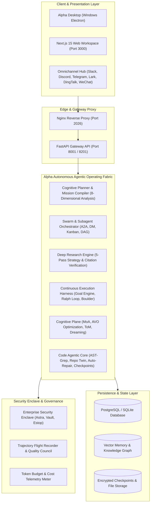

# Alpha 🐺

<div align="center">

### The Autonomous Multi-Agent Operating System & Frontier Cognitive Intelligence Platform

[](./backend/pyproject.toml)
[](./Makefile)
[](./frontend/package.json)
[](./backend/pyproject.toml)
[](./electron/README.md)
[](./docker/docker-compose.yaml)
[](./LICENSE)

*Maintained and architected by [Prem Kumar](https://github.com/itsPremkumar)*  
*Repository: [https://github.com/itsPremkumar/alpha](https://github.com/itsPremkumar/alpha)*

</div>

---

## 📑 Table of Contents

- [Overview](#-overview)
- [System Architecture](#-system-architecture)
- [Comprehensive Feature Catalog](#-comprehensive-feature-catalog)
  - [1. Autonomous Deep Research Engine & 5-Pass Search](#1-autonomous-deep-research-engine--5-pass-search)
  - [2. Multi-Agent Workforce & Swarm Orchestration](#2-multi-agent-workforce--swarm-orchestration)
  - [3. Continuous Execution Harness & Autonomous Planners](#3-continuous-execution-harness--autonomous-planners)
  - [4. Frontier Cognitive Intelligence & Optimization Plane](#4-frontier-cognitive-intelligence--optimization-plane)
  - [5. Code Agentic Core & Developer Workspaces](#5-code-agentic-core--developer-workspaces)
  - [6. Enterprise Security Enclave & Governance](#6-enterprise-security-enclave--governance)
  - [7. Omnichannel Communication & Scheduled Automations](#7-omnichannel-communication--scheduled-automations)
  - [8. Desktop Application & Web Interface](#8-desktop-application--web-interface)
- [Built-in Agentic Tools Index](#-built-in-agentic-tools-index)
- [Quick Start Guide](#-quick-start-guide)
  - [Option A: Windows Desktop Application](#option-a-windows-desktop-application-one-click)
  - [Option B: Docker Compose (Production & Server)](#option-b-docker-compose-recommended-for-production)
  - [Option C: Local Bare-Metal Development](#option-c-local-bare-metal-development)
  - [Option D: Non-Interactive / CI Deployment](#option-d-non-interactive--ci-headless-setup)
- [Configuration Guide](#-configuration-guide)
- [Topology & Network Architecture](#-topology--network-architecture)
- [Repository Structure](#-repository-structure)
- [Verification & Quality Assurance](#-verification--quality-assurance)
- [References & Credits](#-references--credits)

---

## 🌟 Overview

**Alpha** is a state-of-the-art Autonomous Multi-Agent Operating System engineered for long-horizon task execution, frontier cognitive reasoning, multi-model swarms, and comprehensive deep research.

Unlike standard single-turn chatbots or shallow script runners, Alpha acts as an enterprise-grade agentic operating fabric:
- **Long-Horizon Autonomy**: Formulates, monitors, and persists complex multi-session objectives with the continuous **Goal Engine**, **Boulder Checkpointing**, and **Ralph Loop** recursive refinement.
- **Deep Research Superintelligence**: Features an integrated 5-pass search compiler, recursive knowledge gap filling, contradiction detection, and publication-ready cited Markdown report synthesis.
- **Multi-Agent Workforce & Swarms**: Coordinates teams of specialized bots via direct messaging, shared kanban boards, asynchronous event buses, and agent-to-agent (A2A) protocol channels.
- **Cognitive Optimization & Reflection**: Employs NVIDIA Agentic Variation Operators (AVO), Mixture of Agents (MoA) multi-model deliberation, epistemic belief verification, and memory dreaming consolidation.
- **Enterprise-Grade Security Enclave**: Hardware/software sandbox isolation, AST-level code rewriting, AES-GCM encrypted checkpoints, smart command approvals, and tamper-resistant trajectory flight recorders.

---

## 🏛 System Architecture



---

## 🚀 Comprehensive Feature Catalog

### 1. Autonomous Deep Research Engine & 5-Pass Search
- **5-Pass Search Planning Strategy**:
  1. *Discovery & Landscape Mapping*: High-level survey and core dimension discovery.
  2. *Specific Evidence & Benchmarks*: Extraction of quantitative metrics, percentages, speedups, and empirical evidence.
  3. *Adversarial Contradiction & Edge Cases*: Falsification queries uncovering limitations, memory leaks, bugs, and counter-arguments.
  4. *Fact Verification & Cross-Checking*: Cross-domain validation, confidence estimation, and snippet verification.
  5. *Strategic Synthesis & Gap Resolution*: Dynamic synthesis and recursive gap filling.
- **Recursive Knowledge Gap Filling**: Autonomously inspects evidence for missing dimensions (e.g. missing benchmark data or operational trade-offs) and spawns targeted sub-investigations up to depth 5.
- **Contradiction Detection & Nuance Synthesis**: Automatically identifies conflicting viewpoints between primary sources and independent audits, presenting unified resolution analysis.
- **Strict Citation Contract**: Embeds rigorous deterministic source citations (`[S1]`, `[S2]`, etc.) directly into generated publication-grade Markdown briefs.
- **Built-in `deep_research` Tool**: Executes multi-lane investigation programmatically from agents or user prompts.
- **`deep-research` Subagent Category Preset**: Direct delegation via `task(category="deep-research")` with a 150-turn allowance and citation verification constraints.

### 2. Multi-Agent Workforce & Swarm Orchestration
- **Bot Roster & SOUL Protocol**: Maintains registered autonomous bots, each with individual personalities, specialized toolsets, and persistent private inboxes.
- **Bot Mode Direct Messaging (DMs)**: Fire-and-forget asynchronous messaging (`POST /api/bots/{name}/dm`) with server-side attribution and DM verification.
- **Multi-Agent Group Chat & Swarms**: Real-time multi-agent collaborative rooms where specialized agents interact, deliberate, and produce shared outputs (`swarm_tool`, `group_chat_tool`).
- **Collaborative Kanban Board**: Real-time visual project tracking where agents create, transition, assign, and audit task cards (`kanban_board_tool`).
- **Agent-to-Agent (A2A) Messaging**: Inter-agent observation and structured communication (`a2a_tool`, `agent_message_tool`, `agent_observe_tool`).
- **Project Workforce Layer**: Enterprise-grade agent↔project membership, online presence tracking, resource locks, project constitution enforcement, architectural decision record (ADR) memory, and evidence-gated handoffs (`/api/projects/{id}/*`).

### 3. Continuous Execution Harness & Autonomous Planners
- **Autonomous One-Prompt Planner**: Transforms complex, raw user prompts into fully decided execution graphs (`autoplan_tool`, `build_autonomous_plan`).
- **Cognitive Plan Mode (8-Dimensional Strategic Evaluation)**: Analyzes tasks across clarity, safety, feasibility, reversibility, resource intensity, architectural impact, empirical evidence, and mission alignment (`cognitive_plan_tool`).
- **Mission Hierarchy & Work Queue DAG**: Constructs tree-structured mission goals with dynamic dependency scheduling (`manage_mission_hierarchy`, `schedule_work_queue`).
- **Continuous Goal Engine**: Tracks active goals, enforces completion criteria, and prevents hallucinated task termination (`goal_engine_tool`, `goal_integrity_tool`).
- **Ralph Loop (Recursive Self-Improvement Loop)**: Executes test-driven iterative self-healing loops until code meets all invariant criteria (`ralph_loop_tool`, `run_rsi_cycle`).
- **Boulder Checkpointing & Durable Replay**: Multi-session persistent execution states allowing interrupted runs to resume seamlessly without context loss (`boulder_checkpoint_tool`, `manage_durable_orchestration`).
- **Kibitzer & Metacognitive Supervision**: Background monitoring agents that analyze execution health, detecting loops, thrashing, and prompt drift (`kibitzer_nudge_manage`, `check_metacognitive_health`).

### 4. Frontier Cognitive Intelligence & Optimization Plane
- **Autonomous Agentic Variation Operators (AVO)**: Evolutionary prompt and strategy optimization based on NVIDIA AVO concepts (`run_nvidia_avo_step`, `run_avo_variation`).
- **Mixture of Agents (MoA) Multi-Model Reasoning**: Distributes complex analytical queries across multiple LLM backends and synthesizes cross-model consensus (`moa_multi_model_reasoning`).
- **Theory of Mind (ToM) Consult**: Simulates user perspectives, stakeholder reactions, and downstream receiver expectations (`tom_consult`).
- **Epistemic Belief Evaluation**: Evaluates claims against proven knowledge facts to detect unfounded assertions (`evaluate_epistemic_claim`).
- **Cognitive Memory & Dreaming Consolidation**: Background memory consolidation transforming ephemeral episodic traces into structured semantic knowledge (`cognitive_memory_tool`, `consolidate_memory_dream`, `manage_reflexion_memory`).
- **Strategic Discipline Council**: Multi-perspective governance team performing invariant verification and plan gap analysis (`discipline_team_tool`).
- **Quality Council & Evidence Matrix**: Deliberates artifact quality and validates finish-first empirical evidence before declaring deliverables complete (`deliberate_artifact_quality`, `audit_finish_first_evidence`).
- **Consequence Simulation & Problem Modeling**: Simulates high-risk action consequences before execution (`simulate_consequences`, `compile_problem_model`).

### 5. Code Agentic Core & Developer Workspaces
- **Automated Test & Repair**: Autonomously runs unit test suites, captures failure stack traces, diagnoses root causes, and applies verified fixes (`auto_test_and_repair`).
- **Repository Map Generation**: Compiles structural abstract syntax trees and dependency graphs across multi-directory repositories (`generate_repo_map`).
- **Code Checkpoint Management**: Manages temporary Git checkpoints, commits, stashes, and branch rollbacks during experimental refactors (`manage_code_checkpoint`).
- **AST-Grep Search and Rewrite**: Precision semantic code search and AST rewrites across TypeScript, Python, Go, and Rust (`ast_grep_search`, `ast_grep_rewrite`).
- **Repo Twin Inspection**: Maintains an isolated shadow copy of the workspace to preview modifications without risk (`inspect_repo_twin`).
- **Hashline Tooling**: Deterministic line-level reading and editing preventing edit collisions (`hashline_read`, `hashline_edit`).
- **Sandboxed Execution & REPL**: Isolated sandboxed Python and Bash environments (`python_repl_tool`, `execute_sandboxed_computer_action`).
- **Visual Artifact Verification**: Renders and visually inspects generated UI widgets, canvases, and media artifacts (`visual_verify_artifact`, `canvas_widget_tool`).

### 6. Enterprise Security Enclave & Governance
- **Astra & Enclave Security Management**: Hardware and software security enclaves enforcing task boundaries and secret compartmentalization (`astra_security_manage`, `enterprise_security_manage`).
- **Smart Command Approval**: Risk scoring and human-in-the-loop gates for high-impact terminal commands (`verify_command_approval`).
- **Emergency Stop (Estop)**: Instant hard stop mechanism capable of halting any runaway swarm, background task, or loop (`emergency_stop_manage`).
- **Trajectory Flight Recorder**: Cryptographically logs agent trajectory events for forensic security audits (`trajectory_audit_tool`).
- **Artifact Lineage Tracing**: Universal cryptographic provenance graph linking generated outputs to their original source inputs and prompts (`trace_artifact_lineage`).
- **Token Budget Ceilings & Real-Cost Telemetry**: Enforces deterministic token spend limits per run with provider cache-aware pricing calculations.

### 7. Omnichannel Communication & Scheduled Automations
- **Supported Chat Gateways**: Integrated connectivity for **Telegram, Slack, Feishu/Lark, WeChat, WeCom, DingTalk, Discord**, and **Buzz**.
- **Scheduled Tasks & Blueprints**: Cron schedules, wake-gate pre-flights, blueprint automations, and incident tracking with auto-pause (`cronjob_manage`, `/api/scheduled-tasks/*`).
- **OpenAI-Compatible Gateway Surface**: Exposes `POST /api/compat/openai/chat/completions` allowing Alpha to serve as an agentic backend for external OpenAI-compatible tools.

### 8. Desktop Application & Web Interface
- **Windows Desktop App (Electron)**: Unsigned installer bundling Node.js and `uv` runtimes. Launches directly into local chat with automatic Python environment initialization on port 8201.
- **Modern Next.js 15 Web Workspace**: Clean responsive dashboard featuring Chat, Overview, Workforce, Projects, Kanban, Skills, and Settings tabs.
- **Canvas & Interactive Widgets**: Inline rendering of interactive HTML/React widgets, diagrams, charts, and multimedia artifacts.

---

## 🧰 Built-in Agentic Tools Index

Alpha includes an extensive catalog of over 60 native agentic tools categorized by domain:

| Domain | Key Tools | Functionality |
| :--- | :--- | :--- |
| **Research & Search** | `deep_research`<br>`compile_five_pass_search`<br>`web_search`<br>`web_fetch`<br>`tool_search` | Multi-pass search, citation extraction, contradiction detection, recursive gap filling, and web fetching. |
| **Swarm & Workforce** | `bot_roster_tool`<br>`swarm_tool`<br>`group_chat_tool`<br>`kanban_board_tool`<br>`a2a_tool`<br>`agent_message_tool`<br>`subagent_control` | Multi-agent coordination, direct messaging, shared kanban boards, and roster management. |
| **Planning & Goals** | `build_autonomous_plan`<br>`cognitive_plan`<br>`goal_engine_tool`<br>`goal_integrity_tool`<br>`compile_mission`<br>`schedule_work_queue` | 8D strategic analysis, goal tracking, work queue scheduling, and mission compilation. |
| **Execution & Loops** | `ralph_loop_tool`<br>`run_rsi_cycle`<br>`boulder_checkpoint_manage`<br>`manage_durable_orchestration`<br>`create_workflow_checkpoint` | Test-driven iterative self-healing, durable checkpoint persistence, and workflow replay. |
| **Cognitive Intelligence**| `moa_multi_model_reasoning`<br>`run_nvidia_avo_step`<br>`tom_consult`<br>`evaluate_epistemic_claim`<br>`consolidate_memory_dream` | Multi-model consensus, AVO optimization, Theory of Mind, belief checking, and memory dreaming. |
| **Code & Dev Tools** | `auto_test_and_repair`<br>`generate_repo_map`<br>`manage_code_checkpoint`<br>`ast_grep_search`<br>`ast_grep_rewrite`<br>`hashline_read`<br>`hashline_edit` | Semantic AST code editing, repository mapping, automated test repair, and git checkpointing. |
| **Security & Auditing** | `astra_security_manage`<br>`enterprise_security_manage`<br>`verify_command_approval`<br>`emergency_stop_manage`<br>`trajectory_audit_tool`<br>`trace_artifact_lineage` | Enclave security, smart command approvals, emergency stops, trajectory logging, and lineage. |
| **Environment & REPL** | `python_repl_tool`<br>`execute_sandboxed_computer_action`<br>`browser_navigate_and_inspect`<br>`visual_verify_artifact` | Sandboxed Python/Bash execution, browser automation, and visual artifact validation. |

---

## ⚡ Quick Start Guide

### Option A: Windows Desktop Application (One-Click)

The desktop application bundles its own Node.js and `uv` runtimes—end users need no pre-installed dependencies.

1. **Build the installer** (or download the release executable):
   ```powershell
   cd electron
   npm install
   npm run dist
   ```
2. **Run Installer**: Execute `electron/dist/Alpha-Setup-2.1.0.exe` (per-user installation, no administrator privileges required).
3. **First Launch**: Configure your preferred model API key in `%APPDATA%\alpha-desktop\project\config.yaml`, launch the application, and start collaborating.

---

### Option B: Docker Compose (Recommended for Production)

Deploy the complete multi-service stack with Nginx, FastAPI Gateway, Next.js UI, and Redis:

```bash
# 1. Clone repository
git clone https://github.com/itsPremkumar/alpha.git
cd alpha

# 2. Setup secrets & configuration
cp .env.production.example .env
make config

# 3. Verify deployment pre-flight
python scripts/prod_check.py

# 4. Build and start all services
make up

# 5. Access the unified workspace in your browser
# Open: http://localhost:2026
```

To gracefully shut down the stack:
```bash
make down
```

---

### Option C: Local Bare-Metal Development

For rapid active development with hot-reloading:

```bash
# 1. Generate configuration templates
make config

# 2. Install backend and frontend dependencies
make install

# 3. Start local development cluster (Gateway on :8001, Frontend on :3000, Nginx on :2026)
make dev
```

Run the interactive setup wizard to configure your preferred model provider:
```bash
make setup
```
To verify the health of your environment:
```bash
make doctor
```

---

### Option D: Non-Interactive / CI Headless Setup

For automated Docker pipelines, CI/CD runners, or cloud instances without a TTY:

```bash
ALPHA_SETUP_PROVIDER=openrouter \
ALPHA_SETUP_API_KEY=$OPENROUTER_API_KEY \
make setup SETUP_ARGS=--non-interactive
```

Supported environment variables:
- `ALPHA_SETUP_PROVIDER`: `openrouter`, `openai`, `anthropic`, `gemini`, `deepseek`, `ollama`, `vllm`.
- `ALPHA_SETUP_API_KEY`: API authentication token.
- `BETTER_AUTH_SECRET`: Secret key for session authentication (auto-generated if omitted).

---

## ⚙️ Configuration Guide

Alpha configurations are structured into three isolated files:

| File | Scope | Description |
| :--- | :--- | :--- |
| `config.yaml` | Platform Core | Models, default presets, tool groupings, sandboxing mode, databases, and IM channels. |
| `extensions_config.json` | Extensions | Model Context Protocol (MCP) servers and enabled skills (dynamically editable at runtime). |
| `.env` | Secrets | API keys, encryption secrets, database credentials, and external tokens. |

### Example `config.yaml` Snippet

```yaml
# Core Model Configuration
models:
  - name: deep-reasoner
    provider: openrouter
    model: stealth/union-alpha
    api_key: "${OPENROUTER_API_KEY}"
    max_tokens: 16384
    temperature: 0.2

# Subagent Workforce & Intent Presets
subagents:
  timeout_seconds: 1800
  max_total_per_run: 6
  categories:
    deep-research:
      description: "Autonomous multi-hop deep research with 5-pass search and citation verification."
      tools: ["deep_research", "web_search", "web_fetch", "compile_five_pass_search"]
      max_turns: 150

# Sandbox Security Mode (local | docker | provisioner)
sandbox:
  use: local
  timeout_seconds: 300

# Continuous Execution & Token Ceiling
token_budget:
  enabled: true
  max_tokens: 2000000
```

---

## 🌐 Topology & Network Architecture

| Component | Default Port | Internal Role |
| :--- | :--- | :--- |
| **Nginx Ingress** | `2026` | Unified reverse proxy entry point for web clients and APIs. |
| **FastAPI Gateway** | `8001` | Core agent runtime, tool execution engine, and REST/WebSocket server. |
| **Next.js Frontend** | `3000` | Chat composer, workforce monitor, kanban board, and project workspace. |
| **Desktop Gateway** | `8201` | Embedded Gateway dedicated to the Windows Electron desktop application. |
| **Sandbox Provisioner** | `8002` | Optional microservice for isolated Kubernetes sandbox environments. |

---

## 📂 Repository Structure

```
alpha/
├── backend/
│   ├── packages/
│   │   ├── harness/             # Alpha Agentic Harness & Core Runtime
│   │   │   └── agent_workspace/
│   │   │       ├── research/    # Deep Research Engine & 5-Pass Search Compiler
│   │   │       ├── subagents/   # Subagent Registry, Categories & Execution
│   │   │       ├── tools/       # 60+ Built-in Tools, AST Grep, Sandbox REPL
│   │   │       └── config/      # Subagents, AppConfig, and Budget Schemas
│   │   └── extension-api/       # Extension protocols and plugin interfaces
│   └── tests/                   # Automated pytest suites for backend & tools
├── frontend/                    # Next.js 15 Web Application & UI Components
├── electron/                    # Windows Desktop Shell, Installers & Main Process
├── docker/                      # Multi-service Docker Compose definitions & Nginx
├── deploy/helm/                 # Enterprise Kubernetes deployment Helm charts
├── skills/                      # Public and custom agent skill packages
│   └── public/deep-research/    # Deep Research Skill specification & documentation
├── scripts/                     # Pre-flight gates, setup wizards, doctor checks
├── docs/                        # Comprehensive operations runbook (PRODUCTION.md)
├── config.example.yaml          # Full configuration template
├── PROJECT_GOAL.md              # Vision, milestones, and architectural contracts
└── Makefile                     # Unified build, test, and lifecycle automation
```

---

## 🧪 Verification & Quality Assurance

Alpha enforces strict quality gates across backend, frontend, and desktop layers:

### Running Automated Test Suites

```powershell
# 1. Run Backend Deep Research & Harness Tests
$env:PYTHONPATH="backend/packages/harness;backend/packages/extension-api;backend"
pytest backend/tests/test_deep_research_engine.py backend/tests/test_deep_research_tool.py backend/tests/test_subagent_categories.py -v

# 2. Run Frontend Verification Tests
cd frontend
node --test tests/*.test.mjs

# 3. Run Electron Desktop Tests
cd ../electron
node --test tests/*.test.mjs

# 4. Run Production Pre-flight Gate Check
python scripts/prod_check.py
```

---

## 🤝 References & Credits

Alpha incorporates and builds upon pioneering paradigms across the open-source agentic AI ecosystem:

- **Base Project Provenance**: Originally derived and re-architected from DeerFlow (MIT License). Original copyright and license notices are preserved in [LICENSE](./LICENSE).
- **[OpenHands](https://github.com/All-Hands-AI/OpenHands)**: Autonomous software-engineering agent patterns, reproduction mechanisms, and episodic memory.
- **[OpenClaw](https://github.com/openclaw/openclaw)**: Context management engines, interactive canvases, and resilient tool-call repair strategies.
- **Oh My OpenAgent (OmO / Sisyphus)**: Multi-agent collaboration paradigms, real-time kanban boards, and inter-agent communication protocols.
- **Hermes Agent**: Mission compilation, epistemic belief evaluation, cognitive blackboards, and metacognitive health tracking.
- **LangChain / LangGraph & Deep Agents**: Foundation for advanced multi-pass search strategies, stateful subagent graphs, and citation enforcement.
- **Model Providers**: OpenAI, Anthropic, Google Gemini, DeepSeek, OpenRouter, Moonshot AI, MiniMax, StepFun, and Ollama.

---

<div align="center">

**Alpha** — *Autonomous Agentic Intelligence at Scale.*  
Constructed with precision by [Prem Kumar](https://github.com/itsPremkumar).

</div>
