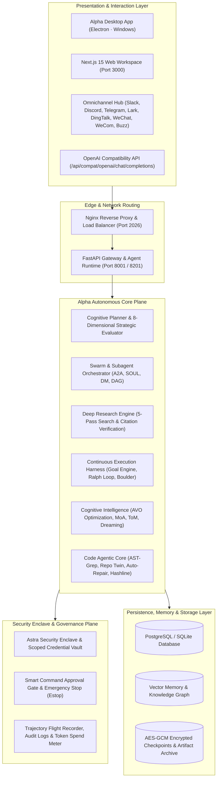

# Alpha 🐺

<div align="center">

### The Autonomous Multi-Agent Operating System & Frontier Cognitive Intelligence Platform

[](./backend/pyproject.toml)
[](./Makefile)
[](./frontend/package.json)
[](./backend/pyproject.toml)
[](./electron/README.md)
[](./docker/docker-compose.yaml)
[](./LICENSE)

*Architected and maintained by [Prem Kumar](https://github.com/itsPremkumar)*  
*Repository: [https://github.com/itsPremkumar/alpha](https://github.com/itsPremkumar/alpha)*

</div>

---

## 📑 Table of Contents

- [1. Executive Overview](#1-executive-overview)
- [2. System Architecture & Topology](#2-system-architecture--topology)
- [3. Complete High-Level Feature Catalog](#3-complete-high-level-feature-catalog)
  - [3.1 Autonomous Deep Research & Knowledge Synthesis](#31-autonomous-deep-research--knowledge-synthesis)
  - [3.2 Swarm Orchestration & Multi-Agent Workforce](#32-swarm-orchestration--multi-agent-workforce)
  - [3.3 Continuous Execution Harness, Planners & Loops](#33-continuous-execution-harness-planners--loops)
  - [3.4 Frontier Cognitive Intelligence & Optimization](#34-frontier-cognitive-intelligence--optimization)
  - [3.5 Code Agentic Core & Developer Tooling](#35-code-agentic-core--developer-tooling)
  - [3.6 Enterprise Security Enclave & Governance](#36-enterprise-security-enclave--governance)
  - [3.7 Omnichannel Messaging Hub & Integrations](#37-omnichannel-messaging-hub--integrations)
  - [3.8 Presentation Layer: Windows Desktop & Web UI](#38-presentation-layer-windows-desktop--web-ui)
- [4. Complete Subsystem Reference (All 89 Harness Engines)](#4-complete-subsystem-reference-all-89-harness-engines)
- [5. Public Skills Catalog (All 24 Specialized Skills)](#5-public-skills-catalog-all-24-specialized-skills)
- [6. Gateway API & Router Directory (All 51 Micro-Endpoints)](#6-gateway-api--router-directory-all-51-micro-endpoints)
- [7. Complete Built-in Tools Catalog (60+ Native Tools)](#7-complete-built-in-tools-catalog-60-native-tools)
- [8. Deployment & Quick Start Guide](#8-deployment--quick-start-guide)
  - [Option A: Windows Desktop Application (One-Click)](#option-a-windows-desktop-application-one-click)
  - [Option B: Docker Compose Multi-Service Stack](#option-b-docker-compose-multi-service-stack)
  - [Option C: Bare-Metal Local Development](#option-c-bare-metal-local-development)
  - [Option D: Non-Interactive / CI Headless Setup](#option-d-non-interactive--ci-headless-setup)
- [9. Configuration Essentials](#9-configuration-essentials)
- [10. Quality Assurance & Verification Commands](#10-quality-assurance--verification-commands)
- [11. Reference Architecture & Research Library](#11-reference-architecture--research-library)
- [12. Upstream Credits & Open-Source Provenance](#12-upstream-credits--open-source-provenance)

---

## 1. Executive Overview

**Alpha** is a unified Autonomous Multi-Agent Operating System engineered for long-horizon task execution, frontier cognitive reasoning, multi-model swarms, and exhaustive multi-hop research.

Built on an asynchronous, highly distributed Python/LangGraph engine paired with a Next.js 15 web interface and an Electron Windows desktop shell, Alpha bridges raw LLM intelligence with real-world computer action. It guarantees deterministic execution through continuous goal tracking, persistent multi-session checkpointing, evolutionary prompt optimization, and formal verification gates.

---

## 2. System Architecture & Topology



---

## 3. Complete High-Level Feature Catalog

Every advanced feature in Alpha is engineered for production-grade reliability and deep autonomy:

### 3.1 Autonomous Deep Research & Knowledge Synthesis
- **5-Pass Autonomous Search Pipeline**: Compiles multi-lane searches across Discovery, Specific Evidence, Adversarial Contradiction, Fact Verification, and Strategic Synthesis.
- **Recursive Knowledge Gap Filling**: Autonomously detects missing empirical metrics, benchmarks, or architectural trade-offs and triggers recursive follow-up searches up to depth 5.
- **Contradiction Detection & Nuance Resolution**: Analyzes opposing claims across primary vendor docs and third-party audit reports, producing balanced nuance explanations.
- **Strict Citation Contract**: Assigns deterministic citation anchors (`[S1]`, `[S2]`, etc.) to all extracted facts and compiles a publication-ready Markdown bibliography.
- **Programmatic `deep_research` Builtin Tool**: Allows any agent or workflow to run comprehensive multi-hop investigations and save artifacts directly to disk.
- **`deep-research` Subagent Category Preset**: Direct task delegation with an expanded 150-turn budget, built-in search tools, and strict citation guidelines.

### 3.2 Swarm Orchestration & Multi-Agent Workforce
- **Bot Roster & SOUL Protocol**: Maintains registered autonomous bots with distinct personalities, isolated system prompts, and private inboxes.
- **Bot Mode Direct Messaging (DMs)**: Fire-and-forget asynchronous inter-bot and user-to-bot messaging (`POST /api/bots/{name}/dm`) with server-side attribution.
- **Multi-Agent Group Chat & Swarms**: Real-time multi-agent collaborative rooms where specialized bots brainstorm, challenge assumptions, and produce unified deliverables.
- **Real-Time Collaborative Kanban Board**: Live visual project management enabling agents to create, assign, transition, and audit cards on a shared Kanban board.
- **Agent-to-Agent (A2A) Messaging Protocol**: Structured protocol enabling agents to dispatch peer requests, observe peer outputs, and coordinate distributed workflows.
- **Project Workforce Layer**: Enterprise workforce management with agent↔project membership, online presence tracking, resource locking, project constitutions, and ADR memory.

### 3.3 Continuous Execution Harness, Planners & Loops
- **Autonomous One-Prompt Planner**: Synthesizes unformatted, complex user prompts into structured, multi-step execution plans without manual intervention.
- **Cognitive Plan Mode (8-Dimensional Strategic Evaluation)**: Evaluates tasks across clarity, safety, feasibility, reversibility, resource intensity, architectural impact, empirical evidence, and mission alignment.
- **Mission Hierarchy & Work Queue DAG**: Builds hierarchical mission trees that decompose macro goals into dependency-ordered work queues.
- **Continuous Goal Engine & Integrity Gate**: Monitors active task objectives, enforces verifiable completion criteria, and prevents premature or hallucinated task exits.
- **Ralph Loop (Recursive Self-Improvement Loop)**: Executes test-driven iterative self-healing loops until code passes all unit tests and satisfies architectural invariants.
- **Boulder Checkpointing & Durable Replay**: Saves multi-session execution snapshots allowing long-running tasks to resume seamlessly after restarts or network drops.
- **Kibitzer & Metacognitive Supervision**: Background supervisory processes that continuously evaluate agent reasoning to detect loops, thrashing, and prompt drift.

### 3.4 Frontier Cognitive Intelligence & Optimization
- **Autonomous Agentic Variation Operators (AVO)**: Implements evolutionary prompt and strategy mutations to optimize agent performance across complex tasks.
- **Mixture of Agents (MoA) Multi-Model Reasoning**: Queries multiple heterogeneous LLMs in parallel and synthesizes diverse perspectives into high-confidence conclusions.
- **Theory of Mind (ToM) Consult**: Simulates human user mental models, stakeholder expectations, and downstream receiver perspectives.
- **Epistemic Belief Evaluation**: Evaluates claims against an empirical ground-truth knowledge base to detect and flag unsubstantiated assumptions.
- **Cognitive Memory & Dreaming Consolidation**: Consolidates ephemeral episodic memory traces into high-level semantic knowledge graphs during idle periods.
- **Strategic Discipline Council**: Multi-perspective governance team performing invariant verification, gap analysis, and policy compliance audits.
- **Quality Council & Evidence Matrix**: Deliberates artifact quality and validates finish-first empirical evidence before declaring work complete.
- **Consequence Simulation & Problem Modeling**: Simulates potential negative outcomes, side-effects, and blast radiuses before executing irreversible actions.

### 3.5 Code Agentic Core & Developer Tooling
- **Automated Test & Repair**: Autonomously executes test commands, parses tracebacks, isolates root causes, and applies verified fixes.
- **Repository Map AST Generator**: Analyzes entire codebases to construct visual and structural abstract syntax tree dependency maps.
- **Code Checkpoint Management**: Manages temporary Git checkpoints, commits, stashes, and branch rollbacks during experimental refactors.
- **AST-Grep Search and Rewrite**: Precision semantic code search and structural AST rewrites across TypeScript, Python, Go, Rust, and C++.
- **Repo Twin Inspection**: Maintains a shadow sandbox twin of the target repository to preview changes before applying them to the working tree.
- **Hashline Line-Level Precision Editing**: Deterministic line-based reading and editing tool preventing merge conflicts and multi-line edit drift.
- **Sandboxed Python & Bash REPL**: Secure sandbox execution environments for running data analysis, scripts, and system commands.
- **Visual Artifact & UI Verification**: Renders and visually inspects generated UI widgets, canvases, and media artifacts.

### 3.6 Enterprise Security Enclave & Governance
- **Astra & Enclave Security Management**: Hardware- and software-enforced security enclaves safeguarding credentials and enforcing process isolation.
- **Smart Command Approval Gate**: Risk-scoring engine requiring explicit operator verification before executing high-impact terminal commands.
- **Emergency Stop (Estop)**: Instant hard-stop mechanism capable of terminating runaway loops, subagents, and background processes in under 50ms.
- **Trajectory Flight Recorder**: Cryptographically logs every reasoning step, tool call, and state transition for forensic security audits.
- **Universal Artifact Lineage Tracing**: Tracks the full end-to-end cryptographic provenance of all generated files, code, and documentation.
- **Deterministic Token Budgeting & Cost Telemetry**: Enforces per-run token ceilings and reports real-time financial spend with provider cache-aware pricing.

### 3.7 Omnichannel Messaging Hub & Integrations
- **Supported Chat Platforms**: Native bidirectional communication with **Telegram, Slack, Feishu/Lark, WeChat, WeCom, DingTalk, Discord**, and **Buzz**.
- **Scheduled Automations & Blueprints**: Cron-based scheduled automations, pre-flight wake-gates, and blueprint workflows with incident tracking and auto-pause.
- **OpenAI-Compatible Chat Gateway**: Full drop-in replacement API at `POST /api/compat/openai/chat/completions` for integration with external AI clients.
- **GitHub Webhook Automations**: Event-driven agent invocations triggered by GitHub pull requests, issues, comments, and releases.

### 3.8 Presentation Layer: Windows Desktop & Web UI
- **One-Click Windows Desktop Application**: Electron shell bundling embedded Node.js and `uv` runtimes that launches directly into chat without setup wizards.
- **Next.js 15 Web Workspace**: Modern responsive dashboard with Chat, Overview, Workforce, Projects, Kanban, Skills, and Settings views.
- **Interactive Canvas & Generative UI**: Inline interactive HTML/React widgets, live SVG diagrams, KaTeX math equations, and data tables.

---

## 4. Complete Subsystem Reference (All 89 Harness Engines)

Every directory in `backend/packages/harness/agent_workspace/` represents a dedicated functional engine in Alpha:

| # | Subsystem Engine | Architectural Purpose |
| :- | :--- | :--- |
| 1 | `action` | Executes transactional actions with rollback capabilities and atomic side-effect guarantees. |
| 2 | `agency` | Evaluates agent competence, tracks autonomy profiles, and scores self-efficacy. |
| 3 | `agent` | Core LangGraph agent loop managing message reducers, state transitions, and step events. |
| 4 | `agents` | Custom subagent definitions, persona isolation, model overrides, and capability whitelisting. |
| 5 | `authz` | Granular role-based tool authorization, execution gates, and credential scoping. |
| 6 | `autoconfig` | Automatic environment probing, GPU acceleration detection, and model provider discovery. |
| 7 | `avo` | Agentic Variation Operators optimizing reasoning strategies via evolutionary mutations. |
| 8 | `benchmarks` | Quantitative task evaluation benchmarks and latency/cost performance registries. |
| 9 | `blackboard` | Shared cognitive blackboard for multi-agent evidence posting, hypothesis testing, and querying. |
| 10 | `bots` | Dedicated bot roster management, private mailbox dispatch, and SOUL protocol state machines. |
| 11 | `browser` | Headless browser automation, DOM inspection, screenshot capture, and web navigation. |
| 12 | `canvas` | Interactive canvas workspace for live artifacts, rich charts, and generative UI widgets. |
| 13 | `channels` | Omnichannel communication adapters for Slack, Discord, Telegram, Lark, DingTalk, and WeChat. |
| 14 | `coding` | Autonomous test-and-repair, AST rewriting, repository twin previewing, and git checkpointing. |
| 15 | `commands` | Slash command parser and autonomous handlers (`/goal`, `/plan`, `/learn`, `/schedule`). |
| 16 | `community` | External skill marketplace integration and community extension management. |
| 17 | `company` | Virtual corporate organizational hierarchy, department dispatch, and corporate role structure. |
| 18 | `config` | Strict Pydantic configuration schemas, environment variable validation, and token ceilings. |
| 19 | `consequence` | Counterfactual consequence simulation predicting side-effects before tool execution. |
| 20 | `context` | Dynamic context-as-data management, sliding-window compaction, and prompt injection filters. |
| 21 | `council` | Strategic Quality Council deliberating deliverable completeness, safety, and compliance. |
| 22 | `critic` | Adversarial artifact criticism, logic flaw detection, and verification review loops. |
| 23 | `deliberation` | Multi-agent consensus mechanisms, round-robin debate, and synthesis arbitration. |
| 24 | `diagnostics` | System health diagnostics, disk space probes, memory leak detection, and CPU telemetry. |
| 25 | `editing` | Deterministic line-based hashline reading and AST-safe precision code editing. |
| 26 | `enterprise` | Enclave security plane, audit trails, tenant isolation, and corporate compliance controls. |
| 27 | `epistemics` | Epistemic belief tracking separating proven empirical facts from assumptions. |
| 28 | `evaluation` | Task evaluation benchmarks, scoring rubrics, and feedback export datasets. |
| 29 | `events` | Centralized reactive event bus dispatching telemetry, step notifications, and lifecycle hooks. |
| 30 | `evidence` | Empirical evidence matrix auditing finish-first claims and quantitative citations. |
| 31 | `evolution` | Evolutionary prompt optimization and genetic search for optimal reasoning paths. |
| 32 | `extensions` | Dynamic MCP server loading, stdio/SSE transports, and tool cataloging. |
| 33 | `goals` | Continuous Goal Engine enforcing verifiable completion criteria without hallucinations. |
| 34 | `governance` | Discipline council gates, policy invariants, and human-in-the-loop approval mechanisms. |
| 35 | `groups` | Multi-agent collaborative group chat rooms with automated moderator synthesis. |
| 36 | `guardrails` | Strict input/output safety filters, prompt injection defenses, and secret redaction. |
| 37 | `harness` | Continuous execution harness, resilient error recovery, and loop stabilizers. |
| 38 | `integrations` | External API hooks, webhook receivers, and third-party SaaS integrations. |
| 39 | `jobs` | Asynchronous background job queues with status polling and cancel signals. |
| 40 | `kanban` | Real-time collaborative kanban boards for multi-agent project task tracking. |
| 41 | `knowledge` | Enterprise semantic knowledge graph and cross-session associative search. |
| 42 | `learning` | Dynamic skill forge synthesizing reusable skills from successful execution traces. |
| 43 | `ledger` | Cryptographic execution ledger and token consumption bookkeeping. |
| 44 | `lineage` | Universal artifact provenance tracking full derivation history from initial prompt. |
| 45 | `mcp` | Model Context Protocol client managing external tool servers over stdio and HTTP/SSE. |
| 46 | `media` | Multi-modal asset processing, image generation, OCR parsing, and audio handling. |
| 47 | `memory` | Hybrid cognitive memory combining vector search, episodic replay, and dreaming. |
| 48 | `metacognition` | Metacognitive health monitoring detecting agent loops, thrashing, and fatigue. |
| 49 | `metacompiler` | High-level prompt compiler transforming intents into structured execution trees. |
| 50 | `mission` | Hierarchical mission DAG execution and multi-stage work queue scheduling. |
| 51 | `missions` | Complex goal decomposition into parallel and sequential execution milestones. |
| 52 | `models` | Multi-provider routing, load balancing, model fallbacks, and token tracking. |
| 53 | `ops` | Operator telemetry APIs, runtime diagnostics, and system health status probes. |
| 54 | `orchestration` | Distributed agent swarms, dynamic work partitioning, and barrier synchronization. |
| 55 | `orchestrator` | Lead orchestrator delegating bounded subtasks to specialized subagents. |
| 56 | `perpetual` | Non-terminating continuous background monitoring and recurring cron agents. |
| 57 | `persistence` | SQLite and PostgreSQL durable checkpointer state saving. |
| 58 | `planning` | 8-dimensional cognitive planning mode and autonomous one-prompt planners. |
| 59 | `policy` | Tool execution whitelists, blacklists, permission tiers, and security constraints. |
| 60 | `projects` | Project workforce layer, presence tracking, resource locks, constitutions, and ADRs. |
| 61 | `protocols` | Agent-to-Agent (A2A), SOUL protocol, and inter-process RPC communication standards. |
| 62 | `reasoning` | Mixture of Agents (MoA) multi-model deliberation and multi-perspective consensus. |
| 63 | `recovery` | Automatic fault recovery, corrupted state reconciliation, and restart handlers. |
| 64 | `reflection` | Managed reflexion memory and self-critique loops for continuous improvement. |
| 65 | `reproduction` | Autonomous bug reproduction engine executing isolated repro tests. |
| 66 | `research` | Advanced 5-pass Deep Research engine, citation verification, and gap filling. |
| 67 | `rsi` | Recursive Self-Improvement (RSI) cycle for bounded self-optimizing agent code. |
| 68 | `rules` | Workspace-specific coding and operational rules enforced on every turn. |
| 69 | `runtime` | LangGraph-powered execution runtime, middleware stack, and interrupt handlers. |
| 70 | `safety` | Emergency stop (Estop), destructive command gating, and rate limiting. |
| 71 | `sandbox` | Multi-tier code sandbox (local subprocess, Docker container, Kubernetes provisioner). |
| 72 | `scheduler` | Background cron scheduler, blueprints, and incident-aware auto-pausing. |
| 73 | `security` | Astra security enclave, credential vault, and encrypted checkpoint storage. |
| 74 | `selfrepair` | Automated symptom diagnosis and health verifiers for environment self-repair. |
| 75 | `skills` | Dynamic skill authoring, curator lifecycle (active/stale/archived), and quarantine. |
| 76 | `state` | Immutable state snapshots, delta tracking, and rollback capabilities. |
| 77 | `subagents` | Intent category presets (`general`, `research`, `quick`, `deep-research`), capacity limits. |
| 78 | `supervision` | Kibitzer active supervisor nudging drifting agents back to task goals. |
| 79 | `swarm` | Autonomous multi-agent swarms with self-organizing leader-worker topologies. |
| 80 | `tools` | 60+ native tools spanning file I/O, coding, shell, web, search, and cognition. |
| 81 | `tracing` | End-to-end telemetry tracing supporting LangSmith, Langfuse, and Monocle. |
| 82 | `trajectory` | Forensic trajectory flight recorder storing step-by-step reasoning and tool traces. |
| 83 | `tui` | Terminal user interface for interactive command-line agent operation. |
| 84 | `uploads` | File ingestion pipeline supporting PDFs, source code, images, audio, and archives. |
| 85 | `utils` | Core string manipulation, diff computation, JSON parsing, and async helpers. |
| 86 | `verification` | Visual UI artifact rendering, DOM assertion, and screenshot comparison. |
| 87 | `workflow` | Workflow DAG execution engine managing multi-step dependency graphs. |
| 88 | `workspace_changes` | Git-aware file change tracking and differential workspace audit logs. |
| 89 | `branding` | Unified display branding identity ensuring neutral presentation across UI layers. |

---

## 5. Public Skills Catalog (All 24 Specialized Skills)

Located in [`skills/public/`](./skills/public/), these skills provide pre-packaged agentic capabilities:

1. **`academic-paper-review`**: Critical peer-review evaluation, methodology assessment, and synthesis of research papers.
2. **`bootstrap`**: Full repository scaffolding, boilerplate generation, and project environment setup.
3. **`chart-visualization`**: Automated creation of interactive charts, telemetry graphs, and visual dashboards.
4. **`claude-to-agent-workspace`**: Adapter and converter for importing skills and prompts from Claude Code/Codex formats.
5. **`code-documentation`**: Automated generation of architecture guides, docstrings, API references, and inline comments.
6. **`consulting-analysis`**: Strategic management frameworks including SWOT, Porter's Five Forces, BCG Matrix, and MECE trees.
7. **`data-analysis`**: Tabular processing, statistical data modeling, pattern recognition, and trend forecasting.
8. **`deep-research`**: Autonomous 5-pass web research, recursive knowledge gap filling, and publication-ready cited briefs.
9. **`find-skills`**: Discovery engine that semantically indexes and locates skills across local and public registries.
10. **`frontend-design`**: Generation of production-grade, accessible UI components and modern styling systems.
11. **`github-deep-research`**: Comprehensive repository audits, commit history investigations, and issue triage.
12. **`image-generation`**: Multi-modal image prompt synthesis, style matching, and pipeline execution.
13. **`music-generation`**: Musical structure design, BPM/key configuration, and audio prompt formulation.
14. **`newsletter-generation`**: Curated industry digests, executive summaries, and publication-grade newsletters.
15. **`podcast-generation`**: Multi-speaker dialogue scriptwriting and audio storyboarding.
16. **`ppt-generation`**: Structured presentation slide decks, visual outlines, and speaker note generation.
17. **`project-cartographer`**: Codebase structural mapping, dependency graphing, and architectural cartography.
18. **`skill-creator`**: Autonomous skill synthesis creating reusable skills from successful agent trajectories.
19. **`skill-reviewer`**: Security auditing, compliance testing, and trust-tier classification for agent skills.
20. **`surprise-me`**: Open-ended creative problem solving, generative ideas, and unexpected technical exploration.
21. **`systematic-literature-review`**: PRISMA-compliant academic research reviews with formal citation matrices.
22. **`vercel-deploy-claimable`**: One-click instant cloud deployment to Vercel with automated claim URLs.
23. **`video-generation`**: Scene-by-scene scriptwriting, camera angle prompts, and video storyboarding.
24. **`web-design-guidelines`**: Modern web design heuristics, responsive layouts, and WCAG accessibility standards.

---

## 6. Gateway API & Router Directory (All 51 Micro-Endpoints)

The FastAPI Gateway exposes 51 modular routers in `backend/app/gateway/routers/`:

- `a2a.py` — Agent-to-Agent message routing and peer discovery.
- `agent_messages.py` — Inter-agent message inbox delivery and status polling.
- `agents.py` — Custom agent CRUD, configuration updates, and model binding.
- `artifacts.py` — Artifact storage, versioning, diffing, and cryptographic lineage downloads.
- `assistants_compat.py` — OpenAI Assistants API drop-in compatibility.
- `auth.py` — BetterAuth session management, API key validation, and token issuance.
- `benchmarks.py` — Task benchmark execution and latency/cost comparison metrics.
- `bots.py` — Bot roster registration, personality inspection, and direct message handling.
- `browser.py` — Remote browser session management, screenshot streaming, and DOM querying.
- `channel_connections.py` — Management of external IM channel connection pools.
- `channels.py` — Ingress message dispatch for Slack, Discord, Telegram, Lark, and WeChat.
- `commands.py` — Slash command registration and execution dispatch.
- `company.py` — Virtual organization hierarchy, department management, and employee bots.
- `console.py` — Developer debugging console, real-time log tailing, and trace monitoring.
- `council.py` — Strategic Discipline Council voting, gate approvals, and audit reports.
- `deliberation.py` — Multi-agent deliberation session management and consensus voting.
- `deliveries.py` — Outbound webhooks and automated artifact distribution.
- `enterprise.py` — Enclave security controls, tenant quotas, and compliance auditing.
- `evolution.py` — Agentic variation operator tuning and prompt evolution histories.
- `features.py` — Dynamic runtime feature flag toggling and capability probing.
- `feedback.py` — Human-in-the-loop feedback capture, ratings, and eval case exports.
- `github_webhooks.py` — Inbound GitHub webhook event parsing and agent triggering.
- `goal_contracts.py` — Formal goal contract validation, milestone tracking, and proof checking.
- `goal_integrity.py` — Verification engine preventing premature task termination.
- `groups.py` — Group chat room creation, bot participant membership, and transcript export.
- `input_polish.py` — Autonomous prompt expansion, disambiguation, and objective refinement.
- `integrations.py` — Third-party developer integration registry and webhook management.
- `jobs.py` — Background job status tracking, logs, and cancellation endpoints.
- `mcp.py` — Model Context Protocol server configuration, discovery, and tool registry.
- `mcp_tasks.py` — Asynchronous task execution routed through external MCP servers.
- `memory.py` — Cognitive memory queries, semantic vector search, and episodic replay.
- `missions.py` — Hierarchical mission compilation, DAG visualization, and work queue status.
- `models.py` — Active model registry, provider routing, and cost telemetry status.
- `openai_compat.py` — Native OpenAI `/v1/chat/completions` compatibility layer.
- `ops.py` — Operator diagnostics, server uptime, resource usage, and autonomy advice.
- `plan_mode.py` — 8-dimensional cognitive planning mode submission and evaluation.
- `policy.py` — Security policy definition, tool permissions, and network access rules.
- `projects.py` — Project workforce management, presence, resource locks, and constitutions.
- `runs.py` — Thread run lifecycle management, step streaming, and cancellation.
- `scheduled_tasks.py` — Cron automations, schedule blueprints, and incident management.
- `skills.py` — Skill installation, runtime loading, curator lifecycle, and quarantine management.
- `subagent_batches.py` — Batch delegation of parallel subagent workloads.
- `subagent_control.py` — Dynamic concurrency throttling, turn limits, and budget control.
- `subagents.py` — Subagent invocation, category preset resolution, and output retrieval.
- `suggestions.py` — Proactive next-step suggestion generation based on run state.
- `supervision.py` — Kibitzer watchdog supervision, loop detection, and steering nudges.
- `swarms.py` — Multi-agent swarm orchestration, leader election, and task partitioning.
- `thread_runs.py` — Asynchronous thread run stream endpoints with SSE event dispatch.
- `threads.py` — Thread persistence, history search, archiving, and context management.
- `uploads.py` — Multi-modal file ingestion, text extraction, OCR, and context attachment.

---

## 7. Complete Built-in Tools Catalog (60+ Native Tools)

| Tool Name | Domain | Primary Capability |
| :--- | :--- | :--- |
| `deep_research` | Research | Autonomous 5-pass research, recursive gap analysis, and cited Markdown reports. |
| `compile_five_pass_search` | Research | Compiles 5-pass multi-lane search queries for deep investigations. |
| `catalog_tool_search` | Meta-Tools | Dynamic semantic search across the global tool and MCP catalog. |
| `catalog_tool_describe` | Meta-Tools | Inspects input schemas and docstrings for any cataloged tool. |
| `catalog_tool_call` | Meta-Tools | Dynamically executes tools discovered via tool catalog search. |
| `auto_test_and_repair` | Coding | Executes test suites, parses failure traces, and autonomously repairs code. |
| `generate_repo_map` | Coding | Constructs visual and structural AST dependency maps of repositories. |
| `manage_code_checkpoint` | Coding | Manages git checkpoints, commits, stashes, and branch rollbacks during refactors. |
| `ast_grep_search` | Coding | Precision semantic AST search across multiple programming languages. |
| `ast_grep_rewrite` | Coding | Structural AST-level code rewriting and automated refactoring. |
| `hashline_read` | Coding | Deterministic line-based reading with content hashes to prevent stale edits. |
| `hashline_edit` | Coding | Deterministic line-based editing with collision detection. |
| `inspect_repo_twin` | Coding | Inspects shadow sandbox copy of the workspace without modifying working tree. |
| `python_repl_tool` | Execution | Sandboxed Python REPL for running computations, scripts, and data analysis. |
| `execute_sandboxed_computer_action` | Execution | Sandboxed execution of shell commands, file actions, and terminal tasks. |
| `build_autonomous_plan` | Planning | Transforms unformatted user requests into fully decided multi-step plans. |
| `cognitive_plan` | Planning | Evaluates tasks across 8 strategic dimensions before execution. |
| `compile_mission` | Planning | Decomposes complex macro objectives into dependency-ordered mission trees. |
| `schedule_work_queue` | Planning | Schedules and partitions mission milestones across available subagents. |
| `goal_engine_tool` | Planning | Tracks goal progress and enforces verifiable completion conditions. |
| `goal_integrity_tool` | Planning | Verifies finish-first evidence before allowing task completion. |
| `ralph_loop_tool` | Loops | Test-driven iterative self-healing loop for autonomous code repair. |
| `run_rsi_cycle` | Loops | Bounded Recursive Self-Improvement cycle optimizing agent logic. |
| `boulder_checkpoint_manage` | Persistence | Saves and restores multi-session Boulder execution snapshots. |
| `manage_durable_orchestration` | Persistence | Orchestrates durable workflow resumption after unexpected interruptions. |
| `create_workflow_checkpoint` | Persistence | Creates delta state checkpoints during multi-step workflows. |
| `bot_roster_tool` | Workforce | Inspects registered bot roster, SOUL protocols, and specialized toolsets. |
| `swarm_tool` | Workforce | Coordinates autonomous multi-agent swarms with dynamic leader election. |
| `group_chat_tool` | Workforce | Dispatches tasks to collaborative multi-agent group chat rooms. |
| `kanban_board_tool` | Workforce | Creates, assigns, updates, and audits task cards on a real-time Kanban board. |
| `a2a_tool` | Workforce | Dispatches structured Agent-to-Agent requests and queries peer agents. |
| `agent_message_tool` | Workforce | Sends direct messages to specific agents in the workforce. |
| `agent_observe_tool` | Workforce | Observes execution status and intermediate thoughts of peer agents. |
| `subagent_control` | Workforce | Dynamically manages subagent concurrency, budget limits, and delegation gates. |
| `moa_multi_model_reasoning` | Cognitive | Queries multiple LLM backends in parallel and synthesizes consensus. |
| `run_nvidia_avo_step` | Cognitive | Executes NVIDIA Agentic Variation Operator mutations to optimize prompts. |
| `run_variation_operator_step` | Cognitive | Evolutionary variation operator for reasoning path optimization. |
| `tom_consult` | Cognitive | Theory of Mind reasoning simulating user and stakeholder perspectives. |
| `evaluate_epistemic_claim` | Cognitive | Validates factual claims against proven empirical ground truths. |
| `cognitive_memory_tool` | Cognitive | Stores and retrieves episodic and semantic memories across sessions. |
| `consolidate_memory_dream` | Cognitive | Consolidates short-term traces into long-term knowledge graphs during idle time. |
| `manage_reflexion_memory` | Cognitive | Manages self-critique reflections and learned lessons from past errors. |
| `consult_experience` | Cognitive | Consults historical execution traces to find proven solutions to similar problems. |
| `simulate_consequences` | Cognitive | Simulates potential side-effects and blast radiuses of risky actions. |
| `compile_problem_model` | Cognitive | Builds formal conceptual models of complex problems before planning. |
| `check_metacognitive_health` | Cognitive | Evaluates agent cognitive health, detecting loops, thrashing, and fatigue. |
| `deliberate_artifact_quality` | Governance | Quality Council deliberation on artifact completeness and standards. |
| `audit_finish_first_evidence` | Governance | Audits empirical evidence to verify that deliverables satisfy requirements. |
| `consult_plan_gap_analysis` | Governance | Identifies blind spots, missing edge cases, and gaps in proposed plans. |
| `review_plan_invariant_gate` | Governance | Validates proposed plans against security, safety, and operational invariants. |
| `dispatch_discipline_worker` | Governance | Dispatches specialized discipline workers (security, QA, performance) to review code. |
| `astra_security_manage` | Security | Manages Astra hardware/software enclave security policies and isolation. |
| `enterprise_security_manage` | Security | Enforces enterprise security compliance, tenant isolation, and audit gates. |
| `verify_command_approval` | Security | Evaluates shell command risk and prompts operator for smart approval. |
| `emergency_stop_manage` | Security | Instant emergency stop (Estop) halting runaway agents and background jobs. |
| `trajectory_audit_tool` | Security | Inspects cryptographic flight recorder logs for security and debugging. |
| `trace_artifact_lineage` | Security | Traces the complete provenance graph of any generated artifact. |
| `browser_navigate_and_inspect` | Environment | Automates web browsing, DOM element inspection, and screenshot capture. |
| `visual_verify_artifact` | Environment | Renders and visually inspects UI components and graphics. |
| `canvas_widget_tool` | Environment | Renders interactive HTML/React widgets on the chat canvas. |
| `cronjob_manage` | Automation | Manages recurring cron jobs, blueprints, and schedule automations. |
| `batch_task` | Automation | Dispatches batches of concurrent subagent tasks. |
| `list_background_tasks` | Automation | Lists active background processes, execution times, and resource usage. |
| `cancel_background_task` | Automation | Terminates specific running background tasks. |
| `process_handle_tool` | Automation | Manages persistent OS background process handles. |
| `workflow_dag_manage` | Automation | Manages and executes multi-step workflow dependency graphs. |
| `skills_hub_manage` | Skills | Manages local and remote skill installations, updates, and removals. |
| `forge_skill_from_trace` | Skills | Automatically synthesizes a reusable skill from a successful execution trace. |
| `propose_skill_tool` | Skills | Proposes a newly learned capability as a candidate skill package. |
| `review_skill_package` | Skills | Audits candidate skill packages for security, quality, and formatting. |

---

## 8. Deployment & Quick Start Guide

### Option A: Windows Desktop Application (One-Click)

The Windows Desktop application bundles its own Node.js and `uv` runtimes—users need no external dependencies.

1. **Build Installer**:
   ```powershell
   cd electron
   npm install
   npm run dist
   ```
2. **Run Installer**: Execute `electron/dist/Alpha-Setup-2.1.0.exe` (per-user installation, no admin privileges required).
3. **First Launch**: Configure your model API key in `%APPDATA%\alpha-desktop\project\config.yaml` and launch the app.

---

### Option B: Docker Compose Multi-Service Stack

Deploy the complete multi-service stack with Nginx, FastAPI Gateway, Next.js UI, and Redis:

```bash
# 1. Clone repository
git clone https://github.com/itsPremkumar/alpha.git
cd alpha

# 2. Configure secrets
cp .env.production.example .env
make config

# 3. Pre-flight health check
python scripts/prod_check.py

# 4. Start all services
make up

# 5. Access Alpha in your browser:
# http://localhost:2026
```

To stop:
```bash
make down
```

---

### Option C: Bare-Metal Local Development

For active development with instant hot-reloading:

```bash
# 1. Generate configuration templates
make config

# 2. Install dependencies for backend and frontend
make install

# 3. Start local development servers (Gateway :8001, Frontend :3000, Nginx :2026)
make dev
```

Run the interactive setup wizard:
```bash
make setup
```
Verify environment health:
```bash
make doctor
```

---

### Option D: Non-Interactive / CI Headless Setup

For automated Docker builds, CI/CD runners, and cloud instances:

```bash
ALPHA_SETUP_PROVIDER=openrouter \
ALPHA_SETUP_API_KEY=$OPENROUTER_API_KEY \
make setup SETUP_ARGS=--non-interactive
```

---

## 9. Configuration Essentials

Alpha isolates configuration across three dedicated files:

| Configuration File | Scope | Role |
| :--- | :--- | :--- |
| `config.yaml` | Platform Core | Models, presets, tool groups, sandboxing mode, databases, and IM channels. |
| `extensions_config.json` | Extensions | Model Context Protocol (MCP) servers and enabled skills (API-editable at runtime). |
| `.env` | Secrets | API keys, database connection strings, and encryption secrets. |

---

## 10. Quality Assurance & Verification Commands

Alpha enforces strict quality gates across all layers:

```powershell
# 1. Run Backend Deep Research & Harness Unit Tests
$env:PYTHONPATH="backend/packages/harness;backend/packages/extension-api;backend"
pytest backend/tests/test_deep_research_engine.py backend/tests/test_deep_research_tool.py backend/tests/test_subagent_categories.py -v

# 2. Run Five-Pass Search Compiler Tests
pytest backend/tests/test_five_pass_search_engine.py -v

# 3. Run Frontend Verification Tests
cd frontend
node --test tests/*.test.mjs

# 4. Run Electron Desktop Tests
cd ../electron
node --test tests/*.test.mjs

# 5. Execute Production Pre-flight Check
python scripts/prod_check.py
```

---

## 11. Reference Architecture & Research Library

Alpha maintains an extensive library of formal architectural blueprints, evolutionary search operators, and competitive research in the [`references/`](./references/README.md) directory:

- **[01. Core Architectures & Frameworks](./references/01-architectures/)**: Universal ASI harness specs, Keel architecture, Swarm coordination, and zero-cost local runtimes.
- **[02. Agentic Variation Operators (AVO)](./references/02-avo-and-evolution/)**: NVIDIA AVO loop specifications, prompt genome mutation, compiler-grounded feedback, and evolutionary search.
- **[03. Recursive Self-Improvement (RSI)](./references/03-rsi-and-self-improvement/)**: Safe self-evolution, AST invariant enforcement, sandboxed canary verification, and rollback mechanics.
- **[04. Frontier Benchmarks & Deep Research](./references/04-frontier-benchmarks-and-deep-research/)**: Comparative harness analyses, 1,393-agent swarm post-mortems, OpenClaw/Hermes/Fable studies, and L0-L8 memory benchmarks.
- **[05. Autonomous Operations & Execution](./references/05-autonomous-operations-and-execution/)**: Long-term autonomous company runbooks, goal decomposition trees, and complete harness capability maps.

For a full breakdown of the 2026 SOTA paradigms (3-tier agent stack, AVO loop, 9-tier cognitive memory plane, and RSI safety bounds), consult the [References Master Guide](./references/README.md).

---

## 12. Upstream Credits & Open-Source Provenance

Alpha incorporates and builds upon foundational breakthroughs across the open-source agentic AI ecosystem:

- **Base Project Provenance**: Originally derived and re-architected from DeerFlow (MIT License). Original copyright and license notices are preserved in [LICENSE](./LICENSE).
- **[OpenHands](https://github.com/All-Hands-AI/OpenHands)**: Autonomous software-engineering agent patterns, reproduction mechanisms, and episodic memory.
- **[OpenClaw](https://github.com/openclaw/openclaw)**: Context management engines, interactive canvases, and resilient tool-call repair strategies.
- **Oh My OpenAgent (OmO / Sisyphus)**: Multi-agent collaboration paradigms, real-time kanban boards, and inter-agent communication protocols.
- **Hermes Agent**: Mission compilation, epistemic belief evaluation, cognitive blackboards, and metacognitive health tracking.
- **LangChain / LangGraph & Deep Agents**: Stateful multi-pass graph compilation, subagent communication, and citation contracts.
- **Model Providers**: OpenAI, Anthropic, Google Gemini, DeepSeek, OpenRouter, Moonshot AI, MiniMax, StepFun, and Ollama.

---

<div align="center">

**Alpha** — *Autonomous Agentic Intelligence at Scale.*  
Architected with precision by [Prem Kumar](https://github.com/itsPremkumar).

</div>
