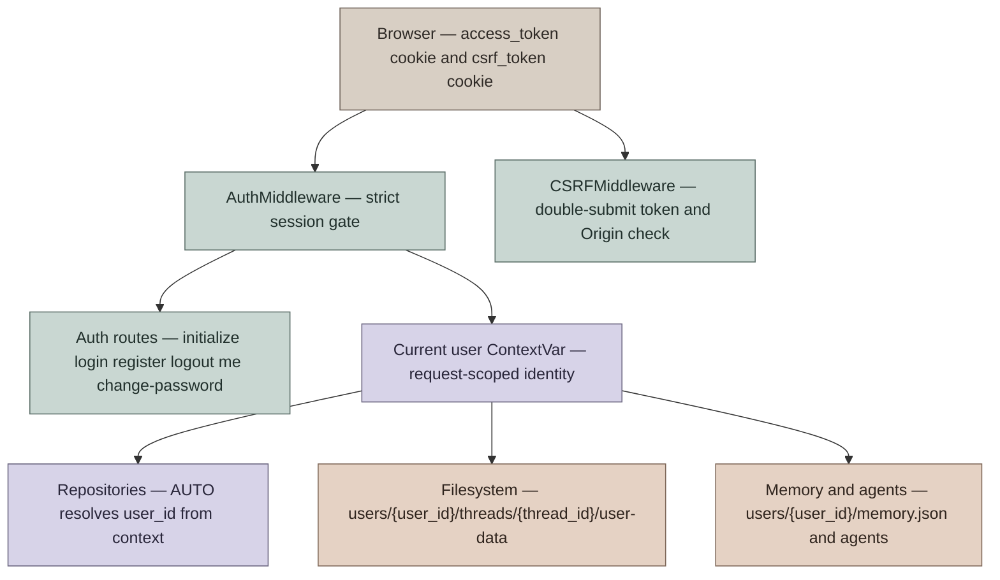

# User Authentication and Isolation Design

This document describes the design of Agent Workspace's built-in authentication and tenant isolation module. It covers browser login, OIDC/SSO, platform trust access (IM Channels and Internal Auth), API authentication, CSRF protection, per-user isolation, initial setup, password reset, and upgrade migrations.

## Design Goals

The core objective of the authentication module is to elevate Agent Workspace from a single-user local tool into a multi-tenant agent runtime, propagating authenticated user identity consistently across HTTP APIs, the LangGraph-compatible runtime, the filesystem, memory, custom agents, and feedback records.

Design constraints:

- **Always-Enforced Authentication by Default**: Except for health check, documentation, and auth bootstrap endpoints, all HTTP routes require a valid session.
- **Server-Controlled Ownership**: Clients cannot declare `user_id` or `owner_id` in request metadata.
- **Isolation by Default**: Repositories, filesystems, memory, and custom agent configurations resolve against the authenticated user by default.
- **Seamless Data Upgrades**: Legacy threads created prior to authentication can be migrated to the initial admin user upon setup.
- **No Credentials in Logs**: Initial setup is completed via UI/API; CLI resets write credentials exclusively to mode `0600` credential files.

Non-goals:

- User roles are currently scoped to `admin` and `user`; fine-grained RBAC is planned for future phases.
- Login rate limiting operates via an in-memory dictionary; multi-worker deployments approximate global limits.

## Core Architecture



### User Schema

User entities are defined in `app.gateway.auth.models.User` and persisted to the `users` table:

| Field | Semantics |
|---|---|
| `id` | Primary key, utilized as JWT `sub` |
| `email` | Unique username / login identifier |
| `password_hash` | bcrypt password hash (nullable for OAuth accounts) |
| `system_role` | `admin` or `user` |
| `needs_setup` | Flags whether the user must configure email/password upon next login |
| `token_version` | Incremented on password change or reset to invalidate stale JWTs |

### Runtime Identity Propagation

Upon successful authentication, `AuthMiddleware` injects identity into:

- `request.state.user`
- `request.state.auth`
- `agent_workspace.runtime.user_context` (`ContextVar`)

The `ContextVar` serves as the runtime boundary: the Gateway layer populates identity, while underlying persistence layers read the active user without circular dependencies on `app.gateway.auth`.

Repository user parameters follow a three-state pattern (`AUTO | str | None`):

- `AUTO`: Resolves identity from `ContextVar`; raises an error if no context exists.
- `str`: Explicit user override, used primarily in admin CLI tools or tests.
- `None`: Bypasses user filtering, permitted strictly for migration scripts.

## Setup and Login Flows

### Initial Setup

On first boot without an admin, the service does not create accounts automatically. Instead, it logs an operator prompt to visit `/setup`:

1. User navigates to `/setup`.
2. Frontend calls `GET /api/v1/auth/setup-status`.
3. If `{"needs_setup": true}` is returned, the setup form is presented.
4. User submits credentials to `POST /api/v1/auth/initialize`.
5. The server creates the initial admin account (`system_role="admin"`, `needs_setup=false`).
6. The server sets an `access_token` HttpOnly cookie, redirecting to the workspace.

Concurrent setup invocations are guarded by database unique constraints, returning 409 Conflict to losing requests.

### Standard Login

`POST /api/v1/auth/login/local` accepts standard `OAuth2PasswordRequestForm` data:
- `username`: Email address.
- `password`: Plaintext password.
- On success, issues a signed JWT in an `access_token` HttpOnly cookie.
- Response payload returns `expires_in` and `needs_setup`; raw tokens are never exposed in JSON.

Failed login attempts increment client IP counters. Client IP resolution trusts `X-Real-IP` only when the TCP peer belongs to `AUTH_TRUSTED_PROXIES`. Thresholds and lockout durations are configurable via `auth.local.max_login_attempts` (default 5) and `auth.local.lockout_seconds` (default 300s).

### Registration

`POST /api/v1/auth/register` creates standard `user` accounts with automatic session login.

### Password Reset

`POST /api/v1/auth/change-password` validates the current password, updates the bcrypt hash, increments `token_version`, and reissues session cookies.

To reset passwords via CLI:

```bash
cd backend
python -m app.gateway.auth.reset_admin
python -m app.gateway.auth.reset_admin --email user@example.com
```

This generates a cryptographically secure random password, updates `token_version`, flags `needs_setup=true`, and writes the credential to `.agent-workspace/admin_initial_credentials.txt` with `0600` permissions.

## HTTP Authentication Boundaries

`AuthMiddleware` implements a fail-closed perimeter gate.

Public Endpoints:
- `/health`
- `/docs`, `/redoc`, `/openapi.json`
- `/api/v1/auth/login/local`
- `/api/v1/auth/register`
- `/api/v1/auth/logout`
- `/api/v1/auth/setup-status`
- `/api/v1/auth/initialize`
- `/api/v1/auth/providers`
- `/api/v1/auth/oauth/*`
- `/api/v1/auth/callback/*`

All other endpoints require an `access_token` cookie. Requests with invalid or expired tokens return 401 Unauthorized immediately.

## CSRF Protection

Agent Workspace enforces Double Submit Cookies:
- Server sets `csrf_token` cookie.
- Frontend includes matching `X-CSRF-Token` header on state-changing requests (`POST`, `PUT`, `DELETE`, `PATCH`).
- Server validates using constant-time comparison (`secrets.compare_digest`).
- Auth bootstrap endpoints verify browser `Origin` headers to protect against session fixation.

## Per-User Isolation

### Thread Metadata

Stored in `threads_meta`:
- Incoming `metadata.user_id` and `metadata.owner_id` are stripped from client payloads.
- `ThreadMetaRepository.create(..., user_id=AUTO)` resolves the user from context.
- `/api/threads/search` queries filter by authenticated user by default.
- Accessing threads belonging to other users returns 404 Not Found to prevent resource enumeration.

### Filesystem Layout

Thread storage:
```text
{base_dir}/users/{user_id}/threads/{thread_id}/user-data/
├── workspace/
├── uploads/
└── outputs/
```

Virtual sandbox paths remain clean and uniform:
```text
/mnt/user-data/workspace
/mnt/user-data/uploads
/mnt/user-data/outputs
```

`ThreadDataMiddleware` and `UploadsMiddleware` resolve runtime identity via `resolve_runtime_user_id(runtime)`. In LangGraph Server direct-connect mode, server-owned `runtime.server_info.user.identity` is sanitized with `make_safe_user_id`. Gateway embedded executions resolve identity via authenticated context.

### Memory & Custom Agents

```text
{base_dir}/users/{user_id}/memory.json
{base_dir}/users/{user_id}/agents/{agent_name}/
├── config.yaml
├── SOUL.md
└── memory.json
```

## Authentication Methods Overview

| Mechanism | Typical Entrypoint | Users Table Record | External Identity Mapping | Isolation Strategy |
|---|---|---|---|---|
| **Local Account** | `POST /api/v1/auth/login/local` | Yes | Email as `users.id` | `threads_meta.user_id = users.id` |
| **OIDC / SSO** | `GET /api/v1/auth/oauth/{provider}` | Yes | IdP `sub` → `users.oauth_id` | `threads_meta.user_id = users.id` |
| **IM Channel Binding** | Settings Connect + `/connect <code>` | Bound to existing user | `channel_connections` | `owner_user_id` → `users.id` |
| **Internal Auth (HTTP)** | `X-Agent-Workspace-Internal-Token` + `X-Agent-Workspace-Owner-User-Id` | No (synthetic internal user) | Platform self-declares owner string | `threads_meta.user_id = owner` |

For detailed SSO configuration, see [SSO.md](SSO.md). For channel integration, see [IM_CHANNEL_CONNECTIONS.md](IM_CHANNEL_CONNECTIONS.md).

## Internal Auth (Direct HTTP)

Designed for server-to-server integration where an upstream platform service proxies calls on behalf of authenticated users:

```bash
export AGENT_WORKSPACE_INTERNAL_AUTH_TOKEN="<long-random-secret>"
```

Headers:
- `X-Agent-Workspace-Internal-Token`: Must match `AGENT_WORKSPACE_INTERNAL_AUTH_TOKEN`.
- `X-Agent-Workspace-Owner-User-Id`: Platform user identifier (e.g. `slack_U12345`, `custom_user_99`). Falls back to `default` if omitted.

Synthetic users created with `system_role="internal"` do not write to the `users` table. All thread metadata, runs, checkpoints, and files are partitioned under the specified owner.