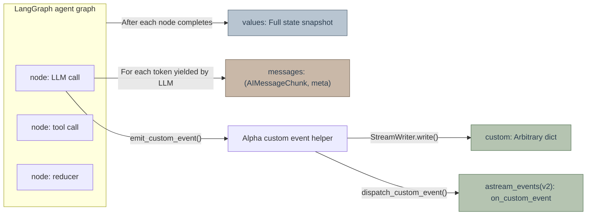
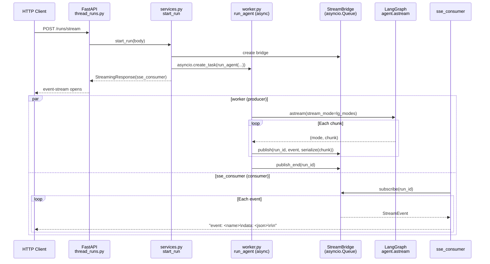
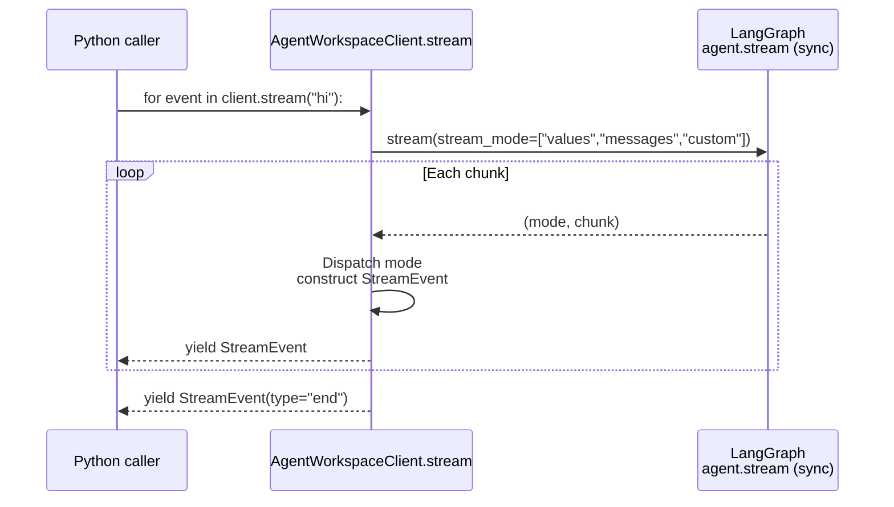

# Alpha Streaming Architecture

This document explains how Alpha delivers LangGraph agent event streams end-to-end to two classes of consumers: HTTP clients and embedded Python callers. It covers why two distinct paths must coexist, their contracts, and the non-obvious invariants within the system.

---

## TL;DR

- Alpha maintains **two parallel** streaming pipelines: the **Gateway path** (async / HTTP SSE / JSON serialization) serving web browsers and IM channels; and the **AgentWorkspaceClient path** (sync / in-process / native LangChain objects) serving Jupyter notebooks, scripts, and tests. They **cannot be merged** due to fundamentally different consumer execution models.
- Both paths originate from the `create_agent()` factory, centered around subscribing to LangGraph's `stream_mode=["values", "messages", "custom"]`. `values` represents node-level state snapshots, `messages` delivers LLM token-level deltas, and `custom` handles explicit `StreamWriter` events. Built-in custom events are also dispatched as `on_custom_event` callbacks under `astream_events(version="v2")` for callback-driven consumers like AG-UI. **These modes are independent event sources, not levels of granularity**; consumers must subscribe to the modes they need.
- The embedded client maintains three distinct `set[str]` instances for every `stream()` invocation: `seen_ids` / `streamed_ids` / `counted_usage_ids`. While seemingly similar, they enforce **three completely separate invariants** and must not be combined.

---

## Why Two Streaming Paths Coexist

The two paths serve fundamentally divergent consumer execution models:

| Dimension | Gateway Path | AgentWorkspaceClient Path |
|---|---|---|
| Entrypoint | FastAPI `/runs/stream` endpoint | `AgentWorkspaceClient.stream(message)` |
| Trigger Layer | `runtime/runs/worker.py::run_agent` | `packages/harness/alpha/client.py::AgentWorkspaceClient.stream` |
| Execution Model | `async def` + `agent.astream()` | Sync generator + `agent.stream()` |
| Event Transport | `StreamBridge` (asyncio Queue) + `sse_consumer` | Direct `yield` |
| Serialization | `serialize(chunk)` → Pure JSON dict, matching LangGraph Platform wire format | `StreamEvent.data`, preserving native LangChain objects |
| Consumers | Frontend `useStream` React hook, Feishu/Slack/Telegram channels, LangGraph SDK clients | Jupyter notebooks, integration tests, internal Python scripts |
| Lifecycle Management | `RunManager`: run_id tracking, disconnect semantics, multitask policies, heartbeats | Lightweight run_id generated per `stream()` for runtime context / tracing / per-run middleware; ends on function return |
| Reconnection | `Last-Event-ID` SSE resumption | Not required |

**The existence of two paths is a deliberate DRY trade-off**: the Gateway's entire infrastructure (async + Queue + JSON + RunManager) exists solely **to transport events across the network boundary to HTTP consumers**. When producer (agent) and consumer (Python call stack) live in the same process, that entire machinery is pure overhead.

### Why AgentWorkspaceClient Cannot Reuse Gateway

Three reuse strategies were previously evaluated and rejected:

1. **Changing `client.stream()` to `async def client.astream()`**  
   Breaking change. Forcing unnecessary `async for` and `asyncio.run()` into synchronous scripts and Jupyter notebooks destroys one of AgentWorkspaceClient's primary value propositions ("call an agent like a standard Python function").

2. **Spawning an internal event loop thread in `client.stream()` using `StreamBridge` to bridge sync/async**  
   Introduces thread pools, queues, and mutexes. Trading lines of code for massive structural complexity is a textbook "wrong abstraction," where maintenance overhead exceeds reuse gains.

3. **Making `run_agent` natively handle sync mode**  
   Adds dead branches to the Gateway, polluting the focus of `worker.py`.

Thus, event processing logic across both paths remains **similar but unshared**. This is an intentional design choice.

---

## LangGraph `stream_mode` Three-Tier Semantics

LangGraph's `agent.stream(stream_mode=[...])` is a **multiplexed** interface: subscribing to multiple modes simultaneously treats each mode as an independent event source. The core modes:



| Mode | Emission Timing | Payload | Granularity |
|---|---|---|---|
| `values` | After each graph node completes | Full state dict (title, messages, artifacts) | Node level |
| `messages` | On each LLM token yield; when tool node completes | `(AIMessageChunk \| ToolMessage, metadata_dict)` | Token level |
| `custom` | Explicit user code call to `StreamWriter.write()` | Arbitrary dict | Application defined |
| `on_custom_event` | Explicit user code call to `dispatch_custom_event()`; consumed via `astream_events(version="v2")` | `name` + arbitrary `data` | Application defined |

Alpha internal events must be emitted using sync or async helpers in `alpha.utils.custom_events`, and each built-in payload must carry a non-empty string `type`. Payloads missing a valid `type` enter only the `custom` stream and will not appear in `astream_events`. The helper writes to the `custom` stream first, followed by a best-effort callback dispatch; the callback name is set to the payload's `type`, retaining the full payload in `data`. Gateway / Web UI / `AgentWorkspaceClient` custom streams remain unchanged while `astream_events` consumers observe identical events. Callback dispatch exceptions are logged at debug level without interrupting writer pipelines.

### Three Naming Schemes Across Protocol Layers

The same streaming concept has three names across protocol tiers:

```
Application                    HTTP / SSE                    LangGraph Graph
┌──────────────┐               ┌──────────────┐              ┌──────────────┐
│ frontend     │               │ LangGraph    │              │ agent.astream│
│ useStream    │──"messages-   │ Platform SDK │──"messages"──│ graph.astream│
│ Feishu IM    │   tuple"──────│ HTTP wire    │              │              │
└──────────────┘               └──────────────┘              └──────────────┘
```

- **Graph Layer** (`agent.stream` / `agent.astream`): Direct LangGraph Python API, named **`"messages"`**.
- **Platform SDK Layer** (`langgraph-sdk` HTTP client): Inter-process wire contract, named **`"messages-tuple"`**.
- **Gateway Worker**: Translates modes explicitly: `if m == "messages-tuple": lg_modes.append("messages")` (`runtime/runs/worker.py:117-121`).

**Consequence**: `AgentWorkspaceClient.stream()` directly calls `agent.stream()` (Graph Layer), so it must pass `"messages"`. `app/channels/manager.py` connects via `langgraph-sdk` over HTTP, so it passes `"messages-tuple"`. **These strings cannot be interchanged or combined into a single shared constant**, as doing so would violate protocol-specific typing.

---

## Gateway Path: async + HTTP SSE



Key Components:

- `runtime/runs/worker.py::run_agent` — Executes `agent.astream()` within an `asyncio.Task`, serializing each chunk via `serialize(chunk, mode=mode)` to JSON, and calling `bridge.publish()`.
- `runtime/stream_bridge` — Abstract Queue. `publish/subscribe` decouples producers from consumers, supporting `Last-Event-ID` reconnections, heartbeats, and multi-subscriber fan-out. `stream_bridge.heartbeat_interval_seconds` (default 15s) governs SSE, `/wait`, and channel watcher heartbeats. In-memory and Redis backends retain `queue_maxsize` data events; when a cursor falls behind retained watermarks, the bridge returns `StreamGap` rather than silently replaying partial history. The Redis backend refreshes TTL on each `publish()` / `publish_end()`. Startup recovery and periodic worker lease checks share the Gateway stream terminalization pathway: `RunManager` marks orphaned runs as `error` with `stop_reason=orphan_recovered`, followed by `END_SENTINEL` publication and scheduled stream cleanup.
- `app/gateway/services.py::sse_consumer` — Subscribes to the bridge and formats raw events into SSE wire frames.
- `runtime/serialization.py::serialize` — Mode-aware serialization; under `messages` mode, `serialize_messages_tuple` transforms `(chunk, metadata)` into `[chunk.model_dump(), metadata]`.

### Bounded History & `gap` Recovery

`Last-Event-ID` guarantees complete replay only within the bounded retention window. When an active cursor is within the window, the bridge resumes from the subsequent event; if the cursor has expired past `queue_maxsize`, or if a slow consumer falls behind the retention watermark, the Gateway transmits a gap frame prior to any partial replay:

```text
event: gap
data: {"code":"stream_replay_gap","run_id":"...","requested_event_id":"...","earliest_available_event_id":"...","latest_available_event_id":"...","recovery":"reload_durable_state"}
```

A `gap` frame omits the SSE `id:` and does not terminate with an `end` sentinel; the active subscription closes immediately. Because this indicates a recovery boundary rather than a client disconnect, `on_disconnect=cancel` is not triggered. Clients must discard uncommitted transient state, reload thread checkpoints and durable message histories, and rejoin streaming using `latest_available_event_id`.

---

## AgentWorkspaceClient Path: sync + in-process



The synchronous path has significantly fewer moving parts:

- **No RunManager** — Each `stream()` call manages its own lifecycle, generating a lightweight `run_id` for runtime context, tracing, and per-run middleware.
- **No StreamBridge** — Directly `yield`s events; producer and consumer share the same call stack.
- **No JSON Serialization** — `StreamEvent.data` holds native LangChain objects (`AIMessage.content`, `UsageMetadata` TypedDict, and non-null `ToolMessage.artifact`).
- **No Asyncio Overhead** — Callers consume streams with simple `for event in ...` loops.

---

## Consumption Semantics: Delta vs Cumulative

LangGraph `messages` mode delivers **deltas**: each `AIMessageChunk.content` contains only newly yielded tokens, **not** cumulative text from the beginning of the message.

The semantic matches the stream standard: **upstream emits increments, downstream handles accumulation**. The frontend `useStream` React hook manages accumulation internally; `AgentWorkspaceClient.chat()` performs accumulation on behalf of the caller.

### `AgentWorkspaceClient.chat()` O(n) Accumulator

```python
chunks: dict[str, list[str]] = {}
last_id: str = ""
for event in self.stream(message, thread_id=thread_id, **kwargs):
    if event.type == "messages-tuple" and event.data.get("type") == "ai":
        msg_id = event.data.get("id") or ""
        delta = event.data.get("content", "")
        if delta:
            chunks.setdefault(msg_id, []).append(delta)
            last_id = msg_id
return "".join(chunks.get(last_id, ()))
```

Using `list` + `"".join()` guarantees O(n) performance, avoiding O(n²) string copying in CPython when appending to dictionaries.

---

## Why Three ID Sets Cannot Be Merged

During its execution lifecycle, `AgentWorkspaceClient.stream()` tracks three `set[str]` instances:

```python
seen_ids: set[str] = set()           # Internal deduplication for values snapshots
streamed_ids: set[str] = set()       # Cross-mode deduplication: messages → values
counted_usage_ids: set[str] = set()  # Idempotent usage_metadata counting
```

| Set | Invariant Managed | Populated By | Queried By |
|---|---|---|---|
| `seen_ids` | Prevents duplicate `messages-tuple` emissions across consecutive `values` snapshots | Populated as each message is processed in values branch | Checked before processing next message in values branch |
| `streamed_ids` | If a message streamed token-by-token via `messages`, skip synthesizing full `messages-tuple` on `values` snapshot | Populated on each AI/tool event in messages branch | Checked when values branch receives message |
| `counted_usage_ids` | Ensures cumulative `usage_metadata` present on both chunk tails and values snapshots is counted exactly once | Populated whenever `_account_usage()` records usage | Checked on each `_account_usage()` invocation |

### Why a Single Set is Insufficient

**The same message ID enters these sets at different times**:

- `seen_ids` is populated **only when a values snapshot arrives**. A message appearing only in the messages stream will never enter `seen_ids`.
- `streamed_ids` is populated **on the first token of a messages stream**. Messages arriving solely through values snapshots never enter `streamed_ids`.
- `counted_usage_ids` is populated **only when non-empty `usage_metadata` is observed**. Messages without usage never enter this set.

Maintaining three explicit sets documents and enforces these invariants at the type level.

---

## End-to-End: Event Timeline of a Real Turn

When invoking `client.stream("Count from 1 to 15")`, LLM tokens are produced in ~35 BPE chunks over ~476ms:

```mermaid
sequenceDiagram
    participant U as User
    participant C as AgentWorkspaceClient
    participant A as LangGraph<br/>agent.stream

    U->>C: stream("Count ... 15")
    C->>A: stream(mode=["values","messages","custom"])

    A-->>C: ("values", {messages: [HumanMessage]})
    C-->>U: StreamEvent(type="values", ...)

    Note over A,C: LLM begins token generation
    loop 35 iterations, ~476ms
        A-->>C: ("messages", (AIMessageChunk(content="ele"), meta))
        C->>C: streamed_ids.add(ai-1)
        C-->>U: StreamEvent(type="messages-tuple",<br/>data={type:ai, content:"ele", id:ai-1})
    end

    Note over A: LLM finish_reason=stop; final chunk carries usage
    A-->>C: ("messages", (AIMessageChunk(content="", usage_metadata={...}), meta))
    C->>C: counted_usage_ids.add(ai-1)<br/>(empty text, not yielded)

    A-->>C: ("values", {messages: [..., AIMessage(complete)]})
    C->>C: ai-1 in streamed_ids → skip synthesis
    C->>C: Capture usage (already in counted_usage_ids, no-op)
    C-->>U: StreamEvent(type="values", ...)

    C-->>U: StreamEvent(type="end", data={usage:{...}})
```

Observations:
1. The consumer receives 35 incremental `messages-tuple` events.
2. The final `values` snapshot's `AIMessage` does not synthesize a redundant event because `ai-1 in streamed_ids`.
3. The `end` event reports exact cumulative usage rather than doubling it.
4. Token chunks represent true deltas.

---

## Code Locations

| Area | Location |
|---|---|
| Embedded streaming client | `packages/harness/alpha/client.py::AgentWorkspaceClient.stream` |
| Embedded ToolMessage artifact serialization | `packages/harness/alpha/client.py::_tool_message_event` / `_serialize_message` |
| `chat()` delta accumulator | `packages/harness/alpha/client.py::AgentWorkspaceClient.chat` |
| Gateway async stream worker | `packages/harness/alpha/runtime/runs/worker.py::run_agent` |
| HTTP SSE frame serialization | `app/gateway/services.py::sse_consumer` / `format_sse` |
| Wire serialization | `packages/harness/alpha/runtime/serialization.py` |
| LangGraph mode translation | `packages/harness/alpha/runtime/runs/worker.py:117-121` |
| Feishu card delta updates | `app/channels/manager.py::_handle_streaming_chat` |
| Channel streaming accumulation | `app/channels/manager.py::_merge_stream_text` |
| Frontend supported stream modes | `frontend/src/core/api/stream-mode.ts` |
| Streaming regression tests | `backend/tests/test_client.py::TestStream::test_messages_mode_emits_token_deltas` |

## Embedded Client ↔ Gateway Method Parity

`AgentWorkspaceClient` is the in-process replacement for the Gateway API. The
client methods below are the exact Gateway equivalents of the REST surface
consumed by the UI and IM channels.

| Category | Methods | Return format |
|----------|---------|---------------|
| Models | `list_models()`, `get_model(name)` | `{"models": [...]}`, `{name, display_name, ...}` |
| MCP | `get_mcp_config()`, `update_mcp_config(servers)` | `{"mcp_servers": {...}}` |
| Skills | `list_skills()`, `get_skill(name)`, `update_skill(name, enabled)`, `install_skill(path)` | `{"skills": [...]}` |
| Goals | `get_goal(thread_id)`, `set_goal(thread_id, objective, max_continuations=8)`, `clear_goal(thread_id)` | `{"goal": {...}}` or `{"goal": None}` |
| Memory | `get_memory()`, `reload_memory()`, `get_memory_config()`, `get_memory_status()` | dict |
| Uploads | `upload_files(thread_id, files)`, `list_uploads(thread_id)`, `delete_upload(thread_id, filename)` | `{"success": true, "files": [...]}`, `{"files": [...], "count": N}` |
| Artifacts | `get_artifact(thread_id, path)` → `(bytes, mime_type)` | tuple |

Gateway differences: upload takes a local `Path`, not `UploadFile`, rejects
directories before copying, and reuses one conversion worker inside an active
event loop. Artifacts return `(bytes, mime_type)`, not an HTTP Response. Gateway
alone deletes `.agent-workspace/threads/{thread_id}` after LangGraph thread
deletion; the client has no equivalent. `update_mcp_config()` and
`update_skill()` invalidate the cached agent.

## Embedded Client `stream()` Event Contract

`AgentWorkspaceClient.stream()` subscribes to LangGraph
`stream_mode=["values", "messages", "custom"]` and yields `StreamEvent`.

- `"values"` — state snapshot (title, messages, artifacts, `summary_text`);
  `summary_text` is the current summary or `None` when absent and is forwarded on
  every snapshot, including unchanged summaries and resets. AI text already
  delivered via `messages` mode is **not** re-synthesized here, so clients never
  see a duplicate delivery; serialized `ToolMessage` entries preserve a
  non-`None` native `artifact`.
- `"messages-tuple"` — per-chunk update: for AI text this is a **delta** (concat
  per `id` to rebuild the full message); tool calls and tool results are emitted
  once each, and tool results preserve a non-`None` native `artifact`.
- `"custom"` — forwarded from `StreamWriter`; Alpha-built-in custom events are
  dual-emitted through `alpha.utils.custom_events`, so `astream_events(version="v2")`
  consumers also receive one `on_custom_event` with `name=payload["type"]` and the
  unchanged payload as `data`.
- `"end"` — stream finished (carrying cumulative `usage` counted once per message
  id).

**Custom-event invariant** — production Alpha emitters must use `emit_custom_event` /
`aemit_custom_event`, not call `StreamWriter` alone. Every built-in payload must
carry a non-empty string `type`; typeless payloads remain writer-only and are
intentionally absent from `astream_events`. The writer runs first and remains
authoritative for Gateway, Web UI, and embedded-client compatibility; callback
dispatch is best-effort and must not break that path. Async graph hooks must await
the async helper rather than invoking synchronous dispatch on a running event loop.

`stream()` binds one trace scope per `next()` step and around `inner.close()`,
never across a `yield`: a sync generator shares the caller's context, so a scope
held across yields would leak the id and break on cross-context GC finalization.
See "Request Trace Context" below.

## Request Trace Context (`packages/harness/alpha/trace_context.py`)

Alpha's request-level correlation id — the `X-Trace-Id` header and the
`agent_workspace_trace_id` key. Not Langfuse's trace id, not `run_id`, not the
short subagent `trace_id` log label.

**The ContextVar is the only source.** Every path that reaches a run binds one
first; downstream treats the id as a plain `str`, with no `if trace_id:` guards.

Entry points and binders: Gateway HTTP — `TraceMiddleware`; scheduled occurrence —
`ScheduledTaskService._attempt_queued_run` → `launch_scheduled_thread_run`; MCP task
notification — `launch_mcp_task_notification_run`; IM inbound —
`ChannelManager._worker_loop`; embedded / TUI / CLI turn —
`AgentWorkspaceClient.stream()`.

Only the first is HTTP; the rest run outside ASGI, so the binding cannot live in
middleware alone. Each scopes **one unit of work**, never a poller loop — a leaked
binding on a reused worker task would tag later occurrences with the first id.
`ensure_trace_context` inherits, keeping layered scheduled bindings and a manual
trigger inside a Gateway request on one trace.

**Every other carrier is a derived output, never read back as an input.**
`worker._bind_trace_id` stamps the runtime context and `config["metadata"]`;
`services.start_run` stamps the run record; a caller-sent
`agent_workspace_trace_id` (`body.metadata`, `body.config.context`) is replaced —
honouring it would let the persisted run disagree with the header and the logs.
`_SERVER_OWNED_RUNTIME_CONTEXT_KEYS` covers the embedded path and also rejects
caller-supplied sandbox lease/scope identities, `redact_config_secrets` scrubs the
kwargs echo (`runs.kwargs_json`), and `build_run_config` merges metadata onto a copy
so the stamp cannot reach `body.config`. Callers pin an id with `X-Trace-Id`.

Accepted divergence: a crash-recovered scheduled launch reuses its run via the
idempotency key without restamping — the record keeps the first attempt's id, the
retry's logs a fresh one; restamping would rewrite an existing record. Not a bug.
Thread metadata omits the key entirely — a thread spans many runs.

**Do not open-code fallback chains.** Two helpers own the resolution order:

- `resolve_trace_id(*carriers)` — first usable carrier, else ambient. For ids
  travelling as data in `runtime.context`; ContextVars do not survive a bare thread
  hop.
- `ensure_trace_context(trace_id)` — reuse the surrounding scope, else start a
  self-contained one. For boundary crossings (`SubagentExecutor._aexecute`, the
  memory `trace_context_manager` hook) and non-HTTP entry points; no argument mints
  a scoped id.

`request_trace_context` (HTTP) deliberately does **not** inherit: a crafted header
must not fall back to the previous request's id.

`get_current_trace_id()` stays nullable only for the logging filter (pre-entry-point
records render as `trace_id=-`); everything else uses
`ensure_trace_id()`/`resolve_trace_id()`.

`logging.enhance.enabled` gates **log output only** (`trace_id` field presence and
format) — not the id, the header, or the run metadata — so `TraceMiddleware` reads
no `AppConfig`; `logging` stays restart-required
(`STARTUP_ONLY_FIELDS["logging"]`). `X-Trace-Id` is in `CORS_EXPOSED_HEADERS` (not
safelisted). Unhandled-exception 500s keep the header — `TraceMiddleware` sends its
own plain 500 (CORS-opaque, see its docstring) before re-raising; mid-stream
failures propagate unchanged.

Tests: the `tests/test_trace_*` and `tests/test_worker_trace_binding.py` suites,
`test_gateway_services.py`, `test_run_metadata_secret_safety.py`, plus the
Langfuse suites in `tracing/AGENTS.md`.