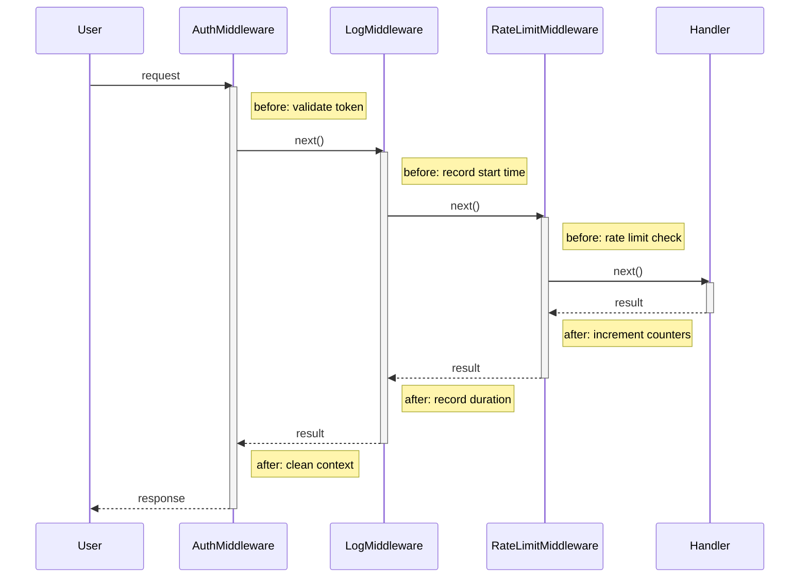
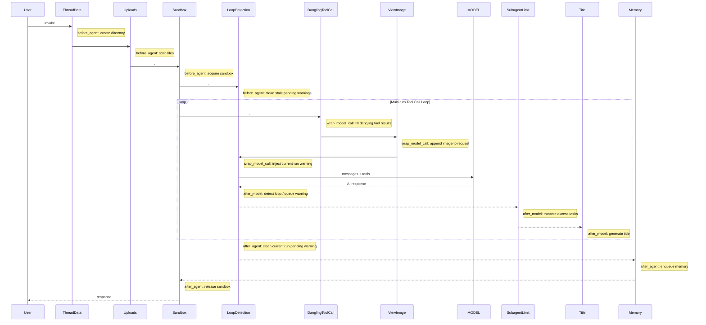

# Middleware Execution Flow

## Middleware List

The complete middleware chain assembled by `create_agent_workspace_agent` via `RuntimeFeatures` (when all features are enabled by default):

| # | Middleware | `before_agent` | `before_model` | `after_model` | `after_agent` | `wrap_model_call` | `wrap_tool_call` | Lead Agent | Subagent | Source |
|---|---|:---:|:---:|:---:|:---:|:---:|:---:|:---:|:---:|---|
| 0 | ThreadDataMiddleware | ✓ | | | | | | ✓ | ✓ | `sandbox` |
| 1 | UploadsMiddleware | ✓ | | | | | | ✓ | ✗ | `sandbox` |
| 2 | SandboxMiddleware | ✓ | | | ✓ | | | ✓ | ✓ | `sandbox` |
| 3 | DanglingToolCallMiddleware | | | | | ✓ | | ✓ | ✗ | Always on |
| 4 | GuardrailMiddleware | | | | | | ✓ | ✓ | ✓ | *Phase 2 inclusion* |
| 5 | ToolErrorHandlingMiddleware | | | | | | ✓ | ✓ | ✓ | Always on |
| 6 | SummarizationMiddleware | | ✓ | | | | | ✓ | ✗ | `summarization` |
| 7 | TodoMiddleware | | ✓ | ✓ | | ✓ | | ✓ | ✗ | `plan_mode` param |
| 8 | TitleMiddleware | | | ✓ | | | | ✓ | ✗ | `auto_title` |
| 9 | MemoryMiddleware | | | | ✓ | | | ✓ | ✗ | `memory` |
| 10 | ViewImageMiddleware | | | | | ✓ | | ✓ | ✗ | `vision` |
| 11 | SubagentLimitMiddleware | | | ✓ | | | | ✓ | ✗ | `subagent` |
| 12 | LoopDetectionMiddleware | ✓ | | ✓ | ✓ | ✓ | | ✓ | ✗ | Always on |
| 13 | ClarificationMiddleware | | | | | | ✓ | ✓ | ✗ | Always last |

The lead agent has **14** middlewares (`make_lead_agent`), while subagents have **4** (ThreadData, Sandbox, Guardrail, ToolErrorHandling). `create_agent_workspace_agent` implements **13** in Phase 1 (Guardrail supports custom instances only, with no built-in default).

## Execution Flow

LangChain `create_agent` rules:
- **`before_*` executes in forward order** (list index 0 → N)
- **`after_*` executes in reverse order** (list index N → 0)

```mermaid
graph TB
    START(["invoke"]) --> TD

    subgraph BA ["<b>before_agent</b> Forward Order 0→N"]
        direction TB
        TD["[0] ThreadData<br/>Create thread directory"] --> UL["[1] Uploads<br/>Scan uploaded files"] --> SB["[2] Sandbox<br/>Acquire sandbox"] --> LD_BA["[12] LoopDetection<br/>Clean stale warning"]
    end

    subgraph WM ["<b>wrap_model_call</b> Outer→Inner 0→N"]
        direction TB
        DTC_WM["[3] DanglingToolCall<br/>Fill dangling ToolMessage"] --> VI["[10] ViewImage<br/>Inject image base64 (request-scoped)"] --> LD_WM["[12] LoopDetection<br/>Inject current run warning"]
    end

    LD_BA --> DTC_WM
    LD_WM --> M["<b>MODEL</b>"]

    subgraph AM ["<b>after_model</b> Reverse Order N→0"]
        direction TB
        LD["[12] LoopDetection<br/>Detect loop/queue warning"] --> SL["[11] SubagentLimit<br/>Truncate excess tasks"] --> TI["[8] Title<br/>Generate title"]
    end

    M --> LD

    subgraph AA ["<b>after_agent</b> Reverse Order N→0"]
        direction TB
        LD_CLEAN["[12] LoopDetection<br/>Clean pending warning"] --> MEM["[9] Memory<br/>Enqueue memory"] --> SBR["[2] Sandbox<br/>Release sandbox"]
    end

    TI --> LD_CLEAN
    SBR --> END(["response"])

    classDef beforeNode fill:#a0a8b5,stroke:#636b7a,color:#2d3239
    classDef modelNode fill:#b5a8a0,stroke:#7a6b63,color:#2d3239
    classDef wrapModelNode fill:#a8a0b5,stroke:#6b637a,color:#2d3239
    classDef afterModelNode fill:#b5a0a8,stroke:#7a636b,color:#2d3239
    classDef afterAgentNode fill:#a0b5a8,stroke:#637a6b,color:#2d3239
    classDef terminalNode fill:#a8b5a0,stroke:#6b7a63,color:#2d3239

    class TD,UL,SB,LD_BA beforeNode
    class DTC_WM,VI,LD_WM wrapModelNode
    class M modelNode
    class LD,SL,TI afterModelNode
    class LD_CLEAN,SBR,MEM afterAgentNode
    class START,END terminalNode
```



## Sequence Diagram

```mermaid
sequenceDiagram
    participant U as User
    participant TD as ThreadDataMiddleware
    participant UL as UploadsMiddleware
    participant SB as SandboxMiddleware
    participant LD as LoopDetectionMiddleware
    participant DTC as DanglingToolCallMiddleware
    participant VI as ViewImageMiddleware
    participant M as MODEL
    participant SL as SubagentLimitMiddleware
    participant TI as TitleMiddleware
    participant MEM as MemoryMiddleware

    U ->> TD: invoke
    activate TD
    Note right of TD: before_agent: create directory

    TD ->> UL: before_agent
    activate UL
    Note right of UL: before_agent: scan uploaded files

    UL ->> SB: before_agent
    activate SB
    Note right of SB: before_agent: acquire sandbox

    SB ->> LD: before_agent
    activate LD
    Note right of LD: before_agent: clean pending warnings from old runs on same thread
    LD ->> DTC: wrap_model_call
    activate DTC
    Note right of DTC: wrap_model_call: fill dangling ToolMessages

    DTC ->> VI: wrap_model_call
    activate VI
    Note right of VI: wrap_model_call: append image base64 to request (ephemeral)
    VI ->> LD: wrap_model_call
    Note right of LD: wrap_model_call: drain current run warnings and append to end
    LD ->> M: messages + tools
    activate M
    M -->> LD: AI response
    deactivate M

    Note right of LD: after_model: detect loop; enqueue warning, hard-stop clears tool_calls
    LD -->> SL: after_model
    deactivate LD

    activate SL
    Note right of SL: after_model: truncate excess subagent tasks
    SL -->> TI: after_model
    deactivate SL

    activate TI
    Note right of TI: after_model: generate title
    TI -->> VI: done
    deactivate TI

    deactivate VI

    DTC -->> SB: done
    deactivate DTC

    Note right of LD: after_agent: clean unconsumed warnings for current run

    Note right of MEM: after_agent: enqueue memory update

    Note right of SB: after_agent: release sandbox
    SB -->> UL: done
    deactivate SB

    UL -->> TD: done
    deactivate UL

    TD -->> U: response
    deactivate TD
```

## Onion Model Comparison

List position determines nesting depth within the onion model — index 0 is outermost, index N is innermost:

```
Entering before_*:       [0] → [1] → [2] → ... → [7] → MODEL
Entering wrap_model_call: [3] → [10] → [12] → MODEL (outer→inner, forward order)
Exiting after_*:         MODEL → [13] → [11] → ... → [6] → [3] → [2] → [0]
                                  ↑ Innermost executes first
```

> [!important] Core Rule
> The last middleware in the list executes its `after_model` **first**.
> `ClarificationMiddleware` resides at the end of the list, ensuring it intercepts model output before all other hooks.

## Comparison: True Onion vs Alpha Pipeline

### True Onion Model (e.g. Koa / Express)

Each middleware handles symmetrical before/after lifecycle actions with full nesting:



### Alpha Pipeline Reality

Alpha is structured as a pipeline rather than a strict onion. Most middlewares implement only a single hook with no symmetrical wrapping. In multi-turn tool calling, `before_model` and `after_model` execute in a loop:



> [!warning] Pipeline vs Onion
> Most middlewares execute only in a single lifecycle phase. `SandboxMiddleware` uses `before_agent`/`after_agent` for resource acquisition and release; `LoopDetectionMiddleware` also uses these hooks to manage run-scoped warning queues. `before_agent` and `after_agent` run once per execution, whereas `before_model`, `after_model`, and `wrap_model_call` run on every tool turn.

Hard dependencies exist in only 2 locations:

1. **ThreadData precedes Sandbox** — the sandbox requires a valid thread directory.
2. **Clarification is placed last in the list** — `wrap_tool_call` intercepts `ask_clarification` first, interrupting execution via `Command(goto=END)`.

### Summary Comparison

| | True Onion | Alpha Pipeline |
|---|---|---|
| Middleware Structure | Symmetrical before + after | Mostly single-phase hooks |
| Activation Lifetime | Nested (outer spans inner) | Linear / Pipeline steps |
| Reverse Order Purpose | Teardown paired with setup | Determines `after_model` / `after_agent` priority |
| Typical Example | Auth: validate token / clear context | ThreadData: creates directory, no teardown |

## Key Design Considerations

### Why is ClarificationMiddleware Placed Last?

Its position at the end of the list allows it to intercept `ask_clarification` ahead of any standard tool execution handlers. When matched, it returns `Command(goto=END)`, writing the formatted clarification query into a `ToolMessage` and terminating execution.

### SandboxMiddleware Symmetry

`before_agent` (3rd in list) acquires the sandbox environment, and `after_agent` (1st in reverse order) releases it. This forms natural, symmetrical boundary management.

### Why Does LoopDetectionMiddleware Use Multiple Hooks?

`after_model` performs detection only: when repeated tool calls cross the warning threshold, it queues a warning scoped to `(thread_id, run_id)`. The warning is actually injected during the subsequent `wrap_model_call`: by this time, `ToolMessage` entries corresponding to previous tool calls are present in the request, and the warning is appended to the end, preserving OpenAI/Moonshot tool-call message pairing invariants. `before_agent` cleans up residual warnings from older runs on the same thread, while `after_agent` purges unconsumed warnings for the completed run.