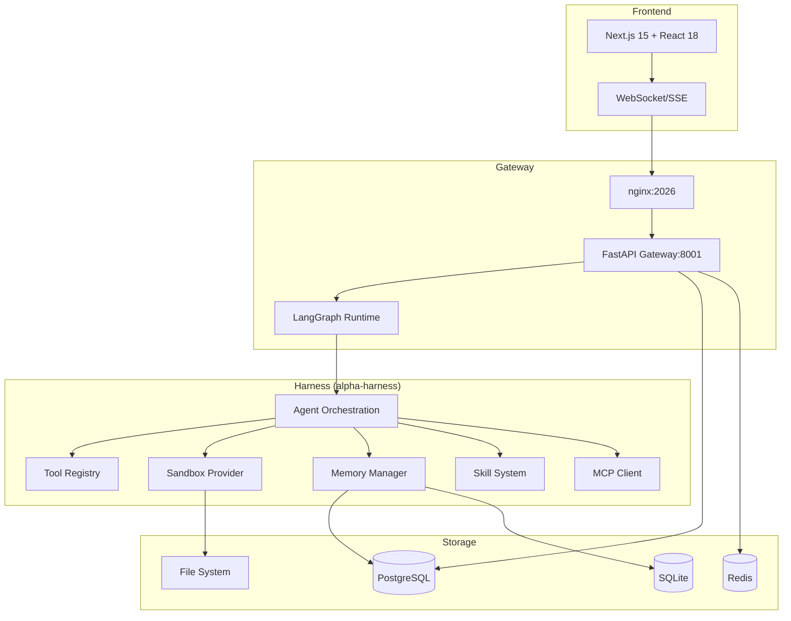
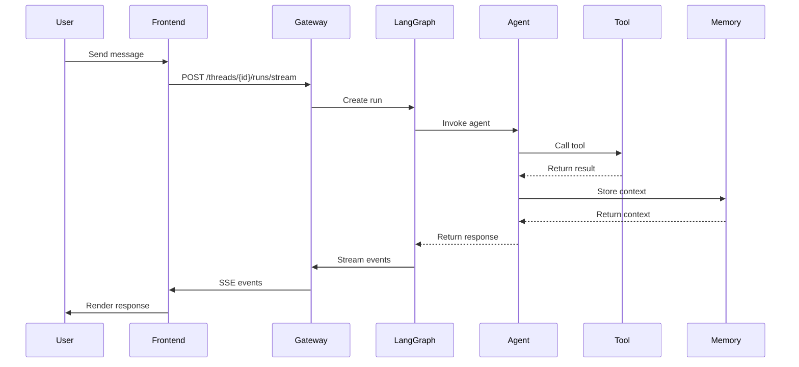
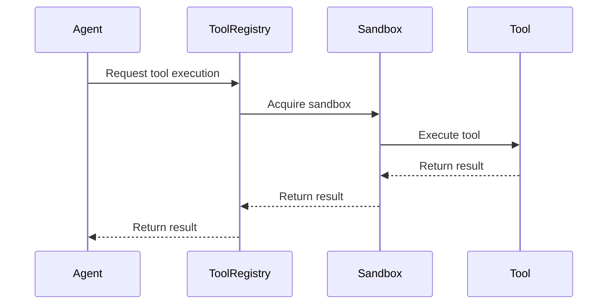
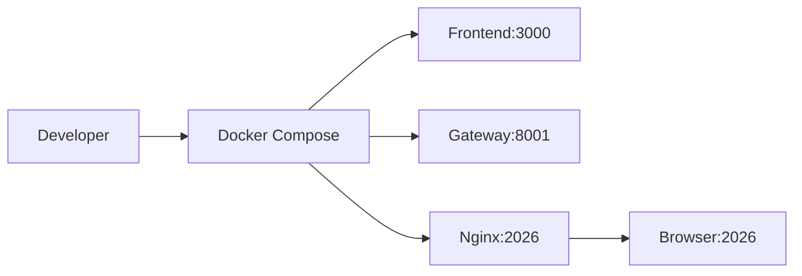
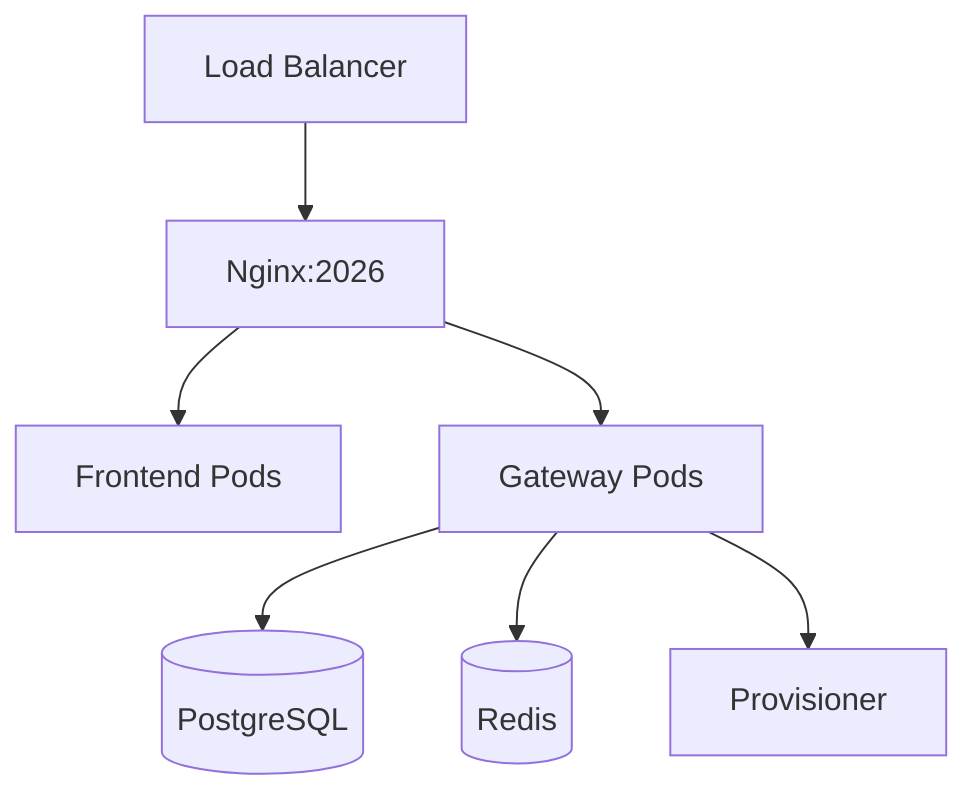

# Architecture

Deep dive into Alpha's system architecture, data flows, and component interactions.

## High-Level Architecture



---

## Component Overview

### Frontend (Next.js 15)

- **Framework**: Next.js 15 App Router
- **UI**: React 18 + Tailwind CSS
- **State**: React hooks + context
- **Real-time**: SSE/WebSocket via Gateway
- **Build**: Turbopack (dev), Next.js build (prod)

### Gateway (FastAPI)

- **Framework**: FastAPI 0.110+
- **Runtime**: Uvicorn + uvloop
- **Auth**: JWT + API keys + PATs
- **Rate Limiting**: Token bucket per client
- **OpenAPI**: Auto-generated at `/docs`

### Gateway Services

| Service | Port | Description |
|-------|------|-------------|
| Gateway API | 8001 | Main REST API |
| LangGraph Runtime | 8001 | Embedded LangGraph |
| WebSocket | 8001 | Real-time streams |
| Provisioner | 8002 | Sandbox provisioning (optional) |

### Harness (alpha-harness)

Core agent framework published as `alpha-harness` package.

| Module | Purpose |
|--------|---------|
| `alpha.agents` | Agent orchestration, LangGraph integration |
| `alpha.tools` | Tool registry, built-in tools, MCP |
| `alpha.memory` | DeerMem, cognitive memory, summarization |
| `alpha.sandbox` | Sandbox providers (Docker, AIO, E2B) |
| `alpha.skills` | Skill system, marketplace |
| `alpha.subagents` | Subagent executor, delegation |
| `alpha.workflow` | Dynamic workflows, DAG execution |
| `alpha.swarm` | Swarm orchestration |
| `alpha.autonomy` | APEX, sentinel, loops |
| `alpha.groups` | Nested groups, claims, coordination |
| `alpha.projects` | Project management, crews |
| `alpha.commands` | Slash commands, registry |
| `alpha.channels` | IM bridges (Slack, Telegram, etc.) |

---

## Data Flows

### Chat Message Flow



### Tool Execution Flow



---

## Component Details

### Agent Orchestration

- **Framework**: LangGraph (stateful, cyclic graphs)
- **State**: Thread-scoped, checkpointed
- **Middleware**: Tool, model, clarification
- **Checkpointing**: SQLite/PostgreSQL
- **Streaming**: SSE with `messages-tuple` mode

### Tool System

| Type | Count | Description |
|------|-------|-------------|
| Built-in | 456+ | Core tools (file, shell, web, code, etc.) |
| MCP | Dynamic | External MCP servers |
| Skills | Dynamic | Community/custom skills |
| Custom | Dynamic | User-defined tools |

**Tool Governance**: Risk classification, approval gates, capability ceilings.

### Memory System

| Layer | Technology | Purpose |
|-------|------------|---------|
| Working | In-memory | Active conversation context |
| Episodic | DeerMem + SQLite | Conversation history |
| Semantic | DeerMem + embeddings | Semantic search |
| Cognitive | Custom | Structured knowledge |

### Sandbox Providers

| Provider | Isolation | Use Case |
|----------|-----------|----------|
| Docker | Container | General purpose |
| AIO | Process | Lightweight, fast |
| E2B | Cloud | Heavy compute, browser |
| Local | Process | Development only |

---

## Security Model

### Authentication

- **JWT**: Stateless, RS256
- **API Keys**: Scoped, rotatable
- **PATs**: Personal access tokens
- **OIDC**: Optional external providers

### Authorization

- **RBAC**: Role-based access control
- **Thread Ownership**: Per-thread isolation
- **Resource Scoping**: Per-resource permissions

### Sandbox Security

- **Capabilities**: Linux capabilities dropped
- **Seccomp**: Syscall filtering
- **Namespaces**: PID, network, mount, user
- **Cgroups**: Resource limits (CPU, memory, I/O)
- **Seccomp**: Syscall filtering

---

## Deployment Architecture

### Development



### Production (Docker)



### Kubernetes

```yaml
# Example K8s deployment
apiVersion: apps/v1
kind: Deployment
metadata:
  name: alpha-gateway
spec:
  replicas: 3
  selector:
    matchLabels:
      app: alpha-gateway
  template:
    spec:
      containers:
      - name: gateway
        image: premkumar/alpha:latest
        ports:
        - containerPort: 8001
        envFrom:
        - secretRef:
            name: alpha-secrets
```

---

## Scaling Considerations

### Horizontal Scaling

- **Gateway**: Stateless, horizontal scaling via load balancer
- **Frontend**: Static assets on CDN, Next.js ISR for dynamic pages
- **Database**: Read replicas for read-heavy workloads
- **Redis**: Cluster mode for pub/sub scaling

### Resource Limits

| Component | CPU | Memory | Replicas |
|-----------|-----|--------|----------|
| Gateway | 2-4 cores | 4-8 GB | 3+ |
| Frontend | 1-2 cores | 1-2 GB | 2+ |
| PostgreSQL | 4-8 cores | 16-32 GB | 1 primary + replicas |
| Redis | 2-4 cores | 8-16 GB | Cluster |

---

## Monitoring & Observability

### Metrics

- **Prometheus**: `/metrics` endpoint
- **Grafana**: Pre-built dashboards
- **Key Metrics**: Latency, throughput, error rate, token usage, cost

### Logging

- **Format**: Structured JSON
- **Levels**: DEBUG, INFO, WARN, ERROR
- **Aggregation**: Loki + Grafana
- **Correlation**: Trace IDs across services

### Tracing

- **OpenTelemetry**: Distributed tracing
- **LangGraph**: Built-in trace events
- **Export**: Jaeger, Zipkin, OTLP

---

## Next Steps

- [Configuration](/getting-started/configuration) — Configure Alpha
- [Deployment](/deployment) — Production deployment guide
- [API Reference](/api) — Complete API documentation
- [Guides](/guides) — Detailed how-to guides