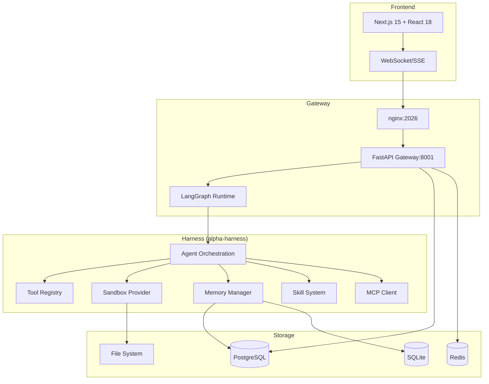

# Welcome to Alpha

**Alpha** is a **LangGraph-based AI super-agent system** — a backend "super agent" with sandboxed execution, persistent memory, subagent delegation, and extensible tooling (built-in, MCP, community), all per-thread isolated; a Next.js chat frontend; and IM bridges (Feishu, Slack, Telegram, Discord, DingTalk) into the same agent through the Gateway.

---

## 🎯 What Can Alpha Do?

| Capability | Description |
|------------|-------------|
| 🤖 **Super Agent** | LangGraph-based orchestrator with tool calling, model routing, and autonomous execution |
| 🏖️ **Sandboxed Execution** | Isolated environments (Docker, AIO, E2B, local) per thread with file I/O, network, and process isolation |
| 🧠 **Persistent Memory** | DeerMem + cognitive memory with semantic search, summarization, and cross-thread recall |
| 👥 **Subagent Delegation** | Spawn specialized agents (`/subagent spawn`), manage swarms (`/swarm`), delegate with acceptance criteria |
| 🔌 **Extensible Tooling** | 456+ built-in tools + MCP servers + custom skills + community extensions |
| 💾 **Per-Thread Isolation** | Every conversation gets its own sandbox, memory, and tool namespace |
| 🌐 **IM Bridges** | Native Feishu, Slack, Telegram, Discord, DingTalk connectors via unified Gateway |
| 📊 **Observability** | Real-time SSE streams, run traces, token usage, cost tracking, delivery receipts |
| 🛡️ **Governance** | Tool risk policies, approval gates, capability ceilings, emergency stop |
| 🔄 **Durable Runtime** | Crash recovery, network partitions, graceful shutdown, session persistence |

---

## 🚀 Quick Start

### Prerequisites

- **Docker** + **Docker Compose v2.24+**
- **Node.js 22+**, **pnpm 11+**
- **Python 3.12+**, **uv**
- **nginx** (project-local binary included)

### One-Command Start

```bash
# Clone and configure
git clone https://github.com/itsPremkumar/alpha.git
cd alpha
cp config.example.yaml config.yaml
# Edit config.yaml with your API keys

# Start everything (Docker)
make docker-start

# Or local development
make dev
```

### Access Points

| Service | URL |
|---------|-----|
| **Web UI** | http://localhost:2026 |
| **API Gateway** | http://localhost:8001 |
| **LangGraph API** | http://localhost:8001/api/langgraph/* |
| **API Docs** | http://localhost:8001/docs |
| **Health Check** | http://localhost:8001/health |

---

## 🏗️ Architecture Overview



---

## 🎯 Key Capabilities

| Capability | Description |
|------------|-------------|
| 🤖 **Super Agent** | LangGraph-based orchestrator with tool calling, model routing, and autonomous execution |
| 🏖️ **Sandboxed Execution** | Isolated environments (Docker, AIO, E2B, local) per thread with file I/O, network, and process isolation |
| 🧠 **Persistent Memory** | DeerMem + cognitive memory with semantic search, summarization, and cross-thread recall |
| 👥 **Subagent Delegation** | Spawn specialized agents (`/subagent spawn`), manage swarms (`/swarm`), delegate with acceptance criteria |
| 🔌 **Extensible Tooling** | 456+ built-in tools + MCP servers + custom skills + community extensions |
| 💾 **Per-Thread Isolation** | Every conversation gets its own sandbox, memory, and tool namespace |
| 🌐 **IM Bridges** | Native Feishu, Slack, Telegram, Discord, DingTalk connectors via unified Gateway |
| 📊 **Observability** | Real-time SSE streams, run traces, token usage, cost tracking, delivery receipts |
| 🛡️ **Governance** | Tool risk policies, approval gates, capability ceilings, emergency stop |
| 🔄 **Durable Runtime** | Crash recovery, network partitions, graceful shutdown, session persistence |

---

## 🚀 Next Steps

- [Quick Start](/getting-started/quick-start) — Get up and running in 5 minutes
- [Installation](/getting-started/installation) — Detailed installation guide
- [Configuration](/getting-started/configuration) — Configure Alpha for your environment
- [First Agent](/getting-started/first-agent) — Create and run your first agent
- [Architecture](/architecture) — Deep dive into Alpha's architecture

---

## 🤝 Community & Support

- **GitHub**: [github.com/itsPremkumar/alpha](https://github.com/itsPremkumar/alpha)
- **Documentation**: [docs.alpha.itsPremkumar.com](https://docs.alpha.itsPremkumar.com)
- **Discord**: [discord.gg/alpha](https://discord.gg/alpha)
- **GitHub Discussions**: [github.com/itsPremkumar/alpha/discussions](https://github.com/itsPremkumar/alpha/discussions)
- **Issues**: [github.com/itsPremkumar/alpha/issues](https://github.com/itsPremkumar/alpha/issues)

---

## 📜 License

Alpha is licensed under the **MIT License** — see [LICENSE](https://github.com/itsPremkumar/alpha/blob/main/LICENSE) for details.

---

<div align="center">

**Made with ❤️ by [Prem Kumar](https://github.com/itsPremkumar) and contributors**

[⭐ Star us on GitHub](https://github.com/itsPremkumar/alpha) • [🐛 Report Bug](https://github.com/itsPremkumar/alpha/issues/new?template=bug_report.md) • [💡 Request Feature](https://github.com/itsPremkumar/alpha/issues/new?template=feature_request.md)

</div>