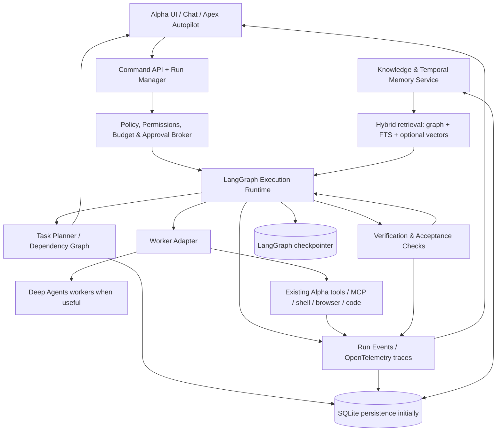
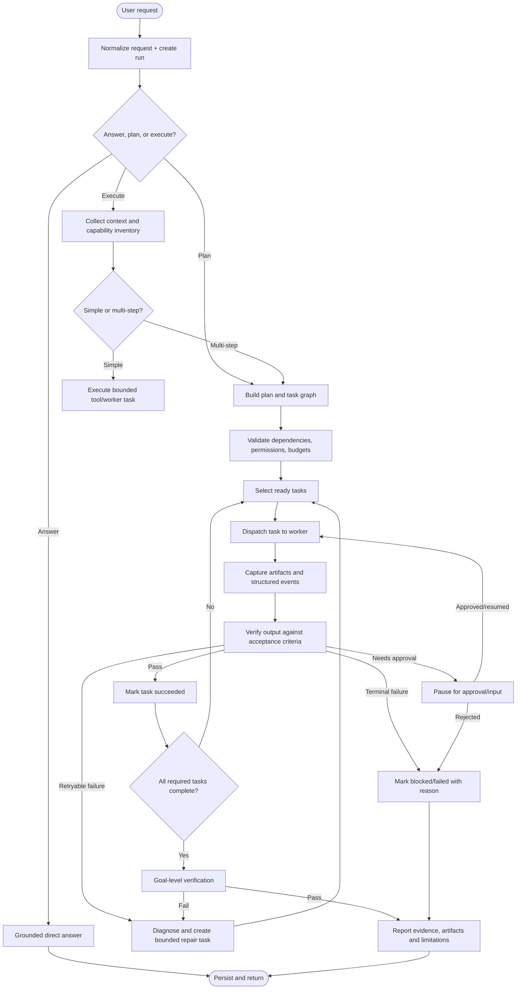
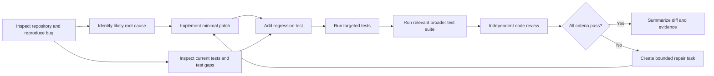

# Alpha AI Agent — Advanced Graph Engineering Research & Implementation Plan

**Document type:** Research-backed technical architecture and implementation specification  
**Prepared:** 10 October 2026  
**Target project:** [itsPremkumar/alpha](https://github.com/itsPremkumar/alpha)  
**Core stack to preserve:** Python, LangChain, LangGraph, Deep Agents, existing Alpha UI/backend/tools, and existing model-provider integrations  
**Primary objective:** Make Alpha reliably plan, execute, delegate, remember, inspect, recover, and verify work through an explicit graph-based architecture—without deleting or silently replacing existing capabilities.

> **Important scope note:** “Graph engineering” is not one standardized product or one graph. This plan separates several graph disciplines that solve different problems, then specifies how Alpha should connect them. LangGraph is the recommended execution-graph runtime. Deep Agents can provide higher-level agent-harness capabilities. A knowledge graph, task DAG, observability graph, and tool-capability graph remain distinct subsystems with separate data models and tests.

---

## 1. Executive recommendation

Implement **Alpha Graph Engineering (AGE)** as a layered architecture, not a single enormous graph and not a complete rewrite.

1. **Use LangGraph as the runtime for important stateful workflows.** Model work as typed state, nodes, normal/conditional edges, bounded loops, checkpoints, interrupts, subgraphs, and streaming events.
2. **Use a task/dependency graph for plans.** Represent objectives, tasks, prerequisites, assignments, retries, deadlines, and acceptance criteria explicitly. Use a DAG for dependencies wherever possible; use the execution graph's controlled loops for retries and review cycles.
3. **Keep Deep Agents as an optional/selected worker harness.** Its planning, filesystem, context management, skills, and subagent features can be valuable, but Alpha must avoid maintaining two competing agent loops that both believe they own planning, tools, state, and retries.
4. **Introduce a provenance-aware knowledge/memory graph incrementally.** Start with a lightweight SQLite-backed graph store and hybrid retrieval. Add a graph database or Graphiti only when real workloads justify the operational cost.
5. **Make observability graph-native.** Every user request, workflow run, node execution, model call, tool call, artifact, error, retry, and approval must be linked by stable IDs. Render a timeline/graph in Alpha's UI and surface failures to users instead of silently returning a plausible but unexecuted answer.
6. **Use deterministic code for policy, permissions, limits, state transitions, and validation.** Use an LLM where flexible language understanding, planning, synthesis, or classification is actually needed.
7. **Prove end-to-end behavior with acceptance tests before expanding autonomy.** A graph that looks sophisticated but does not execute real tools, persist progress, recover after restart, or report failures is not success.

### The most important expected improvement

Alpha should be able to tell the user, truthfully and with evidence:

- what it understood the goal to be;
- what tasks it created and why they depend on each other;
- which task/node is running now;
- which agents and tools actually ran;
- which evidence, files, tests, or external results were produced;
- what failed, what was retried, and what remains blocked;
- whether the goal passed its acceptance checks;
- whether a risky operation needs approval;
- how to resume the task after an app crash or machine restart.

The graph architecture is successful only when those capabilities work in the running application, not merely in a diagram or sample notebook.

---

## 2. What “graph engineering” means for Alpha

Graph engineering means deliberately designing, implementing, validating, persisting, querying, visualizing, and operating graphs that model work and knowledge. The graph's meaning depends on the domain.

### 2.1 Graph families Alpha should distinguish

| Graph family | What its nodes and edges mean | Main Alpha use | Suggested implementation |
|---|---|---|---|
| **Execution / control-flow graph** | Nodes are executable steps; edges determine the next step | Run a goal through classify → plan → execute → verify → report, with controlled loops | **LangGraph `StateGraph`** |
| **Task / dependency graph** | Nodes are concrete tasks; directed edges represent prerequisites or data dependencies | Plan software changes, research, testing, and multi-step automation; detect blockers and parallel work | Alpha-owned typed models + SQLite; DAG validation; optional NetworkX for analysis |
| **Agent delegation graph** | Nodes are agents/worker roles; edges are assignments, reports, or delegation relationships | Parent coordinator delegates bounded tasks to specialists and merges evidence | Task graph plus LangGraph subgraphs/Deep Agents worker harness |
| **Knowledge graph** | Nodes are entities, claims, artifacts, projects, tools, skills, and sources; edges represent typed relationships | Connect memories, code, errors, prior fixes, docs, and project facts | SQLite graph tables first; optional graph database later |
| **Temporal memory graph** | Facts and relationships have provenance and time validity | Remember what was true, when Alpha learned it, and whether later evidence superseded it | Alpha graph schema first; evaluate Graphiti if requirements grow |
| **Tool / skill capability graph** | Nodes are tools, skills, permissions, models, runtime environments; edges describe compatibility/dependencies | Select tools that can fulfill a request and explain why a tool is unavailable | Typed registry + dependency/compatibility graph |
| **Observability / causal graph** | Nodes are run events, node attempts, model calls, tool calls, exceptions, artifacts; edges express parent/causal links | Debug and explain failures, latency, token/cost consumption, missing tool execution | OpenTelemetry-compatible spans + Alpha event store |
| **Software architecture / code graph** | Nodes are files, modules, functions, tests, APIs; edges are imports, calls, ownership, coverage | Locate blast radius, generate change plans, identify tests, explain regressions | Start with static analysis and repository index; do not make it a runtime dependency |
| **Resource / health graph** | Nodes are processes, services, queues, database pools, model providers, schedulers; edges express dependencies | Explain why a run is blocked due to a down backend, provider, or tool | Existing health monitor + dependency edges |

**Do not combine these into one undifferentiated graph.** They have different lifetimes, security rules, write rates, consistency needs, and query patterns. Connect them by IDs and typed relationships instead.

### 2.2 Graphs are not automatically better than lists or tables

Use a graph when relationships, reachability, dependencies, alternate paths, multi-hop reasoning, or causality matter. A normal relational table remains suitable for settings, billing-like counters, flat configuration, and simple lookup records. Alpha can store graph-shaped data in relational tables at first; using graph concepts does **not** require running a graph database from day one.

### 2.3 The three basic pieces of an execution graph

LangGraph's model is built around:

- **State:** the current, typed snapshot of workflow data.
- **Nodes:** deterministic functions, LLM calls, tool invocations, or subgraphs that read state and return updates.
- **Edges:** static or conditional routes deciding what runs next.

LangGraph documents that nodes can run in parallel when a node routes to multiple destinations in a super-step, and reducers define how concurrent updates merge. Therefore, Alpha must design its state schema and merge behavior intentionally, especially for parallel subagents. See the [LangGraph Graph API](https://docs.langchain.com/oss/python/langgraph/graph-api) and [repository](https://github.com/langchain-ai/langgraph).

---

## 3. Research synthesis: patterns and projects to learn from

This is not a claim that every tool below should be installed. Use each as a reference for the problem it solves.

### 3.1 LangGraph — execution and orchestration runtime

**Why it matters:** LangGraph supplies a low-level runtime for stateful, looping workflows. It is designed for durable execution, streaming, persistence, interrupts/human approval, and controllable agent workflows. Its graph API supports typed state, node functions, normal/conditional edges, subgraphs, and parallel branches.

**Best Alpha applications:**

- Separate intent classification, planning, policy, execution, verification, and final response into auditable nodes.
- Route by explicit decisions instead of relying on a single prompt to do everything.
- Bound retry and review loops using state counters and termination rules.
- Persist a thread's run state through a checkpointer and resume by stable `thread_id`.
- Pause before destructive actions and resume after approval.
- Stream node and tool events to the UI.
- Draw workflow topology and capture snapshots for debugging.

**Important design cautions:**

- Reducers must make parallel state merges deterministic and conflict-aware.
- External side effects must be idempotent or guarded by execution records; a retry can call a node again.
- A checkpoint is not the same thing as durable external side-effect execution. Store operation IDs and verify state before retrying a write.
- Use deterministic nodes for permissions and validation rather than delegating policy solely to the LLM.
- Do not blindly wrap every existing helper in a separate graph node; graph nodes should correspond to meaningful execution boundaries and observability needs.

Primary references:

- [LangGraph Graph API](https://docs.langchain.com/oss/python/langgraph/graph-api)
- [LangGraph persistence](https://docs.langchain.com/oss/python/langgraph/persistence)
- [LangGraph durable execution](https://docs.langchain.com/oss/python/langgraph/durable-execution)
- [LangGraph interrupts / human-in-the-loop](https://docs.langchain.com/oss/python/langgraph/interrupts)
- [LangGraph overview](https://docs.langchain.com/oss/python/langgraph/overview)
- [LangGraph GitHub](https://github.com/langchain-ai/langgraph)

### 3.2 Deep Agents — higher-level agent harness

Deep Agents is an open-source harness built on LangGraph and LangChain building blocks. The official documentation describes features such as planning, subagent spawning with isolated context, filesystem tools/backends, context management, skills, persistent memory, and human-in-the-loop operations. It can work with models from providers and with self-hosted/local models when tool-calling capabilities and integrations are compatible; test the exact model/provider used by Alpha rather than assuming every model behaves equally.

**Best Alpha applications:**

- Reuse the filesystem, context-management, skills, or subagent primitives where Alpha's current harness is missing them or has unreliable implementations.
- Run a Deep Agent as a *worker* for a well-bounded task, while Alpha's coordinator owns the task DAG, approvals, resource budgets, run IDs, and final acceptance tests.
- Reuse the Deep Research example as a design reference for planning → delegated research → synthesis, with explicit iteration and concurrency limits.

**Do not:**

- Replace Alpha wholesale before creating regression tests for current behavior.
- Let both Alpha and Deep Agents independently decompose the same task, create uncontrolled child agents, and retry forever.
- Assume the filesystem-backed memory is the same as a provenance-rich knowledge graph; these solve related but different problems.
- Allow a subagent to bypass Alpha's permission broker, cancellation token, tool policy, cost limits, or audit trail.

Primary references:

- [Deep Agents overview](https://docs.langchain.com/oss/python/deepagents/overview)
- [Deep Agents repository](https://github.com/langchain-ai/deepagents)
- [Deep Agents README / feature summary](https://github.com/langchain-ai/deepagents/blob/main/README.md)
- [Deep Research example](https://github.com/langchain-ai/deepagents/tree/main/examples/deep_research)

**Integration decision:** keep LangGraph as the execution/runtime backbone. Integrate selected Deep Agents primitives behind Alpha interfaces. Prefer one owner for planning and one owner for execution state. If current Alpha already depends on Deep Agents, treat this as a cleanup/consolidation task, not a second parallel framework rollout.

### 3.3 Knowledge graphs and GraphRAG

A knowledge graph represents entities and relationships explicitly. A retrieval pipeline can combine graph traversal with full-text or vector retrieval, then provide sourced context to the LLM. Microsoft GraphRAG's documented index pipeline extracts entities and relationships from text, clusters related entities into communities, and generates hierarchical summaries; query paths can include global, local, and DRIFT search. These patterns are useful when a task depends on connecting several documents or answering corpus-wide questions.

**Best Alpha applications:**

- Link project facts with their source files, commits, tests, documentation, and prior decisions.
- Connect an error signature to the affected component, related issue, previous attempts, and the fix that passed tests.
- Retrieve related facts and evidence across previous conversations and tasks.
- Answer questions such as “What caused this bug last time?” by walking from error → component → attempt → patch → test result.

**Important caveats:**

- Graph extraction can invent entities or relationships; store provenance, confidence, and source offsets and require verification for high-impact uses.
- GraphRAG indexing can be expensive. Start with a tiny corpus and low-cost model if evaluating it.
- Microsoft's `microsoft/graphrag` repository currently describes itself as largely in maintenance mode. Treat it as an important research/reference implementation, not the mandatory core dependency for Alpha.
- Knowledge graphs do not eliminate hallucinations. Alpha must ground responses in retrieved evidence and indicate when evidence is weak or conflicting.

Primary references:

- [Microsoft GraphRAG documentation](https://microsoft.github.io/graphrag/)
- [Microsoft GraphRAG GitHub](https://github.com/microsoft/graphrag)
- [Microsoft Research: GraphRAG global search](https://www.microsoft.com/en-us/research/blog/graphrag-improving-global-search-via-dynamic-community-selection/)
- [Neo4j graph database concepts](https://neo4j.com/docs/getting-started/graph-database/)
- [Neo4j GraphRAG developer guide](https://neo4j.com/developer/genai-ecosystem/)

### 3.4 Graphiti / temporal knowledge graphs for memory

[Graphiti](https://github.com/getzep/graphiti) is an open-source framework for temporal knowledge graphs intended for dynamic agent contexts. It models episodes, entities, and relationships; supports incremental updates and historical questions; and combines graph, keyword, and semantic retrieval approaches. This makes it a valuable reference for distinguishing “what Alpha knows now” from “what was true before” and “which source taught Alpha this.”

Potential Alpha use cases:

- A user changes a project preference; retain the latest fact and the old fact's validity interval rather than storing contradictory preferences as equally current.
- A tool is renamed, a repository changes path, a model provider removes an endpoint, or a project moves to a different architecture; represent the change with source and timestamp.
- Store a memory as a sourced claim rather than a free-floating sentence.

Caveats:

- Graphiti's documented setup expects a supported graph backend and an LLM for extraction; its repository says OpenAI is the default for LLM inference and embeddings, with alternatives depending on supported integrations. Do not assume it is turnkey, zero-cost, or light enough for Alpha's baseline laptop.
- The repository documents an evolving project; pin and test versions before adopting it.
- Keep the initial Alpha schema backend-neutral so Graphiti can be evaluated later without rewriting the whole memory layer.

Reference: [Graphiti repository and setup](https://github.com/getzep/graphiti), [Graphiti documentation](https://help.getzep.com/graphiti/getting-started/welcome), and [Zep's temporal graph concepts](https://help.getzep.com/graph-overview).

### 3.5 Graph of Thoughts — graph-shaped reasoning strategy

The research paper *Graph of Thoughts: Solving Elaborate Problems with Large Language Models* models intermediate LLM-produced thoughts as vertices and dependencies as edges, allowing information to be combined, refined, and revisited. It extends beyond a simple linear chain or branching tree. It is a **reasoning pattern**, not a database and not a replacement for LangGraph.

For Alpha, use the concept selectively:

- Keep multiple candidate hypotheses for difficult debugging/research tasks.
- Link each hypothesis to evidence, counter-evidence, and tests that could falsify it.
- Allow a reviewer node to merge compatible findings or mark contradictions.
- Retain the best verified path, not every speculative thought in permanent memory.

Do not log or expose private internal reasoning verbatim. Instead store concise, reviewable **rationales, hypotheses, evidence references, decisions, and verification outcomes** suitable for audit and debugging.

Reference: [Graph of Thoughts (AAAI 2024)](https://ojs.aaai.org/index.php/AAAI/article/view/29720) and [arXiv paper](https://arxiv.org/abs/2308.09687).

### 3.6 Observability and causal execution traces

Agent observability should join workflow events with model calls, tool calls, external requests, exceptions, artifacts, retries, and final outcomes. OpenTelemetry provides traces, spans, events, and semantic conventions; its current GenAI conventions are evolving, so use a compatible SDK/exporter and keep Alpha-specific attributes namespaced.

For Alpha, build a causal tree/DAG:

`conversation → goal → workflow run → node attempt → model/tool operation → artifact/error → verification result`

This makes it possible to answer “why did Alpha return an answer without doing the requested work?” by determining whether the run routed through the action planner, execution node, tool broker, and verification node—or terminated early.

References:

- [OpenTelemetry GenAI semantic conventions](https://opentelemetry.io/docs/specs/semconv/registry/attributes/gen-ai/)
- [OpenTelemetry traces concepts](https://opentelemetry.io/docs/concepts/signals/traces/)
- [LangGraph streaming and debugging](https://docs.langchain.com/oss/python/langgraph/streaming)

### 3.7 Graph database basics and storage choice

A property graph commonly uses nodes (entities), relationships (directed typed edges), and key-value properties. Graph databases such as Neo4j make traversal-oriented relationships first-class and provide graph query languages such as Cypher. That can be powerful for deep multi-hop querying, but a graph database is an operational decision—not a prerequisite for graph engineering.

Reference: [Neo4j: What is a graph database?](https://neo4j.com/docs/getting-started/graph-database/) and [Cypher introduction](https://neo4j.com/docs/getting-started/cypher/).

**Alpha's initial storage recommendation:** use SQLite tables for nodes, edges, claims, evidence, tasks, events, and indexes; use SQLite FTS for lexical search where available; optionally use embeddings later. This minimizes service count and works offline. Keep a storage interface so Neo4j/FalkorDB/Graphiti can be tested as an optional backend if graph scale or query complexity warrants it. Do not install every technology at once.

---

## 4. Target architecture

### 4.1 Layered model



### 4.2 Design principles

- **One orchestration authority:** the Alpha Run Manager assigns each user request a unique `run_id` and chooses the graph/workflow. No second scheduler can independently mutate the same run.
- **One canonical task record:** a task has one stable ID and one current authoritative status. UI, orchestrator, worker, and monitor read that record.
- **Separate graph data from execution state:** LangGraph checkpoints preserve runnable state; task tables track user-visible work; the knowledge graph stores long-lived claims/relationships; event logs explain what happened.
- **All work is observable:** nodes produce structured events with `run_id`, `task_id`, `node_name`, `attempt`, timestamp, status, duration, artifact references, and error classification.
- **All loops are bounded:** planning iterations, tool retries, review iterations, and worker spawns each have explicit limits and a global deadline/resource budget.
- **Failures are data:** exceptions become typed failure events and visible states, not only console output or a silently generated apology.
- **No hidden downgrade:** if the graph runtime, model, tool, database, or browser is unavailable, Alpha should state the actual blocker. A deterministic fallback may be used only when declared and observable.
- **Preserve existing functionality:** introduce adapters and route a small set of tasks through the new architecture behind a feature flag. Do not delete the current paths until they pass the same acceptance tests.

### 4.3 Important boundary: conversation response versus task execution

Alpha should distinguish at least three intents:

1. **Answer:** respond directly; no external action expected.
2. **Plan/explain:** create a plan or explain what would be done, without executing tools unless asked.
3. **Execute:** perform work with tools, files, browser, code, research, or automation and verify the result.

The intent classifier is not allowed to decide success. For an execute request, success requires actual operation records and verification evidence. If policy or environment prevents execution, show `blocked` or `failed` with a reason instead of representing the requested action as completed.

---

## 5. Canonical Alpha data model

Use explicit schemas, enums, and migrations. Avoid a single untyped JSON blob as the only persistent representation.

### 5.1 `Goal`

```json
{
  "goal_id": "goal_01...",
  "run_id": "run_01...",
  "user_request": "Fix the API bug and add regression tests",
  "normalized_objective": "Reproduce the API failure, fix root cause, and verify with regression tests",
  "mode": "execute",
  "status": "planning",
  "acceptance_criteria": ["Regression test fails before patch", "Test passes after patch", "Relevant suite passes"],
  "risk_level": "medium",
  "created_at": "UTC ISO-8601",
  "updated_at": "UTC ISO-8601",
  "deadline_at": null,
  "budget": {"max_model_calls": 30, "max_subagents": 3, "max_wall_seconds": 1800},
  "policy_profile": "local-code-safe-defaults"
}
```

### 5.2 `TaskNode`

```json
{
  "task_id": "task_01...",
  "goal_id": "goal_01...",
  "title": "Reproduce the failing endpoint",
  "description": "Run the targeted request and capture the failure",
  "task_type": "test|research|code|review|browser|tool|synthesis|approval",
  "status": "pending|ready|queued|running|waiting_approval|blocked|succeeded|failed|cancelled|skipped",
  "depends_on": ["task_parent_id"],
  "assigned_worker": "qa-worker",
  "required_capabilities": ["shell", "python", "repository-read"],
  "input_artifact_ids": [],
  "output_artifact_ids": [],
  "acceptance_checks": ["reproduction-command-exits-nonzero-before-fix"],
  "attempt_count": 0,
  "max_attempts": 2,
  "priority": 50,
  "created_at": "UTC ISO-8601",
  "started_at": null,
  "finished_at": null,
  "error_id": null
}
```

### 5.3 `GraphEdge`

Represent edges with an explicit type rather than relying on ambiguous strings.

```json
{
  "edge_id": "edge_01...",
  "graph_id": "task-graph:goal_01...",
  "source_id": "task_reproduce",
  "target_id": "task_patch",
  "edge_type": "DEPENDS_ON",
  "properties": {"reason": "Patch should follow a reproducible failure"},
  "created_at": "UTC ISO-8601",
  "valid_from": "UTC ISO-8601",
  "valid_to": null,
  "source_artifact_id": null
}
```

Recommended edge types include `DEPENDS_ON`, `ASSIGNED_TO`, `PRODUCES`, `USES_TOOL`, `SUPPORTED_BY`, `CONTRADICTS`, `REPLACES`, `DERIVED_FROM`, `CAUSED_BY`, `VERIFIED_BY`, `BLOCKED_BY`, `CALLS`, `OWNS`, `REQUIRES_CAPABILITY`, and `SUPERSEDES`. Keep task-dependency edge types separate from knowledge-relationship types in code and validation.

### 5.4 `Artifact`

An artifact is a durable result produced by work, not an ephemeral string in the chat. Examples include changed file, diff, test report, research report, screenshot, browser capture, API response, command output, error bundle, and evaluation report.

Fields: `artifact_id`, `run_id`, optional `task_id`, `artifact_type`, `uri_or_relative_path`, `content_hash`, `mime_type`, `size_bytes`, `created_at`, `created_by_node`, `sensitivity`, `metadata_json`, and retention policy. Store large payloads on disk; reference them from the graph and database.

### 5.5 `EvidenceClaim`

For knowledge/memory, store claims with sources and time rather than as unqualified “facts”.

```json
{
  "claim_id": "claim_01...",
  "subject_entity_id": "entity_alpha_repo",
  "predicate": "USES_FRAMEWORK",
  "object_entity_id": "entity_langgraph",
  "claim_text": "Alpha's execution orchestration uses LangGraph",
  "source_artifact_id": "artifact_repo_file_or_document",
  "source_locator": "path/to/file.py#L10-L42",
  "confidence": 0.97,
  "status": "candidate|verified|disputed|superseded|retracted",
  "valid_from": "UTC ISO-8601",
  "valid_to": null,
  "observed_at": "UTC ISO-8601",
  "recorded_at": "UTC ISO-8601",
  "created_by": "memory-extractor-v1"
}
```

The confidence is an estimate, not proof. Verification status must be driven by provenance and validation rules, not by the LLM assigning itself high confidence.

### 5.6 `RunEvent` and `TraceSpan`

Minimum event envelope:

```json
{
  "event_id": "evt_01...",
  "run_id": "run_01...",
  "goal_id": "goal_01...",
  "task_id": "task_01...",
  "parent_event_id": "evt_parent_or_null",
  "trace_id": "trace_...",
  "span_id": "span_...",
  "event_type": "node.started|tool.completed|approval.required|task.failed",
  "severity": "debug|info|warning|error|critical",
  "status": "running|succeeded|failed|blocked|cancelled",
  "timestamp": "UTC ISO-8601",
  "duration_ms": null,
  "component": "alpha.executor",
  "operation": "tool.run",
  "attempt": 1,
  "error_code": null,
  "message_safe": "Human-readable message with secrets removed",
  "attributes": {},
  "artifact_ids": []
}
```

Do not put API keys, credentials, raw secrets, or unrestricted private content into traces. Capture input/output content only under an explicit redaction and privacy policy.

---

## 6. Recommended execution graph

### 6.1 Main graph shape

The following is a target topology, not a requirement that every request execute every node. Routing depends on intent, risk, and capabilities.



### 6.2 Node responsibilities

| Node / component | Required behavior | Must not do |
|---|---|---|
| `normalize_request` | Validate input, assign `run_id`, classify answer/plan/execute, set user-visible objective | Claim that the task has been completed |
| `collect_context` | Query relevant memory, files, repo state, available tools, model health | Load every memory item into the prompt |
| `plan_goal` | Propose tasks, dependencies, outputs, tests, risk and budgets | Directly execute tools during planning |
| `validate_plan` | Validate graph acyclicity where DAG is required, capability availability, limits, permissions, schema and acceptance criteria | Trust unchecked LLM JSON |
| `select_ready_tasks` | Select tasks whose dependencies are satisfied, within concurrency and resource caps | Schedule tasks with unresolved prerequisites |
| `dispatch_worker` | Resolve worker/capabilities; pass only required context; link child run/task IDs | Let workers change global policy or arbitrary tasks |
| `tool_broker` | Enforce allow/deny policy, approval, timeout, cancellation, idempotency key, and audit event | Trust prompt-based permission alone |
| `capture_artifact` | Persist result, hash it, attach provenance, emit event | Keep the only copy in transient chat history |
| `verify_task` | Run deterministic checks first, then an LLM reviewer if useful | Accept a worker's “done” assertion as proof |
| `repair_task` | Classify error, inspect trace, propose a bounded next attempt | Retry identical work indefinitely |
| `approval_gate` | Pause with a clear action preview and resume key | Ask for approval after the side effect already happened |
| `final_verify` | Check every goal-level acceptance criterion against artifacts | Convert partial completion into a success status |
| `report_result` | Summarize completed work, evidence, failures, approvals, and next safe step | Hide blockers or fabricate command/tool results |

### 6.3 State schema design

Use a typed schema (for Python, a `TypedDict` for performance or Pydantic models for boundary validation). Keep state minimal and avoid putting huge files, screenshots, or long tool transcripts into the checkpoint. Store large payloads in artifact storage and keep references in state.

Suggested state fields:

```python
class AlphaRunState(TypedDict, total=False):
    run_id: str
    thread_id: str
    goal_id: str
    user_request: str
    normalized_objective: str
    intent: Literal["answer", "plan", "execute"]
    mode: Literal["normal", "apex", "research", "coding", "browser"]
    status: str
    plan_version: int
    task_ids: list[str]
    ready_task_ids: list[str]
    active_task_ids: list[str]
    completed_task_ids: list[str]
    blocked_task_ids: list[str]
    artifact_ids: list[str]
    evidence_ids: list[str]
    approval_request_id: str | None
    retry_count: int
    planning_iteration: int
    model_calls_used: int
    tool_calls_used: int
    started_at: str
    deadline_at: str | None
    cancel_requested: bool
    failure_summary: str | None
    final_result: str | None
```

**Reducer policy:**

- Scalar status fields should be written by one coordinator node at a time.
- For event/artifact ID lists, use append-with-deduplication or store them in the database and select them by `run_id`.
- Never use a blind “last writer wins” merge for two parallel workers editing the same task record.
- Store authoritative task transitions transactionally outside the in-memory graph state.
- Keep private scratch fields out of the public output schema.

### 6.4 Bounded loops and termination

Every graph needs explicit stop conditions. Suggested configurable defaults (tune them with measurement):

- planning iterations per goal: 3;
- retries per task: 2 after the initial attempt;
- verifier/repair cycles per task: 2;
- maximum concurrent workers on an 8 GB laptop: start at 2, then benchmark;
- maximum child agents per goal: 3 initially;
- overall wall-clock deadline: request-specific;
- global tool/model call budget: request-specific;
- maximum repeated identical failure signature: 2 before escalation.

Use centralized config, not magic numbers scattered across nodes. When a limit is reached, set a typed terminal state and explain the blocker. Permit admins to tune safe limits later.

---

## 7. Task graph and planner engineering

### 7.1 Plan representation

The planner must return schema-validated data. It should propose **small, verifiable tasks**, each with:

- task purpose and bounded scope;
- dependencies;
- expected input/output artifact types;
- acceptance criteria expressed as executable or inspectable checks;
- required capabilities and tools;
- risk level and whether approval is needed;
- estimated effort/complexity (rough estimates only);
- retry policy and deadline;
- worker role, not necessarily a specific model;
- stop/escalation conditions.

### 7.2 DAG rules

For the task-dependency graph:

1. Reject self-dependencies.
2. Reject missing dependency IDs.
3. Detect cycles before scheduling.
4. Only mark a task ready when all required prerequisites are succeeded or explicitly waived.
5. Use topological ordering for safe sequencing.
6. Allow independent ready tasks to run concurrently within the worker and memory budgets.
7. When a dependency fails, mark downstream tasks `blocked` or follow an explicit recovery branch—do not leave them silently pending forever.
8. Version plans. If replanning changes dependencies, persist the old graph version and record the reason for the revision.

### 7.3 Example: autonomous code-fix plan



Independent discovery tasks can run in parallel; code changes should be serialized or isolated in separate worktrees to prevent conflicting writes.

### 7.4 Dynamic re-planning

Replanning is permitted when new evidence changes the plan, such as a reproduction failing because the environment is unavailable or a test revealing a different root cause. A replan must:

- record the trigger event and supporting evidence;
- preserve completed task records and artifacts;
- create a new plan version rather than deleting history;
- avoid repeating already completed work unless its preconditions changed;
- respect approval decisions, budgets, and deadlines;
- show the user a meaningful update if the objective or risk changes.

### 7.5 Scheduling algorithm, first version

Keep the scheduler deterministic and small:

1. Query pending/blocked tasks and dependency status.
2. Promote valid pending tasks to ready when dependencies pass.
3. Rank ready tasks by priority, critical-path importance, deadline, and available capability.
4. Enforce concurrency and resource caps.
5. Acquire a task lease/lock transactionally so two schedulers cannot dispatch it simultaneously.
6. Assign an attempt ID and idempotency key.
7. Dispatch, stream events, renew the lease for long-running tasks, and release/expire it at completion.
8. On process restart, reconcile stale leases and the actual tool/artifact state before deciding whether to retry.

Do not start with a distributed queue, Kafka, Kubernetes, or Temporal unless Alpha's actual workload requires them. First prove correctness in one local process with transactional SQLite records.

---

## 8. Agent delegation and Deep Agents integration

### 8.1 Recommended responsibility split

**Alpha coordinator (authoritative):** owns user intent, goal, task DAG, priorities, budgets, policy, approvals, cancellation, worker selection, task statuses, final verification, and the final report.

**Specialist worker (Alpha-native or Deep Agent):** performs one bounded assignment, works inside a scoped context/sandbox, returns artifacts, cites evidence, reports errors, and does not claim success until its local checks finish.

**Verifier:** independently checks outputs against the task's acceptance criteria. Use deterministic test execution for code and automation whenever possible.

**Monitor / watchdog:** observes events and health; can classify failures and suggest repair work. It must not independently mutate project files without a controlled repair task, permissions, and audit trail.

### 8.2 Worker contract

Every worker input should include:

```json
{
  "run_id": "...",
  "goal_id": "...",
  "task_id": "...",
  "attempt_id": "...",
  "objective": "...",
  "scope": {"read_paths": ["..."], "write_paths": ["..."], "network_policy": "..."},
  "acceptance_criteria": ["..."],
  "required_output_schema": "...",
  "available_tools": ["..."],
  "deadline_at": "...",
  "cancellation_token": "...",
  "reporting_requirements": ["artifact IDs", "evidence", "errors", "test results"]
}
```

Workers return structured outcomes such as `succeeded`, `needs_input`, `blocked`, `retryable_failure`, or `terminal_failure`, plus artifacts and evidence. Do not interpret a blank response, timeout, malformed JSON, or unhandled exception as success.

### 8.3 When to use a subagent

Use a subagent if at least one condition is true:

- the work needs a genuinely different tool/skill context;
- independent research can run in parallel;
- the task is large enough to justify context isolation;
- independent verification improves reliability;
- the parent can state an objective, scope, and completion check clearly.

Do not spawn agents for simple operations or tasks that all need to edit the same file simultaneously. Parallelism can increase context switching, tokens, RAM use, and merge conflicts. On Alpha's constrained baseline machine, begin with two workers and collect metrics before raising the cap.

### 8.4 Avoid nested autonomy loops

Choose one planner of record. If a Deep Agent has its own internal planning, let that plan stay inside its bounded worker task. It must not replace or silently rewrite the global goal DAG. Configure separate budgets for parent and worker, with a shared hard ceiling enforced outside both.

### 8.5 Tool and permission boundary

Every tool call—whether initiated by an Alpha-native node or a Deep Agent—must pass through the same broker. Broker rules include:

- tool name and schema validation;
- argument validation and path normalization;
- allowed root directories and path traversal checks;
- command allowlist/denylist and sandbox policy;
- network and host permission policy;
- secret redaction;
- approval for destructive or externally consequential actions;
- timeout, output limits, cancellation, and resource limits;
- operation idempotency and result reconciliation;
- structured logs and artifact capture.

---

## 9. Knowledge, memory, and evidence graph

### 9.1 What to put in the knowledge graph

Initial entity types:

- `Project`, `Repository`, `File`, `Symbol`, `APIEndpoint`, `Tool`, `Skill`, `ModelProvider`, `AgentRole`, `Task`, `Run`, `Artifact`, `Test`, `ErrorSignature`, `FixAttempt`, `Decision`, `Document`, `UserPreference`, `Capability`, `Service`, and `Environment`.

Initial relationships:

- `CONTAINS`, `IMPORTS`, `CALLS`, `IMPLEMENTS`, `TESTS`, `DOCUMENTS`, `USES_TOOL`, `REQUIRES_CAPABILITY`, `PRODUCED`, `DERIVED_FROM`, `SUPPORTED_BY`, `CONTRADICTS`, `CAUSED_BY`, `FIXED_BY`, `VERIFIED_BY`, `PREFERS`, `DEPENDS_ON`, `SUPERSEDES`, `VALID_DURING`, and `OBSERVED_IN`.

Keep the ontology modest; only add a node/edge type when a real query or workflow needs it.

### 9.2 Provenance-first memory

Every fact extracted from code, web, a run, or a conversation should record source and time. For code, capture repository revision and file/line reference. For web research, capture URL, page title, access date, and relevant excerpt or content hash under the site's terms. For tool output, reference the artifact. For user preferences, differentiate explicit user instructions from model inference.

Use states such as:

- `candidate`: extracted but not checked;
- `verified`: supported by source or deterministic check;
- `disputed`: evidence conflicts;
- `superseded`: newer evidence replaced it;
- `retracted`: invalidated or proven wrong.

Alpha's answers should favor current verified claims, while retaining historical records for audit when useful. Do not silently overwrite a claim and erase why the system previously believed it.

### 9.3 Temporal fields

At minimum, distinguish:

- `observed_at`: when Alpha encountered the evidence;
- `recorded_at`: when it persisted the fact;
- `valid_from`: when the fact became true in the modeled world, if known;
- `valid_to`: when that validity ended, if known.

Not all facts have precise validity windows; allow unknown values rather than fabricating dates.

### 9.4 Hybrid retrieval pipeline

Implement a retrieval interface that can combine:

1. exact IDs and keyword/FTS search;
2. filtered structured SQL queries;
3. graph traversal across a small bounded neighborhood;
4. semantic/vector retrieval when embeddings are available;
5. reranking based on relevance, recency, provenance quality, verification state, and permissions.

A practical initial scoring design might combine normalized components:

`score = 0.30 * semantic + 0.25 * lexical + 0.20 * graph_relevance + 0.15 * provenance_quality + 0.10 * freshness`

These weights are starting hypotheses, not truth. Keep them configurable and tune on a manually labeled retrieval evaluation set. For queries needing global understanding of a document corpus, evaluate community summaries/GraphRAG separately; do not run expensive graph extraction after every chat turn.

### 9.5 Context budgets

Never dump the entire graph into an LLM prompt. Retrieve a bounded, source-cited subgraph and provide:

- the relevant claims;
- their source pointers;
- validity and confidence/verification state;
- relevant contradictions;
- short relationship paths explaining why each item was retrieved.

Limit hop depth and node count, and require the model to cite artifact/claim IDs in structured outputs. When relevant evidence is absent, state that it is absent.

---

## 10. Tool, skill, model, and capability graph

This graph prevents Alpha from assigning tasks to nonexistent or incompatible tools and helps explain tool-selection decisions.

### 10.1 Capability registry

Each registered tool or skill should declare:

- stable capability ID and version;
- input/output JSON schemas;
- required runtime/platform;
- permissions and side effects;
- compatible model/provider constraints if applicable;
- installation/health status;
- cost/rate-limit metadata where known;
- timeout and retry semantics;
- whether human approval is required;
- owners and tests;
- dependencies and conflicting capabilities.

Example relations:

`Task --REQUIRES_CAPABILITY--> BrowserNavigation`  
`BrowserNavigation --IMPLEMENTED_BY--> PlaywrightTool`  
`PlaywrightTool --REQUIRES_RUNTIME--> BrowserDriver`  
`BrowserDriver --HEALTH_STATUS--> healthy|unavailable`

### 10.2 Selection process

1. Parse task requirements into capability IDs.
2. Resolve registered tools and versions.
3. Filter by platform, permissions, health, and declared constraints.
4. Rank compatible options by reliability/evidence, latency, resource use, and configured cost policy.
5. Select an option and record the decision plus alternatives.
6. Execute through the policy broker.
7. On failure, re-check capability health and classify the failure before choosing an allowed alternative.

No silent provider fallback. Alpha may retry another provider or tool only if policy allows it; it must log and display the switch when it affects behavior, privacy, performance, or cost.

---

## 11. Observability graph and debugging experience

This is a priority area because Alpha must reliably show whether it actually did the requested work.

### 11.1 Events every meaningful node must emit

- `node.started`, `node.completed`, `node.failed`;
- `model.requested`, `model.completed`, `model.failed`;
- `tool.requested`, `tool.approval_required`, `tool.started`, `tool.completed`, `tool.failed`, `tool.cancelled`;
- `task.created`, `task.ready`, `task.assigned`, `task.blocked`, `task.completed`, `task.failed`;
- `artifact.created`, `artifact.validation_failed`;
- `checkpoint.saved`, `run.resumed`, `run.cancelled`;
- `retry.scheduled`, `retry.exhausted`;
- `verification.started`, `verification.passed`, `verification.failed`;
- `health.degraded`, `dependency.unavailable`;
- `run.completed`, `run.partial`, `run.failed`.

### 11.2 Causal linking

All events should share `run_id`; task events carry `task_id`; node attempts carry `attempt_id`; distributed operations carry `trace_id` and `span_id`; child work records `parent_run_id` or `parent_task_id`. Never reconstruct causal order from log text alone if structured identifiers are available.

### 11.3 UI requirements

For each active or recent task, expose:

- status and current graph node;
- plan/task DAG and dependency blockers;
- event timeline with durations;
- worker and tool used;
- real output artifact links;
- retries and error codes;
- model/provider identity where safe;
- cost/token/latency fields when returned by provider;
- approval controls;
- cancellation and resume controls;
- verification criteria and pass/fail results;
- final completion classification: succeeded, partial, blocked, failed, cancelled.

Do not show an infinite spinner when the backend is unavailable. The frontend should have explicit connection state and poll/reconnect logic, and the backend should expose truthful run status.

### 11.4 Error schema

Create a stable internal failure taxonomy:

- `INTENT_MISMATCH`
- `PLAN_VALIDATION_FAILED`
- `DEPENDENCY_CYCLE`
- `CAPABILITY_UNAVAILABLE`
- `MODEL_TIMEOUT`, `MODEL_RATE_LIMIT`, `MODEL_INVALID_OUTPUT`
- `TOOL_ARGUMENT_INVALID`, `TOOL_PERMISSION_DENIED`, `TOOL_TIMEOUT`, `TOOL_NONZERO_EXIT`
- `ARTIFACT_WRITE_FAILED`, `CHECKPOINT_FAILED`, `STORE_UNAVAILABLE`
- `WORKER_CRASHED`, `WORKER_OUTPUT_INVALID`
- `VERIFICATION_FAILED`, `RETRY_BUDGET_EXHAUSTED`
- `USER_APPROVAL_REQUIRED`, `USER_REJECTED`, `CANCELLED`
- `RESOURCE_LIMIT`, `INTERNAL_ERROR`

Persist the technical cause with a redacted stack trace and a short user-safe explanation. Keep the original exception class/code and relevant artifact IDs so developers can reproduce the failure.

### 11.5 Tracing standards

Instrument the run manager, graph nodes, model adapters, tools, DB calls, and workers with OpenTelemetry-compatible spans where practical. Keep Alpha-specific attributes namespaced, e.g. `alpha.run_id`, `alpha.goal_id`, `alpha.task_id`, `alpha.node_name`, `alpha.attempt`, `alpha.model.provider`, `alpha.tool.name`, and `alpha.artifact.ids`. Be deliberate with sensitive input/output fields; tracing prompts and tool results without redaction can leak credentials or private data.

---

## 12. Persistence, recovery, and long-running tasks

### 12.1 Use separate persistence mechanisms for separate purposes

| Data | Canonical store | Why |
|---|---|---|
| Current execution checkpoint | LangGraph checkpointer | Resume graph state for a thread/run |
| Goal/task status and dependency graph | Alpha relational task tables | Queryable, transactional work tracking and scheduler correctness |
| Durable artifacts | Local artifact directory or configured storage | Survive process restart and avoid bloating checkpoints |
| Events/traces | Append-only event store plus trace exporter | Debug and audit work causally |
| Long-term claims/relationships | Knowledge graph tables initially | Cross-run knowledge retrieval and provenance |
| User preferences/settings | Existing Alpha settings store | Keep configuration authoritative and simple |

LangGraph docs distinguish thread-scoped checkpoints from longer-lived stores. Alpha should make the same separation instead of confusing conversation history with durable long-term memory. See [LangGraph persistence](https://docs.langchain.com/oss/python/langgraph/persistence).

### 12.2 Development and production storage

- For a single-user local Windows install, SQLite is a reasonable first durable store and avoids an always-on DB service.
- In-memory checkpointers are for tests/prototypes only; they lose persisted state on process restart.
- If Alpha becomes multi-user or needs concurrent service instances, evaluate PostgreSQL and a persistent LangGraph checkpointer/store.
- Run migrations on startup with backup safeguards; never silently reset a database when a schema version is unexpected.
- Keep checkpoints bounded with a configurable retention policy and preserve artifacts/events necessary for debugging.

### 12.3 Restart recovery algorithm

On application/gateway startup:

1. Load incomplete runs and their last checkpoint.
2. Reconcile task statuses, active leases, artifact files, and tool process records.
3. Detect leases belonging to dead workers; mark the attempt interrupted, not successful.
4. For side effects, verify the external result or idempotency record before retrying.
5. Resume safe idempotent nodes from the saved state.
6. Route ambiguous external effects to reconciliation or human approval.
7. Emit `run.resumed` and restore UI state.
8. If persistence is corrupt or unavailable, fail visibly and preserve database/log backups.

LangGraph interrupts can pause a workflow and resume through a thread identifier and checkpoint. Because a resumed interrupted node may execute its code from the beginning, put non-idempotent operations after the approval result or guard them with an idempotency key. See [LangGraph interrupts](https://docs.langchain.com/oss/python/langgraph/interrupts).

### 12.4 Exactly-once is not a default assumption

A local graph runtime, task queue, or networked tool may retry work. Build for at-least-once attempts and idempotent operations, not a general promise of exactly-once side effects. For operations such as file writes, branch creation, HTTP POST, database mutation, or sending a message, record operation identity and reconcile state before repeating it.

---

## 13. Safety, permissions, and controlled autonomy

Graph orchestration makes actions easier to automate, so permissions must become more explicit—not less explicit.

### 13.1 Risk tiers

| Tier | Examples | Default treatment |
|---|---|---|
| Low | Read files, search docs, inspect logs, run a safe read-only test | Automatic within allowed scope |
| Moderate | Edit project files in a worktree, install approved dev dependencies, run tests | Automatic only in scoped sandbox with diff/artifact capture |
| High | Delete user data, change system settings, use credentials, modify production DB, send external communication, publish/release | Require user approval and show a specific preview |
| Prohibited | Credential theft, bypassing access controls, actions explicitly disallowed by policy | Deny and record reason |

### 13.2 Human approval gates

Pause before an irreversible or externally consequential operation. The approval payload should state:

- exact operation and target;
- files/records/recipients affected;
- command or API method and normalized arguments;
- permissions being used;
- expected side effects;
- available alternatives;
- approve/reject/edit options.

Approval must be tied to a specific operation payload hash or version so the action cannot mutate unnoticed after approval. If arguments change, request approval again.

### 13.3 Prompt injection and untrusted data

Retrieved web pages, repository files, issue comments, terminal output, and tool responses are untrusted inputs. They can contain instructions intended to redirect an agent. Treat them as evidence, not privileged policy. Policy rules and permission checks must live outside retrieved context and outside worker prompts. Sanitize/label untrusted content and ensure it cannot directly alter tool allowlists, secrets, system prompts, or task ownership.

### 13.4 Cancellation and emergency stop

Cancellation is first-class state. Every long-running tool and worker must receive a cancellation token and check it at safe boundaries. Provide a kill switch that stops dispatching new tasks, asks active workers to stop, terminates owned subprocesses where safe, preserves logs/artifacts, and leaves the run in `cancelled` or `partial` state. Do not silently restart a user-cancelled task through the watchdog.

---

## 14. Suggested repository structure (adapt to Alpha's real layout)

Do not create a duplicate codebase. First inspect the current repository and map each responsibility to existing modules. The following is a logical target layout, not a claim about the repository's present files.

```text
alpha/
  orchestration/
    run_manager.py
    graph_factory.py
    state.py
    routing.py
    nodes/
      intake.py
      context.py
      planning.py
      plan_validation.py
      dispatch.py
      verification.py
      repair.py
      reporting.py
    graphs/
      execute_goal.py
      research.py
      coding.py
      browser.py
      approval.py
  planning/
    models.py
    dag.py
    scheduler.py
    readiness.py
    budget.py
  workers/
    base.py
    alpha_worker.py
    deepagents_adapter.py
    worker_contracts.py
  tools/
    registry.py
    capability_graph.py
    broker.py
    permissions.py
    idempotency.py
  memory/
    interfaces.py
    graph_models.py
    sqlite_store.py
    extraction.py
    retrieval.py
    provenance.py
    temporal.py
  persistence/
    migrations/
    checkpointer.py
    tasks_repository.py
    events_repository.py
    artifacts.py
  observability/
    events.py
    tracing.py
    error_taxonomy.py
    metrics.py
  api/
    runs.py
    tasks.py
    graph.py
    events.py
    approvals.py
  tests/
    unit/
    integration/
    crash_recovery/
    evaluations/
```

### 14.1 Required interfaces

Define interfaces before implementing storage or framework-specific classes:

- `RunRepository`: create/get/update/list active runs.
- `TaskRepository`: create task graph, transition statuses, acquire leases, query ready tasks, record attempts.
- `GraphStore`: upsert nodes/edges, traverse bounded neighbors, query claims with provenance, invalidate/supersede facts.
- `ArtifactStore`: persist/read/hash/list artifacts.
- `EventSink`: append structured run events and flush/close safely.
- `WorkerAdapter`: execute a task contract, stream events, cancel, return structured result.
- `ToolBroker`: validate and authorize tool operations, apply approval/idempotency/timeouts, capture outputs.
- `ModelRouter`: choose a configured model; record provider/model and why a fallback occurred.

Avoid direct SQLite queries scattered through node code. Nodes should call repositories/services, which are unit-testable.

---

## 15. Implementation phases

Ship in increments. Each phase must have measurable acceptance criteria and a rollback path.

### Phase 0 — Repository audit and behavior baseline

**Goal:** Learn the existing architecture before changing it.

Tasks:

1. Inspect the actual Alpha repo and map UI → API → agent loop → tools → models → memory → logs → process manager.
2. Inventory existing LangChain/LangGraph/Deep Agents versions and current usage; identify duplicate planning/execution loops.
3. List every existing feature, slash command, integration, route, tool, memory store, and model adapter. Create a preservation matrix.
4. Reproduce three known scenarios: simple question, a request that should use a tool, and a multi-step coding/research task.
5. Capture existing behavior with integration tests and save baseline logs and artifacts.
6. Identify state loss on restart, swallowed exceptions, incorrect “success” paths, and front/backend event gaps.
7. Add feature flag `ALPHA_GRAPH_EXECUTION_ENABLED` defaulting off.

**Deliverables:** architecture map, feature inventory, baseline test suite, risk register, migration plan.

**Exit criteria:** existing launch path works; known regressions are captured; no feature removal has happened.

### Phase 1 — Event envelope, error taxonomy, and artifact store

**Goal:** Make today's agent actions observable before rewriting orchestration.

Tasks:

1. Create stable run/task/attempt/artifact/event IDs.
2. Add an append-only structured event sink and redaction helpers.
3. Route existing model calls, tool calls, HTTP endpoints, shell execution, browser automation, and memory access through instrumentation wrappers.
4. Capture actual command outputs and exceptions as artifacts; hash artifacts and store metadata.
5. Surface safe error summaries and run status in API/UI.
6. Ensure a tool call not actually executed is displayed as planned/blocked—not completed.

**Acceptance tests:** deliberately throw errors in model adapter, tool broker, memory read, API, and artifact write; each must appear in UI and persistent logs with the correct IDs and no secrets.

### Phase 2 — Typed task graph and deterministic scheduler

**Goal:** Separate planning from execution and give each unit of work a durable status.

Tasks:

1. Implement `Goal`, `TaskNode`, `GraphEdge`, `TaskAttempt`, and `Artifact` schemas.
2. Add SQLite migrations, indexes, foreign-key constraints, and transaction-backed state transitions.
3. Implement cycle detection, missing-dependency validation, readiness, blocked-state propagation, and topological scheduling.
4. Add leases and idempotency keys to protect against duplicate dispatch.
5. Expose APIs for goal/task status, graph snapshot, task event timeline, cancellation, and resume.
6. Render the task DAG in the UI with status colors and dependency blockers.

**Acceptance tests:** cycles rejected, independent tasks run in parallel under a cap, blocked dependencies are visible, crash/restart does not mark a running task successful, and a single task cannot be dispatched twice due to racing schedulers.

### Phase 3 — First LangGraph execution workflow

**Goal:** Route a small end-to-end task through explicit graph nodes.

Start with a low-risk workflow such as local repository inspection or read-only research.

Tasks:

1. Define a typed, bounded `AlphaRunState`.
2. Implement `normalize_request`, `collect_context`, `plan_goal`, `validate_plan`, `execute_task`, `verify_task`, and `report_result` nodes.
3. Add conditional routing for answer/plan/execute and succeeded/failed/needs-approval paths.
4. Configure persistent checkpointing and stable `thread_id`/`run_id` linkage.
5. Stream events to the frontend so the user can see which node is running.
6. Add hard bounds for tool/model calls, loop iterations, wall-clock duration, and subagent count.
7. Keep the old execution path behind a feature flag and compare outcomes.

**Acceptance criteria:** the graph executes a real task; event trace matches actual calls; persisted state survives a gateway restart; every terminal state has a truthful report; no preexisting route or feature disappears.

### Phase 4 — Safe tool broker and human approval

**Goal:** Centralize execution permissions for Alpha-native and Deep Agents workers.

Tasks:

1. Register each tool with validated input/output schemas, capabilities, side effects, permissions, timeouts, retry behavior, and health.
2. Apply path and command restrictions in deterministic code.
3. Add approval interrupts for destructive or external actions.
4. Bind approvals to immutable operation previews/hashes.
5. Add cancellation tokens and tool process cleanup.
6. Add idempotency and post-crash side-effect reconciliation.

**Acceptance criteria:** a denied operation never runs; an approval pause survives restart; modified arguments require a new approval; repeated retries do not duplicate protected external effects.

### Phase 5 — Deep Agents worker adapter

**Goal:** Reuse Deep Agents where its capabilities produce real value while keeping Alpha's coordinator authoritative.

Tasks:

1. Compare Alpha's existing features with Deep Agents filesystem, skills, planning, subagent, memory, and context features.
2. Choose a narrow pilot such as one isolated research worker or code-review worker.
3. Implement `DeepAgentsWorkerAdapter` around the existing task contract.
4. Inject only allowed tools and scoped filesystem/network access.
5. Convert worker output into Alpha's structured outcome and artifacts.
6. Enforce parent budget and cancellation externally.
7. Add parity tests against the Alpha-native path.

**Acceptance criteria:** worker cannot bypass the broker; parent retains task ownership; all outputs have artifacts/evidence; malformed worker responses fail visibly; model/provider alternatives work only if explicitly configured.

### Phase 6 — Verification-first code/research execution

**Goal:** Turn tool-using replies into work that is actually checked.

Coding workflow:

1. Inspect repository and status.
2. Reproduce issue before patch where practical.
3. Create isolated branch/worktree or other safe write boundary.
4. Make the smallest coherent change.
5. Add/adjust regression tests.
6. Run targeted tests, then relevant broad tests.
7. Collect diff, test logs, lint/type checks, and changed-file list.
8. Run independent review for risky changes.
9. Accept only if mandatory checks pass; otherwise make bounded repair task or report failure.

Research workflow:

1. Break request into questions and evidence targets.
2. Search multiple credible sources.
3. Record URL, title, access date, and claim-supporting evidence.
4. Distinguish facts, hypotheses, conflicts, and missing evidence.
5. Cross-check material claims.
6. Synthesize only after evidence gathering.
7. Provide source-linked conclusions and clearly mark uncertainty.

**Acceptance criteria:** completion claims reference real outputs and checks; tests that were not run are explicitly identified; failed tests cannot be translated into “all tests pass.”

### Phase 7 — Lightweight knowledge graph and hybrid retrieval

**Goal:** Make memory queryable by relationships and provenance without adding an always-on service.

Tasks:

1. Implement node/edge/claim/evidence schema in SQLite.
2. Add a small ontology for project, code, tool, task, artifact, error, decision, and preference.
3. Extract candidate claims from explicit user preferences, approved task summaries, run artifacts, and selected docs.
4. Keep claims `candidate` until checked; implement superseding/retraction paths.
5. Add keyword/FTS and bounded graph-neighborhood queries.
6. Add optional semantic retrieval behind an interface; avoid making the app depend on embeddings being present.
7. Add graph-aware context composition with provenance references and a token budget.
8. Evaluate retrieval on manually labeled Alpha tasks.

**Acceptance criteria:** Alpha retrieves related past fixes when relevant, displays evidence provenance, respects current/superseded status, and can operate with embeddings disabled.

### Phase 8 — Observability graph and self-repair loop

**Goal:** Diagnose a failed run from evidence and create safe repair work.

Tasks:

1. Connect run/node/model/tool/error/artifact events with parent-child IDs and trace context.
2. Add dashboards for failure rate, retries, stuck runs, duration, provider/tool health, token/cost when available, and checkpoint errors.
3. Implement a deterministic failure classifier before asking an LLM for diagnosis.
4. Create a repair task with the relevant logs, artifacts, and constraints; run it through normal scheduling and policy checks.
5. Require regression tests or an explicit verification strategy before accepting a repair.
6. Prevent a repair agent from suppressing logs or changing its own permissions/acceptance rules.

**Acceptance criteria:** injected failures produce a clear causal trace; a repair suggestion names the observed failure and evidence; no auto-fix is merged/deployed without mandatory tests/policy.

### Phase 9 — Optional temporal graph backend / GraphRAG experiment

**Goal:** Adopt heavier graph technology only if measured needs justify it.

Run a separate proof of concept comparing:

- SQLite graph tables + FTS;
- SQLite + optional vector retrieval;
- Graphiti backed by a supported graph database;
- GraphRAG-style indexing for global corpus questions.

Measure retrieval accuracy, evidence quality, indexing latency, query latency, memory footprint, service count, API requirements, and cost. Evaluate on real questions rather than a demo-only dataset.

**Decision gate:** do not make a graph database mandatory unless it materially outperforms the lightweight baseline on Alpha's target workload and the operational cost is acceptable.

### Phase 10 — Apex/autopilot rollout and production hardening

**Goal:** Enable longer autonomy only after run control and verification work reliably.

Tasks:

1. Add mode policy for normal, research, coding, browser, and Apex/autopilot.
2. Require Apex goals to include acceptance criteria, deadlines, budgets, cancellation controls, and explicit approval policy.
3. Add scheduled recovery/watchdog integration without reviving cancelled or terminally failed runs automatically.
4. Conduct long-running tests with provider failures, internet loss, machine restart, corrupted artifact, and unavailable DB.
5. Add versioned graph definitions, migration compatibility, and rollback flags.
6. Publish a runbook and a feature-preservation acceptance report.

**Acceptance criteria:** the application can stop, restart, resume safe work, surface blockers, and pass the same behavior tests with graph mode enabled and disabled for unaffected features.

---

## 16. Testing strategy

Graph correctness needs more than unit tests that assert an LLM returned text.

### 16.1 Unit tests

- state schema validation and reducers;
- routing decisions for every intent/status;
- DAG cycle detection and topological order;
- ready-task selection and status transition rules;
- retry budget and timeout enforcement;
- permission and path validation;
- redaction and safe log formatting;
- claim provenance and temporal invalidation;
- artifact hashes and missing-file behavior;
- model/tool output schema parsing.

### 16.2 Graph-structure tests

- every required node is reachable from a valid entry point;
- no unintended orphan nodes;
- every route can reach a valid terminal/paused state;
- every loop has a state-based termination guard;
- approval routes cannot bypass the approval gate;
- error routes cannot accidentally land in `succeeded`;
- parallel nodes cannot overwrite conflicting state without a reducer or transactional write.

### 16.3 Integration tests

Run with a fake deterministic model/provider and stub tools first. Simulate:

- tool success, nonzero exit, malformed output, timeout, and crash;
- model rate limit and provider unavailable;
- database unavailable and checkpoint write failure;
- invalid plan and cyclic dependency graph;
- approval, rejection, and resume after restart;
- duplicate event delivery and repeated task dispatch;
- cancellation during a running subprocess;
- corrupted/missing artifact;
- stale task lease from a dead worker;
- frontend disconnect/reconnect while task continues.

### 16.4 End-to-end behavior tests

At minimum maintain these golden scenarios:

1. “Explain LangGraph” → answer path; no unnecessary tool execution.
2. “Search the web and write a sourced report” → research plan, actual search calls, stored source artifacts, synthesis, citations.
3. “Fix this reproducible bug” → repo inspection, test, patch, regression test, real test logs, diff, verification.
4. “Run this destructive command” → approval required and no execution before approval.
5. “Continue after app restart” → checkpoint/task state reload; safe continuation without duplicate side effect.
6. “Model provider is down” → clear failure/provider event; no hidden switch unless configured.
7. “Two independent tasks” → parallel execution within cap and deterministic merge.
8. “One task fails” → downstream tasks blocked or repair created; final result is partial/failed as appropriate.
9. “User cancels” → dispatch stops; cancellation is not overridden by watchdog.
10. “Memory has contradictory facts” → conflict is visible; outdated fact is not presented as current without qualification.

### 16.5 Evaluation metrics

Measure at least:

- task completion rate against acceptance criteria;
- false-success rate (target: zero in automated tests);
- tool invocation precision: did the requested tool actually execute?
- plan validity rate and dependency-cycle rate;
- verification pass rate and regression escape rate;
- successful resume rate after forced restart;
- duplicate side-effect rate (target: zero for protected operations);
- mean time to detect and diagnose a failure;
- median/p95 latency by node/tool/provider;
- model calls/tokens/cost per successfully completed goal where available;
- memory retrieval precision/recall and provenance coverage;
- user-visible blocked/partial completion accuracy;
- CPU/RAM/disk footprint on the target Windows machine.

Do not optimize only for number of agents, node count, graph size, or answer length. The useful metric is verified outcomes under constraints.

---

## 17. API and frontend contract

Adapt these names to Alpha's existing API conventions; don't introduce duplicate endpoints if equivalents already exist.

### Suggested endpoints

- `POST /api/runs` — create a goal/run and return `run_id`.
- `GET /api/runs/{run_id}` — current status, objective, final result, active node, counters, and timestamps.
- `GET /api/runs/{run_id}/events` — paginated structured events or streaming event feed.
- `POST /api/runs/{run_id}/cancel` — set cancellation request.
- `POST /api/runs/{run_id}/resume` — resume a paused/interrupt state where appropriate.
- `GET /api/runs/{run_id}/tasks` — current task nodes and dependencies.
- `GET /api/runs/{run_id}/graph` — graph snapshot in a renderer-neutral JSON schema.
- `GET /api/tasks/{task_id}` — task, attempts, artifacts, errors and dependencies.
- `GET /api/artifacts/{artifact_id}` — safe artifact metadata or authorized file access.
- `POST /api/approvals/{approval_id}` — approve/reject/edit a pending operation.
- `GET /api/system/health` — service health plus dependency failures.

### UI behaviors

- Show a status header (`planning`, `running`, `waiting approval`, `blocked`, `partial`, `succeeded`, `failed`, `cancelled`).
- Display task DAG and timeline as separate views; they answer different questions.
- Show live node events while the run proceeds, with reconnection using a cursor/event ID.
- Mark output as provisional until required checks finish.
- Let users inspect artifacts, patches, logs, and test reports.
- A successful API response for “run created” must not be displayed as “task succeeded.”
- If the frontend loses the connection, backend execution state remains authoritative; UI reconnects and reloads from API.

---

## 18. Resource strategy for Alpha's constrained local environment

Target assumptions include Windows-first desktop operation, limited system RAM (around 8 GB on the baseline machine), optional local models, and a preference for free/open-source components. These constraints make minimal services a feature.

### Recommended first version

- LangGraph for orchestration;
- current Alpha tool/model adapters retained;
- Deep Agents only where it adds a missing capability;
- SQLite for tasks/events/knowledge graph metadata and a durable local checkpoint strategy;
- local artifact directory with limits/retention;
- standard Python logging plus structured JSON event records;
- OpenTelemetry enabled behind a configuration flag, using a local exporter/file or configured collector;
- optional vector embeddings, not required for basic operation;
- no mandatory Neo4j, Redis, Kafka, Docker, or cloud observability service.

### Resource controls

- Limit concurrent LLM calls and workers separately.
- Bound response sizes and store large outputs as artifacts.
- Use model routing based on task complexity and availability, but never change providers silently.
- Add rate limits and a per-run budget.
- Avoid launching a local 3B/large model for trivial routing if a deterministic classifier or small configured model suffices.
- Let expensive indexing jobs run explicitly, incrementally, and cancellably.
- Add database backup/retention and disk-space monitoring.

### Optional upgrades

- PostgreSQL for multi-process/multi-user concurrency;
- graph database backend if real graph queries become central;
- Graphiti for temporal fact invalidation and richer memory after a comparative evaluation;
- GraphRAG-style community indexing for repository/document corpus-wide questions;
- dedicated workflow durability platform only if long-running jobs exceed what Alpha's current runtime can safely operate.

---

## 19. Failure scenarios and mandatory behaviors

| Failure scenario | Required Alpha behavior |
|---|---|
| Planner generates invalid JSON | Validate, attempt one bounded repair if allowed, otherwise fail planning visibly |
| Task DAG contains a cycle | Reject before execution and identify cycle path |
| Worker says done but no artifact exists | Verification fails; do not mark succeeded |
| Tool call is only proposed but not executed | UI shows planned/blocked, not completed |
| Model times out | Record provider, operation, timeout; bounded retry or explicit failure |
| Tool returns nonzero exit | Capture command, exit code, stdout/stderr artifacts; classify result; don't suppress error |
| Two workers write same file | Use worktrees/locks/serialized writer or fail safely; never merge unreviewed conflicting edits |
| App crashes during an external side effect | Reconcile operation ID/result before retrying |
| Checkpoint is missing/corrupt | Report recovery failure, preserve evidence, do not invent restored state |
| Memory fact contradicts new evidence | Mark disputed/superseded, retain provenance, present uncertainty if relevant |
| User rejects approval | Do not execute; mark rejected and adjust the plan safely |
| User cancels task | Stop dispatch and active work safely; never let watchdog restart it without user intent |
| Storage is full | Stop creating new work, alert user, preserve critical logs, avoid corrupting DB/checkpoint |
| Tracing exporter is unavailable | Agent should continue if the primary event store works; report telemetry degradation without masking task result |
| Optional graph DB is down | Lightweight core paths continue if designed to degrade; disclose unavailable memory retrieval and don't claim graph search occurred |

---

## 20. Anti-patterns to avoid

1. **One giant graph for every concern.** Split graph responsibilities by data model and lifecycle.
2. **Rewriting Alpha from scratch.** Establish a feature inventory and regression baseline first.
3. **Adding Neo4j, Graphiti, GraphRAG, Redis, and a queue simultaneously.** Prove a small durable local solution before adding operating burden.
4. **Treating the LLM's task plan as executable truth.** Validate schemas, dependencies, capabilities, permissions, and budgets in code.
5. **Unbounded self-reflection loops.** Every plan/review/repair cycle needs a ceiling and a stop reason.
6. **Confusing generated thoughts with evidence.** Keep hypotheses separate from verified claims and artifacts.
7. **Parallel writes to the same workspace.** Use worktrees or serialized file-write ownership.
8. **Using the graph to bypass the permission broker.** All worker actions must use the same audited tool interface.
9. **Storing entire prompts and outputs indiscriminately.** Redact secrets and apply retention rules.
10. **Claiming success because no exception was thrown.** Require artifact-based acceptance checks.
11. **Using an in-memory checkpoint for real long-running tasks.** Persist state and test forced restart recovery.
12. **Assuming retry equals exactly-once execution.** Use idempotency and reconciliation.
13. **Turning off logging to keep output clean.** Log structured internal details and render user-safe summaries separately.
14. **Installing an experimental memory layer without a retrieval evaluation.** Compare it against current memory and a labeled test set.
15. **Treating graph visualization as the implementation.** The authoritative scheduler, storage transitions, permissions, and recovery logic must be real and testable.
16. **Letting a worker decide its own verification passed.** Use independent checks where possible.

---

## 21. Recommended working order for an implementation agent

Use the following checklist when an AI coding agent is asked to implement this document.

### Before edits

- [ ] Read repository `README`, contribution instructions, architecture docs, existing `AGENTS.md`/`CLAUDE.md`, and test commands.
- [ ] Inventory the current stack and all user-facing features; map real files to each responsibility.
- [ ] Run baseline tests and capture current failures separately from new regressions.
- [ ] Report any mismatch between this plan and the repository before making destructive design assumptions.
- [ ] Create a branch/worktree and a feature flag.

### During implementation

- [ ] Keep changes small and type-checked.
- [ ] Use adapters around current tools/providers instead of duplicating them.
- [ ] Add migrations and tests with each schema change.
- [ ] Validate LLM-generated plans at a deterministic boundary.
- [ ] Emit structured events for success and failure paths.
- [ ] Test cancellation, timeout, and restart behavior as soon as the first graph works.
- [ ] Keep each phase independently runnable and reversible.
- [ ] Do not remove an old feature to make new tests pass; record feature gaps and fix them.

### Before declaring completion

- [ ] Run unit, integration, type, lint, and end-to-end tests that exist in the repo.
- [ ] Add test results and real command outputs as artifacts.
- [ ] Test a forced process restart while a job is paused/running.
- [ ] Test a tool failure and show the visible UI state.
- [ ] Verify approval cannot be bypassed.
- [ ] Confirm no duplicate protected side effects occur after retry/resume.
- [ ] Compare behavior with graph mode disabled/enabled for unaffected features.
- [ ] Update architecture docs, configuration docs, API schemas, and runbook.
- [ ] Provide a factual report: implemented, tested, not tested, known limitations, rollback procedure.

---

## 22. Copy-paste implementation prompt for Alpha

Use this prompt with a capable coding agent after opening the actual Alpha repository. The plan above remains the source of requirements; the prompt is a compact execution contract.

```text
You are the senior architect and implementation engineer for Alpha, an existing open-source, Windows-first AI agent project.

Reference architecture and research:
- Alpha repository: https://github.com/itsPremkumar/alpha
- LangGraph: https://github.com/langchain-ai/langgraph
- LangGraph Graph API: https://docs.langchain.com/oss/python/langgraph/graph-api
- LangGraph persistence: https://docs.langchain.com/oss/python/langgraph/persistence
- LangGraph interrupts: https://docs.langchain.com/oss/python/langgraph/interrupts
- Deep Agents: https://github.com/langchain-ai/deepagents
- Deep Agents docs: https://docs.langchain.com/oss/python/deepagents/overview
- Microsoft GraphRAG: https://github.com/microsoft/graphrag
- Graphiti temporal agent memory: https://github.com/getzep/graphiti
- Graph of Thoughts paper: https://arxiv.org/abs/2308.09687
- OpenTelemetry GenAI conventions: https://opentelemetry.io/docs/specs/semconv/registry/attributes/gen-ai/

MISSION
Implement a production-minded graph-engineering architecture for Alpha so user requests can be planned, delegated, executed with real tools, verified, observed, persisted, recovered, and reported truthfully. Use LangGraph as the execution runtime and integrate selected Deep Agents capabilities through an adapter only when they add value. Include explicit task/dependency graphs, a provenance-aware knowledge/memory graph, a tool/capability registry, and an observability/causal trace graph. Follow ALPHA_GRAPH_ENGINEERING_IMPLEMENTATION_PLAN.md as the design contract.

NON-NEGOTIABLE CONSTRAINTS
1. Do not rewrite Alpha from scratch.
2. Do not delete, disable, or silently replace existing functionality. Inventory current features first and keep a feature-preservation matrix.
3. Inspect the real repository, dependency versions, entry points, current APIs, tests, configuration, and runtime before editing. Do not assume file paths or architecture that you have not verified.
4. Add a feature flag and a reversible rollout. Preserve the old path until the new path passes tests.
5. Keep the first version lightweight for a local Windows machine with limited RAM. Prefer SQLite and existing storage/tools. Graph databases, vector databases, Graphiti, GraphRAG, Redis, queues, and cloud services are optional experiments, not mandatory dependencies.
6. Do not claim AGI/ASI or guaranteed autonomous success. Report actual demonstrated behavior.
7. Never fabricate tool outputs, test results, evidence, source citations, artifacts, or successful execution.
8. All model/tool outputs are untrusted and must be validated.
9. Every loop, retry, subagent spawn, model call, tool call, resource use, and long-running task must have a configurable limit.
10. All tools, including tools called by Deep Agents, must go through one permission/audit/idempotency broker.

IMPLEMENTATION ORDER
Phase 0: Audit and baseline. Map every existing feature and test; run baseline checks; document current flows and known failures. Do not begin refactoring before this is completed.
Phase 1: Add run/task/attempt/artifact/event IDs, structured redacted logs, stable error taxonomy, artifact capture, and UI-visible status/errors.
Phase 2: Add typed Goal/Task/Edge/Attempt/Artifact schemas, SQLite migrations, DAG validation, ready-task scheduling, bounded concurrency, leases, idempotency keys, blocked-state propagation, and task graph APIs.
Phase 3: Add one bounded LangGraph workflow with typed state, conditional routing, capped retry/review loops, persistent checkpointing, streaming events, and truthful terminal states.
Phase 4: Centralize tool schemas, capabilities, permissions, approvals, cancellation, timeouts, path/command safety, and post-crash side-effect reconciliation.
Phase 5: Add a Deep Agents worker adapter for one carefully selected use case. Parent Alpha coordinator owns global plans, budgets, permissions, task status, cancellation, and final verification.
Phase 6: Add verification-first coding and research flows. Use real tools and persist code diffs, test reports, research sources, logs, and other evidence as artifacts.
Phase 7: Add a small SQLite-backed knowledge graph with claims, typed edges, source provenance, temporal fields, `candidate/verified/disputed/superseded/retracted` states, FTS retrieval, bounded traversal, and optional embeddings.
Phase 8: Link run/node/model/tool/error/artifact events into causal traces; add failure classification and controlled repair tasks; require verification before accepting fixes.
Phase 9: Only after measuring the baseline, evaluate Graphiti/GraphRAG/Neo4j/FalkorDB as optional backends on a real evaluation set.
Phase 10: Expand to Apex/autopilot only after crash recovery, policy, approval, cancellation, and verification tests pass.

REQUIRED GRAPH WORKFLOW
Normalize request -> classify answer/plan/execute -> collect context/capabilities -> plan -> validate schema/dependencies/permissions/budgets -> schedule ready tasks -> dispatch bounded workers/tools -> capture artifacts/events -> verify acceptance criteria -> bounded repair or approval if needed -> goal-level verification -> truthful final report.

REQUIRED MODELS
At minimum implement or adapt models for Goal, TaskNode, GraphEdge, TaskAttempt, Artifact, EvidenceClaim, RunEvent, ApprovalRequest, and Capability/ToolSpec. Use stable IDs and explicit status enums. Store large content outside LangGraph checkpoint state and refer to it by artifact ID.

REQUIRED RELIABILITY
- Persist incomplete runs and restore status after restart.
- Test LangGraph checkpoint/resume with stable thread IDs.
- Treat retries as potentially repeated execution; make external effects idempotent or reconcile them before repeating.
- Never mark a task succeeded without required artifacts and acceptance checks.
- A failed dependency must create a visible blocked state or an explicit recovery route.
- An approval must bind to a specific normalized operation payload; changed arguments need new approval.
- User cancellation must prevent new dispatch and should not be undone by watchdog auto-restart.
- Model/tool/provider fallback must be explicit and logged.
- Use redaction; never persist API keys or secrets in logs/traces.

REQUIRED TESTS
Add unit, graph-structure, integration, restart-recovery, and end-to-end tests. Cover invalid plans, graph cycles, tool errors, model timeout, missing artifacts, duplicate dispatch, stale leases, concurrent workers, approval/resume, cancellation, database/checkpoint failure, provider unavailability, contradictory memory claims, and frontend reconnect. Add golden user scenarios for simple answers, sourced research, code fixing with regression tests, approval-gated destructive actions, and restart/resume. False-success rate must be zero in deterministic tests.

EXECUTION RULES
- Work phase by phase; run relevant tests after each phase.
- Before changing a module, inspect its callers and existing tests.
- Make the smallest coherent patch; do not perform unrelated cleanup.
- If an existing dependency conflicts with the target design, report the exact conflict and choose the least disruptive adapter/migration.
- Never ask the user to repeat facts already present in the repo or project documentation.
- If blocked by unavailable credentials, models, web APIs, databases, or unsupported local tools, implement test doubles and report exactly what remains unverified.
- Do not claim to have tested a path that was not executed.

FINAL DELIVERABLES
1. Working changes in the existing repository.
2. A feature-preservation matrix showing old feature -> new route -> test.
3. Architecture diagram and graph state/task/knowledge/event schemas.
4. API/UI updates for run state, task DAG, events, artifacts, approval, cancellation, and resume.
5. Migrations and configuration with safe defaults.
6. Tests plus the real test output and command list.
7. A crash-recovery and failure-injection test report.
8. Setup/runbook and rollback instructions.
9. A final factual report split into: implemented, tested, not tested, limitations, risks, and next steps.

Start with repository audit and baseline. Do not implement all phases in one unreviewable patch.
```

---

## 23. Source list and research links

The links below are primary documentation, open-source repositories, or research papers used to ground this plan. Product APIs and repositories evolve; pin library versions and re-check these pages during implementation.

### LangGraph and Deep Agents

1. [LangGraph — repository](https://github.com/langchain-ai/langgraph)
2. [LangGraph — Graph API](https://docs.langchain.com/oss/python/langgraph/graph-api)
3. [LangGraph — persistence](https://docs.langchain.com/oss/python/langgraph/persistence)
4. [LangGraph — durable execution](https://docs.langchain.com/oss/python/langgraph/durable-execution)
5. [LangGraph — interrupts / human-in-the-loop](https://docs.langchain.com/oss/python/langgraph/interrupts)
6. [LangGraph — overview](https://docs.langchain.com/oss/python/langgraph/overview)
7. [LangGraph — streaming](https://docs.langchain.com/oss/python/langgraph/streaming)
8. [Deep Agents — repository](https://github.com/langchain-ai/deepagents)
9. [Deep Agents — overview](https://docs.langchain.com/oss/python/deepagents/overview)
10. [Deep Agents — Deep Research example](https://github.com/langchain-ai/deepagents/tree/main/examples/deep_research)

### Knowledge graphs and retrieval

11. [Microsoft GraphRAG — documentation](https://microsoft.github.io/graphrag/)
12. [Microsoft GraphRAG — repository](https://github.com/microsoft/graphrag)
13. [Microsoft Research — GraphRAG global search](https://www.microsoft.com/en-us/research/blog/graphrag-improving-global-search-via-dynamic-community-selection/)
14. [Neo4j — graph database concepts](https://neo4j.com/docs/getting-started/graph-database/)
15. [Neo4j — Cypher](https://neo4j.com/docs/getting-started/cypher/)
16. [Neo4j — GraphRAG developer guide](https://neo4j.com/developer/genai-ecosystem/)
17. [Graphiti — repository](https://github.com/getzep/graphiti)
18. [Graphiti — getting started](https://help.getzep.com/graphiti/getting-started/welcome)
19. [Zep — context graph overview](https://help.getzep.com/graph-overview)

### Reasoning graphs and observability

20. [Graph of Thoughts — AAAI 2024 paper](https://ojs.aaai.org/index.php/AAAI/article/view/29720)
21. [Graph of Thoughts — arXiv](https://arxiv.org/abs/2308.09687)
22. [OpenTelemetry — GenAI semantic conventions](https://opentelemetry.io/docs/specs/semconv/registry/attributes/gen-ai/)
23. [OpenTelemetry — traces concepts](https://opentelemetry.io/docs/concepts/signals/traces/)

### Durable workflows and task execution

24. [Temporal — task/workflow failures and retries](https://docs.temporal.io/tasks)
25. [Temporal — idempotency guidance in Nexus operations](https://docs.temporal.io/nexus/operations)

---

## 24. Final architectural decision

**Build the first version with LangGraph + Alpha-owned task DAG + SQLite-backed event/artifact/knowledge records + one centralized tool/permission broker. Integrate Deep Agents selectively as workers. Add retrieval with provenance before adding a graph database. Add Graphiti or GraphRAG only after an evaluation proves a need.**

This gives Alpha the most important benefits of graph engineering—explicit control flow, parallel task execution, durable progress, resumability, evidence-linked memory, better debugging, and bounded autonomy—while keeping the architecture testable and light enough for a local desktop agent. The priority is not to maximize graph complexity; it is to make every important action traceable, recoverable, permissioned, and verifiably complete.
