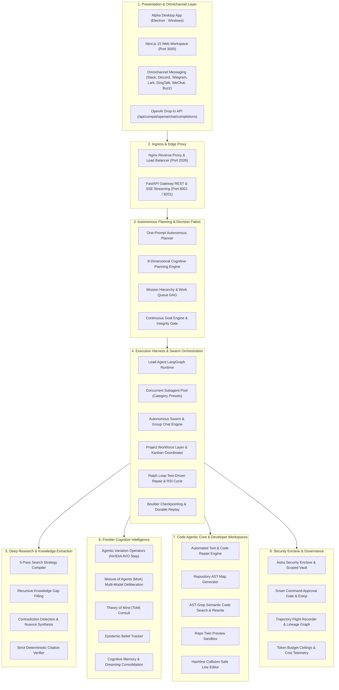

# Alpha System Architecture 🐺

## 1. Overview

**Alpha** is a unified, production-grade Autonomous Multi-Agent Operating System engineered on LangGraph, FastAPI, Next.js 15, and an Electron Windows desktop shell. It delivers long-horizon task execution, frontier cognitive reasoning, multi-model swarms, and exhaustive multi-hop research across sandboxed, thread-isolated environments.

---

## 2. High-Level Architectural Planes

Alpha is structured into eight core architectural planes:

---

## 3. Service Topology & Port Mapping

| Service | Port | Protocol | Architectural Role |
| :--- | :--- | :--- | :--- |
| **Nginx Ingress** | `2026` | HTTP / WS | Unified reverse proxy entry point routing `/api/*` to Gateway and `/` to Next.js. |
| **FastAPI Gateway** | `8001` | HTTP / SSE | Core agent runtime, tool execution, REST endpoints, and WebSocket event stream. |
| **Next.js Web UI** | `3000` | HTTP | Client workspace dashboard (Chat, Workforce, Projects, Kanban, Skills, Settings). |
| **Desktop Gateway** | `8201` | HTTP / SSE | Isolated Gateway spawned internally by the Windows Electron desktop application. |
| **Sandbox Provisioner**| `8002` | HTTP / gRPC | Optional microservice managing Kubernetes pod-based execution sandboxes. |

---

## 4. Subsystem Deep-Dive

### 4.1 Autonomous Deep Research Subsystem
The deep research pipeline solves shallow web-search limitations by executing an autonomous 5-pass investigation:
1. **Pass 1: Discovery & Landscape**: Identifies foundational themes, key terminology, and high-level boundaries.
2. **Pass 2: Specific Evidence & Benchmarks**: Extracts empirical numbers, percentages, speedups, and verified metrics.
3. **Pass 3: Adversarial Contradiction & Edge Cases**: Formulates falsification queries hunting for bugs, failure modes, and dissenting views.
4. **Pass 4: Fact Verification & Cross-Checking**: Corroborates claims across diverse domains to eliminate hallucinations.
5. **Pass 5: Strategic Synthesis & Gap Resolution**: Recursively resolves knowledge gaps and compiles publication-grade Markdown briefs with deterministic citations (`[S1]`, `[S2]`).

### 4.2 Swarm & Multi-Agent Workforce Layer
- **Bot Roster & SOUL Protocol**: Maintains registered bots with distinct operational personalities, isolated prompts, and private inboxes.
- **Bot Mode Direct Messaging**: Fire-and-forget asynchronous inter-bot and user-to-bot messaging (`POST /api/bots/{name}/dm`) with server-side attribution.
- **Collaborative Kanban Board**: Real-time project boards where agents create, assign, transition, and audit task cards.
- **Agent-to-Agent (A2A)**: Structured messaging protocol enabling peer delegation, observation, and state querying.
- **Workforce Project Governance**: Tracks active agent presence, enforces resource locks, project constitutions, and architectural decision records (ADRs).

### 4.3 Continuous Execution Harness & Planners
- **Autonomous One-Prompt Planner**: Converts ambiguous natural language requests into fully decided multi-step execution graphs.
- **8-Dimensional Cognitive Planning**: Evaluates tasks across clarity, safety, feasibility, reversibility, resource intensity, architectural impact, empirical evidence, and mission alignment.
- **Continuous Goal Engine**: Enforces verifiable completion criteria, auditing evidence matrices before allowing an agent to exit.
- **Ralph Loop (Self-Healing Code Loop)**: Runs test-driven iterative repair cycles until code passes all unit tests and invariant gates.
- **Boulder Multi-Session Checkpoints**: Persists complete agent state graphs to PostgreSQL/SQLite, allowing interrupted tasks to resume seamlessly.

### 4.4 Frontier Cognitive Intelligence
- **Agentic Variation Operators (AVO)**: Mutates reasoning prompts and execution strategies using evolutionary algorithms (inspired by NVIDIA AVO).
- **Mixture of Agents (MoA)**: Dispatches queries across multiple heterogeneous LLMs simultaneously and aggregates consensus.
- **Theory of Mind (ToM)**: Simulates user expectations and downstream stakeholder reactions before finalizing outputs.
- **Cognitive Memory & Dreaming**: Periodically consolidates ephemeral episodic interaction traces into high-level semantic knowledge.

### 4.5 Code Agentic Core
- **Automated Test & Repair**: Autonomously invokes unit tests, captures failure tracebacks, diagnoses root causes, and edits source code.
- **Repository Map AST Generator**: Generates structural abstract syntax tree dependency maps across entire codebases.
- **AST-Grep**: Executes semantic syntax-tree search and replacement across Python, TypeScript, Go, Rust, and C++.
- **Repo Twin Sandbox**: Evaluates code modifications in an isolated shadow directory before applying them to the working tree.
- **Hashline Line Editing**: Line-level reading and editing preventing edit collisions.

### 4.6 Enterprise Security Enclave & Governance
- **Astra Security Enclave**: Enforces task boundaries and encrypts sensitive API tokens and credentials.
- **Smart Command Approval**: Scores the blast radius of terminal commands and prompts the operator for approval when necessary.
- **Emergency Stop (Estop)**: Instant hard-stop mechanism halting runaway loops, swarms, and background jobs.
- **Trajectory Flight Recorder**: Cryptographically logs every reasoning step, tool call, and state transition for forensic audits.
- **Token Budget Ceilings**: Enforces deterministic token spend limits per run with real-cost provider pricing telemetry.

---

## 5. Middleware Execution Pipeline

Every agent invocation passes through a deterministic sequence of middleware layers:

| Sequence | Middleware | Enforcement Role |
| :---: | :--- | :--- |
| **1** | `SecurityEnclaveMiddleware` | Validates session authorization, credential boundaries, and tenant isolation. |
| **2** | `DynamicContextMiddleware` | Prunes context tokens, compacts running histories, and prevents prompt injection. |
| **3** | `SubagentDateContextMiddleware`| Injects current temporal context (year, month, day, timezone). |
| **4** | `SubagentCapacityMiddleware` | Enforces concurrency limits and delegation quotas. |
| **5** | `TokenBudgetMiddleware` | Tracks cumulative token consumption against enforced budget ceilings. |
| **6** | `ToolPolicyMiddleware` | Enforces whitelists, blacklists, and sticky tool denials. |
| **7** | `ToolAssemblyMiddleware` | Assembles native tools, MCP server tools, and enabled skills. |
| **8** | `TrajectoryAuditMiddleware` | Logs every event to the cryptographic flight recorder. |
| **9** | `RunJournalCallback` | Emits real-time SSE step events to the UI and WebSocket channels. |