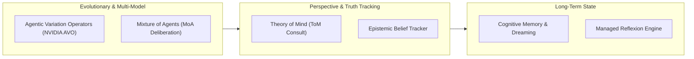

# Frontier Cognitive Intelligence & Optimization 🧠

## 1. Overview

Alpha incorporates an advanced Cognitive Plane designed to elevate agent reasoning beyond basic reactive text generation. It integrates evolutionary prompt optimization, multi-model consensus deliberation, Theory of Mind simulation, epistemic ground-truth validation, and memory dreaming consolidation.

---

## 2. Core Cognitive Engines

---

## 3. Agentic Variation Operators (AVO)
*Tools: `run_nvidia_avo_step`, `run_variation_operator_step`*

Inspired by NVIDIA Agentic Variation Operators, AVO treats reasoning prompts, tool call chains, and task decomposition strategies as an evolutionary genome:
- **Mutation Operator**: Generates diverse semantic variations of system instructions, search queries, and subagent prompts.
- **Fitness Evaluation**: Evaluates outputs against empirical metrics (accuracy, latency, token economy).
- **Selection & Elitism**: Preserves high-performing reasoning paths while discarding unproductive branches.

---

## 4. Mixture of Agents (MoA) Multi-Model Deliberation
*Tool: `moa_multi_model_reasoning`*

When resolving ambiguous, high-stakes, or complex architectural dilemmas:
1. **Parallel Query Distribution**: Alpha distributes the problem simultaneously across multiple heterogeneous LLMs (e.g. OpenAI GPT-4o, Anthropic Claude 3.5 Sonnet, Google Gemini 2.0 Pro, DeepSeek V3).
2. **Independent Perspectives**: Each model generates a solution independently without cross-talk bias.
3. **Synthesis & Consensus Voting**: A lead aggregator model reconciles disagreements, eliminates outliers, and produces a hardened, multi-perspective deliverable.

---

## 5. Theory of Mind (ToM) Consult
*Tool: `tom_consult`*

Theory of Mind equips agents with the ability to reason about mental states, beliefs, and expectations of human operators and downstream receivers:
- **Operator Intent Disambiguation**: Infers unspoken context, preferences, and unstated priorities.
- **Downstream Receiver Modeling**: Simulates how an engineer, executive, or client will interpret the generated deliverable.
- **Communication Calibration**: Adjusts technical granularity, tone, and conciseness based on receiver role.

---

## 6. Epistemic Belief Tracking
*Tool: `evaluate_epistemic_claim`*

Prevents hallucination and unjustified confidence by maintaining an epistemic ground-truth ledger:
- **Proven Facts**: Claims backed by verified empirical evidence and direct citations.
- **Working Hypotheses**: Intermediate assumptions flagged for downstream verification.
- **Unverified Beliefs**: Assertions lacking ground-truth evidence, which are blocked from being presented as conclusive facts.

---

## 7. Cognitive Memory & Dreaming Consolidation
*Tools: `cognitive_memory_tool`, `consolidate_memory_dream`, `manage_reflexion_memory`*

Human-inspired memory consolidation transforms raw interaction logs into durable intelligence:
- **Episodic Traces**: Granular, step-by-step turn histories captured during active sessions.
- **Dreaming Consolidation**: Background worker that runs during idle periods, pruning redundant tokens, detecting recurring patterns, and updating semantic knowledge graphs.
- **Reflexion Memory**: Maintains self-critique notes from past failures, preventing the agent from repeating previous mistakes.

---

## 8. Consequence Simulation & Problem Modeling
*Tools: `simulate_consequences`, `compile_problem_model`*

Before executing destructive, high-cost, or irreversible actions:
- **Counterfactual Simulation**: Evaluates what might break if a script, migration, or deletion command is executed.
- **Blast Radius Scoring**: Categorizes actions into Low, Medium, and Critical risk tiers.
- **Formal Problem Modeling**: Constructs structural models of business and architectural problems before formulating execution plans.
