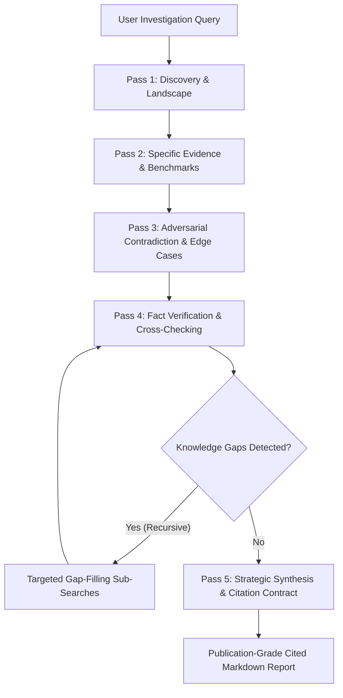

# Autonomous Deep Research Engine 🔬

## 1. Overview

The **Alpha Deep Research Engine** is an advanced, autonomous multi-hop research pipeline designed to overcome the limitations of superficial, single-turn web searches. Inspired by frontier deep agent architectures, it formulates multi-lane search strategies, recursively detects and fills knowledge gaps, identifies contradictions, cross-checks evidence, and compiles publication-grade Markdown briefs with strict citations.

---

## 2. The 5-Pass Search Strategy

Alpha approaches complex research problems through a structured 5-pass search pipeline:



### Pass 1: Discovery & Landscape Mapping
- Explores high-level taxonomy, domain definitions, core architectures, and major industry players.
- Establishes the boundaries and scope of the investigation.

### Pass 2: Specific Evidence & Quantitative Benchmarks
- Targets empirical data, percentage improvements, latency reductions, memory footprints, and benchmark numbers.
- Extracts structured key metrics (e.g. `99.9% reliability`, `4x speedup`).

### Pass 3: Adversarial Contradiction & Edge Cases
- Actively formulates counter-hypothesis and falsification queries (`problems`, `limitations`, `failure modes`, `bugs`, `memory leaks`, `criticism`).
- Ensures the final deliverable presents a balanced, realistic, and hardened perspective rather than promotional vendor bias.

### Pass 4: Fact Verification & Multi-Source Cross-Checking
- Corroborates claims across primary documentation, peer-reviewed papers, independent security audits, and production case studies.
- Computes source confidence scores and filters out unverified assertions.

### Pass 5: Strategic Synthesis & Gap Resolution
- Recursively addresses unanswered subtopics identified during earlier passes.
- Compiles the intelligence into a cohesive, publication-ready report adhering to the strict citation contract.

---

## 3. Recursive Knowledge Gap Filling

During execution, the engine inspects gathered evidence against three critical dimensions:
1. **Empirical Benchmarks**: If no concrete numbers or percentages were retrieved, a dedicated benchmark query is executed.
2. **Adversarial Balance**: If no failure modes or criticisms were discovered, targeted risk queries are dispatched.
3. **Architectural Trade-offs**: Follow-up searches compare the subject against competing alternatives and legacy systems.

The recursive search depth is configurable from **1 (broad landscape)** to **5 (exhaustive multi-pass)**.

---

## 4. Contradiction Detection & Nuance Resolution

When evidence contains conflicting statements across sources (e.g., vendor performance claims vs. independent production stress tests), the engine:
1. Identifies the conflicting claims between Source A and Source B.
2. Formulates a **Nuance Explanation** reconciling the divergent results (e.g., explaining why peak synthetic throughput differs from real-world network partitioned environments).
3. Embeds a dedicated `Detected Contradictions & Nuance Analysis` section in the final report.

---

## 5. Strict Citation Contract

Every factual assertion, metric, and finding in the report is bound to an immutable source identifier:
- **Citation Anchors**: `[S1]`, `[S2]`, `[S3]` attached inline to every key sentence and table row.
- **Verified Bibliography**: Includes source title, origin URL, domain, search facet, and excerpt snippet.
- **Example Citation Matrix**:
  ```markdown
  | Source Domain | Document / Artifact | Research Facet | Key Metric / Highlight |
  | :--- | :--- | :--- | :--- |
  | mit.edu | [Solid State Energy Review](https://mit.edu/energy) | `specific_evidence` | 450 Wh/kg energy density |
  | audit-lab.org | [Production Stress Test](https://audit-lab.org) | `adversarial_contradiction` | Dendrite formation failure |
  ```

---

## 6. Invocation & Usage

### 6.1 Using the `deep_research` Built-in Tool
Agents can invoke the engine programmatically:
```python
deep_research(
    topic="Neuromorphic Computing Chips Architecture",
    depth=3,                  # Depth from 1 to 5 (default 3)
    max_sources=15,           # Maximum distinct sources to cite (default 15)
    include_adversarial=True, # Actively run falsification queries (default True)
    output_path="reports/neuromorphic_research.md" # Optional output path
)
```

The tool writes the full Markdown report to disk and returns an actionable JSON summary:
```json
{
  "status": "success",
  "topic": "Neuromorphic Computing Chips Architecture",
  "executive_summary": "...",
  "sources_analyzed": 12,
  "citations_verified": 12,
  "contradictions_detected": 1,
  "saved_report_path": "reports/neuromorphic_research.md",
  "core_findings_preview": [...]
}
```

### 6.2 Delegating via the `deep-research` Subagent Category
Lead agents can delegate multi-hop research to a dedicated subagent:
```python
task(
    prompt="Investigate next-generation solid-state battery electrolytes for aviation",
    category="deep-research"
)
```
Applying the `deep-research` category automatically:
- Expands the subagent turn budget to **150 turns**.
- Whitelists tools: `["deep_research", "web_search", "web_fetch", "compile_five_pass_search"]`.
- Injects operator guidance enforcing rigorous 5-pass search and citation compliance.

---

## 7. Automated Testing & Verification

The Deep Research subsystem is verified by unit tests in `backend/tests/`:
```powershell
$env:PYTHONPATH="backend/packages/harness;backend/packages/extension-api;backend"
pytest backend/tests/test_deep_research_engine.py backend/tests/test_deep_research_tool.py -v
```
- Validates 5-pass plan compilation.
- Verifies source citation formatting.
- Validates contradiction detection.
- Tests recursive gap filling and resolution notes.
- Validates disk artifact writing and tool payload generation.
