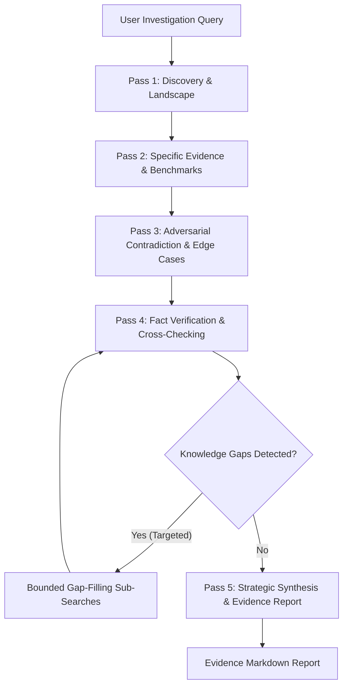

# Autonomous Deep Research Engine 🔬

## 1. Overview

The **Alpha Deep Research Engine** is a bounded multi-hop research pipeline for moving beyond a single web search. It compiles five search lanes, performs one targeted knowledge-gap follow-up pass, screens fetched content for prompt injection, samples citation-support verdicts, and compiles a Markdown evidence report. It reports `no_evidence` rather than inventing findings when discovery returns nothing. The optional pinned AgentEye adapter broadens live source coverage; see [`backend/docs/AGENT_EYE_RESEARCH.md`](../backend/docs/AGENT_EYE_RESEARCH.md).

---

## 2. The 5-Pass Search Strategy

Alpha approaches complex research problems through a structured 5-pass search pipeline:



### Pass 1: Discovery & Landscape Mapping
- Explores high-level taxonomy, domain definitions, core architectures, and major industry players.
- Establishes the boundaries and scope of the investigation.

### Pass 2: Specific Evidence & Quantitative Benchmarks
- Targets empirical data, percentage improvements, latency reductions, memory footprints, and benchmark numbers.
- Extracts structured key metrics (e.g. `99.9% reliability`, `4x speedup`).

### Pass 3: Adversarial Contradiction & Edge Cases
- Actively formulates counter-hypothesis and falsification queries (`problems`, `limitations`, `failure modes`, `bugs`, `memory leaks`, `criticism`).
- Ensures the final deliverable presents a balanced, realistic, and hardened perspective rather than promotional vendor bias.

### Pass 4: Fact Verification & Multi-Source Cross-Checking
- Gathers documentation, papers, independent audits, and production evidence when available.
- Samples extracted findings through the System One citation-support boundary when that provider is available.
- Drops findings judged contradicted, flags unsupported findings, and leaves no-verdict findings explicitly unverified.

### Pass 5: Strategic Synthesis & Gap Resolution
- Addresses unanswered subtopics identified during earlier passes.
- Compiles the evidence into a cohesive Markdown report with explicit support status.

---

## 3. Targeted Knowledge Gap Filling

During execution, the engine inspects gathered evidence against three critical dimensions:
1. **Empirical Benchmarks**: If no concrete numbers or percentages were retrieved, a dedicated benchmark query is executed.
2. **Adversarial Balance**: If no failure modes or criticisms were discovered, targeted risk queries are dispatched.
3. **Architectural Trade-offs**: Follow-up searches compare the subject against competing alternatives and legacy systems.

Search depth is configurable from **1 (broad landscape)** to **5 (broader follow-up selection)**. Depths 2–5 enable one targeted gap-resolution stage, currently capped at three follow-up queries; they do not create five independent recursive crawls.

---

## 4. Adversarial juxtaposition & nuance resolution

The engine places ordinary evidence next to explicitly adversarial-lane evidence and emits a comparison section. This is a research lead, not proof that two sources logically contradict each other. The legacy `contradictions_detected` field counts these juxtapositions; `adversarial_comparisons_detected` is the explicit name. A source is labeled verified only when its sampled findings receive a semantic support verdict; URL registration alone is never treated as verification.

---

## 5. Evidence and citation contract

Extracted findings are bound to report-local source identifiers, while their verification status remains explicit:
- **Citation anchors**: `[S1]`, `[S2]`, `[S3]` attach findings to a source URL.
- **Evidence bibliography**: records title, origin URL, domain, search facet, and snippet.
- **Verification status**: `verified`, `unsupported`, `unverified`, or `not_checked`; no verdict is not a pass.
- **Honest empty state**: no sources means `status: "no_evidence"`, no bibliography, and no generated claims.
  ```markdown
  | Source Domain | Document / Artifact | Research Facet | Citation Status | Key Metric / Highlight |
  | :--- | :--- | :--- | :--- | :--- |
  | mit.edu | [Solid State Energy Review](https://mit.edu/energy) | `specific_evidence` | `unverified` | 450 Wh/kg energy density |
  | audit-lab.org | [Production Stress Test](https://audit-lab.org) | `adversarial_contradiction` | `verified` | Dendrite formation failure |
  ```

---

## 6. Invocation & Usage

### 6.1 Using the `deep_research` Built-in Tool
Agents can invoke the engine programmatically:
```python
deep_research(
    topic="Neuromorphic Computing Chips Architecture",
    depth=3,                  # Depth from 1 to 5 (default 3)
    max_sources=15,           # Maximum distinct sources to cite (default 15)
    include_adversarial=True, # Actively run falsification queries (default True)
    output_path="neuromorphic_research.md" # filename under the current thread outputs directory
)
```

The tool writes the full Markdown report to disk and returns an actionable JSON summary:
```json
{
  "status": "completed",
  "topic": "Neuromorphic Computing Chips Architecture",
  "executive_summary": "...",
  "sources_analyzed": 12,
  "citations_registered": 12,
  "citations_verified": 7,
  "contradictions_detected": 1,
  "adversarial_comparisons_detected": 1,
  "saved_report_path": "/thread/outputs/neuromorphic_research.md",
  "output_error": null,
  "core_findings_preview": [...]
}
```

### 6.2 Delegating via the `deep-research` Subagent Category
Lead agents can delegate multi-hop research to a dedicated subagent:
```python
task(
    prompt="Investigate next-generation solid-state battery electrolytes for aviation",
    category="deep-research"
)
```
Applying the `deep-research` category automatically:
- Expands the subagent turn budget to **150 turns**.
- Whitelists tools: `["deep_research", "web_search", "web_fetch", "agent_eye_search", "agent_eye_sources", "compile_five_pass_search"]`.
- Injects operator guidance enforcing rigorous 5-pass search and citation compliance.

---

## 7. Automated Testing & Verification

The Deep Research subsystem is verified by unit tests in `backend/tests/`:
```powershell
$env:PYTHONPATH="backend/packages/harness;backend/packages/extension-api;backend"
pytest backend/tests/test_deep_research_engine.py backend/tests/test_deep_research_tool.py -v
```
- Validates 5-pass plan compilation.
- Verifies source citation formatting.
- Validates adversarial source juxtaposition without an invented contradiction verdict.
- Tests bounded gap filling and resolution notes.
- Validates the no-evidence failure contract, filename-only output confinement, and tool payload generation.
- Validates AgentEye source allowlisting, dedupe/ranking, backend isolation, and SSRF-safe fetching.
.
