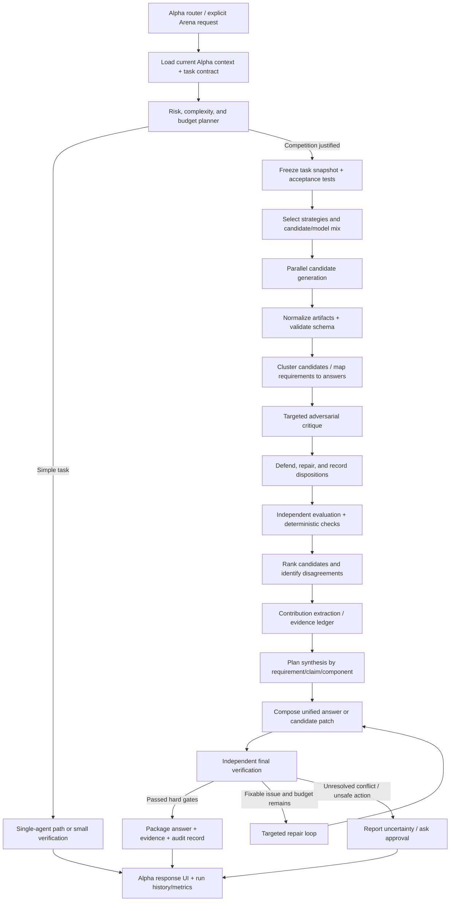

# Alpha Arena+ — Advanced Multi-Agent Answer Competition, Synthesis, and Verification Engine

**Document type:** Implementation specification and engineering roadmap  
**Target project:** [itsPremkumar/alpha](https://github.com/itsPremkumar/alpha)  
**Reference project:** [Jakeschincariol/arena-skill](https://github.com/Jakeschincariol/arena-skill)  
**Primary objective:** Build an Alpha-native, graph-orchestrated system that produces stronger results from multiple specialist agents by generating diverse candidates, challenging them, repairing them, **combining the strongest valid contributions from every candidate**, and independently verifying the final result.  
**Design principle:** Extend Alpha's existing systems; do not replace, disable, or silently regress existing features.

---

## 0. Executive Summary

Arena Skill is a compact but thoughtful answer-competition workflow for Claude Code. It gives every competitor the same task and one unique strategy card, then uses attack, defense/revision, and rubric-based judging inside a single-elimination bracket. Its bookkeeping is handled by a standard-library Python state machine, and the run can be resumed from files on disk. See the [README](https://github.com/Jakeschincariol/arena-skill), [SKILL.md](https://github.com/Jakeschincariol/arena-skill/blob/main/skills/arena/SKILL.md), [bracket.py](https://github.com/Jakeschincariol/arena-skill/blob/main/skills/arena/bracket.py), [strategies.json](https://github.com/Jakeschincariol/arena-skill/blob/main/skills/arena/strategies.json), [rubric.md](https://github.com/Jakeschincariol/arena-skill/blob/main/skills/arena/rubric.md), and [tests](https://github.com/Jakeschincariol/arena-skill/tree/main/tests).

The reference project's main mechanism is useful: structured task briefs, strategy diversity, explicit adversarial criticism, defense and revision, a written scoring rubric, a separate judge, persisted tournament state, and tests for tournament bookkeeping. Its key mismatch with the requested Alpha feature is the output selection rule: a single elimination champion is the final answer. That can discard an excellent explanation, missing requirement, superior implementation detail, valid edge case, or strong test case from an eliminated competitor.

**Alpha Arena+ should not merely copy the bracket.** It should add a contribution-level synthesis system around a bounded competition:

1. Normalize the user's request into a task contract and acceptance criteria.
2. Select the cheapest adequate competition profile based on task complexity, risk, user settings, and available model/tool budgets.
3. Generate diverse candidates using strategy cards and, when available, genuinely different model/provider capabilities.
4. Normalize outputs into a common artifact format that exposes requirements, claims, evidence, assumptions, tests, and uncertainty.
5. Run adversarial critiques and repair cycles.
6. Judge candidates independently with task-specific rubrics, deterministic checks, evidence validation, and bias controls.
7. Rank candidates without relying exclusively on single-elimination outcomes.
8. Extract the best *valid contribution for each requirement/claim/section/code change* and combine them into a coherent answer.
9. Run an independent final verifier against the original task contract. Iterate only when verification finds actionable issues.
10. Return the best verified answer with a concise explanation, unresolved uncertainty, evidence/provenance, and an optional expanded audit trail.

This gives Alpha a better goal than “one candidate wins”: **one verified deliverable assembled from the best compatible contributions, with an auditable reason for every major inclusion and rejection.** It must still be able to say “no synthesis is safe” when candidates conflict or evidence is insufficient.

---

## 1. Reference Project Analysis

### 1.1 What Arena Skill contains

The repository is intentionally small, focused on Claude Code, and includes:

| Component | Purpose | Design lesson for Alpha |
|---|---|---|
| `skills/arena/SKILL.md` | Human-readable orchestration instructions and job briefs | Keep the orchestration policy explicit, inspectable, and testable rather than buried in one giant prompt. |
| `skills/arena/bracket.py` | Python state machine for planning, candidate IDs, pairings, prompts/jobs, output paths, result collection, advancing rounds, status, and winner reporting | Keep model calls separate from deterministic bookkeeping. Use a durable state machine for long runs and resumability. |
| `skills/arena/strategies.json` | Reasoning modes, workflows, and strategies combined into cards | Diversity should be intentional and reproducible, not just multiple identical prompts. |
| `skills/arena/rubric.md` | Written rubric for judges | Score against the task contract with named criteria and weights, not vague “which answer feels better?” impressions. |
| `tests/test_bracket.py` | Tests covering tournament state/commands, card distribution, and simulated tournament completion | Test orchestration logic with fake agents before spending real model calls. |
| `.claude-plugin/` | Claude Code plugin packaging | Alpha may expose a skill/command, but must also integrate with its own chat, bot, task, and graph modes. |

The README describes 15 reasoning modes, 12 workflows, and 12 strategies—2,160 possible card combinations. Each competitor receives the same task text with a different card; the strategy card changes the approach, not necessarily the underlying model. The reference documents a default 100-agent tournament requiring 595 sub-agent calls (plus an optional baseline comparison), so its full configuration is intentionally expensive. Its `--quick` profile reduces the field to 16. Details can change upstream; verify the repository before implementing against exact line-level assumptions.

### 1.2 Strengths to preserve

**A. Strategy diversity.** First-principles, inversion, adversarial, constraint-first, systems thinking, and other modes can produce materially different hypotheses. Use Alpha's existing agent personas and skills wherever possible, then add specialized cards instead of duplicating existing capabilities.

**B. Same task contract for all candidates.** All candidate agents should see the same immutable requirements and input snapshot. Otherwise, the system compares answers to different tasks.

**C. Explicit attacks.** Criticism asks for concrete failures, missed requirements, and counterexamples rather than generic “improve this” feedback. Alpha should retain severity labels and require evidence or a reproducible counterexample for major/fatal findings.

**D. Defense and revision.** An agent must either fix an attack or rebut it with evidence. This turns competition into iterative improvement rather than a one-shot popularity contest.

**E. Separate judge.** Candidate identity and strategy cards should be hidden from evaluators where practical, reducing bias toward a particular role or model.

**F. Deterministic bookkeeping.** Pairing, scoring calculations, eligibility checks, state transitions, and budget accounting should be code, not improvised by the orchestrator's language model.

**G. Durable runs.** Long tasks need persistent state and artifact files so Alpha can recover after a process restart, model timeout, UI close, or context-window compaction.

**H. Human control over repository changes.** Candidate work should be presented as a proposed result/diff. Do not give every competitor permission to edit the same live project checkout.

### 1.3 Limitations Alpha should improve

These are architectural trade-offs, not claims that the reference project is defective for its intended use.

1. **Winner-only selection discards useful work.** Single elimination identifies a survivor, but it does not inherently compose valid, complementary contributions across all candidates. This is the primary problem Alpha+ must solve.
2. **Bracket path and judge variance matter.** A candidate can be eliminated early in a noisy match despite containing an excellent component. Keep a portfolio of candidates and use multiple forms of evaluation before final selection.
3. **Strategy diversity is not model diversity.** Multiple sub-agents running the same model are not independent model families. Alpha should track actual provider/model identity and avoid claiming model diversity when only prompts differ.
4. **LLM judging is fallible.** A rubric makes judgments more legible, not objectively correct. Position preference, verbosity preference, reference anchoring, self/family preference, and inconsistent scoring are documented risks. Use pair-order swaps, blind IDs, factual/test checks, and disagreement-triggered review.
5. **General-purpose rubric may not fit each task.** Code changes, factual research, planning, and creative writing require different evidence and quality criteria. Select task-specific rubrics and hard gates.
6. **No guarantee of factual truth from surviving attacks.** Several agents can agree on the same false claim. Evidence verification must be separate from candidate consensus.
7. **Large competitions are costly and slow.** Make candidate count, concurrency, retries, context size, and escalation adaptive. A simple question should not trigger a tournament by default.
8. **Task brief quality remains critical.** Preserve original requirements, constraints, context and disliked-baseline feedback in a normalized task contract. Detect ambiguity before spawning many agents.
9. **Research, coding, and action tasks differ.** A prose response can be synthesized claim-by-claim; code patches need conflict analysis, isolated workspaces, execution tests, and a safe merge. Tool actions may have irreversible side effects and must not be executed by all candidates.
10. **A bracket is not a workflow graph.** Alpha already uses LangChain/LangGraph/Deep Agents. The competition should be a native, resumable subgraph that the existing task router can invoke from chat, bot, swarm, or autopilot modes—not a separate orchestrator that competes with Alpha's own scheduler.

### 1.4 What not to copy blindly

- Do not port a Claude-Code-only `Agent` call assumption into Alpha's generic agent/provider layer.
- Do not assume the number 100 is a good default. Use a bounded 3–5 candidate profile initially and escalate only when value justifies cost.
- Do not let the language model decide bracket arithmetic, result persistence, budget debit, safety gates, or task completion by free-form text.
- Do not make final-answer selection depend only on elimination outcomes.
- Do not automatically apply candidate code changes to Alpha's primary working tree.
- Do not add an entirely separate long-lived “arena framework” if the existing graph runner can own the run lifecycle, checkpointing, logs, cancellation, and metrics.

---

## 2. Product Definition and Non-Goals

### 2.1 Proposed capability name

Use **Alpha Arena+** as the product/feature label and **Deliberation Engine** as the internal service/module name. These are suggested names; use Alpha's existing naming conventions if another module name already exists.

### 2.2 Mission

For tasks where quality benefits from alternatives, Alpha Arena+ runs a controlled multi-agent process that explores diverse approaches, challenges errors, repairs weak points, combines compatible strengths, and verifies the final output. It returns the result that best satisfies the original contract, not simply the most popular or verbose answer.

### 2.3 Non-goals

- Replacing Alpha's existing model providers, tool engine, memory system, planner, bot mode, swarm mode, code agent, or scheduler.
- Running multiple candidates for every ordinary chat message.
- Assuming more agents always means better quality.
- Using majority vote as the factuality oracle.
- Merging incompatible code patches without tests.
- Hiding uncertainty in order to produce a confident-sounding single answer.
- Executing irreversible actions just because one candidate recommends them.
- Requiring paid APIs; all provider/model selections must respect Alpha's existing configuration and free/local options, while clearly reporting capability limitations.

### 2.4 User-visible modes

Add these as commands/buttons only if Alpha's current command registry supports them; otherwise map them into the existing interaction conventions.

| Mode | Expected behavior | Default profile |
|---|---|---|
| `arena quick` | Generate a few genuinely different candidates, quick review, synthesize, verify | 3 candidates; one critique pass; lightweight verifier |
| `arena` | Full balanced deliberation | 5 candidates; critique/repair; independent judging; synthesis |
| `arena deep` | Highest-quality bounded run for an important task | 8–12 candidates subject to budget; multiple judges; stronger verification |
| `arena compare` | Compare an existing answer against alternatives | Include baseline candidate; report if baseline remains best |
| `arena synthesize` | Extract/merge useful components from supplied or existing candidate answers without a full tournament | Contribution matrix + synthesis + validation |
| `arena plan` | Show proposed candidate count, expected stages/calls, cost estimate where available, duration estimate if measured, and safety level before running | No model calls |
| `arena status` | Show progress, completed/failed jobs, current stage, spend, and recovery/cancel state | Read persisted run |
| `arena resume <run-id>` | Resume an interrupted run from checkpoint | Reuse completed valid artifacts |
| `arena cancel <run-id>` | Cancel queued work and mark in-flight work for safe cancellation | No orphaned tasks |

Do not overload `/arena` for every vague request. Invoke automatically only for explicit requests such as “compare approaches”, “give me the best combined answer”, or a configured high-quality workflow. A normal chat response should remain fast.

---

## 3. Architecture: Native Alpha Graph, Not a Parallel Agent Framework

### 3.1 Integration rule

First inspect Alpha's current branch, graph factories, state schemas, persistence/checkpointer, provider registry, model routing, tool permissions, tracing/logger, command registry, and UI event layer. Reuse these established abstractions. Names in this document are logical names, not assumptions that files already exist.

The integration should be an **optional subgraph/workflow** called by Alpha's existing router. The existing system remains the source of truth for run IDs, model configuration, tool access policy, budgets, cancellation, and user-visible progress. If Alpha already has similar code, adapt it instead of creating a parallel implementation.

### 3.2 Proposed graph



The exact implementation can differ, but retain the stage boundaries that make work inspectable and recoverable. Avoid one enormous node that asks a model to spawn, evaluate, synthesize, and self-certify everything in one opaque call.

### 3.3 Graph execution patterns

- Use the version-compatible LangGraph dynamic fan-out/map-reduce pattern for candidate jobs if the current Alpha graph runner supports it. Parallel branches should have isolated input state and a deterministic reducer/fan-in stage.
- A supervisor decides *what work is worth delegating*; the graph runtime handles parallel execution. Do not depend on a supervisor LLM's tool-call turn to simulate runtime-level parallelism.
- Use small subgraphs where it helps isolate candidate generation, critique, evaluation, synthesis, and verification. Keep the execution graph simple enough to debug.
- Use Alpha's current checkpointer for durable runs. Every candidate/critique/judge/synthesis job must be idempotent or have a safe deduplication key before retries.
- Bound concurrency at the graph/provider queue. Respect provider rate limits, machine RAM, user-set limits, and local-model throughput. Hundreds of jobs must never be enqueued accidentally because an LLM generated a large fan-out list.
- For parallel outputs, define explicit merge/reducer semantics for collections. Do not let two branches overwrite the same mutable `result` or `messages` slot and silently drop work.

Useful official reference: [LangGraph “Thinking in LangGraph”](https://docs.langchain.com/oss/javascript/langgraph/thinking-in-langgraph), [LangChain multi-agent architecture benchmarking](https://www.langchain.com/blog/benchmarking-multi-agent-architectures), [LangGraph supervisor reference](https://reference.langchain.com/python/langgraph-supervisor/supervisor/create_supervisor). Confirm API details against the LangGraph version pinned by Alpha before implementing.

### 3.4 Suggested component boundaries

Adapt paths to Alpha's actual structure after repository inspection. Do not create all of these blindly if equivalent services already exist.

```text
alpha/
  ...existing graph / router / provider / tools / UI...
  arena_plus/
    __init__.*
    models_or_types.*          # Typed run state and artifact schemas
    router.*                   # Profile selection, task-type routing
    task_contract.*            # Requirements, constraints, done conditions
    strategy_dealer.*          # Strategy cards and diversity allocation
    candidate_runner.*         # Provider-neutral, bounded candidate calls
    artifact_normalizer.*      # Parse and validate candidate output
    critiques.*               # Attack jobs, severity, counterexamples
    repair.*                   # Defense, revise, disposition tracking
    evaluator.*                # Rubric scoring, rubric selection, calibration
    verification.*             # Evidence, tests, safety, hard gates
    contribution_map.*         # Requirement/claim/component attribution
    synthesis.*                # Best-per-step composition and conflict policy
    ranking.*                  # Aggregate judge results deterministically
    persistence.*              # Wrapper around existing run/checkpoint service
    events.*                   # UI/log/trace events via Alpha's event layer
    policies.*                 # Budget, model, permission, and escalation rules
    prompts/
      candidate.*
      critique.*
      repair.*
      judge.*
      synthesis.*
      final_verify.*
    tests/
      ...
```

The language suffixes are illustrative. Match Alpha's current backend language and package conventions. Prefer a small module that fits the codebase over creating a giant directory for a feature that could be implemented as a few focused files.

---

## 4. The Core Improvement: Best Contribution per Requirement, Then One Coherent Answer

This is the highest-priority requirement. **Do not return only the champion's whole answer.** Every candidate can contain both high-quality and low-quality sections, and the system must evaluate those independently.

### 4.1 Concept: contribution-level synthesis

Break the original task into stable requirement IDs. For different task types, the “contribution unit” differs:

- **Q&A / explanation:** atomic claims, definitions, reasoning steps, examples, caveats, answer sections.
- **Research:** claims, sources, source-backed findings, methodology, date-specific facts, uncertainty notes.
- **Planning:** requirements, milestones, dependencies, risks, acceptance criteria, implementation options.
- **Code changes:** patch hunks/files/functions, tests, API-contract changes, migrations, configuration changes, design decisions.
- **Debugging:** suspected causes, reproduced symptoms, tests, minimal fix proposals, regression tests.
- **Creative writing:** paragraphs, alternative phrasings, tone, structure, factual constraints (less emphasis on factual consensus).
- **Tool/workflow plans:** individual steps, preconditions, reversibility, permissions, expected outputs.

For each unit, record candidate provenance, the requirement(s) it satisfies, confidence, evidence, critic findings, judge scores, and verification status. Then select or merge units that improve the complete deliverable without violating constraints.

### 4.2 Pipeline details

**Step 1 — Extract requirements.** Turn the task into a contract containing user goal, must-have outcomes, hard constraints, context, deliverable format, success tests, excluded changes, safety restrictions, and unresolved ambiguity. Keep the original user text alongside the normalized contract. Every requirement gets an ID such as `REQ-001`.

**Step 2 — Ask candidates for structured outputs.** Candidates provide both their human-readable answer and a machine-readable manifest. They must not be forced to expose private chain-of-thought. Ask for concise justifications, claims, evidence references, assumptions, tests, known limitations, and result files instead of hidden reasoning traces.

**Step 3 — Normalize.** Parse each candidate's output into a shared schema. Reject or repair malformed output. Normalization must not silently discard unparseable answer sections; preserve the raw artifact and flag the parsing failure.

**Step 4 — Map coverage.** For each requirement, identify which candidate contributions may satisfy it. Use deterministic identifiers and semantic matching cautiously. The LLM may propose mappings, but the verifier should reject impossible or unsupported mappings.

**Step 5 — Evaluate contributions, not just candidate personalities.** A candidate can score poorly overall but still contribute an excellent test case, critical caveat, clear explanation, or valid code patch. Keep candidate-level scores for overall comparison while recording per-contribution quality and evidence.

**Step 6 — Detect disagreement.** Cluster duplicate answers and explicitly identify material conflicts. If three candidates repeat an unsupported claim and one provides reliable documentation or a reproducible test, do not use majority vote to overrule evidence. The system must distinguish independent support from copied/common-source agreement.

**Step 7 — Build a synthesis blueprint.** Before writing the final response, select a source for each requirement and important segment. Specify where contributions can be combined, what must be rewritten for consistency, what conflicts require further verification, and which rejected ideas are worth mentioning as alternatives.

**Step 8 — Compose once.** A synthesis agent produces a single coherent deliverable that satisfies all requirements. It is not allowed to concatenate outputs or produce a “Frankenstein” response with contradictions, repeated sections, incompatible terminology, duplicate code, or broken references.

**Step 9 — Verify the composed result.** A different role, ideally an independent model/provider or a deterministic checker, verifies the final output against the original task contract and evidence ledger. No synthesis score can waive a failed hard gate.

**Step 10 — Repair targeted defects.** If the verifier finds a fixable issue, route the exact issue back to the responsible contribution or synthesis node. Re-run only affected steps rather than regenerating all candidates. Stop after a bounded number of repair loops and report unresolved issues honestly.

### 4.3 Example contribution matrix

For a user request like “design a reliable FastAPI service,” candidates might give these contributions:

| Requirement | Candidate A | Candidate B | Candidate C | Selection logic |
|---|---|---|---|---|
| Correct API contract | Good | Good | Missing status codes | Keep best verified contract; deduplicate common content |
| Migration safety | Missing | Strong but assumption-heavy | Strong rollback plan | Merge only compatible migration and rollback steps, check DB engine assumptions |
| Test coverage | Basic happy path | Excellent edge cases | No tests | Combine tests, then run them against the actual contract |
| Security | Generic | Correct authentication note | Specific injection risk | Keep only claims supported by current code/docs and verifier |
| Operational clarity | Concise | Verbose | Strong monitoring section | Synthesize a readable implementation sequence without redundant content |

The final deliverable should state a consistent API and ordered implementation sequence, not show three answers as a substitute for choosing. If two approaches are genuinely incompatible, present the trade-off and choose only after checking the task's constraints.

### 4.4 Provenance requirements

Every important synthesized unit should retain internal provenance metadata:

- `source_candidate_ids`
- `source_artifact_ids`
- `source_claim_ids` (where applicable)
- `requirement_ids`
- `supporting_evidence_ids`
- `critic_issue_ids`
- `verification_status`
- `synthesis_action`: `KEEP`, `MERGE`, `REWRITE`, `REJECT`, `DEFER`, or `NEEDS_HUMAN_REVIEW`
- `reason_code` and a short user-readable explanation

Do not expose an overwhelming internal table in every normal chat response. Use it for audit/debug views and provide a compact “why this won” explanation plus optional expand-for-details UI.

---

## 5. Candidate Diversity and Strategy Allocation

### 5.1 Candidate identity

Track these dimensions separately:

- `candidate_id` (stable within a run)
- `role` / specialist objective
- `strategy_card_id`
- `provider_id` and `model_id` when known
- `model_family` when known (optional, do not guess)
- `temperature` / decoding settings where supported
- `context_snapshot_id`
- `tool_capabilities` and permissions
- `attempt_number`, `parent_candidate_id` for repair lineages

Never describe one model with five prompt variants as five independent models. The UI should distinguish **strategy diversity** from **model/provider diversity**.

### 5.2 Strategy-card system

Preserve the useful three-part strategy model from the reference project—reasoning approach, workflow, and optimization objective—but make it extensible and task-aware.

Example reasoning modes:

- first-principles decomposition
- constraint-first
- adversarial / inversion
- systems thinking
- edge-case-first
- evidence-first
- failure-mode analysis
- algorithmic / complexity analysis
- user-empathy and usability
- minimal-change / least-complex solution
- quantitative / test-first
- security and threat modeling
- compatibility and migration analysis
- alternative hypothesis / differential diagnosis
- cost/latency optimization
- counterfactual analysis
- implementation-first
- research triangulation

Example workflows:

- draft → critique → revise
- tests-first → implementation → tests
- research → evidence ledger → synthesis
- decompose → solve components → integrate
- build simplest baseline → add necessary robustness
- enumerate risks → mitigation design
- propose two incompatible alternatives → compare against constraints
- inspect existing code → smallest patch → regression verification
- reproduce failure → isolate cause → validate fix
- outline → fill sections → coherence pass

Example strategies:

- correctness before speed
- minimal working solution
- completeness against requirements
- maximum evidence quality
- robust edge-case handling
- low-resource execution
- maintainability and observability
- security-first
- clarity and usability
- backward compatibility
- low operational risk
- reversible and easy-to-review changes

These are examples, not a demand to add every card immediately. Define a schema and start with a curated set. Measure whether cards produce useful differences on Alpha's evaluation set instead of assuming all prompt variants help.

### 5.3 Avoid superficial diversity

- Do not select the same role card repeatedly until all other useful perspectives are covered.
- Ensure a reasonable spread across objective dimensions; optionally constrain candidates from sharing two or three identical card attributes, depending on candidate count.
- Use different model families/providers only if already configured and permitted. Do not add a provider solely to claim diversity.
- Keep candidate prompts blind to other candidate answers during initial generation.
- Share a common, immutable task snapshot and verified context packet.
- When research is involved, candidates may share a verified source corpus but should have permission to pursue independent lines of inquiry if web tools are enabled.
- If two candidate answers are near-identical, mark their semantic similarity and reduce the effective diversity score; do not count them as fully independent votes.
- Do not let a candidate's personality label replace a useful execution role. “Security reviewer” is a job objective; a strategy card is an alternate approach; a model provider is the engine. Track these separately.

### 5.4 Role portfolio suggestion

A balanced 5-candidate portfolio for a nontrivial technical task:

1. **Baseline Builder** — satisfy the task directly with the simplest correct approach.
2. **Edge-Case / Failure Analyst** — find omissions, invalid states, and recovery paths.
3. **Evidence / Research Specialist** — validate claims against repository files/docs/tests or trusted sources.
4. **Alternative Architect** — explore a materially different solution and expose hidden assumptions.
5. **Implementation / Test Specialist** — focus on executable tests, interfaces, and acceptance criteria.

The portfolio is not fixed. A writing task may use tone, audience, structure, and editor perspectives; a database migration task needs schema, rollback, compatibility, and test expertise.

---

## 6. Task Contract, Context, and Memory Integration

### 6.1 Task contract schema

Create a validated object with fields equivalent to:

```json
{
  "task_id": "task-...",
  "original_request": "unchanged user request",
  "goal": "normalized outcome",
  "task_type": "coding | research | qa | planning | writing | analysis | action",
  "requirements": [
    {
      "id": "REQ-001",
      "text": "a checkable requirement",
      "priority": "must | should | could",
      "verification_method": "unit_test | evidence | rubric | user_review",
      "blocking": true
    }
  ],
  "constraints": [],
  "context_snapshot_id": "ctx-...",
  "baseline_artifact_id": null,
  "acceptance_checks": [],
  "safety_level": "low | medium | high | critical",
  "budget_profile": "quick | standard | deep",
  "ambiguities": [],
  "do_not_change": [],
  "deliverable_format": "..."
}
```

Treat this as an illustrative schema. Use Alpha's existing Pydantic/TypedDict/dataclass conventions and validation library rather than adding a redundant schema framework. Validate enum values and required fields in deterministic code.

### 6.2 Requirement quality gates

Before launching candidates:

- Confirm that the request has a recognizable goal and deliverable.
- Preserve every explicit requirement and constraint supplied by the user.
- Bring in only context actually available to Alpha. Do not invent repository paths, test commands, provider availability, or project architecture.
- Store an existing disliked answer as the baseline if the request is a retry/competition against it.
- For code tasks, include the relevant repo commit/branch or workspace snapshot and available test commands.
- For research tasks, specify allowed source types and date requirements.
- If ambiguity materially affects safety, reversibility, or result correctness, follow Alpha's existing policy for clarification or safe assumptions. Avoid asking unnecessary questions for low-risk tasks; record assumptions explicitly.
- Avoid copying the entire conversation history into every candidate. Use a small, relevance-filtered context packet plus the source task contract.

### 6.3 Existing memory integration

Memory is supporting context, not ground truth. Use relevant Alpha memory only when permitted and relevant to the present task. Record memory references internally so results can be traced. Candidates should receive the same relevant snapshot; otherwise score comparisons are unfair. Never let a memory item override the user's current explicit instruction.

Do not write new long-term memories from candidate speculation. Persist arena run artifacts and normal conversation memory through separate policies.

---

## 7. Candidate Output Contract

Every candidate should produce a structured artifact plus its normal deliverable. Define one stable schema and validate it before downstream use.

Illustrative JSON shape:

```json
{
  "candidate_id": "cand-003",
  "status": "complete",
  "artifact_type": "answer | research_report | plan | patch | diagnosis",
  "summary": "short description of the proposed result",
  "deliverable": "human-readable response or artifact reference",
  "requirement_coverage": [
    {"requirement_id": "REQ-001", "status": "satisfied", "contribution_ids": ["CON-001"]}
  ],
  "contributions": [
    {
      "id": "CON-001",
      "kind": "claim | step | section | code_change | test | design_decision",
      "content": "one independently reviewable contribution",
      "requirement_ids": ["REQ-001"],
      "evidence_ids": [],
      "assumptions": [],
      "confidence": 0.72,
      "dependencies": [],
      "known_risks": []
    }
  ],
  "evidence": [],
  "tests": [],
  "limitations": [],
  "open_questions": [],
  "changed_files": [],
  "raw_output_artifact_id": "artifact-..."
}
```

Implementation notes:

- The schema above illustrates semantics; do not blindly trust model-emitted IDs, scores, file paths, or status labels.
- Alpha should assign canonical IDs and calculate actual status/timestamps in code.
- Evidence fields should reference stored evidence artifacts, not simply embed a URL that has never been fetched.
- Preserve original raw output for debugging, but sanitize secrets and limit its size.
- A malformed result must produce a visible, structured validation failure; no silent fallback to an unrelated answer.
- Do not require the model to disclose private chain-of-thought. Request concise rationales and checkable supporting artifacts instead.

---

## 8. Adversarial Critique, Defense, and Repair

### 8.1 Critique job

Critics should receive the normalized task contract, the candidate artifact under review, relevant context/evidence, and an assigned critique lens. They should not see the candidate's strategy label or author identity unless that information is required to assess provenance.

Each finding must have:

- `issue_id`
- `severity`: `FATAL`, `MAJOR`, `MINOR`, or `SUGGESTION`
- `category`: requirement gap, factual claim, logic, edge case, test failure, security, API compatibility, contradiction, verbosity/clarity, maintainability, or other task-specific category
- `target_contribution_id` (when applicable)
- concrete defect statement
- requirement IDs affected
- evidence / exact quote / reproduction steps / counterexample
- estimated impact and likelihood
- whether the issue is independently verified or merely suspected
- suggested repair (optional)

A criticism such as “this answer is weak” is not enough. For high severity, require a specific failure path, trusted evidence, failed test, or a clearly explained requirement violation.

### 8.2 Attack diversity

Assign different critique lenses instead of duplicating the same generic critique. Examples: spec compliance, counterexample discovery, factual-source audit, test and edge-case analysis, performance, security, failure recovery, backwards compatibility, clarity, and assumption challenge.

Target the most useful candidates/sections. A complete all-pairs cross-examination is not needed for every task; it grows quadratically. For a moderate run, use candidate-to-reviewer assignment, top-candidate pair checks, cluster representatives, and coverage of under-reviewed requirements. Reserve full cross-examination for deep mode.

### 8.3 Defense and revision

For every finding, the candidate or a designated repair agent must record one disposition:

- `FIXED` — changed artifact and identifies what changed.
- `CONCEDED_NOT_FIXED` — valid problem but no safe/feasible fix; must remain visible.
- `REBUTTED` — evidence shows the issue does not apply.
- `PARTIALLY_FIXED` — residual issue remains.
- `NEEDS_VERIFICATION` — cannot decide yet; assign a test/source check.

Do not let the defending candidate judge its own rebuttal. Critical disputed findings go to an independent verification step. The repair agent can be a different configured model, but it must have enough context to edit only the assigned artifact, not arbitrary shared state.

### 8.4 Bounded repair loop

- Default to one critique/repair cycle in quick mode.
- Standard mode can allow two cycles when major issues were found.
- Deep mode may allow additional cycles only while measured improvements justify cost and the hard budget is not exceeded.
- Stop if the same issue repeats, the candidate fails the same gate twice, scores stop improving, or the remaining budget is reached.
- Record every cycle and artifact version. Never overwrite the only copy of a candidate's previous result.

---

## 9. Evaluation, Ranking, and Judge Reliability

### 9.1 Task-specific rubrics

Keep a default rubric, but let the task router select a specialized rubric. Every criterion has a definition, weight, scoring anchors, and evidence expected for each score band. Score the contract, not the judge's personal preference.

**General answer rubric (example, total 100):**

| Criterion | Weight | What counts |
|---|---:|---|
| Correctness | 25 | Claims/logic are sound; no demonstrable misleading statements |
| Requirement coverage | 20 | Meets every must-have and records any gap |
| Evidence quality | 15 | Important claims supported by verifiable evidence when needed |
| Completeness | 10 | Important cases, constraints, and relevant context covered |
| Robustness | 10 | Survives critique, edge cases, and counterexamples |
| Actionability | 10 | User can act without guessing at critical steps |
| Clarity | 5 | Understandable and well organized; no reward for unnecessary length |
| Constraint and safety compliance | 5 | Respects user constraints, permissions, and policies |

**Code/change rubric (example):** correctness and actual tests 30; task/spec coverage 20; reliability/edge cases 15; security 10; compatibility and migration safety 10; maintainability/minimality 10; explanation/reviewability 5. Adjust these values by task and existing project policy. Hard gates override weighted totals.

**Research rubric (example):** source reliability and direct support 30; coverage of the question 20; recency/temporal correctness 15 when relevant; triangulation and source independence 15; accurate uncertainty/limitations 10; clarity/actionability 10. If the task needs current information, sources must match the requested date window.

**Creative-writing rubric (example):** compliance with brief 30; audience/tone fit 20; usefulness/impact 20; originality and coherence 15; factual constraints 10; concision/readability 5. Evidence isn't mandatory for purely fictional content unless factual claims were requested.

### 9.2 Hard gates (cannot be averaged away)

Examples:

- A required acceptance test failed.
- A must-have requirement is missing.
- A major factual assertion has no required evidence or contradicts primary source material.
- The response violated the user's explicit “do not change” constraint.
- A code patch breaks import/type/build checks or contains unsafe, unreviewed side effects.
- A tool/action plan violates permission boundaries or performs a prohibited action.
- The artifact is malformed such that the user cannot use it.

Hard-gate status must be produced by deterministic checks or an independent verifier with referenced evidence. A candidate with a verified fatal flaw cannot win merely because it scores highly on style or detail.

### 9.3 Judge-bias controls

LLM judges are useful but fallible. Research has reported position bias in pairwise LLM evaluation, and practical guides also identify verbosity, distraction, and reference-anchoring risks. See [Judging the Judges (ACL Anthology, 2025)](https://aclanthology.org/2025.ijcnlp-long.18/) and this [LLM-as-judge bias guide](https://github.com/wenxuec/llm-judge/blob/main/docs/biases.md).

Implement the following mitigations:

1. Replace author names with neutral candidate IDs during scoring.
2. Hide strategy cards and avoid exposing candidate model/provider metadata unless evaluating capability is the explicit goal.
3. Do not let a judge see its own previous scores as if they were ground truth.
4. For close pairwise matches, run an A/B comparison and a swapped B/A comparison. If the preference changes, mark the result as unstable and invoke a tie/escalation rule.
5. State clearly: “Do not reward length, confident tone, formatting, or rhetorical polish unless the task values them.”
6. Give judges only the context needed to score, avoiding distracting transcripts and unrelated tool output.
7. Where practical, use more than one judge or different configured model families. Model diversity is optional and must be labelled accurately.
8. Keep the judge's per-criterion score and short evidence-grounded explanation, not only a single winner token.
9. Track disagreement and historical calibration on Alpha's own test set. Do not assume equal reliability for all judges without evidence.
10. On disagreement about factual correctness, defer to a source checker/test rather than resolving by majority vote.

### 9.4 Ranking approach

Use a hybrid ranking method:

- **Pointwise gate/score:** every finalist receives criterion-level evaluation; hard gates are checked first.
- **Pairwise comparison:** use only where it adds information, especially near the top of the score table or for materially different candidates.
- **Deterministic aggregation:** compute weights, penalties, missing-data handling, tie rules, and eligibility in code.
- **Uncertainty flag:** if the top candidates are close, judges disagree, or score variance is high, retain a set of finalists and put more budget into targeted verification/synthesis rather than pretending the ranking is certain.
- **Portfolio retention:** preserve strong non-winning candidates and their contributions through synthesis.

A Bradley–Terry-style or Elo-style aggregation could be introduced later if Alpha has enough pairwise results to estimate rankings; it is not required for the MVP. Keep the first version deterministic and easy to audit. Never turn numerical precision into false certainty.

---

## 10. Evidence and Fact Verification

### 10.1 Evidence ledger

Create a common evidence ledger for the run. Each evidence record should include:

- evidence ID
- type: repository file, code/test output, official documentation, webpage/source, database result, tool output, or user-provided input
- original location (URL or repository path) and retrieval timestamp where relevant
- normalized excerpt/observation and hash where useful
- authority/reliability assessment and why it is appropriate for the claim
- claims/requirements it supports or contradicts
- fetch/test status, errors, and expiration/freshness policy
- source independence/duplicate detection where practical

Do not count several pages copying the same press release as independent corroboration. Do not claim to have run a test, fetched a URL, or inspected a file unless the action actually happened and produced a stored result.

### 10.2 Claim-level checks

For research/technical claims, split key statements into atomic claims and classify each as:

- `SUPPORTED`
- `PARTIALLY_SUPPORTED`
- `CONTRADICTED`
- `UNVERIFIED`
- `NOT_APPLICABLE`

Check the quoted source against the specific claim; the existence of a URL is not enough. For current-information tasks, prioritize official docs, current releases, primary sources, and dates that match the user request. Record when sources disagree rather than synthesizing a false consensus.

### 10.3 Avoid consensus hallucinations

- Similar wording among candidates is not evidence.
- Confidence expressed by candidates is not proof.
- Several candidates using the same upstream source are not independent confirmations.
- A judge score is not factual evidence.
- The synthesis agent cannot upgrade `UNVERIFIED` to `SUPPORTED` without adding evidence or running a valid test.
- When evidence remains weak, qualify the statement, omit it if nonessential, or explain what would be needed to verify it.

### 10.4 Code verification

Where supported by the existing Alpha environment, run deterministic checks against an isolated snapshot:

1. Format/lint where configured.
2. Unit tests and relevant existing tests.
3. Type checks/build/import checks.
4. Targeted regression test for the reported bug.
5. Static security/dependency checks if already configured and proportionate.
6. Diff inspection for unrelated changes, secret leakage, binary changes, destructive migration, or unexpected file deletion.
7. Review compatibility of generated APIs/types/configuration with the actual repo.

A test that did not run due to environment limits is `NOT_RUN`, not `PASSED`. Distinguish failed, blocked, skipped, and passed checks in UI and logs.

---

## 11. Safe Synthesis for Code and Tool-Using Agents

### 11.1 Code tasks are not prose tasks

For code modifications, each candidate should produce a patch or isolated branch against the **same base commit/snapshot**. Never let multiple candidate agents write to the same working tree simultaneously.

Recommended flow:

1. Create a read-only or immutable base snapshot.
2. Have candidate agents propose plans/patches in isolated worktrees, branches, temporary copies, or patch artifacts using Alpha's existing execution abstractions.
3. Evaluate each candidate patch independently and run relevant tests in its isolated workspace.
4. Extract compatible patch components and tests into a synthesis branch/worktree.
5. Use a merge planner to detect overlapping hunks, changed APIs, file ownership conflicts, dependencies, and mutually exclusive design choices.
6. Merge only compatible changes; when conflict is semantic rather than textual, request a deliberate integration decision and test it.
7. Run the full required validation suite against the composed patch.
8. Produce a unified diff, test report, files changed, known risks, and rollback notes.
9. Do not apply changes to the user's primary checkout without the permissions and confirmation rules already defined in Alpha.

A model that writes code is not equivalent to a test that proves the code works. Prefer actual test outcomes over claims in candidate explanations.

### 11.2 Patch contribution record

Each code contribution should include:

- base commit/snapshot ID
- intended files and symbols
- exact diff or patch artifact
- requirements/bug IDs addressed
- tests added/modified and their results
- dependencies on other contributions
- conflicts/overlap region
- risk rating (migration, API, performance, security, data loss)
- revert instructions where meaningful

The patch merger must not use natural-language summaries as the only source of the code change. It must merge concrete patches and inspect the final diff.

### 11.3 Tool execution isolation

During candidate generation, default to **recommendation-only mode** for external side effects. Candidates may plan or simulate tool usage, but only an authorized execution node can execute the selected action. Actions such as file deletion, remote write, deploy, send, purchase, database mutation, credential updates, or public posting must pass Alpha's existing permission/human-approval gates.

Never execute the same side effect once per candidate. For any read-only tools that are parallel-safe, apply rate limits and protect secrets. Treat tool outputs and retrieved documents as untrusted data; they must not be allowed to override the system's safety policy or request that secrets be disclosed.

---

## 12. Adaptive Budgets, Routing, and Efficiency

### 12.1 Initial profiles

Start with bounded defaults. Exact limits should be configurable and surfaced in UI.

| Profile | Candidate target | Critique/revision | Judges | Use case |
|---|---:|---|---:|---|
| Single | 1 | No, unless verification needed | 0–1 verifier | Low-risk straightforward task |
| Quick | 3 | One targeted critique pass; repair only important findings | 1 judge + deterministic checks | Everyday “give me a better answer” request |
| Standard | 5 | One critique/repair cycle | 1–2 judges for finalists | Nontrivial engineering, research, or planning |
| Deep | 8–12, subject to limits | One or two cycles plus targeted adversarial review | 2+ judges or independent verification | High-value, complex tasks where extra quality is worth cost |

These are recommended initial settings, not mandatory final values. Measure latency, cost, and quality before changing them. The 100-agent example in the reference project shows why scale must be deliberate.

### 12.2 Router inputs

Route based on explicit user mode first, then evaluate:

- task complexity and number of must-have requirements
- error cost / risk / reversibility
- whether candidate diversity is likely to help
- ambiguity and quality of context
- model/provider availability and health
- user budget/call/token/time limits
- local computer resource status if local models run
- whether deterministic acceptance checks exist
- past measured benefit for this task class

Do not have an LLM freely choose unlimited candidate counts. The planner returns an allowed profile and maximum budget, then deterministic code validates it.

### 12.3 Early stopping / escalation

Stop when all are true:

- all blocking requirements pass;
- no unhandled fatal or major issue remains;
- the candidate/merged output meets the rubric threshold established by evaluation;
- evidence/test gates pass for the task class;
- the top candidate set or synthesized deliverable is stable enough for the profile;
- further candidate calls have low expected marginal value or the budget is exhausted.

Escalate when:

- the top candidate scores are close and judges disagree;
- a material conflict remains;
- important evidence is missing;
- a critical test fails;
- the task depends on an unavailable tool, model, file, or external source;
- the system cannot determine whether a hard constraint was met.

Never report “verified” just because the budget ended. Use clear statuses such as `VERIFIED`, `VERIFIED_WITH_LIMITATIONS`, `NEEDS_USER_REVIEW`, `BLOCKED`, or `FAILED`.

### 12.4 Caching and reuse

- Cache only safe, context-correct artifacts such as stable source retrievals, repeated deterministic checks, or normalized prompts; include model/prompt/config/version keys.
- Do not reuse a previous answer when the repository snapshot, task requirements, user constraints, or freshness window differ.
- Cache deterministic calculations separately from stochastic model outputs.
- Let users disable history/semantic reuse if their privacy preferences require it.

---

## 13. Durable State, Reliability, and Error Handling

Alpha already prioritizes observability and recovery. Arena+ must use those mechanisms instead of creating a shadow logging system.

### 13.1 Run state

Persist at least:

- `run_id`, user/session/thread reference, created/updated timestamps
- task-contract version and context snapshot ID
- run status and current graph node/stage
- selected profile, candidate cap, judge cap, concurrency, budget limits
- candidate/job registry and each job status (`QUEUED`, `RUNNING`, `SUCCEEDED`, `FAILED`, `TIMED_OUT`, `CANCELLED`, `SKIPPED`)
- candidate output artifact references and hashes
- critique/rebuttal/revision history
- rubric version, scores, judge IDs, disagreement indicators
- contribution map, evidence ledger, synthesis plan and final artifact references
- test/verification result IDs
- errors, retry counts, timestamps, and recovery metadata
- final completion reason and unresolved limitations

Persist artifacts separately from mutable run metadata when that aligns with Alpha's current artifact system. Use atomic writes/transactions where appropriate; never mark a job complete before its output artifact is durable.

### 13.2 Recovery behavior

- Recover from process restart by reading the checkpoint and resuming only unfinished/idempotent jobs.
- Reuse completed valid candidate artifacts instead of paying to regenerate them.
- A failed provider call should retry only for transient/retryable failures, with bounded exponential backoff/jitter if consistent with Alpha's existing policy.
- Schema failure may get one constrained repair attempt, then a visible failure.
- Distinguish rate limit, timeout, authentication/configuration, context limit, cancellation, schema error, safety block, and internal failure.
- Never silently switch to a different model/provider without recording the fallback. If fallback changes expected quality/capability, surface it.
- Cancel future stages when required dependencies fail; allow independent candidates to complete when useful.
- Prevent duplicate job execution with stable job IDs/idempotency keys.
- Preserve partial results on failure and offer resume when safe.

### 13.3 Event and logging contract

Use Alpha's existing structured logger/tracing/event bus if present. Each event should include `run_id`, `job_id`, `stage`, `candidate_id` where applicable, provider/model fields where available, timestamp, latency, token/cost estimates when exposed by the provider, status, and normalized error code. Keep secrets and sensitive user content out of routine logs; store detailed data only within Alpha's approved redaction and retention policies.

Suggested event names:

- `arena.run.created`
- `arena.task_contract.ready`
- `arena.budget.approved`
- `arena.candidates.planned`
- `arena.candidate.started`
- `arena.candidate.completed`
- `arena.candidate.failed`
- `arena.critique.completed`
- `arena.repair.completed`
- `arena.evaluation.completed`
- `arena.contribution_map.ready`
- `arena.synthesis.completed`
- `arena.verification.completed`
- `arena.run.paused`
- `arena.run.resumed`
- `arena.run.cancelled`
- `arena.run.completed`

Keep the schema compatible with Alpha's existing telemetry conventions; don't emit both old and new incompatible event formats.

---

## 14. UI/UX Integration

Do not replace Alpha's existing chat UX. Add a view/overlay/panel using the existing frontend patterns.

### 14.1 Minimum useful UI

- A clear “Quick / Standard / Deep” selector and maximum budget display.
- Pre-run summary of candidate count, stages, configured models/providers, and estimated model-call count. If cost cannot be estimated, say so rather than fabricate a price.
- Live stage/progress display, not a fake percentage. Show actual completed/total jobs when known.
- Candidate cards with brief summaries, model/role metadata according to user's privacy settings, status, score breakdown, and evidence/test badges.
- A contribution view answering “which answer contributed this part?” with links to its source artifact and verification result.
- Conflict panel showing incompatible claims/patches and what resolved them.
- Final answer plus concise explanation of major selected contributions, rejected critical issues, and unresolved limitations.
- Actions to view full run record, retry failed jobs, resume, cancel, export Markdown/JSON, and compare final answer against baseline.
- Visible test statuses: `PASSED`, `FAILED`, `NOT RUN`, `BLOCKED`, `SKIPPED`.

### 14.2 Progressive disclosure

Default answer: the final usable response and a short result summary.  
Expanded view: contribution map, score-by-criterion, critical attack findings, evidence, diff, and test outputs.  
Developer/debug view: full job history, prompt templates/version IDs, structured errors, timing, provider fallback record, and sanitized artifact paths.

Do not overwhelm normal chat users with every agent transcript. The full record must remain available for debugging and audit.

### 14.3 Accessibility and stability

- Make run status understandable with text, not color alone.
- Ensure cancellation/resume buttons have real actions and progress updates do not reorder content unpredictably.
- Preserve existing mobile/responsive layout and keyboard navigation.
- A disconnected frontend should not kill a durable backend run unless the user's explicit cancellation policy says it should.
- Never display “all agents agree” when candidate outputs were missing or only one model/strategy was used.

---

## 15. Security, Privacy, and Permissions

1. Reuse Alpha's current auth/permission model; do not invent a second access-control system.
2. Treat candidate outputs, retrieved pages, repository comments, model-generated patches, and tool results as untrusted input.
3. Separate *advice generation* from *authorized action execution*.
4. Do not send private data to another provider/model unless Alpha's existing user/provider configuration permits it.
5. Do not expose API keys, credentials, internal prompt secrets, environment values, private memory, or unrelated conversation text in candidates, evaluator contexts, or logs.
6. Sanitize logs and error messages before display.
7. Limit worktree paths and artifact writes to a run-scoped directory; validate all generated paths and IDs.
8. For code tasks, sandbox untrusted commands using Alpha's existing execution safeguards. No candidate may override command allowlists or sandbox rules through its prompt.
9. Require human approval for destructive, externally visible, financial, deployment, database mutation, or other irreversible actions according to Alpha's established policy.
10. Retain a kill switch / feature flag so Arena+ can be disabled without stopping unrelated Alpha workflows.
11. Preserve a transparent record of model fallbacks and unverified claims.
12. Apply retention, deletion, and export behavior consistent with Alpha's existing privacy policies.

---

## 16. Testing and Evaluation Plan

Testing should demonstrate both that the software works and that answer quality is better than the current Alpha baseline. “It completed one tournament” is not sufficient.

### 16.1 Test layers

**A. Unit tests (fast, no model calls)**

- task-contract schema validation and preservation of requirements;
- strategy allocation, stable IDs, and no accidental duplicate cards when unique cards are required;
- budget cap and profile routing;
- candidate/job lifecycle state transitions;
- deterministic aggregation, score weights, tie rules, missing-score handling, and hard gates;
- position-swapped comparison parsing and judge disagreement routing;
- contribution-to-requirement coverage and conflict detection;
- synthesis action validation and unsupported-claim rejection;
- retries/idempotency, cancellation, partial outputs, and checkpoint resume;
- path validation, redaction, secret filtering, and permission policies.

**B. Graph integration tests (fake model/provider)**

- full run from request to final output using deterministic fake candidates;
- candidate branches run concurrently up to configured caps and merge all outputs without data loss;
- failed candidate does not erase successful candidates;
- a judge timeout yields `UNKNOWN/FAILED`, not an assumed winner;
- checkpoint/restart resumes only incomplete work;
- no model call happens in `plan` mode;
- no external side-effect tool is executed in candidate branches;
- final verifier failure triggers a bounded targeted repair or an honest blocked result.

**C. Contract tests (real configured provider, small sample)**

- structured-output parsing and schema repair behavior;
- provider timeout/rate-limit handling;
- model fallback behavior and UI status;
- prompt version identifiers and token/cost telemetry if available;
- local model path and a no-paid-key configuration, where supported by Alpha.

**D. Quality regression tests (fixed dataset)**

Build a task set with known constraints and independently checked expected properties. Include:

- simple factual questions;
- ambiguous-but-low-risk requests;
- multi-step technical plans;
- code bug fixes with reproducible failing tests;
- code changes where two valid approaches differ;
- current research tasks requiring recent sources;
- tasks with conflicting or misleading evidence;
- edge-case-heavy APIs;
- long-form synthesis from several source drafts;
- prompts with irrelevant/hostile instructions embedded in retrieved text;
- tasks where the existing Alpha answer is already best;
- tasks where different candidates each contain one important valid contribution;
- tool-action tasks that require approval and must not run side effects from candidate branches.

**E. Performance/resilience tests**

- concurrency caps; rate limit handling; RAM and CPU behavior with local models;
- crash during generation, critique, synthesis, and verification;
- interrupted network and unavailable provider;
- long task checkpoint size/context trimming;
- cancellation while some branches are running;
- many candidates with duplicate/near-duplicate outputs;
- malformed or extremely large candidate output;
- frontend disconnect/reconnect while backend run persists.

### 16.2 Baseline comparison

Compare against:

1. current Alpha single-agent answer;
2. multi-candidate best-single candidate without synthesis;
3. Arena+-synthesized answer;
4. synthesized answer with independent verification disabled (ablation);
5. quick vs standard vs deep profile.

This reveals which features earn their cost. Do not assume deeper is always better.

### 16.3 Metrics

Track per task class:

- must-have requirement pass rate;
- correctness/evidence scores from a held-out evaluation rubric;
- code test pass rate and regression rate;
- factual claim support rate;
- useful contribution retention rate (valid units from non-winning candidates that appear in the final result);
- incorrect contribution rejection rate;
- contradiction rate in final output;
- judge agreement / swapped-position consistency;
- false-positive and false-negative fatal issue rate on labelled cases;
- time to first usable result and total latency;
- model calls/tokens/cost if available;
- timeout/failure/retry rate;
- average incremental quality improvement per added candidate/call;
- user acceptance/edit/retry rate where existing telemetry allows and privacy policy permits.

Do not optimize for “number of agents,” output length, or apparent confidence. The target is useful quality per unit cost with safe, auditable completion.

### 16.4 Suggested release gates

Use the following as initial targets to refine after collecting Alpha's baseline dataset; they are proposed acceptance criteria, not measurements of the current system:

- All required state/graph/unit tests pass.
- No regression in non-Arena Alpha workflows under feature flag off and on.
- On an initial held-out set, Arena+ reduces must-have requirement failures relative to single-agent baseline without increasing serious safety/permission failures.
- Synthesized answers outperform best-single selection on tasks deliberately constructed with complementary valid contributions, while not introducing unsupported claims.
- All final hard-gate failures are surfaced; no failed/unrun test is labelled passed.
- Run resume and cancellation tests pass under simulated provider failures.
- Candidate concurrency and maximum budget are enforced by code.
- Every final material claim or patch has an internal provenance path to a candidate, artifact, or test/evidence result.
- The quick profile shows an acceptable quality/latency/cost trade-off for routine tasks before it is enabled as a suggested default.

Never declare a numeric quality improvement until the tests have actually measured it.

---

## 17. Implementation Roadmap (Incremental, No Feature Deletion)

### Phase 0 — Audit and integration contract

**Goal:** Map the existing Alpha implementation before adding code.

Tasks:

- Inspect current branch/status, graph definitions, task router, agent/subagent/swarm/bot modes, provider registry, memory/context providers, checkpointer, task store, logger/tracing, permission checks, and UI progress events.
- Locate any existing evaluator, debate, self-critique, answer-revision, ensemble, tool verification, benchmark, or test infrastructure. Reuse it.
- Identify where an Arena subgraph can be invoked without bypassing the existing planner and run lifecycle.
- Record actual pinned versions of LangGraph, LangChain, Deep Agents, the UI framework, Python/Node runtimes, and relevant schemas.
- Create an architecture note and list the files that would change. Do not rename/delete existing files as a shortcut.

**Deliverable:** Audit document, integration diagram, dependency/version map, and explicit list of reused modules.

**Gate:** No implementation before verifying the real entry points and data contracts in the current Alpha checkout.

### Phase 1 — Task contract and run state

**Goal:** Reliable foundations before real model orchestration.

Tasks:

- Add validated task-contract and run-state schemas following existing conventions.
- Add stable run/job/candidate/artifact IDs, versioning, and deterministic state transitions.
- Use Alpha's persistence/checkpoint service; add only the minimum new persisted fields.
- Build profile planner and strict candidate/job/budget limits.
- Add status and resume/cancel semantics.
- Add pure unit tests for state transitions and malformed outputs.

**Deliverable:** `arena plan`, `arena status`, persisted empty/planned run, fake-job state transitions.

**Gate:** All bookkeeping works without calling a model.

### Phase 2 — Minimal candidate fan-out

**Goal:** Multiple diverse answers through the native Alpha graph.

Tasks:

- Add initial curated strategy cards and deterministic allocation.
- Invoke 3 candidates using the provider registry and existing budget controls.
- Freeze common task/context input; store separate outputs and provider errors.
- Use correct graph fan-out/reducer/fan-in patterns for the pinned LangGraph version.
- Validate outputs against the candidate schema and preserve raw artifacts.
- Display actual run progress and candidate status.

**Deliverable:** Three candidate cards and a candidate comparison panel; no automated code application.

**Gate:** No lost outputs, no shared-state races, concurrency is bounded, failures are visible.

### Phase 3 — Critique, repair, and task-specific evaluation

**Goal:** Candidates improve from concrete adversarial feedback.

Tasks:

- Add targeted critique jobs with severity/evidence/reproduction requirements.
- Add defense/disposition and one bounded repair pass.
- Implement first general rubric plus code/research rubric variants.
- Add hard gates and deterministic score aggregation.
- Add judge anonymity and A/B order-swap handling for close pairwise matches.
- Add timeout/error handling and separate critic/repair artifacts.

**Deliverable:** Candidate score matrix, attack findings, revised versions, explicit unhandled issues.

**Gate:** Verified critical failure blocks a candidate regardless of prose/style scores.

### Phase 4 — Contribution-level answer synthesis (**primary differentiator**)

**Goal:** Make the final answer better than simple champion selection by combining valid contributions from different candidates.

Tasks:

- Implement contribution extraction and requirement coverage mapping.
- Add claim/evidence/patch contribution metadata and candidate provenance.
- Create contribution clusters; identify duplicates, contradictions, and incompatible ideas.
- Build synthesis blueprint and explicit keep/merge/rewrite/reject/defer dispositions.
- Compose a coherent single output using selected units.
- Preserve and expose source provenance internally and a concise explanation externally.
- Add tests where candidates have complementary strengths and where two candidates disagree.

**Deliverable:** Final answer generated from a contribution map, not by copying the winner's output.

**Gate:** A valid non-winning contribution survives into the final output when it covers an unmet requirement, and an unsupported popular claim is rejected.

### Phase 5 — Independent verification and targeted repair

**Goal:** Ensure the final composed output satisfies the task contract.

Tasks:

- Add final verifier as a separate stage/role from synthesis.
- Add evidence ledger and claim status checks for research tasks.
- Add code test/build/lint hooks using Alpha's existing command runner and permissions.
- Add final consistency/requirement checks and one targeted repair loop.
- Make unrun tests and unresolved factual claims visible.
- Add safe blocked/needs-review outcomes.

**Deliverable:** Final answer with verification statuses, limitations, and evidence trail.

**Gate:** It is impossible for missing tests or unsupported facts to appear as verified just because synthesis succeeded.

### Phase 6 — Code patch synthesis and safe merge

**Goal:** Support code tasks without unsafe shared filesystem edits.

Tasks:

- Add isolated worktree/patch-output support using Alpha's current workspace abstraction.
- Keep identical base snapshot for competitors.
- Run tests per patch and on the merged candidate.
- Detect file/hunk/API/schema/migration conflicts.
- Produce unified diff, changed-file summary, and rollback notes.
- Require existing approval gates before applying to the user's active worktree.

**Deliverable:** Reviewable synthesized patch plus real test outcomes.

**Gate:** No candidate directly edits the primary working tree; no merge succeeds with required tests failing.

### Phase 7 — Adaptive routing, diversity, and cost controls

**Goal:** Spend more only when the task needs it.

Tasks:

- Tune complexity/risk router using fixed evaluation data.
- Add model/provider diversity when available and user-authorized.
- Add early stopping, top-candidate escalation, duplicate detection, and targeted extra critics.
- Enforce global per-run budgets and provider/local-resource caps.
- Show accurate planned/completed call counts and available spend metrics.

**Deliverable:** Single/Quick/Standard/Deep profiles with measured trade-offs.

**Gate:** Quick profile does not unintentionally fan out into deep mode; budgets hold under malformed LLM planning output.

### Phase 8 — Full UI, audit trail, and reliability hardening

**Goal:** Make runs understandable, resumable, and supportable.

Tasks:

- Add expanded contribution/score/evidence/patch view.
- Add structured errors to Alpha's existing logger/trace UI.
- Finish retry/resume/cancel/reconnect behavior.
- Apply privacy/redaction and artifact retention policies.
- Run concurrency, restart, timeout, adversarial-input, and UI tests.
- Roll out behind feature flag, then enable only for explicit user requests before considering default suggestions.

**Deliverable:** Production-ready opt-in feature with reliable logs and reversible rollout.

**Gate:** Existing Alpha features remain available, and Arena+ can be disabled without breaking general chat or other agent modes.

---

## 18. Parallel Implementation Team Plan

Alpha can use its own specialist agents to implement this plan, but parallelism should follow interface boundaries. Do not ask all coding agents to edit the same files in the same branch.

### Workstream A — Repository Auditor / Integration Architect

Responsibilities: inspect Alpha, identify reusable functionality and exact integration points, verify pinned library versions, propose actual file-level changes, and write interface contracts. This is a prerequisite for other tracks.

Must not: implement broad refactors or delete existing systems.

### Workstream B — State, Persistence, and Reliability Engineer

Responsibilities: schemas, lifecycle state transitions, durable checkpoints, idempotency, retries, cancellation, run resumption, and state-machine tests.

Depends on: Workstream A's integration contract.

### Workstream C — Candidate/Strategy/Graph Engineer

Responsibilities: strategy dealer, candidate generation, provider integration, parallel fan-out/fan-in, bounded scheduling, artifact normalization, and fake-provider integration tests.

Depends on: A and the shared schema from B.

### Workstream D — Critique/Judge/Evaluation Engineer

Responsibilities: critic prompts, finding schema, defense/repair, rubric selection, hard gates, blind judging, pair-order checks, deterministic ranking, and judge tests.

Depends on: shared artifact contracts from A/B/C; can draft prompts in parallel before integration.

### Workstream E — Contribution Synthesis / Evidence Engineer

Responsibilities: claim/step/patch decomposition, contribution matrix, evidence ledger, conflict detection, synthesis plan, provenance, final verifier, and complementary-candidate fixtures.

Depends on: stable candidate and critic artifact schemas. This workstream should define its contract early and run independently on synthetic fixtures while graph plumbing is built.

### Workstream F — Code Workspace / Patch Integration Engineer

Responsibilities: isolated worktrees/patch artifacts, same-base enforcement, diff composition, conflict detection, test execution, final diff review, and apply/approval gate integration.

Depends on: A's workspace/permission audit. Keep separate from general text synthesis until the shared flow is stable.

### Workstream G — UI / Observability Engineer

Responsibilities: progress events, status panel, candidate score view, contribution map, logs/errors, cancellation, resume, export, and responsive behavior.

Depends on: run/job/event schemas. May build with mocked event streams before graph completion.

### Workstream H — Test / Red-Team / Quality Engineer

Responsibilities: fake models, unit/graph/integration tests, fixture corpus, baseline comparisons, failure injection, bias tests, prompt-injection tests, performance measurements, and release gates.

Can begin independently by writing contract tests, but must coordinate on schema IDs and expected statuses.

### Integration order

1. Auditor approves shared interface contracts.
2. State/persistence contracts merge first.
3. Candidate graph and UI can integrate against mocks.
4. Critique/evaluation and synthesis integrate through versioned artifacts.
5. Code patch pipeline follows once the general synthesis/verification contracts work.
6. Quality engineer runs end-to-end tests against each integration checkpoint.
7. A designated Alpha maintainer/integration agent reviews all diffs, runs the full suite, and merges only verified changes.

### Parallel work rules

- Assign explicit file ownership or separate worktrees/branches.
- Agree on schemas and event names before parallel implementation.
- Avoid concurrent edits to shared graph state, provider registry, UI routing, or root configuration.
- Require each workstream to return: changed files, tests run, test results, known gaps, compatibility risks, and a commit/diff reference.
- An integration agent may not accept “looks good” as a test result; it must reproduce validation.
- Do not permit an implementation agent to silently remove an existing feature to make the tests pass.

---

## 19. Copy-Paste Implementation Brief for Alpha's Coding Agent

Use this as the top-level task brief when assigning the work to Alpha or a developer agent. It intentionally asks the agent to inspect the actual repository before choosing file paths.

> **Task: Implement Alpha Arena+ as an incremental native feature in the existing Alpha AI agent project.**
>
> Read the entire `alpha-arena-advanced-implementation-plan.md` first. Inspect the actual Alpha repository, current branch, existing graph/router, LangGraph/LangChain/Deep Agents versions, providers, models, memory/context, tools, checkpointing, scheduler, logs/tracing, user permissions, tests, and UI event architecture before editing anything. Do not guess file names or rebuild facilities that already exist.
>
> Build an opt-in Arena+/Deliberation Engine subgraph that fits Alpha's current architecture and can be invoked from existing chat, bot, task, and agent orchestration modes without replacing those systems. Preserve all working Alpha capabilities. Do not delete, rename, stub out, or silently disable unrelated functionality. Keep the rollout behind a feature flag until the required tests pass.
>
> **The central acceptance requirement is contribution-level synthesis.** Multiple candidate agents must generate different solutions from the same immutable task contract/context snapshot; their answers must be normalized into reviewable contributions (requirements, claims, sections, steps, tests, or patch components); critics must identify concrete issues; candidates or repair agents must address them; judges and deterministic validators must evaluate candidates; and the synthesis stage must combine the best compatible, verified contribution for each important requirement into one coherent deliverable. Do not simply return the single-elimination winner. Preserve provenance and report conflicts/uncertainty.
>
> Use the repository [Jakeschincariol/arena-skill](https://github.com/Jakeschincariol/arena-skill) as a design reference for strategy cards, same-task candidate generation, attack/defense/revision, rubric scoring, separate judges, state-machine bookkeeping, recoverability, and testing—not as a reason to force Claude Code-specific calls into Alpha. Reference files: `skills/arena/SKILL.md`, `skills/arena/bracket.py`, `skills/arena/strategies.json`, `skills/arena/rubric.md`, and `tests/test_bracket.py`. Also consult [LangGraph workflow design docs](https://docs.langchain.com/oss/javascript/langgraph/thinking-in-langgraph), [LangChain multi-agent architecture research](https://www.langchain.com/blog/benchmarking-multi-agent-architectures), [LLM judge position-bias study](https://aclanthology.org/2025.ijcnlp-long.18/), and [Aider's Architect/Editor separation](https://aider.chat/2024/09/26/architect.html) where relevant.
>
> Start with a repository audit and proposed file-level plan; then implement in small, reviewable phases: (1) task/run schemas and durable state, (2) bounded candidate fan-out, (3) critique/repair and task-specific evaluation, (4) contribution mapping and synthesis, (5) independent evidence/test verification, (6) isolated code-patch synthesis, (7) UI/telemetry, (8) regression and resilience tests. Follow existing dependency and naming conventions.
>
> Default to 3 candidates in quick mode and 5 in standard mode, with a hard deterministic budget cap. Deep mode may use more candidates only when explicitly selected and permitted. A planner must not be able to create unlimited jobs. Use the current graph/checkpointer/provider/event system. Avoid duplicate frameworks and unnecessary dependencies. Candidates must not edit the same live workspace; code proposals run against the same base snapshot in isolated worktrees or patch artifacts. Do not execute external side effects in candidate branches. Respect all existing permission and human approval checks.
>
> Include structured critique findings with severity, specific evidence/counterexamples, requirement IDs, and disposition; weighted rubric scores plus hard gates; anonymized judging; swapped-order checks for close pairwise comparisons; a common evidence ledger; explicit `PASSED/FAILED/NOT RUN/BLOCKED` test states; bounded repair loops; error visibility; checkpoint recovery; idempotent job IDs; retry/cancel/resume behavior; and output provenance. The final verifier must be independent from the synthesis writer and must not mark unrun tests or unsupported claims as verified.
>
> Write tests before claiming completion. Test the complete flow using fake providers, including parallel state merging, missing/invalid candidates, provider failures, timeout, resume after interruption, budget caps, no-side-effect enforcement, contradictory evidence, candidate disagreement, selection of useful contributions from a non-winning candidate, rejection of an unsupported majority claim, patch conflicts, failing tests, and feature-flag-off regression. Compare output quality to the existing Alpha single-agent baseline on a fixed task set. Never invent test results or claim performance/quality improvements that were not measured.
>
> Keep all unrelated features. If an existing Alpha subsystem can satisfy a requirement, integrate it; do not replace it. If a blocker or version incompatibility is found, document it and implement the best compatible subset instead of making speculative broad edits. At the end, report actual changed files, architecture choices, tests actually run and their outputs, remaining gaps, rollout/rollback instructions, and any behavior requiring user approval.

---

## 20. Suggested Prompt Templates / Behavioral Contracts

These are behavioral contracts, not a requirement to create a new prompt file if Alpha already has equivalent templates. Put prompts in Alpha's existing prompt/versioning mechanism.

### 20.1 Candidate prompt contract

- You receive the same immutable task contract and relevant context snapshot as all competitors.
- Follow every must-have requirement and respect all explicit constraints.
- Produce a usable deliverable and a structured contribution manifest.
- Label assumptions and uncertainty; do not invent tool output, file inspection, tests, URLs, or source support.
- Do not inspect or imitate other candidates during independent generation.
- Do not run side-effecting actions; provide patch/plan artifacts for the authorized executor.
- Do not emit private chain-of-thought. Provide concise reasons and checkable evidence instead.

### 20.2 Critic prompt contract

- Judge only against the task contract and verifiable context.
- Look for exact requirement misses, contradictions, false or unsupported claims, counterexamples, unsafe actions, compatibility issues, missing tests, and unclear implementation steps.
- Do not reward verbosity or personal style unless relevant.
- Provide a quote, requirement ID, evidence, reproduction, or counterexample for each major/fatal finding.
- Separate confirmed defect from suspected concern.
- Do not rewrite the entire solution unless assigned that job.

### 20.3 Repair prompt contract

- For each finding, either repair, rebut with evidence, concede, or mark unresolved.
- Preserve already-correct contributions and explicit user requirements.
- Make the smallest change that resolves the problem unless the task contract requires an architectural change.
- Identify modified contributions and changed artifacts.
- Do not claim a fix passed a test that was not executed.

### 20.4 Judge prompt contract

- Candidate identities and strategy labels are hidden.
- Score each named criterion against its written scale and the task contract.
- Do not reward length, confidence, formatting, or unsupported specificity.
- Check whether criticisms were actually fixed or credibly rebutted.
- Cite evidence/requirement IDs for deductions and a brief rationale for scores.
- Return structured output only; invalid output is a failed job, not a valid zero/automatic win.
- A score cannot override a failed hard gate.

### 20.5 Synthesis prompt contract

- Satisfy the original task contract, not the personal preferences of any candidate.
- Use the contribution matrix to select the strongest verified compatible unit for every must-have requirement.
- Keep contribution provenance internally and avoid copying duplicate content.
- Do not resolve factual conflicts by majority vote. Use evidence/test results or preserve uncertainty.
- Do not merge mutually incompatible code or architecture choices without an explicit resolution and test.
- Produce one coherent deliverable, including necessary dependencies and transition sentences, not a concatenation of candidates.
- Preserve critical caveats; reject unsupported claims even if repeated by multiple candidates.

### 20.6 Final verifier prompt contract

- The original task contract is authoritative.
- Compare final deliverable to each requirement ID.
- Inspect evidence IDs/test artifacts, not only the synthesis agent's summary.
- Find contradiction, omitted requirements, unsupported claims, invalid references, patch regressions, and unsafe assumptions.
- Return pass/fail/needs-review for each blocking gate, with evidence.
- The verifier cannot execute an action or change permissions. It reports findings and routes only permitted targeted repairs.

---

## 21. Acceptance Checklist

### Must-have before calling the first release usable

- [ ] Existing Alpha entry points remain the owner of run lifecycle and permissions.
- [ ] Arena+ is optional and feature-flagged.
- [ ] Task contract captures original user request, requirements, constraints, context, baseline, and acceptance checks.
- [ ] Candidate count and concurrency are bounded by deterministic policy.
- [ ] At least three diverse candidate outputs can be saved independently.
- [ ] Every candidate output has a validated artifact record and visible failure state.
- [ ] Candidate strategies and model/provider diversity are tracked separately.
- [ ] Critique findings are concrete, severity-labelled, and traceable to requirements/evidence.
- [ ] Repairs preserve version history and record dispositions.
- [ ] Rubric is task-aware; hard gates cannot be offset by weighted scores.
- [ ] Judge ordering bias is mitigated for close pairwise comparisons.
- [ ] Synthesis selects the best valid contribution by requirement/claim/component—not only the tournament champion.
- [ ] Conflicting claims/patches are detected and handled explicitly.
- [ ] Evidence/test statuses distinguish passed, failed, unrun, blocked, and skipped.
- [ ] Final verifier is separate from the synthesis writer.
- [ ] Code candidates use isolated workspace/patch artifacts based on the same snapshot.
- [ ] External side effects are only performed by authorized executor nodes.
- [ ] Errors, retry counts, provider fallback, and recovery status are visible.
- [ ] Runs can resume without repeating every successful call.
- [ ] User can cancel, review, export, and inspect the final result.
- [ ] Feature-flag-off and existing Alpha regression tests pass.
- [ ] Fixed-set quality evaluation compares against current single-agent Alpha behavior.

### Strongly recommended for later releases

- [ ] Provider/model diversity selection based on availability and measured task fit.
- [ ] Calibrated judge reliability and per-task score normalization.
- [ ] Automated duplicate/near-duplicate candidate detection.
- [ ] Adaptive early stopping and cost-quality curve telemetry.
- [ ] Run comparison across prompt/rubric versions.
- [ ] User feedback incorporated into eval datasets only under Alpha's privacy policy.
- [ ] A reliable contribution graph or graph visualization in the UI.
- [ ] Exportable JSON audit bundle for reproducible debugging.

---

## 22. Reference Links and Research Notes

1. **Arena Skill repository** — project overview and stated behavior: https://github.com/Jakeschincariol/arena-skill
2. **Arena Skill orchestration specification** — candidate/task briefs, phases, and orchestration policy: https://github.com/Jakeschincariol/arena-skill/blob/main/skills/arena/SKILL.md
3. **Arena Skill state machine** — deterministic run state, prompts/jobs, collection, and bracket operations: https://github.com/Jakeschincariol/arena-skill/blob/main/skills/arena/bracket.py
4. **Arena strategy cards** — reasoning/workflow/strategy diversity: https://github.com/Jakeschincariol/arena-skill/blob/main/skills/arena/strategies.json
5. **Arena rubric** — weighted criteria used to compare solutions: https://github.com/Jakeschincariol/arena-skill/blob/main/skills/arena/rubric.md
6. **Arena test suite** — state machine and tournament test approach: https://github.com/Jakeschincariol/arena-skill/tree/main/tests
7. **LangGraph workflow design** — discrete nodes, state design, persistence, retries, interruption and resume concepts: https://docs.langchain.com/oss/javascript/langgraph/thinking-in-langgraph
8. **LangChain multi-agent architecture benchmark** — architecture trade-offs and agent orchestration patterns: https://www.langchain.com/blog/benchmarking-multi-agent-architectures
9. **LangGraph supervisor reference** — official API documentation; use only if it matches Alpha's pinned version and architecture: https://reference.langchain.com/python/langgraph-supervisor/supervisor/create_supervisor
10. **Judging the Judges (ACL Anthology, 2025)** — study of position bias and reliability in LLM-as-a-judge: https://aclanthology.org/2025.ijcnlp-long.18/
11. **LLM-as-a-judge bias guide** — practical summary of position, verbosity, distraction, and reference anchoring: https://github.com/wenxuec/llm-judge/blob/main/docs/biases.md
12. **Aider Architect/Editor approach** — separates high-level solution reasoning from producing concrete edits, a useful code-agent design pattern: https://aider.chat/2024/09/26/architect.html

### Source interpretation caveat

This plan is based on the public repository and documentation linked above plus the Alpha architecture context available at planning time. It is an implementation blueprint, not a verified change against Alpha's current local source tree. The implementing agent must inspect the actual checked-out Alpha code, pin-compatible APIs, and test commands before making file-level changes. Any quantitative targets in this document are proposed acceptance gates; they are not claimed measured outcomes.

---

## Final Recommendation

Implement this in two deliberately separated milestones:

1. **Correct candidate workflow:** task contract → bounded diverse candidates → attack/repair → task-aware evaluation → contribution-level synthesis → independent verification, all on Alpha's existing graph/persistence/logging systems.
2. **Advanced optimization:** model/provider diversity, calibrated judges, adaptive cost routing, sophisticated patch synthesis, and richer contribution visualization after the first version passes fixed-set tests.

The feature's defining success condition is not “Alpha can launch many agents.” Alpha already has multi-agent modes. It is that **Alpha reliably turns multiple competing attempts into one more complete, coherent, evidence-backed, tested result by retaining the strongest valid contribution from every relevant candidate—including candidates that do not win overall—without hiding unresolved conflicts or breaking existing Alpha functionality.**
