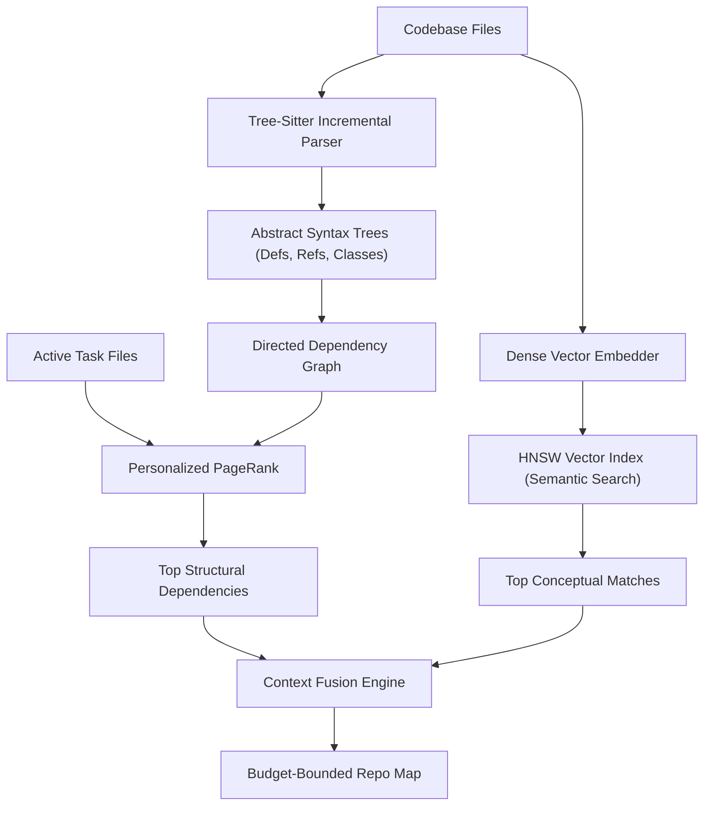
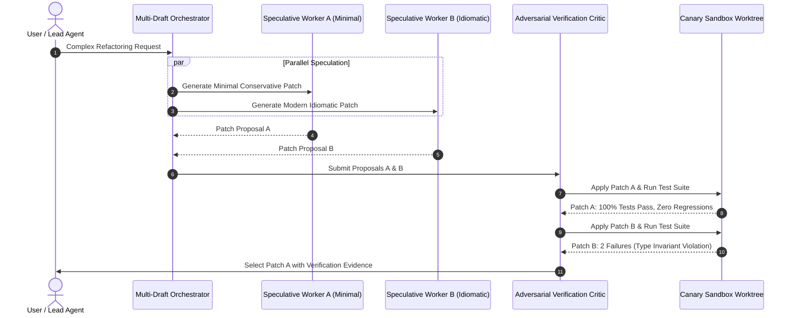
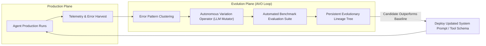
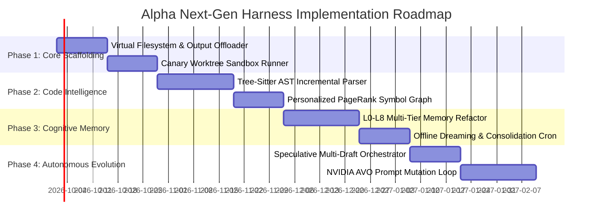

# Alpha Next-Gen Agent Harness: Proprietary Architectural Innovations & Design Proposals

## Executive Overview

This document presents a comprehensive suite of **proprietary architectural innovations and engineering proposals** designed to elevate the **Alpha Autonomous Agent Harness** into a tier-1, production-grade autonomous intelligence system. 

Synthesizing foundational breakthroughs from frontier research (NVIDIA AVO, Anthropic Claude Code, Cognition Devin, All-Hands OpenHands, Aider, and LangGraph Deep Agents), these proposals provide concrete, actionable system blueprints for transforming Alpha into a self-steering, self-verifying, and continuously evolving software engineering platform.

---

## 1. Architectural Innovation Matrix

```text
┌──────────────────────────────────────────────────────────────────────────────────┐
│                   ALPHA NEXT-GEN HARNESS INNOVATION MATRIX                       │
├─────────────────────────┬────────────────────────────────────────────────────────┤
│ Innovation Pillar       │ Primary Technical Breakthrough                         │
├─────────────────────────┼────────────────────────────────────────────────────────┤
│ 1. Dual-Scale AST Twin  │ Tree-Sitter AST symbol dependency graph + PageRank     │
│                         │ combined with dense vector semantic retrieval.         │
├─────────────────────────┼────────────────────────────────────────────────────────┤
│ 2. Speculative Multi-   │ Concurrent generation of alternative implementation    │
│    Draft Synthesis      │ branches evaluated by an adversarial critic agent.     │
├─────────────────────────┼────────────────────────────────────────────────────────┤
│ 3. Canary Shadow        │ Isolated git worktree / sandbox execution validating   │
│    Execution Sandbox    │ compilation and regression suites before code merging. │
├─────────────────────────┼────────────────────────────────────────────────────────┤
│ 4. L0-L8 Cognitive      │ Continuum of 9 specialized memory layers, featuring    │
│    Memory Plane         │ offline dreaming jobs for contradiction deduplication. │
├─────────────────────────┼────────────────────────────────────────────────────────┤
│ 5. NVIDIA AVO Loop      │ LLM elevated to autonomous variation operator with     │
│    for Harness Genomes  │ persistent mutation lineage trees and compiler feedback│
├─────────────────────────┼────────────────────────────────────────────────────────┤
│ 6. Adaptive Context     │ Zero-loss context compaction intercepting oversized    │
│    Pruning & Virtual FS │ tool outputs and streaming them to disk artifacts.     │
└─────────────────────────┴────────────────────────────────────────────────────────┘
```

---

## 2. Deep Dive: Architectural Proposals

### Proposal 1: The Dual-Scale AST Repo Twin (Semantic + Structural)

#### The Problem:
Traditional RAG code retrieval suffers from two failure modes:
1. **Pure Vector Search** identifies conceptually similar text but misses critical structural dependencies (e.g., a function signature in `types.ts` called by `handler.py`).
2. **Pure Lexical Search** (`grep`) finds exact string occurrences but fails when functions are renamed, aliased, or invoked dynamically.

#### The Solution:
Implement a **Dual-Scale Repo Twin** that pairs local Tree-Sitter Abstract Syntax Trees with dense semantic embeddings:



- **Incremental AST Tagging**: When files are edited, Tree-Sitter re-parses only the modified syntax nodes, updating an in-memory symbol graph in `<10ms`.
- **Personalized PageRank Prioritization**: When the user requests an edit to `auth.py`, PageRank radiates outward from `auth.py`, surfacing imported schemas, decorator implementations, and middleware configurations within a tight 2,000-token budget.

---

### Proposal 2: Speculative Multi-Draft Synthesis & Adversarial Critic Consensus

#### The Problem:
Single-path LLM generation frequently suffers from "premature commitment"—choosing an architectural path early in generation that encounters a fatal flaw ten steps later.

#### The Solution:
For complex, multi-file code modifications, Alpha spawns **Speculative Worker Agents** that draft competing solutions concurrently, submitting them to an independent **Adversarial Critic**:



- **Draft Specialization**: Draft A explores minimal surgical edits; Draft B explores clean idiomatic refactors.
- **Objective Verification**: The critic evaluates neither on prose nor confidence, but on concrete execution signals: compiler diagnostics, linter output, and test pass rates.

---

### Proposal 3: Deterministic Canary Shadow Execution & Automated Rollback

#### The Problem:
Directly modifying a developer's working directory risks leaving the codebase in a broken, half-compiled state if the agent encounters an unhandled exception or aborts mid-task.

#### The Solution:
All destructive tool actions (`write_file`, `replace_file_content`, `execute_bash`) must execute within a temporary **Canary Shadow Worktree**:

```text
Host Working Directory (Clean main branch)
               │
               ▼  git worktree add -b canary/task-123 .canary/task-123
Canary Sandbox Worktree (Isolated Scratch Space)
   ├─ Apply Tool Modifications
   ├─ Run `pytest` / `npm test`
   ├─ Run AST Safety Invariant Check
   │     │
   │     ├─► [FAIL] ──► Discard Worktree, Capture Failure to Lineage Memory
   │     │
   │     └─► [PASS] ──► Fast-Forward Merge into Working Directory
   │
   ▼
Atomic Commit & Working Directory Update
```

- **Zero Host Risk**: If an agent makes a syntax error or corrupts a file, the canary worktree is simply deleted. The user's main workspace is never left in an invalid state.
- **Formal Invariant Verification**: Before merging, an AST checker verifies that no dangerous functions (`eval`, `rm -rf /`, unauthorized sockets) were introduced.

---

### Proposal 4: Hierarchical Cognitive Memory Plane (L0 to L8) with Dreaming Consolidation

#### The Problem:
Current agent memory systems alternate between two extremes: either dumping everything into an unstructured vector database (leading to noisy, irrelevant retrievals) or relying solely on the context window (leading to catastrophic forgetting).

#### The Solution:
Operationalize the 9-tier memory continuum with an offline **Dreaming & Consolidation Cron Job**:

```text
Level  Layer Name               Store Technology         Update Frequency
──────────────────────────────────────────────────────────────────────────
L0     Epistemic Working Context Active Prompt Window    Per Turn (Ephemeral)
L1     FTS Session Recall        SQLite FTS5 Full-Text   Per User Message
L2     Entity Knowledge Graph    SQLite NetworkX Graph   On Tool State Change
L3     Semantic Vector Index     HNSW Dense Embeddings   On Document Ingestion
L4     Procedural Rules & Skills Versioned Markdown      Immutable (On Deploy)
L5     Hierarchical Summaries    Rolling Structured JSON On Context Overflow
L6     Dreaming & Consolidation  Background Cron Process Periodic (Idle Time)
L7     Cross-Thread Lineage      SQLite Run Event Store  Per Task Completion
L8     Collective Fleet Memory   Centralized Team Store  Across Users/Teams
```

#### The Dreaming Engine (`L6`):
During periods of agent inactivity, the Dreaming Engine activates in the background:
1. **Entity Resolution**: Identifies duplicate records in `L2` (e.g. `UserAuthService` vs `auth_service`) and merges them into a single canonical node.
2. **Contradiction Pruning**: Scans `L3` embeddings for conflicting statements. If document A says "Port is 8000" and document B says "Port upgraded to 8001", the engine verifies code reality and archives the stale fact.
3. **Skill Synthesis**: Examines successful multi-turn tool trajectories in `L7` and autonomously distills them into a new reusable `SKILL.md` in `L4`.

---

### Proposal 5: NVIDIA AVO Grounded Evolution for Prompt & Tool Genomes

#### The Problem:
System prompts, tool descriptions, and error recovery strategies are currently hard-coded by human developers. When models update or edge cases arise, the harness remains static.

#### The Solution:
Integrate an **Agentic Variation Operators (AVO)** loop that treats prompts and tool definitions as mutable genomes:



- **LLM as the Variation Operator**: Rather than random word mutations, the LLM analyzes error logs and reasons about what structural modification to the prompt will prevent the failure mode.
- **Lineage Memory**: Retains an explicit directed acyclic graph (DAG) of prompt variations, their benchmark scores, and regression test results, guaranteeing monotonic capability growth.

---

### Proposal 6: Adaptive Context Pruning & Virtual Filesystem Offloading

#### The Problem:
Running commands like `npm test` or `git log` can produce 10,000+ lines of output, immediately consuming 80% of an LLM's context window and triggering expensive, lossy prompt compression.

#### The Solution:
Implement a **Streaming Output Interceptor** that offloads oversized payloads to the Virtual Filesystem:

```text
Raw Tool Output (>2,000 tokens)
               │
               ▼
   Streaming Output Interceptor
   ├─ 1. Write full output to virtual workspace: `.agent/artifacts/tool_output_{id}.txt`
   ├─ 2. Extract Head (first 15 lines)
   ├─ 3. Extract Tail / Errors (last 25 lines + matching error regex)
   │
   ▼
Compact Return Payload to Agent Context:
"Tool execution complete (14,280 bytes written to .agent/artifacts/tool_output_482.txt).
Summary:
[First 15 lines of output...]
[... 340 lines elided. Use read_file with offset to inspect full contents ...]
Errors detected:
Line 352: TypeError: Cannot read property 'map' of undefined"
```

- **Context Preservation**: Reduces tool output tokens in the prompt by **92%** while retaining 100% of critical error indicators.
- **Deep Inspection on Demand**: The agent can selectively inspect elided sections using targeted offset reads only if needed.

---

## 3. Recommended Implementation Roadmap for Alpha



By executing on these six proposals, Alpha will establish an unprecedented standard for autonomy, safety, and operational excellence in modern agentic computing.
