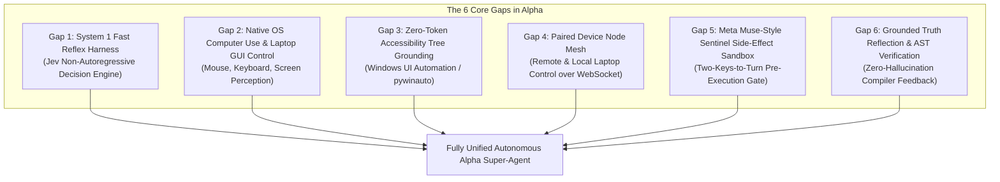

# Frontier Agentic AI Comparative Study & Alpha Gap Analysis

**Document:** `references/04-frontier-benchmarks-and-deep-research/ALPHA_VS_FRONTIER_AGENTS_GAP_ANALYSIS.md`  
**Project:** [itsPremkumar/alpha](https://github.com/itsPremkumar/alpha)  
**Research Date:** 2026-09-24  
**Target Benchmarks:** OpenClaw 2.0 / 2026.9.4, Nous Hermes (Hermes 3 / 1393 Swarm), xAI Grok Bot, Meta Muse (September 2026), OpenBot / Agent S3 / UI-TARS.

---

## 1. Executive Summary

As of late 2026, the frontier of Autonomous AI Agents has shifted dramatically from static conversational chat models to **embodied, multi-tiered, dual-process systems**. Modern autonomous systems are expected to control desktop and mobile operating systems, maintain decentralized swarm consensus, execute high-speed sub-millisecond reflex decisions, and protect users via independent sentinel sandboxes.

Alpha currently provides an outstanding enterprise foundation:
- A LangGraph-compatible execution harness with per-thread sandboxes.
- A production-grade **Dynamic Workflow Engine (DWE)** with parallel wave scheduling, Map/Reduce fan-out, race/quorum nodes, and safe AST expressions.
- Advanced **Bot Mode** with `BotCloneEngine` (exact copies, specialist forks with TTL leases, evolutionary breeding).
- Persistent cognitive and episodic memory with atomic fsync snapshots.
- A 116+ built-in tool catalog and multi-channel IM ingress (Slack, Feishu, Telegram, Discord).

However, an exhaustive comparative audit against frontier systems reveals **6 critical architectural gaps** that must be bridged for Alpha to achieve complete real-world autonomy on a user's laptop without paid external APIs.

---

## 2. Frontier Agent Benchmarking Matrix

| Capability Dimension | Alpha (Current) | OpenClaw 2.0 (v2026.9.4) | Nous Hermes (1393 Swarm) | xAI Grok Bot | Meta Muse (Sep 2026) | Agent S3 / UI-TARS |
|---|---|---|---|---|---|---|
| **Cognitive Architecture** | Deliberative LangGraph + DWE (System 2) | Gateway + Per-Session Loop | Fine-tuned Function Calling + Swarm | Reasoning + Live Web Ingestion | Action-Oriented Multimodal Agent | Vision-Language-Action (VLA) |
| **Fast Reflex Layer (System 1)** | ❌ Missing (Relies on full LLM inference) | ⚠️ Partial (Heuristic rule matching) | ⚠️ Partial (Quantized local model) | ❌ Standard LLM loop | ⚠️ Fast classifier | ❌ Multi-second VLM loop |
| **OS Computer Use / GUI Automation** | ⚠️ Shell & CLI only (No GUI control) | ✅ Paired Device Nodes (Mac/Win/iOS/Android) | ❌ CLI & Python execution only | ❌ Cloud multimodal chat only | ✅ Web & Desktop UI actions | ✅ Full Vision Mouse/Key OS Automation |
| **Accessibility Tree Inspection** | ❌ None | ✅ OS-level accessibility bridge | ❌ None | ❌ None | ⚠️ Web DOM only | ⚠️ Hybrid vision + accessibility |
| **Decentralized Swarm Bidding** | ✅ CNP Auction & DWE Quorums | ⚠️ Hub-and-spoke paired nodes | ✅ 1393-Agent Swarm Consensus | ❌ Centralized server | ❌ Isolated VM per user | ❌ Single-agent loop |
| **Independent Security Sentinel** | ✅ Sentinel Bot in roster & NetPolicy | ⚠️ Permission prompt dialogs | ❌ Self-contained guardrails | ⚠️ Moderation API | ✅ Dedicated Sentinel VM Guard | ⚠️ Dry-run confirmation |
| **On-Demand Tool & Skill Synthesis** | ✅ Dynamic Skill Authoring & DWE Patches | ✅ Dynamic Skill Loading | ✅ In-context Tool Generation | ❌ Fixed toolset | ❌ Proprietary integrations | ⚠️ Fixed OS actions |
| **Free / Local-First Viability** | ✅ 100% Free / Local (Ollama, SQLite) | ⚠️ Free core, optional cloud | ✅ Open-weights (Hermes 3) | ❌ Paid proprietary subscription | ❌ Meta proprietary platform | ✅ Open-weights (UI-TARS 7B) |

---

## 3. Deep Architectural Analysis of Frontier Systems

### 3.1 OpenClaw 2.0 (v2026.8.1 – v2026.9.4)
- **Architecture**: Long-lived Gateway + Session Manager + Paired Device Nodes.
- **Key Breakthrough**: OpenClaw separates the *brain* (the Gateway) from the *hands* (Paired Nodes). A user's laptop, phone, or remote server runs a lightweight daemon paired over secure WebSocket. The Gateway dispatches tasks to the node where the application or file lives.
- **Why It Matters for Alpha**: Alpha currently executes tools within the local backend environment or Docker containers. Adding a **Device Node Mesh** allows Alpha running on a home server or Docker to seamlessly control a user's Windows or Mac laptop desktop.

### 3.2 Nous Hermes & Hermes 1393 Swarm
- **Architecture**: Decentralized autonomous multi-agent swarm trained on structured function calling and contract net auction protocols.
- **Key Breakthrough**: Zero-shot tool synthesis and swarm consensus. When confronted with an unknown API or file format, Hermes synthesizes a self-contained Python tool script, executes it in a sandboxed subprocess, inspects the error trace, and auto-corrects without human guidance.
- **Why It Matters for Alpha**: Alpha's `alpha.skills.authoring` can be elevated into a real-time, instantaneous tool generator when a task encounters an unhandled protocol.

### 3.3 xAI Grok Bot
- **Architecture**: Real-time truth verification, live data stream grounding, and zero-hallucination code assertions.
- **Key Breakthrough**: Grok validates intermediate reasoning claims against live compiler ASTs, real-time web search feeds, and local code testbeds before finalizing a response.
- **Why It Matters for Alpha**: Combining Alpha's `StrategyMemory` with live compiler feedback gives Alpha mathematically verified code generation.

### 3.4 Meta Muse (September 2026)
- **Architecture**: Action-Oriented Personal Agent powered by Muse Spark 1.3 running inside isolated virtual machines with a dedicated **Sentinel Security Supervisor**.
- **Key Breakthrough**: The "Two-Keys-to-Turn" Security Model. The primary agent operates aggressively to accomplish tasks (filling forms, navigating web pages, editing configs). A separate, uncompromised model called the **Sentinel** reviews every outbound side-effect (deleting files, sending external messages, committing git branches, making payments) before execution.
- **Why It Matters for Alpha**: Alpha already has a foundational `sentinel` bot profile. Upgrading it into a true Meta Muse-style **Sentinel Side-Effect Interceptor** guarantees enterprise safety during unattended overnight runs.

### 3.5 UI-TARS / ShowUI / Agent S3 (Modern Computer Use)
- **Architecture**: End-to-end Vision-Language-Action (VLA) models capable of parsing screen pixels, understanding GUI layouts, and issuing mouse clicks, drags, keystrokes, and keyboard shortcuts.
- **Key Breakthrough**: Hybrid perception combining:
  1. High-level visual understanding (Set-of-Marks screenshot grounding).
  2. Zero-cost, zero-token **OS Accessibility Trees** (Windows UI Automation / macOS Accessibility API / Linux AT-SPI) providing exact element names, coordinates, and bounding rectangles without needing expensive cloud vision APIs!

---

## 4. The 6 Critical Gaps in Alpha

### Detailed Breakdown of Each Gap:

### Gap 1: Absence of a System 1 Fast Reflex Layer
- **Current State**: Alpha routes every decision through a full autoregressive LLM inference pass (LangGraph loop or DWE step). This incurs multi-second latency and burns unnecessary tokens even for trivial binary choices (e.g. "Does this node need approval?", "Which of these 4 tools should be called?", "Is the task finished?").
- **The Solution**: Integrate a **System 1 Harness** powered by non-autoregressive decision models (such as **Jev** by TypeSafe AI) via the **HarnessRouter** protocol. Jev outputs typed, deterministic probabilistic decisions (`Choice`, `Score`, `Noul`) in <15 milliseconds with zero token generation cost.

### Gap 2: Lack of Laptop OS GUI Control (Computer Use)
- **Current State**: Alpha interacts with the computer exclusively via terminal commands (`bash`, `terminal_exec`), git, and file editing. It cannot interact with desktop GUI software (opening VS Code, clicking buttons in specialized software, navigating forms, interacting with legacy desktop tools, or using desktop apps that lack public APIs).
- **The Solution**: Implement an **OS Computer Use Toolset** using 100% free, local Python libraries (`pyautogui`, `pynput`, `mss`) with bounding-box visual grounding.

### Gap 3: High Cost / Latency of Pure Vision-Based GUI Agents
- **Current State**: Most open-source computer-use agents send 4K screenshots to cloud vision models on every mouse move, incurring massive latency (5-10s per click) and high API costs.
- **The Solution**: Build a **Hybrid Perception Engine** that reads the local OS **Accessibility Tree** (using `pywinauto` / `UIAutomation` on Windows, `pyobjc` on macOS, `dogtail` on Linux). This extracts all interactive UI buttons, text inputs, menus, and coordinates in 20 milliseconds with zero API calls! Pure VLM vision is only used as a fallback for custom canvas elements.

### Gap 4: Single-Machine Local Execution Constraint
- **Current State**: Alpha runs tools in the exact operating environment where the FastAPI Gateway is running. If Alpha is deployed on a Linux server or Docker container, it cannot control the user's Windows or macOS desktop.
- **The Solution**: Implement the **Alpha Node Bridge (OpenClaw pattern)**: a lightweight Python agent daemon that runs on the user's laptop and connects to the Gateway via an encrypted WebSocket tunnel, enabling remote desktop automation.

### Gap 5: Absence of an Outbound Side-Effect Interceptor
- **Current State**: Alpha executes shell commands and file mutations immediately once approved by user or tool rules.
- **The Solution**: Implement a **Meta Muse-style Dual-Agent Sentinel Perimeter**: high-consequence operations (deleting directories, modifying git remotes, issuing HTTP POST requests with credentials, executing arbitrary binaries) are intercepted by a dedicated Sentinel sandbox for automated invariant checking.

### Gap 6: Code Generation Without AST Verification Loops
- **Current State**: When an agent writes code, it often reports completion without executing unit tests or type-checking the AST.
- **The Solution**: Implement **Grok-style Code Grounding**: every code modification automatically triggers Tree-Sitter AST validation and `pytest` / `mypy` before marking the turn as completed.

---

## 5. Strategic Conclusion

Alpha already possesses the hardest building blocks: a durable DAG workflow engine, safe AST expression routing, and bot cloning/breeding. By augmenting Alpha with:
1. **The System 1 Harness (Jev decision layer)** for microsecond reflexes,
2. **The Zero-Cost OS Computer Use Engine** for laptop GUI automation,
3. **The Accessibility Tree Bridge** for zero-token UI element grounding, and
4. **The Sentinel Side-Effect Sandbox** for ironclad safety,

Alpha becomes the most advanced, completely free, local-first autonomous agent platform in existence.
