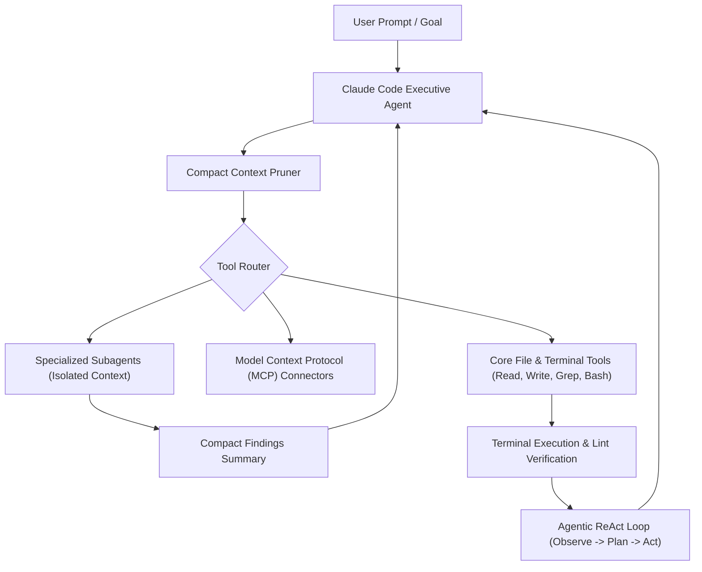
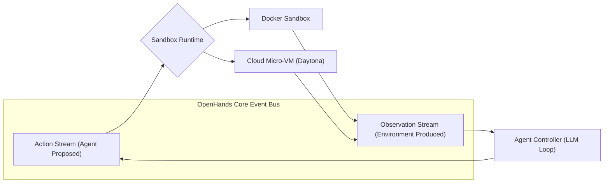
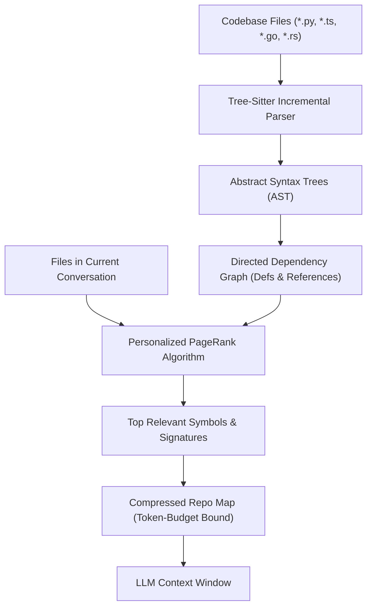

# SOTA Coding Agents & Frontier Harness Architecture: Comprehensive 2026 Comparative Study

## Executive Summary

In 2026, the artificial intelligence landscape has transitioned from single-turn conversational models to **autonomous software engineering agents** operating within production developer workflows. Industry benchmarks like **SWE-bench Verified** have demonstrated that while the raw intelligence of underlying frontier foundation models (Claude 3.5/3.7/4.5 Sonnet/Opus, GPT-4o/o1/o3, DeepSeek-R1/V3) is critical, **the harness architecture—the operational scaffolding, context management, tool plane, sandbox boundaries, and feedback loops—accounts for up to 60% of total agent task resolution efficacy**.

This research study evaluates the leading frontier coding agents and open-source harnesses, analyzing their architectural strengths, trade-offs, and design paradigms to extract actionable engineering lessons for the **Alpha Autonomous Agent Harness**.

---

## 1. Comparative Architecture Matrix

| Agent / Harness | Organization | Primary Paradigm | Codebase Context Engine | Sandbox / Execution Isolation | Multi-Agent / Delegation | SWE-bench Verified |
| :--- | :--- | :--- | :--- | :--- | :--- | :--- |
| **Claude Code** | Anthropic | ReAct + Compact Loops | File/Grep Tools + Project Memory (`.clauderules`) | Local Host Process with User Permission Gates | Subagents with Isolated Context Windows | >65% |
| **Devin** | Cognition AI | Dual Planner-Executor | Full-Repository Semantic Search + File Graph | Dedicated Cloud Micro-VM + Remote Browser | Specialized Internal Worker Subagents | >65–70% |
| **OpenHands** | All-Hands AI | Event-Stream Perception-Action Bus | Hybrid Grep/Find + Tree-Sitter AST & File Outline | Docker Container / Cloud Sandbox (Daytona) | Modular Sub-Agents (Coding, Browsing, Testing) | >65–72% |
| **Cursor** | Anysphere | Hybrid IDE Agent | Tree-Sitter AST + ripgrep + LSP + Embeddings | Git Worktree Background Validation | Agentic Flow with Background Verification | N/A (IDE SOTA) |
| **Aider** | Paul Gauthier | Architect/Editor Loop | Tree-Sitter AST PageRank Symbol Map | Local Git Worktree with Atomic Commits | Dual-Model Pair Programming (Architect + Editor) | >50–60% |
| **LangGraph Deep Agents** | LangChain | 3-Tier Stateful Graph | Virtual Workspace Filesystem + Context Pruning | Pluggable Docker / Local Python Runtime | Hierarchical Subagent Graph Delegation | Benchmarked via LangSmith |
| **Windsurf** | Codeium | Cascade Flow Engine | Multi-Layer Variable / Call Graph + Semantic Vectors | In-Editor Background Sandbox | Cooperative Multi-Step Assistants | N/A (IDE SOTA) |
| **Nous Hermes Agent** | Nous Research | Tool-Calling Graph Engine | Epistemic Belief Ledger + Tool Registry | Local Docker Sandbox / Process Isolation | Decentralized Swarm Coordination (1,000+ Agents) | Highly competitive OSS |

---

## 2. In-Depth Architectural Analyses

### 2.1 Claude Code (Anthropic)
Claude Code operates as an interactive, terminal-native software engineering agent. Its design is characterized by extreme restraint, low latency, and deterministic tool execution.



#### Key Engineering Paradigms:
1. **Subagent Context Isolation**: When an operation requires traversing deep directories or running exhaustive grep queries, Claude Code spawns an ephemeral subagent in an isolated context window. Only the distilled conclusion is returned to the parent agent, preventing "context pollution" and "prompt bloat."
2. **Model Context Protocol (MCP)**: Native support for MCP servers allows dynamic extension to external issue trackers (Jira, GitHub Issues), databases (PostgreSQL, SQLite), and deployment monitoring.
3. **Iterative Repair Loop**: Commands that fail linting, tests, or compilation immediately pipe the STDERR back into the agent loop for automated self-healing.

---

### 2.2 OpenHands (All-Hands AI)
OpenHands (formerly OpenDevin) is the premier open-source autonomous software engineering platform, boasting top ranks on SWE-bench Verified.



#### Key Engineering Paradigms:
1. **Event-Stream Nervous System**: Every interaction is modeled as an explicit stream of `Action` and `Observation` events. This enables complete deterministic replayability, trajectory debugging, and seamless human intervention.
2. **Decoupled Sandbox Runtimes**: OpenHands strictly separates agent reasoning from execution environments. Runtimes can be swapped from local Docker containers to cloud-hosted micro-VMs without altering a line of agent logic.
3. **Micro-Agent Specialization**: Incorporates dedicated sub-agents tailored for specific software lifecycle phases: Code Navigation, Patch Synthesis, Test Execution, and Web Documentation Browsing.

---

### 2.3 Aider (Paul Gauthier)
Aider demonstrates that exceptional coding performance can be achieved without massive context windows through mathematical symbol graph modeling.



#### Key Engineering Paradigms:
1. **Tree-Sitter Abstract Syntax Trees (AST)**: Rather than sending entire files or simple regex matches, Aider incrementally parses repository files into ASTs to extract precise function definitions, class headers, type signatures, and cross-references.
2. **Personalized PageRank**: Treats the codebase as a directed web graph where files are nodes and symbol dependencies are edges. By biasing PageRank toward files active in the current discussion, Aider mathematically identifies the most structurally relevant peripheral files.
3. **Git-Native Atomic Commits**: Every code change is verified and committed to git with an automatically generated, descriptive commit message, providing instantaneous rollbacks if an edit introduces regressions.

---

### 2.4 Cursor & Windsurf (IDE Context Engines)
Modern AI-native IDEs (Cursor and Windsurf) bridge editor telemetry with language models through background synchronization.

#### Key Engineering Paradigms:
1. **Hybrid Retrieval (Lexical + Semantic + LSP)**: Cursor combines `ripgrep` for exact symbol identifiers, local dense vector embeddings for conceptual matching, and Language Server Protocol (LSP) diagnostics for type-level accuracy.
2. **Shadow Workspaces**: While the developer types, the agent runs proposed edits in a background shadow workspace (leveraging git worktrees), executing type-checkers (`tsc`, `mypy`) and unit tests before displaying suggested code diffs to the user.
3. **Multi-File Speculative Diffing**: Changes across multiple interdependent files are drafted concurrently and verified as a single cohesive patch.

---

### 2.5 LangGraph Deep Agents (LangChain)
Deep Agents establishes the industry-standard 3-tier decoupling of agent software:

```text
┌──────────────────────────────────────────────────────────────┐
│  Tier 3: Autonomous Scaffolding Harness (Deep Agents / Alpha)│
│  • Planning Tools (Structured DAG Decomposition)             │
│  • Virtual Filesystem (Persistent Long-Horizon Scratchpad)   │
│  • Subagent Delegation (Clean Context Budgets)               │
│  • Context Compaction (Token Compression & Offloading)       │
└──────────────────────────────┬───────────────────────────────┘
                               │
┌──────────────────────────────▼───────────────────────────────┐
│  Tier 2: Stateful Durable Runtime (LangGraph)                │
│  • Cyclical Graph Execution Engine                           │
│  • Temporal Checkpointers (SQLite / Postgres)               │
│  • Human-in-the-Loop Interrupts & Resumes                    │
│  • State Branching & Time-Travel                             │
└──────────────────────────────┬───────────────────────────────┘
                               │
┌──────────────────────────────▼───────────────────────────────┐
│  Tier 1: Primitive Framework (LangChain)                     │
│  • Multi-Model Adapters (OpenAI, Anthropic, Gemini, OSS)     │
│  • Tool Declarations & Pydantic Schema Parsing               │
│  • Prompt Templates & Base Output Parsers                    │
└──────────────────────────────────────────────────────────────┘
```

---

## 3. Critical Architectural Insights for Alpha

From this comparative survey, five universal design imperatives emerge for the **Alpha Autonomous Agent Harness**:

1. **Deterministic Context Isolation**: Never run exploratory searches, massive test outputs, or multi-hop web queries inside the primary executive agent's context. Always isolate these inside ephemeral subagents or virtual filesystem artifacts.
2. **Tree-Sitter Structural Code Awareness**: Combine dense vector retrieval with AST-derived symbol dependency graphs. Pure vector search fails at identifying non-obvious cross-file type references; pure AST parsing fails at semantic intent. Hybrid is mandatory.
3. **Event-Driven Execution Bus**: Transitioning internal harness events to an immutable event-stream (Action/Observation) provides auditability, live replay debugging, and reliable crash recovery.
4. **Sandboxed Verification Before Merging**: No generated patch should ever touch the main branch without passing through a sandboxed canary execution environment (Docker or git worktree) that validates compilation and regression tests.
5. **Persistent Mutation Lineages**: When conducting autonomous self-improvement (AVO/RSI), the agent must maintain a persistent evolutionary tree of past attempts and compiler outputs to avoid repeating suboptimal mutations.
