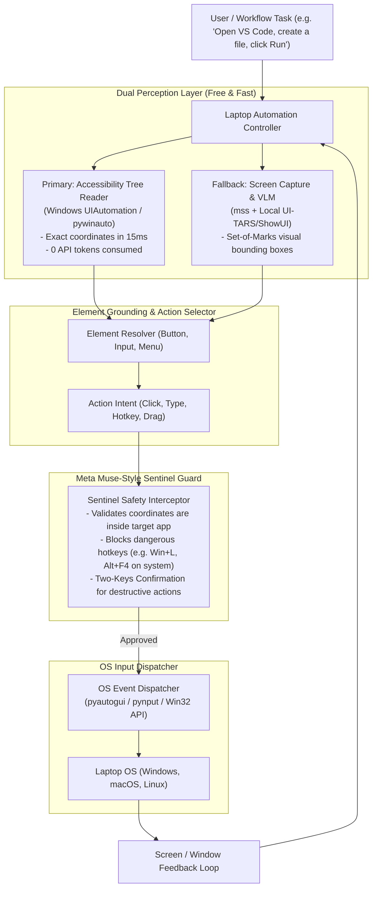

# OS Computer Use & Laptop Automation Architecture Guide

**Document:** `references/07-system1-and-os-computer-use/OS_COMPUTER_USE_AND_LAPTOP_AUTOMATION_GUIDE.md`  
**Project:** [itsPremkumar/alpha](https://github.com/itsPremkumar/alpha)  
**Status:** Living Technical Guide & Implementation Blueprint  
**Authors:** Alpha Core Architecture Team  
**Focus:** Free Local-First Computer Use, Windows/Mac/Linux Laptop Automation, Accessibility Tree Grounding, and Meta Muse-Style Sentinel Safety.

---

## 1. Executive Vision: Real Laptop Work Without Paid APIs

Most autonomous agent projects remain trapped inside a chat window or a sandboxed Docker container, capable only of generating text or modifying files in a local directory.

To do **real work on a user's laptop**, an agent must be able to interact with the host operating system just like a human engineer does:
1. Opening applications (VS Code, Slack, Chrome, Postman, Excel, specialized desktop tools).
2. Navigating interfaces (clicking buttons, typing text, selecting dropdowns, scrolling).
3. Inspecting the screen (taking screenshots, detecting UI elements, reading active window titles).
4. Automating web flows (filling complex multi-step web forms, interacting with internal dashboards).
5. Recovering from UI popups and unexpected dialogs autonomously.

### The Zero-Cost Mandate
Existing proprietary solutions (such as Claude 3.5 Computer Use API) cost $0.05 to $0.20 per screenshot action and require sending high-resolution images to the cloud every few seconds.

Alpha's OS Computer Use Engine is designed from the ground up to be **100% free and local-first**:
- Uses **OS Accessibility Trees** (Windows UI Automation, macOS Accessibility, Linux AT-SPI) for **zero-token, instantaneous UI element detection**.
- Uses lightweight open-source Python automation libraries (`pyautogui`, `pynput`, `mss`, `pywinauto`).
- Uses local, open-weights Vision-Language Models (e.g. `UI-TARS-7B`, `ShowUI`, or `Qwen2-VL-7B` via Ollama / vLLM) **only as an optional fallback** when accessibility trees are insufficient.

---

## 2. Core Architecture: The Laptop Action Loop



---

## 3. The Dual Perception Layer: Why Accessibility Trees Win

The greatest performance bottleneck in modern computer use agents is relying purely on raw pixels. Raw screenshots sent to VLMs suffer from:
1. High token cost (millions of tokens per hour).
2. High latency (3–8 seconds per action).
3. Coordinate hallucination (misclicking by 20 pixels and missing a small button).

Alpha solves this by establishing a **Dual Perception Layer**:

### 3.1 Primary Layer: The OS Accessibility Tree (`pywinauto` / `UIAutomation`)
Modern operating systems maintain an internal hierarchical tree of every window, button, text field, checkbox, and menu item for screen readers. 

Using native OS accessibility APIs:
- We query the active application window directly.
- We receive the exact bounding box rectangles `(x, y, width, height)` and accessibility labels (e.g. `"Run Test"`, `"Save"`, `"Address Bar"`) in **15 to 30 milliseconds**.
- **Token Cost**: Exactly ZERO.
- **Accuracy**: 100% pixel-perfect (no coordinate guessing).

```python
# Conceptual Windows UI Automation reader in Alpha
from pywinauto import Desktop

def find_interactive_element(app_title: str, element_name: str) -> tuple[int, int] | None:
    app = Desktop(backend="uia").window(title_re=f".*{app_title}.*")
    element = app.child_window(title=element_name, control_type="Button")
    if element.exists():
        rect = element.rectangle()
        # Return center click coordinates
        return (rect.mid_point().x, rect.mid_point().y)
    return None
```

### 3.2 Fallback Layer: Screen Capture & Local Vision Grounding
When interacting with custom canvas apps, games, or legacy software that do not expose accessibility trees:
1. `mss` captures the active monitor or window in <10ms.
2. The image is passed through a **Set-of-Marks (SoM)** overlay generator, which numbers visible UI bounding boxes.
3. A local open-weight vision model (running on Ollama or CPU/GPU) selects the mark number to click.

---

## 4. The OS Action Dispatcher

The action space is modeled after human computer interaction:

### 4.1 Mouse Operations
- `mouse_click(x, y, button="left", clicks=1)`: Single or double click at coordinates.
- `mouse_move(x, y, smooth=True)`: Moves the cursor with natural human-like Bezier acceleration to avoid tripping anti-bot heuristics.
- `mouse_drag(start_x, start_y, end_x, end_y)`: Drags files, window headers, or canvas elements.
- `mouse_scroll(clicks, direction="down")`: Scrolls the active viewport.

### 4.2 Keyboard Operations
- `keyboard_type(text, interval_ms=20)`: Types text with realistic keystroke timing.
- `keyboard_hotkey(*keys)`: Dispatches key combinations (e.g. `ctrl+s`, `alt+tab`, `ctrl+shift+p`, `super+r`).
- `keyboard_press(key)`: Single key press (`enter`, `escape`, `backspace`, `tab`).

### 4.3 Window & Application Lifecycle Management
- `launch_application(app_name_or_path)`: Starts desktop apps (e.g. `"notepad"`, `"code"`, `"chrome"`).
- `focus_window(window_title)`: Brings a specific window to the foreground.
- `list_open_windows()`: Returns a list of all currently visible application windows.
- `close_window(window_title)`: Gracefully terminates an application window.

---

## 5. Meta Muse-Style Sentinel Safety Sandbox

Giving an AI agent direct control of your laptop mouse and keyboard carries significant risks (accidental file deletion, sending unfinished emails, closing unsaved work, or triggering system reboots).

Alpha implements a **Two-Keys-to-Turn Sentinel Perimeter** inspired by Meta Muse:

```
                            Proposed Action (e.g. click, key)
                                           │
                                           ▼
                       ┌───────────────────────────────────────┐
                       │     Sentinel Pre-Execution Guard      │
                       └───────────────────┬───────────────────┘
                                           │
                   ┌───────────────────────┴───────────────────────┐
                   │ Safe Action                                   │ Dangerous Action
                   ▼                                               ▼
         ┌──────────────────┐                            ┌──────────────────┐
         │ Immediate OS     │                            │ Interactive      │
         │ Execution        │                            │ Human Approval   │
         │ - Typing code    │                            │ - Format Drive   │
         │ - Clicking test  │                            │ - Modify System  │
         │ - Scrolling      │                            │ - Commit Main    │
         └──────────────────┘                            └──────────────────┘
```

### Safety Policies Enforced by the Sentinel:
1. **Window Boundary Containment**: Actions are strictly restricted to the bounding box of the designated target window (e.g., VS Code or Browser). Mouse movements outside the permitted window are clamped or aborted.
2. **Forbidden Key Combinations**: Blacklists dangerous OS-level hotkeys (e.g., `Win+L` lock, `Alt+F4` on desktop, `Ctrl+Alt+Del`, `Shift+Delete` permanent file erase) unless explicitly approved.
3. **Emergency Kill-Switch (Panic Corner)**: Moving the physical mouse cursor to the upper-left corner of the primary display (`(0, 0)`) immediately pauses the agent and halts all automation.
4. **Action Rate Limiting**: Enforces human-scale interaction speeds (maximum 3 clicks per second) to prevent runaway loops.

---

## 6. OpenClaw-Style Paired Device Node Bridge

What if Alpha is running inside a Docker container, in WSL, or on a remote Linux server, but you want it to control your physical Windows/macOS laptop?

Alpha implements the **Node Bridge Protocol (OpenClaw pattern)**:

```text
Alpha Gateway (Docker / Server / Cloud)
                 │
                 ▼  Encrypted WebSocket (TLS + HMAC Token)
         ┌───────────────┐
         │ Node Bridge   │
         └───────┬───────┘
                 │
                 ▼
Local Laptop Daemon (Alpha Node)
- Runs locally in background tray
- Captures screen & accessibility tree
- Dispatches mouse & keyboard inputs
- Manages local files & applications
```

### Key Advantages:
- The heavy agent runtime and dynamic workflow engine can run anywhere.
- The laptop only needs a lightweight Python client (`alpha-node`) with zero heavy dependencies.
- Multiple laptops or remote VMs can be paired to a single Alpha Gateway, enabling a multi-machine autonomous fleet.

---

## 7. Concrete Tool Interfaces for Alpha

These built-in tools will be registered in `backend/packages/harness/alpha/tools/builtins/os_computer_tool.py`:

```python
@tool("desktop_screenshot", parse_docstring=True)
def desktop_screenshot_tool(window_title: str = "") -> dict:
    """Capture a screenshot of the primary display or a specific active window.
    
    Args:
        window_title: Optional substring of the window to capture. If empty, captures full desktop.
    """
    ...

@tool("desktop_inspect_ui_tree", parse_docstring=True)
def desktop_inspect_ui_tree_tool(window_title: str) -> list[dict]:
    """Inspect all clickable buttons, text inputs, and controls in a window via Accessibility API.
    
    Args:
        window_title: Substring of the application window to inspect.
    """
    ...

@tool("desktop_mouse_action", parse_docstring=True)
def desktop_mouse_action_tool(
    action: str,
    x: int,
    y: int,
    button: str = "left",
    clicks: int = 1,
) -> str:
    """Dispatch mouse click, move, drag, or scroll to specific desktop coordinates.
    
    Args:
        action: One of 'click', 'move', 'drag', 'scroll'.
        x: X-coordinate in pixels.
        y: Y-coordinate in pixels.
        button: 'left', 'right', or 'middle'.
        clicks: Number of clicks.
    """
    ...

@tool("desktop_keyboard_action", parse_docstring=True)
def desktop_keyboard_action_tool(
    action: str,
    text: str = "",
    hotkey: str = "",
) -> str:
    """Type text, press a key, or execute a keyboard hotkey combination.
    
    Args:
        action: One of 'type', 'press', 'hotkey'.
        text: Text to type (when action='type').
        hotkey: Key combo like 'ctrl+s', 'alt+tab' (when action='hotkey').
    """
    ...
```

---

## 8. Summary

By combining **Zero-Token Accessibility Trees**, **Local Python OS Dispatchers**, **Meta Muse-Style Sentinel Safety**, and **OpenClaw-Style Node Pairing**, Alpha gains full-fledged, safe, and completely free Computer Use capabilities on any laptop.
