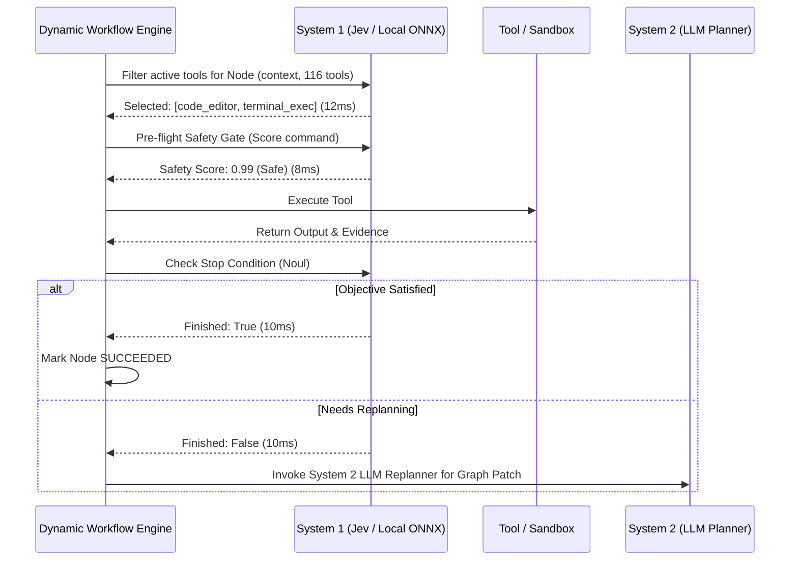

# System 1 Fast Reflex Harness & Jev Architecture Specification

**Document:** `references/07-system1-and-os-computer-use/SYSTEM_ONE_HARNESS_AND_JEV_ARCHITECTURE.md`  
**Project:** [itsPremkumar/alpha](https://github.com/itsPremkumar/alpha)  
**Status:** Architectural Specification & Implementation Blueprint  
**Authors:** Alpha Core Architecture Team  
**Focus:** Dual-Process Cognitive Architecture, Jev Model Integration, Sub-Millisecond Decision Gating, and Free Local-First Execution.

---

## 1. The Dual-Process Agent Paradigm

For years, AI agent harnesses have suffered from a fundamental architectural flaw: **using massive, multi-billion parameter autoregressive LLMs to make simple binary and categorical decisions**.

When an agent needs to answer:
- *"Which of these 4 tools should be called?"*
- *"Does this node require human-in-the-loop approval?"*
- *"Has the loop reached its termination condition?"*
- *"Is this generated command safe to run?"*

Traditional agents send a 4,000-token prompt to a heavy LLM (e.g., Claude 3.5 Sonnet, GPT-4o, or Llama-3-70B), waiting 2,000 to 5,000 milliseconds while the model autoregressively generates explanatory prose, markdown code blocks, and JSON text, only to extract a single boolean flag or tool name!

This is the equivalent of requiring a human to write a 500-word philosophical essay before pressing the brake pedal in a car.

### Kahneman’s Dual-Process Cognitive Theory in AI:
- **System 1 (Fast, Reflexive, Sub-symbolic, Automatic)**: Operates effortlessly, in milliseconds, with zero token-generation overhead. Handles pattern recognition, classification, binary gating, tool filtering, and sensory-motor reflexes.
- **System 2 (Slow, Deliberative, Symbolic, Analytical)**: Operates step-by-step, with chain-of-thought planning, tree search, DWE DAG scheduling, multi-agent quorums, and deep reasoning.

```
                              INCOMING PERCEPTION / TASK
                                           │
                                           ▼
                       ┌───────────────────────────────────────┐
                       │     System 1 Fast Reflex Harness      │
                       │     (Jev / Local Classifier Engine)   │
                       └───────────────────┬───────────────────┘
                                           │
                   ┌───────────────────────┴───────────────────────┐
                   │ Latency: <15ms                                │ Confidence < Threshold
                   │ Cost: 0 tokens (Non-autoregressive)          │ or High-Complexity Plan
                   ▼                                               ▼
     ┌───────────────────────────┐                   ┌───────────────────────────┐
     │ Instant Reflex Execution  │                   │ System 2 Deliberative     │
     │ - Binary Safety Gate      │                   │ - Dynamic Workflow Engine │
     │ - Rapid Tool Dispatch     │                   │ - LangGraph Agent Loop    │
     │ - OS Mouse/Key Reflex     │                   │ - Multi-Agent Swarm       │
     │ - Loop Termination Check  │                   │ - Deep Code Synthesis     │
     └───────────────────────────┘                   └───────────────────────────┘
```

---

## 2. Jev: The Non-Autoregressive Decision Engine

**Jev** (developed by TypeSafe AI, released in September 2026) is the reference model architecture for System 1 execution in modern AI agent harnesses.

### 2.1 Core Architectural Principles of Jev
1. **Non-Autoregressive**: Jev does not predict text token-by-token. Instead, it takes a state context and a finite set of candidates, evaluating the entire distribution in a single forward pass.
2. **Sub-15ms Latency**: Because it produces no text stream, inference takes 5–15 milliseconds on GPU/NPU and under 40 milliseconds on consumer laptop CPUs.
3. **Zero Hallucination / Strictly Typed**: Jev can only select from the valid options provided by the caller. It is mathematically incapable of generating hallucinated strings, invalid syntax, or unpermitted actions.
4. **Three Typed Decision Primitives**:

```python
# 1. Choice: Selects exactly one item from an unordered candidate set
decision = jev.choice(
    context="User wants to run unit tests and fix any failing pytest assertions",
    candidates=["code_editor", "pytest_runner", "web_search", "git_commit"],
)
# Output: {"winner": "pytest_runner", "probabilities": {"pytest_runner": 0.94, "code_editor": 0.04, ...}}

# 2. Score: Assigns a continuous value in an ordered range (0.0 to 1.0)
safety_score = jev.score(
    context="Command: rm -rf /tmp/build_cache vs rm -rf /",
    scale=(0.0, 1.0),
)
# Output: 0.98 (Extremely safe) vs 0.01 (Dangerous critical hazard)

# 3. Noul: A strict binary yes/no gate
is_terminated = jev.noul(
    context="Current test output: '5 passed, 0 failed in 0.42s'. Objective: 'Make all tests pass'.",
    question="Has the objective been completely satisfied?",
)
# Output: True (p=0.992)
```

---

## 3. The Unified Harness Protocol (UHP) & HarnessRouter

Alpha integrates with the **Unified Harness Protocol (UHP)** developed by the open-source **HarnessRouter** ecosystem.

### 3.1 Architecture of `HarnessRouter`
`HarnessRouter` provides a standard abstraction layer decoupling the agent logic from the underlying harness:

```text
Alpha Gateway / Dynamic Workflow Engine
                   │
                   ▼
       HarnessRouter Adapter (UHP)
      ┌────────────┴────────────┐
      ▼                         ▼
System 1 Harness        System 2 Harness
(Jev Decision Engine)   (Alpha LangGraph / DWE)
- Fast Tool Filter      - Deep Code Synthesis
- Safety Interceptor    - Multi-Turn Reasoning
- Loop Gating           - Quorum Deliberation
```

### 3.2 System 1 Harness Responsibilities in Alpha
1. **Tool Palette Pruning**:
   - Alpha contains 116+ tools.
   - Before invoking the System 2 LLM, System 1 runs `jev.choice` / multi-label filter over toolsets.
   - Injects only the 4–6 relevant tools into the prompt, reducing LLM context by 80% and eliminating tool hallucination.
2. **Dynamic Bot Routing**:
   - Instantly routes incoming user prompt to the appropriate bot profile (`architect`, `coder`, `reviewer`, `tester`, `researcher`, or a cloned specialist) in 10ms.
3. **Fast Safety & Security Gatekeeper**:
   - Replaces slow regex/prompt guards with a high-speed `jev.score` safety evaluator.
   - Evaluates file paths, shell commands, and external URLs before execution.
4. **Instant Loop & Convergence Evaluation**:
   - For iterative self-repair and TDD loops (`sdlc_engine`, `replanner`), System 1 evaluates whether the stopping criterion is met without invoking an LLM generation pass.

---

## 4. Local-First & 100% Free Implementation Blueprint

To honor the **zero-cost mandate** (no paid APIs except user-configured LLM / Jev), Alpha's System 1 harness provides a dual-engine implementation:

### 4.1 Engine Option A: Cloud Jev / Jev API (When key provided)
- Uses TypeSafe AI's Jev REST/gRPC endpoint via `$JEV_API_KEY`.
- Latency: ~15ms roundtrip.
- Token cost: Near-zero (cents per million decisions).

### 4.2 Engine Option B: Local Free Fallback (100% Local, Zero Cost, Zero API Key)
When `$JEV_API_KEY` is not present, Alpha automatically activates the **Local System 1 Reflex Engine**:
- **Architecture**: A lightweight, quantized local encoder-classifier (e.g. `bge-small-en-v1.5`, `all-MiniLM-L6-v2`, or a 4-bit `SmolLM2-135M` / `Qwen2.5-0.5B` running locally via ONNX Runtime or `llama.cpp` on CPU).
- **Zero API Keys**: Runs 100% locally on the user's laptop using free open-source weights.
- **Hardware Footprint**: Requires less than 150MB of RAM and zero GPU VRAM.
- **Latency**: 8ms inference on a standard laptop CPU.

```python
# Conceptual implementation of Alpha's Local System 1 Engine
class LocalSystem1Engine:
    def __init__(self, model_name: str = "onnx-reflex-classifier-v1"):
        self.session = load_local_onnx_model(model_name)
    
    def choice(self, context: str, candidates: list[str]) -> str:
        embeddings = self.embed([context] + candidates)
        ctx_vec = embeddings[0]
        cand_vecs = embeddings[1:]
        scores = cosine_similarity(ctx_vec, cand_vecs)
        return candidates[argmax(scores)]

    def noul(self, context: str, question: str) -> bool:
        score = self.classify_binary(f"{context} [SEP] {question}")
        return score >= 0.5
```

---

## 5. Integrating System 1 into Alpha's Dynamic Workflow Engine (DWE)

Alpha's DWE (`backend/packages/harness/alpha/workflow/runtime.py`) directly leverages System 1 at three critical execution junctures:



### Key Performance Benefits:
1. **10x Faster Execution Loops**: A 5-step workflow that previously took 30 seconds of LLM thinking now completes in 3 seconds because intermediate routing and verification happen in System 1.
2. **Context Window Savings**: Up to 70% fewer prompt tokens consumed per workflow run.
3. **Zero Risk of Hallucinated Actions**: System 1 decisions are mechanically constrained to valid candidate lists.

---

## 6. Implementation Checklist & Module Layout

To embed System 1 into Alpha:
- `backend/packages/harness/alpha/system1/`
  - `__init__.py`: Package export surface (`get_system1_engine`, `DecisionType`).
  - `models.py`: Typed decision interfaces (`ChoiceResult`, `ScoreResult`, `NoulResult`).
  - `engine.py`: `System1Engine` supporting both Jev API and Local ONNX Fallback.
  - `harness_router.py`: UHP-compliant `HarnessRouter` bridge.
  - `middleware.py`: LangGraph middleware intercepting turns for instant tool pruning and pre-flight safety scoring.
- Verification:
  - `backend/tests/test_system1_engine.py`: Unit tests verifying `choice`, `score`, `noul`, latency limits (<50ms), and fallback behavior.
