# ALPHA — AGI/ASI-Oriented Autonomous Intelligence Architecture

**Document type:** Research + system architecture blueprint  
**Project:** Alpha autonomous agent  
**Research cutoff:** September 26, 2026  
**Primary stack assumed:** Python + LangGraph + LangChain + Deep Agents, provider-agnostic LLM layer, MCP, A2A-compatible federation, local/cloud runtimes, persistent memory, observability/evaluation, and a Windows-first desktop/runtime target.

> **Important scope note:** This document is an engineering architecture for building an increasingly general, autonomous, self-improving agent. It does **not** claim that an implementation of these components will automatically produce AGI or ASI. Current research does not provide a proven recipe for ASI. The design therefore treats AGI/ASI as a capability target and research program, not a guaranteed product feature.

---

## 1. Executive architecture

The central idea is to turn Alpha from a single LLM agent into a **persistent cognitive operating system** with six continuously interacting loops:

1. **Task loop** — understand → plan → act → observe → verify → complete.
2. **Memory loop** — encode → retrieve → consolidate → forget/deprecate → learn.
3. **Research loop** — search → synthesize → experiment → review → publish/store.
4. **Evaluation loop** — measure → diagnose → generate tests → compare → regress/block.
5. **Self-improvement loop** — propose change → sandbox → test → benchmark → review → promote/rollback.
6. **Federation loop** — discover other Alpha instances → negotiate capabilities → delegate/share evidence → reconcile results → synchronize approved artifacts.

These loops should run under a common runtime, common event schema, common state model, and common safety/promotion gates.

The architecture is inspired by recent work on tool-using agents, long-running agents, multi-agent systems, memory systems, automated software engineering, automated scientific discovery, and recursive self-improvement. LangGraph/Deep Agents provide useful execution primitives; ReAct combines reasoning and acting; Reflexion and Self-Refine demonstrate feedback-driven improvement without weight updates; MemGPT demonstrates hierarchical/virtual memory; SWE-agent demonstrates the importance of agent-computer interfaces; AlphaEvolve and the Darwin Gödel Machine demonstrate automated code/algorithm search loops with evaluation; The AI Scientist demonstrates an automated research loop; MCP and A2A provide interoperability patterns; OpenTelemetry/Phoenix/DeepEval/Promptfoo support tracing and evaluation; and OWASP/NIST provide security and risk-management guidance.

### High-level system

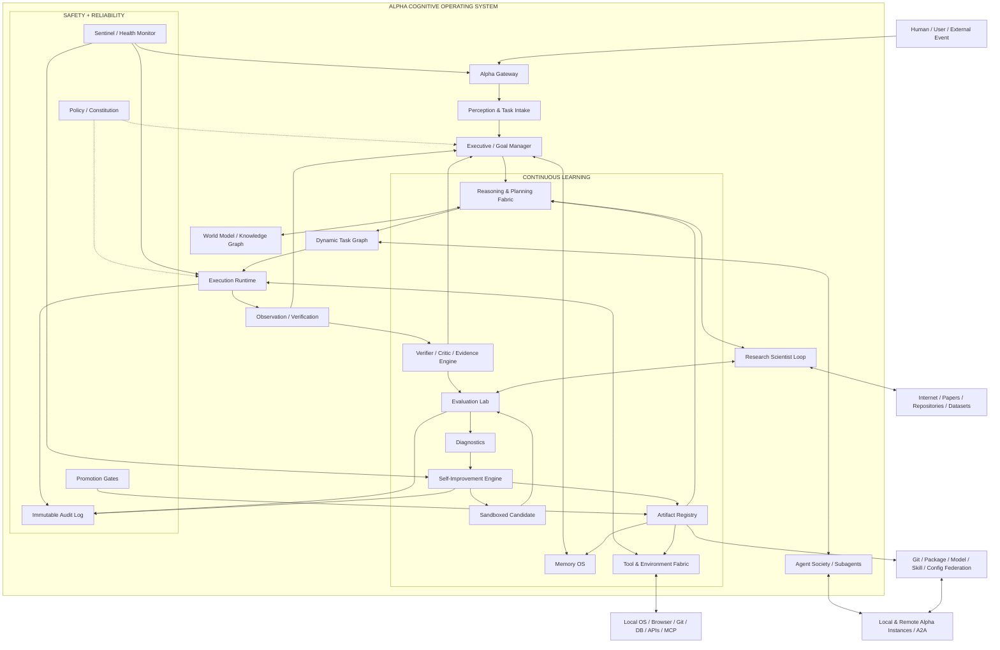

---

## 2. What the “AGI/ASI architecture” actually means

Do not model AGI as a single module called `AGI.py`. For Alpha, general intelligence should be represented as a **capability stack**.

### Layer A — Reliable agency

Alpha can execute multi-step tasks over hours/days, recover from errors, preserve state, use tools, and produce verifiable outcomes.

### Layer B — General problem solving

Alpha can move between domains instead of being hard-coded for one workflow. It should be able to decompose unfamiliar tasks, acquire missing knowledge, choose tools, construct experiments, and ask for clarification only when genuinely necessary.

### Layer C — Learning from experience

Alpha should become better from trajectories and outcomes by storing reusable experiences, failure patterns, skills, test cases, and verified procedures. This can happen without changing foundation-model weights.

### Layer D — Learning to improve the agent

Alpha can identify weaknesses in its prompts, routing policies, tools, graph topology, memory policies, evaluation sets, and code; generate candidate changes; test them; and promote only improvements supported by evidence.

### Layer E — Open-ended research

Alpha can formulate research questions, inspect literature, write hypotheses, implement experiments, run experiments, analyze results, and use results to choose the next experiment.

### Layer F — Multi-agent organization

Alpha instances and subagents can specialize, coordinate, critique, verify, delegate, compete on candidate solutions, and merge validated outputs.

### Layer G — General cognitive architecture

Alpha needs explicit mechanisms for perception, world modeling, causal/structural reasoning, episodic memory, semantic memory, procedural memory, metacognition, planning under uncertainty, tool use, self-modeling, and social/organizational coordination.

### Layer H — Research frontier beyond current proven agent practice

Potential future components include architecture search, automated algorithm discovery, self-play environments, learned world models, simulator generation, automated curricula, automated evaluator generation, model distillation, model routing optimization, and eventually model/training-loop improvement.

The last layer is a research direction, not a solved engineering recipe.

---

## 3. Design principles for Alpha

### 3.1 Separate “intelligence” from “runtime”

The LLM is only one component. Alpha needs a runtime that controls:

- state
- time
- budgets
- tools
- memory
- retries
- concurrency
- subagents
- permissions
- checkpoints
- evaluation
- deployment
- rollback
- observability

This follows the general direction of long-running agent harnesses: the harness provides planning, context management, subagents, tools, filesystem access, memory and execution semantics around a model.

### 3.2 Treat every important output as an artifact

Examples:

- plan
- task graph
- tool call
- observation
- evidence item
- hypothesis
- experiment
- code patch
- skill
- memory record
- benchmark result
- model routing rule
- configuration change
- self-improvement candidate
- release candidate

Every artifact gets an ID, timestamp, parent/ancestor IDs, provenance, author (human/model/agent), confidence, verification state and version.

### 3.3 Separate proposal from authority

An agent can **propose** an action without automatically having authority to execute or promote it.

Architecture:

`proposal -> policy check -> sandbox -> verification -> evaluation -> approval -> promotion`

This becomes especially important once Alpha can edit its own code.

### 3.4 Evidence beats internal confidence

Alpha should distinguish:

- belief
- inference
- retrieved fact
- observed fact
- executed test
- independently reproduced result
- human-confirmed result

The system should prefer stronger evidence and preserve disagreements instead of collapsing them into a single “confident” answer.

### 3.5 No silent degradation

This matches the Sentinel/debugging direction already discussed for Alpha:

- model unavailable → explicit event
- tool unavailable → explicit event
- memory backend unavailable → explicit event
- agent crash → explicit event
- evaluation failure → explicit event
- security policy denial → explicit event
- stale dependency → explicit event
- failed health check → explicit event
- rollback → explicit event

Every failure is observable and traceable.

---

# 4. Full architecture layers

## 4.1 Layer 0 — Hardware and execution substrate

Alpha should run over a portability layer:

```text
Windows Desktop
   │
   ├── Python services
   ├── Electron/UI
   ├── local model runtime (optional)
   ├── Docker containers
   ├── WSL/Linux workers
   └── cloud workers

All expose the same Alpha Runtime contract.
```

Required abstraction:

```text
RuntimeAdapter
  ├── Windows
  ├── Linux
  ├── WSL
  ├── Docker
  ├── Local GPU
  ├── CPU fallback
  ├── Cloud worker
  └── Remote Alpha node
```

Alpha should never hard-code a specific machine as the only execution environment.

---

## 4.2 Layer 1 — Event and state fabric

Every component communicates through a typed internal event bus.

Recommended event families:

```text
TaskCreated
TaskPlanned
PlanRevised
SubgoalCreated
AgentSpawned
AgentHandoff
ModelSelected
PromptRendered
ToolRequested
ToolApproved
ToolStarted
ToolResult
ObservationRecorded
MemoryRetrieved
MemoryWritten
EvidenceAdded
HypothesisCreated
ExperimentStarted
ExperimentFinished
EvaluationStarted
EvaluationFinished
FailureDetected
SecurityViolation
CandidateCreated
CandidateTested
CandidatePromoted
CandidateRejected
RollbackStarted
RollbackCompleted
HealthChanged
AgentDiscovered
AgentHandshake
ArtifactPublished
```

Use a standard schema so the UI, Sentinel, evaluator, and audit log can all consume the same information.

---

## 4.3 Layer 2 — Perception and task intake

Alpha should accept:

- text
- images
- audio
- files
- URLs
- Git repositories
- structured API events
- scheduled jobs
- system events
- messages from another agent
- machine telemetry

The intake pipeline normalizes everything into an `Observation` and `TaskEnvelope`.

### TaskEnvelope

```yaml
id: uuid
source: user|schedule|agent|system|research
objective: string
constraints: []
priority: low|normal|high|critical
risk_class: R0|R1|R2|R3|R4
allowed_tools: []
allowed_domains: []
time_budget_seconds: integer
compute_budget: object
success_criteria: []
required_evidence: []
parent_task_id: uuid|null
```

---

# 5. Executive / Goal Manager

The Executive is the central controller above individual agent loops.

It answers:

1. What is the current objective?
2. What constraints apply?
3. What is the success criterion?
4. What should happen next?
5. Which agent should do it?
6. Which model should be used?
7. Which tools are authorized?
8. What evidence is required?
9. When should the plan be revised?
10. When is the task actually complete?
11. When should Alpha stop, escalate, or rollback?

### Executive state

```text
Mission
 ├── Objective
 ├── Constraints
 ├── Priorities
 ├── Risk budget
 ├── Resource budget
 ├── Time horizon
 ├── Current plan
 ├── Active subgoals
 ├── Evidence status
 ├── Open questions
 ├── Failure history
 └── Completion proof
```

The Executive must not equate “LLM returned text” with “task completed.”

---

# 6. Reasoning and planning fabric

Instead of one reasoning style, use a **planner portfolio**.

```text
                         ┌───────────────┐
                         │ Task Objective│
                         └───────┬───────┘
                                 │
                  ┌──────────────▼──────────────┐
                  │ Strategy Router / Metacog.   │
                  └───────┬───────────┬──────────┘
                          │           │
        ┌─────────────────┼───────────┼─────────────────┐
        │                 │           │                 │
     ReAct            Plan/Exec   Tree Search       Debate
        │                 │           │                 │
        └─────────────────┴─────┬─────┴─────────────────┘
                                │
                        Candidate Plans
                                │
                       Critic / Verifier
                                │
                         Selected Plan
                                │
                        Dynamic Task Graph
```

### Strategy router

Alpha should select reasoning depth based on task properties:

- simple question → direct response
- tool lookup → ReAct loop
- multi-step coding → hierarchical plan + subagents
- uncertain reasoning → generate multiple candidates
- high-risk decision → independent verification
- research → literature + hypothesis + experiment loop
- self-modification → isolated improvement loop + strict gates

### Atomic planning

The plan engine should support the Atom-of-Thoughts design discussed previously:

```text
Global Objective
   ↓
Independent atomic claims / decisions / subproblems
   ↓
Dependencies
   ↓
Evidence requirements
   ↓
Executable subgoals
   ↓
Local verification
   ↓
Global synthesis
```

The stored object should contain compact intermediate state rather than exposing raw hidden chain-of-thought. Store **actionable summaries, decisions, evidence, and rationales needed for auditing**, not unrestricted private reasoning transcripts.

---

# 7. Dynamic Task Graph

LangGraph is a natural execution substrate because Alpha needs stateful branching, looping, checkpoints, interrupts and durable workflows.

The graph should be generated dynamically.

```text
Task
 │
 ├── understand
 ├── clarify-if-required
 ├── gather-context
 ├── decompose
 │    ├── subgoal A
 │    ├── subgoal B
 │    ├── subgoal C
 │    └── verification
 │
 ├── parallel execution
 ├── merge
 ├── critique
 ├── repair
 ├── verify
 ├── complete?
 │    ├── no → revise graph
 │    └── yes → finalize
 └── learn
```

The graph should support:

- dynamic insertion of nodes
- node retry policies
- alternate tool paths
- subagent branches
- cancellation
- timeouts
- compensation/rollback
- human approval gates
- evaluation gates
- resumability after restart
- partial completion

---

# 8. Agent Society / Swarm architecture

Alpha should operate with a hierarchy rather than an undifferentiated swarm.

```text
                         ALPHA EXECUTIVE
                               │
                        Chief Orchestrator
                               │
           ┌───────────────────┼───────────────────┐
           │                   │                   │
       Research              Build              Operations
       Director             Director             Director
           │                   │                   │
     ┌─────┼─────┐       ┌─────┼─────┐       ┌────┼────┐
     │     │     │       │     │     │       │    │    │
   Search  ML  Science  Code  Test  Review  Browser OS  Monitor
```

### Agent profile contract

Every specialist should define:

```yaml
name:
mission:
capabilities:
tools:
skills:
memory_scopes:
model_policy:
input_contract:
output_contract:
risk_class:
allowed_actions:
forbidden_actions:
evaluation_suite:
```

### Subagent isolation

A subagent should receive only the context and permissions it needs. Deep Agents explicitly supports isolated subagent contexts, tool sets, model overrides, skills, filesystem permissions and human-interrupt configuration; Alpha should adopt these as runtime concepts, not as optional afterthoughts.

### Organizational patterns

Use several coordination modes:

```text
SEQUENTIAL       A → B → C
PARALLEL         A ┐
                 B ├→ Judge
                 C ┘
DEBATE           A ↔ B ↔ C → Judge
COMPETITION      A / B / C → benchmark → winner(s)
SPECIALIZATION   manager → domain experts
HIERARCHICAL     director → team lead → worker
MARKET           tasks bid by capability/cost/risk
FEDERATION       Alpha ↔ Alpha ↔ Alpha
```

Do not automatically trust “more agents” as better. Use evaluation to determine whether coordination complexity actually improves outcomes.

---

# 9. Memory Operating System

Alpha needs memory at multiple timescales.

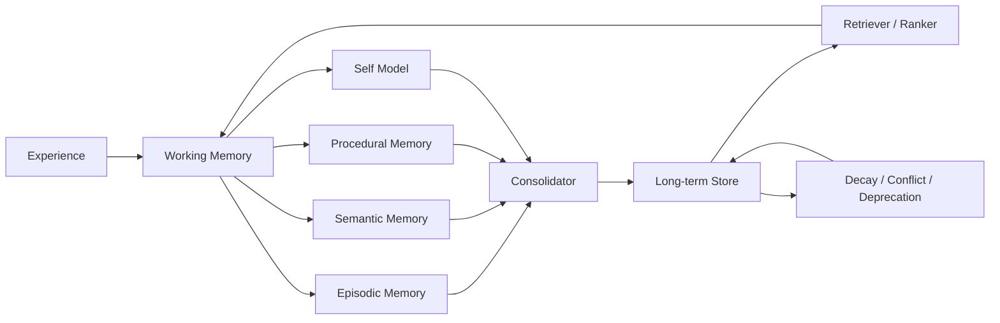

### Memory classes

**Working memory** — current task state, active observations, current plan.  
**Episodic memory** — previous runs, successes, failures, interventions.  
**Semantic memory** — stable concepts, entities, facts, relationships.  
**Procedural memory** — skills, playbooks, workflows, code templates.  
**Self memory** — Alpha's capabilities, current version, known weaknesses, resource limits, open bugs.  
**Social memory** — other agents, roles, trust/provenance, communication history.  
**Research memory** — papers, hypotheses, experiments, negative results, datasets.

### Memory record

```json
{
  "id": "mem-uuid",
  "type": "episodic|semantic|procedural|self|social|research",
  "content": "...",
  "source": "trace/task/document/tool",
  "provenance": [],
  "confidence": 0.0,
  "freshness": 0.0,
  "utility": 0.0,
  "access_count": 0,
  "created_at": "...",
  "updated_at": "...",
  "supersedes": null,
  "contradicts": [],
  "embedding": "..."
}
```

### Memory rules

1. Never silently overwrite important facts.
2. Support contradiction sets.
3. Record provenance.
4. Separate personal/task memory from global system memory.
5. Prevent untrusted text from directly modifying high-trust system memory.
6. Add decay and archival.
7. Promote repeated verified experiences into procedural skills.

MemGPT's virtual-context design is particularly relevant here: context management should act like an operating-system memory hierarchy instead of trying to place the entire history into every prompt.

---

# 10. World Model / Knowledge Graph

RAG is not enough for a highly general agent. Alpha should combine:

```text
Document Store
Vector Store
Structured DB
Knowledge Graph
Code Graph
Temporal Event Store
Research Graph
```

### Entity graph

```text
Entity
 ├── properties
 ├── relationships
 ├── temporal validity
 ├── provenance
 ├── confidence
 ├── source documents
 └── observed events
```

For software projects, add:

```text
Repository
 ├── package
 ├── module
 ├── symbol
 ├── dependency
 ├── test
 ├── issue
 ├── commit
 └── runtime trace
```

This enables Alpha to reason about the codebase as a system rather than searching files one at a time.

---

# 11. Tool and Environment Fabric

Tools should be first-class, dynamically discoverable resources.

### Tool categories

```text
SEARCH
BROWSER
FILESYSTEM
TERMINAL
POWERSHELL
BASH
WSL
GIT
GITHUB
DATABASE
HTTP/API
CODE EXECUTION
TEST RUNNER
IMAGE / AUDIO / VIDEO
COMPUTER USE
SIMULATOR
ROBOTICS
MODEL TRAINING
PACKAGE MANAGEMENT
DEPLOYMENT
MONITORING
```

### Tool contract

```yaml
name:
version:
capabilities:
input_schema:
output_schema:
permissions:
network_domains:
filesystem_scope:
side_effect_level:
timeout:
retry_policy:
verification:
```

### MCP

Use MCP as a standard tool/context boundary. Keep Alpha's internal tool interface independent of MCP so that local tools, native functions and MCP servers share one internal contract.

### A2A

Use A2A-like semantics for Alpha-to-Alpha communication. A2A is designed for agent-to-agent collaboration, including long-running tasks; its current specification also provides structured interoperability concepts over HTTP/SSE/JSON-RPC. Alpha should treat this as a transport/protocol layer rather than giving remote agents unconditional authority.

---

# 12. Browser and computer-use subsystem

For general agency, Alpha needs a safe computer interaction layer.

```text
Browser Controller
  ├── observe page
  ├── locate target
  ├── plan interaction
  ├── click/type/navigation
  ├── validate postcondition
  └── record screenshot/state

Desktop Controller
  ├── window discovery
  ├── keyboard
  ├── mouse
  ├── clipboard
  ├── application launch
  └── postcondition verification
```

Every consequential UI action should have:

- intended effect
- allowed target
- verification condition
- timeout
- rollback/compensation when possible

---

# 13. Research Scientist Loop

Alpha should include a dedicated scientific-discovery mode inspired by automated research systems such as The AI Scientist.

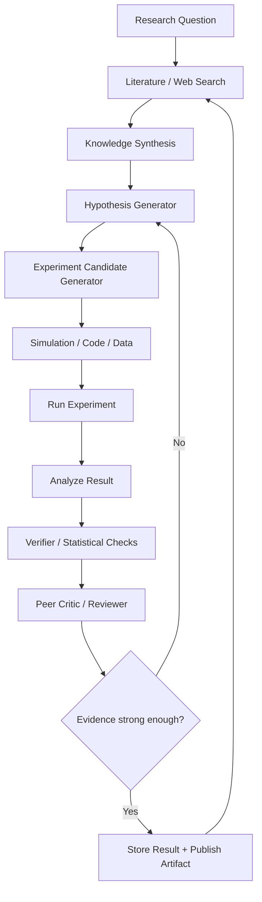

### Research artifact

Every experiment needs:

```yaml
hypothesis:
prior_evidence:
variables:
method:
code_version:
dataset_version:
random_seed:
compute_environment:
metrics:
results:
uncertainty:
negative_results:
review_comments:
reproduction_status:
```

A key principle: **negative results are first-class memory**. Otherwise Alpha will repeatedly rediscover failed strategies.

---

# 14. Coding / software-engineering cognition

This is one of the most important routes to self-improvement because Alpha's own implementation is software.

Use a dedicated coding loop:

```text
Issue / Weakness
      ↓
Repository indexing
      ↓
Architecture understanding
      ↓
Change hypothesis
      ↓
Patch candidate
      ↓
Static checks
      ↓
Unit tests
      ↓
Integration tests
      ↓
End-to-end tests
      ↓
Agent behavior evals
      ↓
Security tests
      ↓
Performance tests
      ↓
Canary
      ↓
Promote / Reject / Rollback
```

SWE-agent research demonstrates that agent-computer interface design matters substantially for autonomous software engineering. Alpha should therefore expose specialized repository navigation, editing, test and debugging tools rather than forcing all coding through generic terminal commands.

---

# 15. Recursive Self-Improvement Engine (RSI)

This is the centerpiece of the AGI/ASI-oriented design.

## 15.1 What Alpha is allowed to improve

Start with lower-risk surfaces:

```text
Tier 0: prompts / response templates
Tier 1: skills / playbooks
Tier 2: routing policies
Tier 3: planner heuristics
Tier 4: memory policies
Tier 5: evaluator suites
Tier 6: tool adapters
Tier 7: graph/workflow topology
Tier 8: application code
Tier 9: runtime optimization
Tier 10: model selection / distillation / fine-tuning pipelines
Tier 11: new algorithmic components
Tier 12: architecture search / new cognitive modules
```

Do not enable all tiers at once.

## 15.2 The RSI loop

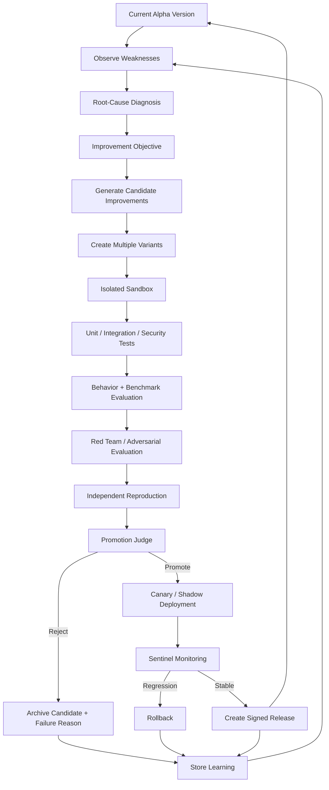

## 15.3 Candidate archive

Inspired in part by evolutionary self-improvement research, maintain an archive of variants rather than only “current version” and “previous version.”

```text
Candidate Archive
 ├── agent-v1
 ├── agent-v2
 │    ├── planner-a
 │    ├── planner-b
 │    └── memory-c
 ├── agent-v3
 └── research-branch-17
```

Each candidate contains:

```yaml
parent:
change_set:
reason:
expected_gain:
compute_cost:
benchmarks:
safety_results:
regressions:
reviewers:
promotion_decision:
```

The Darwin Gödel Machine is an important research reference because it explores iterative code modification, evaluation, and an archive of diverse agent versions rather than a single linear chain of edits. Its published experiments used sandboxing and human oversight; Alpha should adopt the same principle of isolating self-modification experiments.

---

# 16. The “improvement objective” engine

Alpha cannot optimize everything at once.

Use a vector of measurable objectives:

```text
Capability
Reliability
Task Success
Generalization
Latency
Cost
Memory Efficiency
Tool Accuracy
Planning Efficiency
Code Quality
Security
Robustness
Interpretability / Auditability
Human Escalation Quality
```

Example objective:

```yaml
objective_id: IMP-2026-042
primary_metric: end_to_end_success
secondary_metrics:
  - error_rate
  - latency
  - cost
  - security_regressions
constraints:
  max_cost_delta: +15%
  max_latency_delta: +20%
  zero_high_severity_security_regressions: true
```

This turns “self-improve” from a vague instruction into an optimization problem.

---

# 17. Evaluator Factory

A future-oriented Alpha should not only run tests; it should **create better tests**.

```text
Known task failures
      ↓
Failure classifier
      ↓
Missing capability detector
      ↓
Generate new eval cases
      ↓
Generate adversarial variants
      ↓
Add to benchmark set
      ↓
Run current + candidate versions
      ↓
Track regression
```

This is essential because a self-improving agent can otherwise learn to optimize a static benchmark.

### Eval domains

```text
1. Reasoning
2. Planning
3. Tool selection
4. Tool execution
5. Retrieval
6. Memory
7. Coding
8. Research
9. Browser/computer use
10. Multimodal perception
11. Long-horizon tasks
12. Self-correction
13. Multi-agent coordination
14. Security
15. Truthfulness / factuality
16. Robustness to prompt injection
17. Generalization to unfamiliar tasks
18. Cost/latency efficiency
19. Recovery from failures
20. Human handoff quality
```

Use both trajectory-level and end-to-end evaluation. DeepEval, Phoenix and OpenAI's agent-evaluation documentation all emphasize tracing/evaluating the agent as a system, not only grading final text.

---

# 18. Sentinel — always-on health and behavioral monitoring

Sentinel is Alpha's nervous system for reliability.

## Infrastructure signals

```text
CPU
RAM
GPU
VRAM
Disk
Network
Process uptime
Service uptime
Queue depth
Worker count
Thread count
Open files
```

## Agent signals

```text
tasks active
subagents active
tool calls/min
LLM calls/min
token usage
latency
retry rate
failure rate
loop depth
plan revision count
handoff count
memory retrieval rate
eval failure rate
```

## Behavioral anomalies

```text
repeated tool calls
repeated same answer
infinite loops
unexpected privilege request
unexpected network target
memory write burst
large code change without tests
benchmark overfitting
high disagreement among critics
sudden performance drop
```

### Sentinel flow

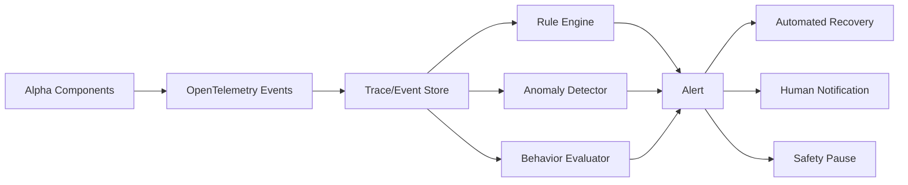

OpenTelemetry now has developing semantic conventions for GenAI agent/framework spans; Phoenix builds on OpenTelemetry/OpenInference and supports traces, datasets, experiments and agent-framework integrations. These are strong patterns for Alpha's observability layer.

---

# 19. Debugging architecture

For every task, store a hierarchical trace:

```text
TRACE task-123
│
├── EXECUTIVE
│   ├── objective
│   ├── constraints
│   └── plan versions
│
├── MODEL
│   ├── provider
│   ├── model
│   ├── prompt version
│   └── latency / token usage
│
├── AGENTS
│   ├── researcher-01
│   ├── coder-02
│   └── verifier-03
│
├── TOOLS
│   ├── search
│   ├── filesystem
│   ├── terminal
│   └── browser
│
├── MEMORY
│   ├── retrievals
│   └── writes
│
├── EVIDENCE
│   ├── sources
│   ├── tests
│   └── verification
│
└── OUTCOME
    ├── success
    ├── failures
    └── final proof
```

### Every span should expose

```text
trace_id
span_id
parent_span_id
agent_id
workflow_id
model_id
prompt_version
tool_id
input_hash
output_hash
start_time
end_time
status
error_type
retry_count
risk_class
cost
provenance
```

Do not depend on a single vendor's tracing backend. Keep the event schema portable.

---

# 20. Security and constitutional layer

A system designed for long-horizon autonomy must treat security as a core subsystem.

## 20.1 Policy hierarchy

```text
Platform Safety Rules
        ↓
Alpha Constitution
        ↓
System Policy
        ↓
Project Policy
        ↓
Agent Role Policy
        ↓
Task Policy
        ↓
Tool Permission
```

The lower layer may be more restrictive than the upper layer, never more permissive.

## 20.2 Least privilege

Each action needs:

```text
who can act?
what tool?
what resource?
what data?
what network?
what time window?
what side effect?
what verification?
```

## 20.3 High-risk action gate

Examples:

```text
delete data
publish externally
send money
change authentication
modify security controls
execute untrusted binaries
change production infrastructure
rotate credentials
modify Alpha's own safety constraints
```

The system should require explicit approval or a separately governed autonomous policy.

## 20.4 Self-modification separation

Never let the production agent directly overwrite its own running executable environment.

Instead:

```text
PRODUCTION ALPHA
      │
      │ proposal
      ▼
RESEARCH SANDBOX
      │
      ├── copy repository
      ├── copy test suite
      ├── isolated dependencies
      ├── limited network
      ├── fake credentials
      ├── synthetic data
      └── resource quotas
      │
      ▼
EVALUATION
      │
      ▼
PROMOTION SERVICE
      │
      ├── signed artifact
      ├── version pin
      ├── canary
      └── rollback
```

OWASP's Agentic Top 10 highlights risks such as goal hijacking, tool misuse, identity/privilege abuse, agentic supply-chain vulnerabilities, unexpected code execution, memory poisoning, insecure inter-agent communication, cascading failures, human-agent trust exploitation and rogue-agent behavior. Alpha should map controls directly to these categories.

NIST's Generative AI Profile should be used as a broader lifecycle risk-management reference.

---

# 21. Agent-to-agent Alpha federation

The long-term Alpha network should not require a centralized Alpha server for basic discovery.

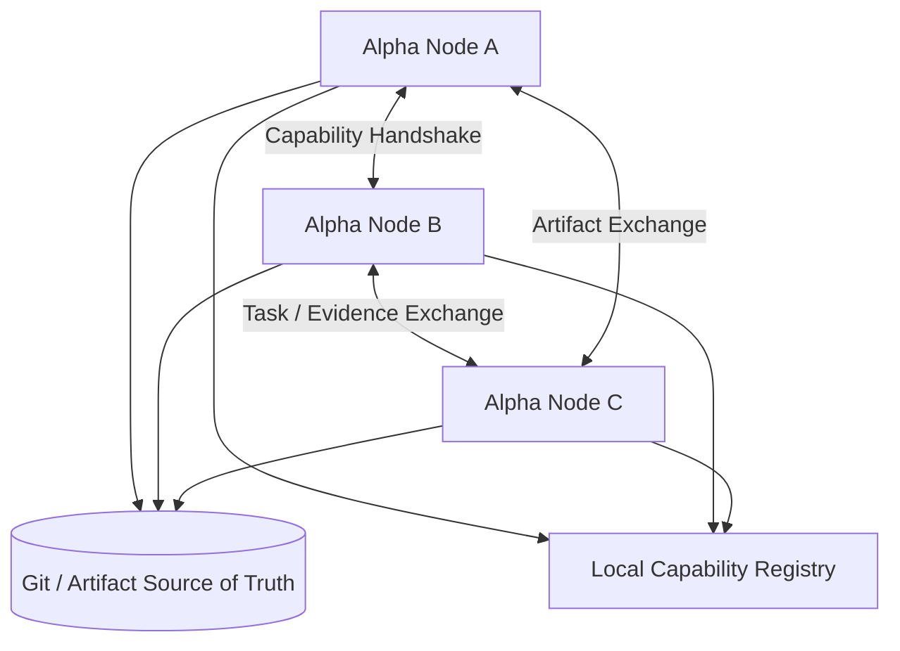

### Node identity

Each node advertises a capability card:

```json
{
  "agent_id": "alpha-node-...",
  "version": "...",
  "capabilities": ["coding", "research", "vision"],
  "tools": ["browser", "git", "python"],
  "resources": {"gpu": true, "ram_gb": 16},
  "supported_protocols": ["a2a", "mcp"],
  "task_types": ["code_review", "research"],
  "proof": "signed-capability-document"
}
```

### Discovery strategies

```text
Local broadcast / LAN discovery
mDNS / DNS-SD
GitHub repository discovery
User-provided peers
Known peer cache
Optional public registry
```

Remote agents must remain untrusted by default.

---

# 22. Global Alpha knowledge federation

Alpha instances can share:

- skills
- benchmark tasks
- bug reports
- fixes
- tool adapters
- research notes
- verified procedures
- model routing data
- evaluation results
- candidate improvements

They should **not** automatically share:

- raw credentials
- private user data
- unrestricted memory dumps
- secrets
- private files
- access tokens
- unreviewed safety-policy changes

### Artifact flow

```text
Alpha A finds bug
   ↓
reproduce
   ↓
create issue + minimized testcase
   ↓
generate patch
   ↓
run tests
   ↓
open agent-generated PR
   ↓
Alpha B/C independently review
   ↓
CI + security checks
   ↓
merge
   ↓
new release
   ↓
Alpha instances update
   ↓
post-update verification
```

This matches the earlier Alpha goal of using GitHub as the source of truth while allowing multiple machines to participate in testing and improvement.

---

# 23. Model layer: provider and model council

Alpha must not be architecturally tied to one model.

```text
                    MODEL ROUTER
                         │
         ┌───────────────┼────────────────┐
         │               │                │
     FAST MODEL       DEEP MODEL       LOCAL MODEL
         │               │                │
      cheap            reasoning        offline

                    MODEL COUNCIL
             ┌──────────┼───────────┐
             │          │           │
          proposer   critic      verifier
```

### Routing signals

```text
task type
complexity
context size
required modality
latency budget
cost budget
model reliability
current provider health
local/offline requirement
security class
```

### Council pattern

Use diversity where it matters:

```text
Independent candidates
        ↓
Cross-critique
        ↓
Verifier
        ↓
Evidence-based selection
```

Mixture-of-Agents research provides evidence that combining multiple agent outputs in layered structures can improve aggregate performance on some benchmarks, but Alpha must validate whether the extra inference cost is justified for each task class.

---

# 24. Training and model-improvement layer

Agent-level self-improvement and model-level self-improvement are different.

## Agent-level

Can start immediately:

- prompts
- workflows
- tools
- memory
- routing
- skills
- evaluators
- code

## Model-level

Requires much more infrastructure:

```text
Dataset creation
      ↓
Synthetic task generation
      ↓
Quality filtering
      ↓
Training / fine-tuning
      ↓
Alignment / preference optimization
      ↓
Evaluation
      ↓
Red teaming
      ↓
Deployment
```

For Alpha's current hardware profile, prioritize agent/runtime optimization first. Model training should be a separate research workload executed only when resources and evaluation quality justify it.

---

# 25. Self-play and environment generation

One route toward stronger general problem-solving is to create environments in which Alpha can practice.

```text
Environment Generator
        ↓
Task Generator
        ↓
Agent Attempts
        ↓
Verifier / Reward
        ↓
Harder Task Generator
        ↓
Repeat
```

Environment classes:

```text
coding sandbox
web sandbox
logic puzzles
software maintenance
research simulation
data-analysis tasks
games
workflow simulations
robotics simulation
multi-agent negotiation
```

The system should generate **new tasks**, not only repeat a fixed benchmark.

---

# 26. Generalization engine

Benchmarks can be gamed. Alpha therefore needs a generalization protocol.

For every improvement:

```text
Known benchmark
      +
Held-out benchmark
      +
Generated benchmark
      +
Adversarial benchmark
      +
Real-world task sample
      +
Cross-domain task sample
```

Then calculate a capability profile instead of one score.

```text
Reasoning:        strong / weak / unknown
Planning:         strong / weak / unknown
Coding:           strong / weak / unknown
Research:         strong / weak / unknown
Memory:           strong / weak / unknown
Tool use:         strong / weak / unknown
Generalization:   strong / weak / unknown
Safety:           acceptable / blocked / unknown
```

This is more informative than claiming “Alpha is AGI.”

---

# 27. AGI capability measurement plan

Google DeepMind's Levels of AGI framework separates performance, breadth/generalization and autonomy, which is a useful way to structure Alpha's evaluation rather than treating AGI as a single binary property.

Alpha should track at least these dimensions:

```text
BREADTH
  number of domains handled

DEPTH
  difficulty reached within each domain

AUTONOMY
  how much uninterrupted work can be completed

GENERALIZATION
  performance on novel task families

ADAPTATION
  ability to learn new tools / rules / environments

TRANSFER
  whether skills learned in one domain help another

RELIABILITY
  success consistency across repeated runs

EFFICIENCY
  compute, time and cost per successful task
```

### Suggested internal progression

```text
Stage 0 — Tool-using assistant
Stage 1 — Reliable multi-step agent
Stage 2 — Long-horizon agent
Stage 3 — Generalist problem solver
Stage 4 — Multi-agent organization
Stage 5 — Research-capable agent
Stage 6 — Agent that improves its own software
Stage 7 — Open-ended research + self-improvement
Stage 8 — Broad, robust, highly autonomous system
Stage 9 — Frontier research state; AGI/ASI status remains an external empirical question
```

Do not label a stage as “ASI” based only on benchmark performance. The claim must be supported by broad independent evaluation.

---

# 28. Benchmark portfolio

Alpha's evaluation harness should maintain several benchmark families.

### General reasoning

ARC-AGI-1 and ARC-AGI-2 are useful for testing abstract reasoning and generalization to novel tasks. ARC-AGI-2 was created specifically to provide a stronger signal for fluid-intelligence-style reasoning; its public discussion also emphasizes that high scores require new methods, not simply scale.

### Software engineering

SWE-bench / SWE-bench Verified and related software-engineering tasks test the ability to operate on real codebases and satisfy issue-level success criteria.

### Agent task horizon

METR's time-horizon measurements provide a way to think about the duration of tasks an agent can reliably complete, while stressing that this is a task-difficulty measure, not a literal prediction of uninterrupted autonomy.

### Agentic evaluation

Use trajectory-based tests for:

- tool selection
- tool arguments
- delegation
- recovery
- policy compliance
- memory use
- planning
- final outcome

### Internal Alpha benchmarks

Create an `alpha-evals/` repository with:

```text
planning/
reasoning/
coding/
research/
memory/
tools/
browser/
multimodal/
long_horizon/
self_improvement/
security/
federation/
regression/
```

Every merged capability should add at least one regression test.

---

# 29. AGI/ASI-oriented capability graph

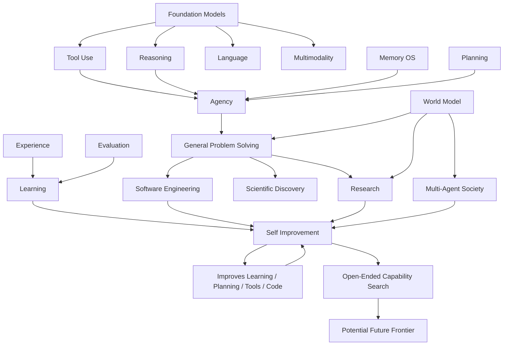

---

# 30. “ASI flywheel” architecture

The most important system-level loop is:

```text
                    ┌────────────────────┐
                    │  Real-world tasks  │
                    └──────────┬─────────┘
                               ↓
                    ┌────────────────────┐
                    │ Experience + data  │
                    └──────────┬─────────┘
                               ↓
                    ┌────────────────────┐
                    │ Failure discovery  │
                    └──────────┬─────────┘
                               ↓
                    ┌────────────────────┐
                    │ Hypothesis/ideas   │
                    └──────────┬─────────┘
                               ↓
                    ┌────────────────────┐
                    │ Candidate changes  │
                    └──────────┬─────────┘
                               ↓
                    ┌────────────────────┐
                    │ Sandbox experiments│
                    └──────────┬─────────┘
                               ↓
                    ┌────────────────────┐
                    │ Evaluation/review  │
                    └──────────┬─────────┘
                               ↓
                    ┌────────────────────┐
                    │ Verified improvement│
                    └──────────┬─────────┘
                               ↓
                    ┌────────────────────┐
                    │ New Alpha version  │
                    └──────────┬─────────┘
                               │
                               └──────────────→ more capable tasks
```

The engineering problem is therefore not “make Alpha rewrite itself.” It is “build an evidence-driven improvement factory that can safely discover and validate changes faster than humans can manually engineer every iteration.”

---

# 31. Three independent improvement loops

Never allow a single judge to decide Alpha's evolution.

## Loop A — Capability improvement

```text
candidate → task evals → capability benchmark
```

## Loop B — Safety improvement

```text
candidate → red team → security benchmark → policy checks
```

## Loop C — Reliability improvement

```text
candidate → soak test → fault injection → recovery test
```

Promotion requires all three.

---

# 32. Fault injection and chaos testing

Alpha should deliberately break itself in the sandbox.

Inject:

```text
LLM timeout
wrong model response
invalid tool output
network outage
database outage
memory corruption simulation
worker crash
partial result
duplicate event
stale state
malformed MCP response
malicious tool description
prompt injection
agent disagreement
infinite loop
resource exhaustion
```

Then measure whether Alpha:

1. detects the fault
2. records it
3. contains the fault
4. retries safely
5. chooses a fallback path
6. preserves state
7. avoids duplicate side effects
8. resumes correctly
9. notifies the user/Sentinel
10. learns a regression test

---

# 33. Long-running autonomy architecture

Long tasks should be resumable after every major transition.

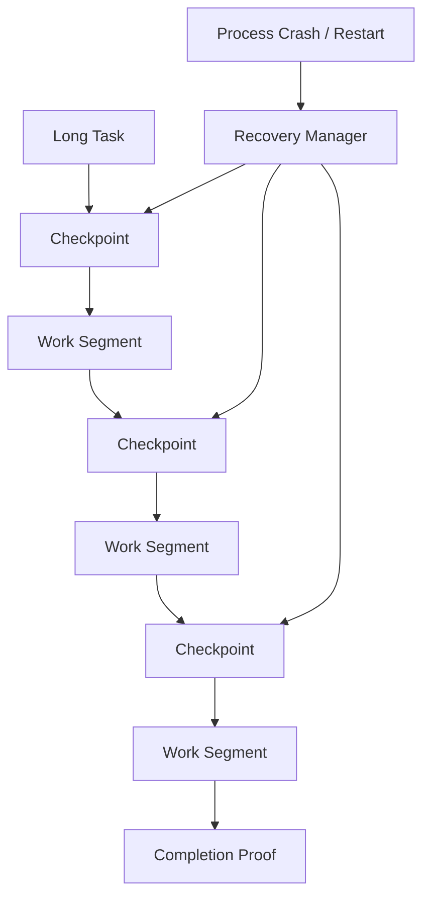

Use durable state for:

- current graph position
- active subagents
- tool reservations
- outputs
- evidence
- retry counters
- approvals
- time budgets
- evaluation status

This is critical for Alpha's 24/7 operation goal.

---

# 34. Completion-proof system

A task should produce a **proof-of-completion bundle**.

Example:

```yaml
status: completed
objective: "Fix CRM agent bug"
claims:
  - "Bug reproduced"
  - "Root cause identified"
  - "Patch applied"
  - "Unit tests pass"
  - "Integration tests pass"
  - "Regression test added"
  - "No new high-severity security finding"
artifacts:
  - commit_sha
  - test_report
  - trace_id
  - evaluator_run_id
```

If proof is incomplete, Alpha should use `partial` or `blocked`, not `completed`.

---

# 35. Self-awareness / self-model

Alpha needs a machine-readable self-model.

```yaml
alpha:
  version: 0.0.0
  runtime_status: healthy
  capabilities:
    - coding
    - browser
    - research
  weak_areas:
    - long_horizon_planning
  known_bugs: []
  active_experiments: []
  current_limits:
    ram_gb: 8
    network: online
  trusted_artifacts: []
  last_eval: ...
```

The self-model should be empirical. Never let the model simply declare itself capable of something without corresponding evidence.

---

# 36. Metacognitive controller

Alpha's metacognition should decide:

```text
Do I know enough?
Do I need another source?
Do I need another agent?
Should I use a stronger model?
Should I test this?
Should I simulate it?
Is the current evidence contradictory?
Is the task too risky to do autonomously?
Should I spend more compute?
Should I stop?
```

### Compute allocation

Use an adaptive budget:

```text
Task difficulty ↑  → reasoning budget ↑
Uncertainty ↑      → verification budget ↑
Risk ↑             → approval/review ↑
Confidence ↑       → compute may ↓
Time pressure ↑    → fast path
```

This turns inference-time compute into a controllable resource.

---

# 37. Knowledge acquisition engine

Alpha should be able to learn a new domain systematically:

```text
Unknown domain
    ↓
Discover terminology
    ↓
Find primary sources
    ↓
Build concept map
    ↓
Extract entities/relations
    ↓
Test understanding
    ↓
Create domain skill
    ↓
Run benchmark
    ↓
Promote skill
```

For web research, Alpha should preserve source URLs, timestamps, snippets, claims, counterclaims, confidence and retrieval context.

---

# 38. Skill compiler

Repeated successful behavior should be compiled into skills.

```text
Many successful trajectories
            ↓
Pattern detector
            ↓
Generalized procedure
            ↓
Skill definition
            ↓
Skill tests
            ↓
Skill package
            ↓
Registry
```

Skill package format:

```text
skills/<skill-name>/
  SKILL.md
  schema.json
  examples/
  tests/
  evals/
  version.json
```

The existing Alpha preference for `SKILL.md`/objective-contract style documentation fits naturally into this layer.

---

# 39. Prompt/program compiler

Treat prompts as programs with versioning.

```text
Prompt
 ├── inputs
 ├── constraints
 ├── tool policy
 ├── memory policy
 ├── output schema
 ├── evaluation suite
 └── version
```

Alpha can generate prompt candidates and optimize them against held-out tasks.

DSPy-style program optimization is relevant here because it treats LM pipelines as declarative programs that can be systematically optimized rather than manually tuned forever.

---

# 40. Architecture search layer

At later stages, Alpha should be able to propose new module graphs.

```text
Current architecture
        ↓
Performance bottleneck
        ↓
Generate architecture hypotheses
        ↓
Compose modules
        ↓
Instantiate sandbox
        ↓
Run benchmark suite
        ↓
Compare capability/cost/safety
        ↓
Keep non-dominated candidates
```

This is conceptually closer to evolutionary architecture search than simple code editing.

Do not allow the production architecture to be replaced directly by the model. Promotion remains an external runtime decision.

---

# 41. Non-dominated candidate archive

Use Pareto-style selection instead of a single scalar when evaluating large changes.

```text
Candidate A: better quality, more cost
Candidate B: slightly lower quality, much cheaper
Candidate C: same quality, safer
Candidate D: faster, but less robust
```

Keep multiple candidates for later experimentation.

This is especially useful for model routing, planner design and tool orchestration.

---

# 42. Continuous integration for intelligence

Alpha's CI should become:

```text
Code CI
+ Agent CI
+ Eval CI
+ Security CI
+ Memory CI
+ Tool CI
+ Model compatibility CI
+ Performance CI
```

A pull request should fail when:

```text
unit tests fail
integration tests fail
e2e tests fail
agent success regresses
security regression introduced
memory poisoning test fails
tool contract breaks
trace schema breaks
migration unsafe
```

---

# 43. Release engineering

Use signed immutable releases:

```text
Source commit
   ↓
Build
   ↓
Artifact hash
   ↓
Test
   ↓
Eval
   ↓
Security scan
   ↓
Sign
   ↓
Canary
   ↓
Promote
```

The production runtime should support:

- rollback to previous version
- last-known-good version
- automatic restart
- health checks
- watchdog
- update scheduling
- migration safety
- state compatibility

This aligns directly with the Alpha Windows-first reliability work already identified.

---

# 44. Suggested Alpha repository architecture

```text
alpha/
├── apps/
│   ├── desktop/
│   ├── gateway/
│   └── dashboard/
│
├── alpha_core/
│   ├── executive/
│   ├── planning/
│   ├── reasoning/
│   ├── metacognition/
│   ├── completion/
│   └── policies/
│
├── runtime/
│   ├── langgraph/
│   ├── deepagents/
│   ├── checkpoints/
│   ├── scheduler/
│   └── recovery/
│
├── agents/
│   ├── researcher/
│   ├── coder/
│   ├── reviewer/
│   ├── scientist/
│   ├── browser/
│   ├── sysadmin/
│   └── sentinel/
│
├── memory/
│   ├── working/
│   ├── episodic/
│   ├── semantic/
│   ├── procedural/
│   ├── research/
│   └── federation/
│
├── knowledge/
│   ├── vector/
│   ├── graph/
│   ├── docs/
│   └── code_index/
│
├── tools/
│   ├── native/
│   ├── mcp/
│   ├── browser/
│   ├── os/
│   └── execution/
│
├── research/
│   ├── hypotheses/
│   ├── experiments/
│   ├── datasets/
│   └── papers/
│
├── rsi/
│   ├── proposer/
│   ├── sandbox/
│   ├── candidate_archive/
│   ├── evaluator/
│   ├── promotion/
│   └── rollback/
│
├── evals/
│   ├── reasoning/
│   ├── coding/
│   ├── research/
│   ├── long_horizon/
│   ├── multi_agent/
│   ├── security/
│   └── regression/
│
├── sentinel/
│   ├── health/
│   ├── alerts/
│   ├── anomalies/
│   ├── recovery/
│   └── watchdog/
│
├── security/
│   ├── policy/
│   ├── permissions/
│   ├── sandbox/
│   ├── secrets/
│   └── audit/
│
├── federation/
│   ├── discovery/
│   ├── a2a/
│   ├── artifact_sync/
│   └── trust/
│
├── protocols/
│   ├── events/
│   ├── tool_contracts/
│   └── agent_contracts/
│
└── docs/
    ├── architecture/
    ├── operations/
    ├── security/
    └── research/
```

---

# 45. Core interfaces

A stable internal API matters more than any individual framework.

```python
class Agent:
    async def run(self, task: TaskEnvelope) -> AgentResult: ...

class Planner:
    async def plan(self, task: TaskEnvelope, state: State) -> Plan: ...

class Memory:
    async def retrieve(self, query: MemoryQuery) -> list[MemoryItem]: ...
    async def write(self, item: MemoryItem) -> None: ...

class Tool:
    async def execute(self, call: ToolCall) -> ToolResult: ...

class Evaluator:
    async def evaluate(self, run: Run) -> Evaluation: ...

class Improver:
    async def propose(self, diagnosis: Diagnosis) -> list[Candidate]: ...

class PromotionGate:
    async def decide(self, candidate: Candidate, evals: list[Evaluation]) -> Decision: ...

class Sentinel:
    async def observe(self, event: Event) -> None: ...
```

The exact implementation can evolve without rewriting the whole architecture.

---

# 46. Data model

The minimum persistent entities:

```text
Agent
Task
Run
Plan
Subgoal
Observation
ToolCall
ToolResult
Memory
Evidence
Hypothesis
Experiment
Evaluation
Benchmark
Failure
Diagnosis
Candidate
Artifact
Version
Policy
Permission
Alert
Release
Peer
```

Use immutable event history plus materialized current state.

---

# 47. Data flow for a normal task

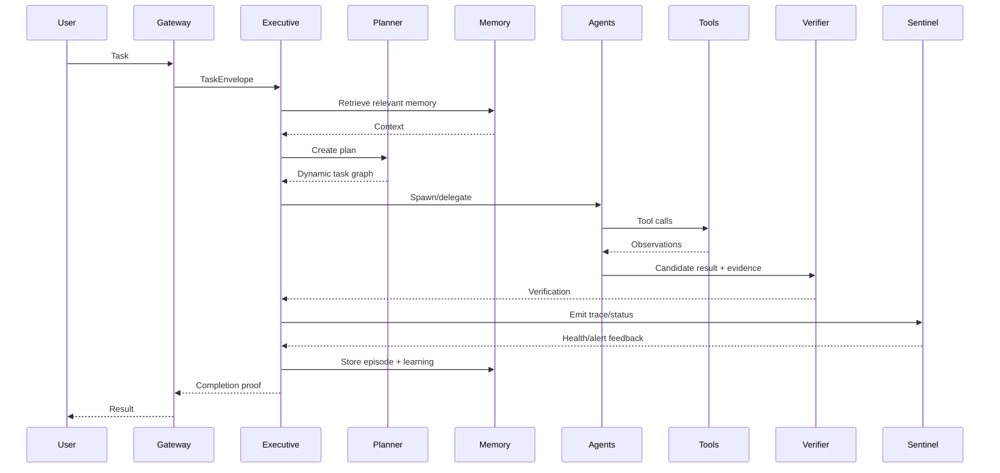

---

# 48. Data flow for self-improvement

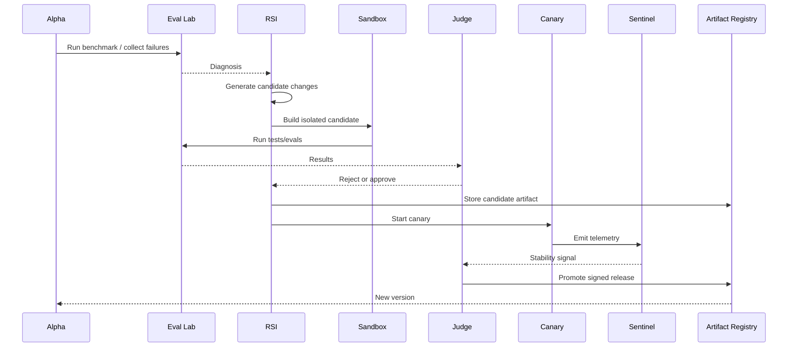

---

# 49. Research data flywheel

```text
Tasks
  ↓
Traces
  ↓
Failure clusters
  ↓
Synthetic test generation
  ↓
New benchmark cases
  ↓
Candidate experiments
  ↓
Verified improvements
  ↓
New skills + new tools + new code
  ↓
Better Alpha
  ↓
More capable task collection
  ↺
```

The flywheel is only valuable if evaluation remains independent enough to prevent self-confirming errors.

---

# 50. Independence and anti-self-deception mechanisms

A self-improving agent can fool itself. Alpha therefore needs independent evaluation channels.

### Minimum independence

```text
Proposer ≠ Primary evaluator
Primary evaluator ≠ Promotion judge
Promotion judge ≠ Security red team
```

### Stronger independence

Use:

```text
different prompts
multiple models
held-out datasets
separate evaluator code
frozen private benchmarks
human review for high-impact changes
```

The evaluator should be harder to manipulate than the system being evaluated.

---

# 51. Prevent benchmark overfitting

Alpha should continuously mutate evaluation tasks.

```text
Seed task
  ↓
Paraphrase
  ↓
Change domain
  ↓
Change tool constraints
  ↓
Hide key assumptions
  ↓
Add distractors
  ↓
Generate adversarial version
  ↓
Generate unseen test
```

The system should track performance on:

- seen
- held-out
- generated
- adversarial
- live

A large gain only on seen tasks should not count as general intelligence progress.

---

# 52. Embodied / physical-world extension

If Alpha later controls robots or IoT, use a separate embodiment layer.

```text
Alpha Cognitive Core
      ↓
Embodiment Planner
      ↓
Perception
      ↓
World State
      ↓
Motion / Action Planner
      ↓
Controller
      ↓
Physical Environment
      ↓
Sensors
      ↓
World State
```

This allows the same cognitive architecture to control a digital environment, simulated robot, or physical robot while keeping safety-critical controllers isolated.

---

# 53. Organization-level autonomy (“AVO-style” layer)

The term **AVO** is not a single standardized AGI capability framework. If the intended concept is an autonomous virtual organization, model it as a higher-level organizational layer.

```text
Alpha CEO / Executive
       ↓
Objectives / Strategy
       ↓
Departments
       ├── Research
       ├── Engineering
       ├── QA
       ├── Security
       ├── Operations
       ├── Product
       └── Knowledge
       ↓
Teams
       ↓
Agents
       ↓
Tasks
       ↓
Artifacts / Results
```

Capabilities:

- project creation
- role assignment
- budgets
- schedules
- staffing
- capability discovery
- performance reports
- organizational memory
- cross-team coordination
- failure reassignment
- internal audits

This connects directly to Alpha's company/agency/group architecture direction.

---

# 54. The Alpha “cognitive OS” stack

```text
┌────────────────────────────────────────────────────────────┐
│ USER / ENVIRONMENT / OTHER AGENTS                         │
├────────────────────────────────────────────────────────────┤
│ INTERACTION LAYER                                         │
│ chat • desktop • voice • web • APIs • schedules           │
├────────────────────────────────────────────────────────────┤
│ EXECUTIVE LAYER                                           │
│ goals • priorities • budgets • completion proof           │
├────────────────────────────────────────────────────────────┤
│ COGNITION LAYER                                           │
│ reasoning • planning • metacognition • world model       │
├────────────────────────────────────────────────────────────┤
│ AGENT SOCIETY                                              │
│ specialists • teams • debate • delegation • federation   │
├────────────────────────────────────────────────────────────┤
│ MEMORY OS                                                  │
│ working • episodic • semantic • procedural • research     │
├────────────────────────────────────────────────────────────┤
│ TOOL / ENVIRONMENT OS                                     │
│ MCP • browser • terminal • code • DB • APIs              │
├────────────────────────────────────────────────────────────┤
│ LEARNING ENGINE                                            │
│ reflection • feedback • skill compilation • curricula    │
├────────────────────────────────────────────────────────────┤
│ RSI / RESEARCH ENGINE                                      │
│ hypothesis • candidate • sandbox • eval • promotion       │
├────────────────────────────────────────────────────────────┤
│ EVAL / SENTINEL                                            │
│ traces • benchmarks • alerts • anomaly detection          │
├────────────────────────────────────────────────────────────┤
│ SAFETY / TRUST                                              │
│ permissions • sandbox • policy • audit • rollback        │
├────────────────────────────────────────────────────────────┤
│ RUNTIME                                                    │
│ LangGraph • Deep Agents • workers • checkpoints           │
├────────────────────────────────────────────────────────────┤
│ MODEL LAYER                                                │
│ local • cloud • reasoning • multimodal • council         │
└────────────────────────────────────────────────────────────┘
```

---

# 55. Implementation roadmap for Alpha

The roadmap should build capability in increasing order of architectural risk.

## Phase 0 — Runtime reliability

Implement first:

- Windows service/watchdog
- health endpoints
- persistent checkpoints
- structured logs
- event IDs
- crash recovery
- explicit failure states
- update/rollback
- Sentinel

**Exit condition:** Alpha can restart itself and resume unfinished work without silent corruption.

## Phase 1 — Strong single-agent loop

Implement:

- Executive
- planner
- dynamic graph
- verification
- completion proof
- tool registry
- model router

**Exit condition:** deterministic replay of representative tasks.

## Phase 2 — Memory OS

Implement:

- working memory
- episodic memory
- semantic memory
- procedural skills
- consolidation
- provenance
- contradiction handling

**Exit condition:** Alpha can use previous experience to improve repeated tasks.

## Phase 3 — Multi-agent organization

Implement:

- subagent profiles
- isolated contexts
- hierarchy
- delegation
- debate
- parallelism
- task marketplace/dispatcher

**Exit condition:** multi-agent mode must beat or match single-agent mode on selected benchmarks at a justified compute cost.

## Phase 4 — Research engine

Implement:

- literature search
- source/evidence store
- hypothesis generation
- experiment runner
- review
- result memory
- negative-result memory

**Exit condition:** Alpha can independently reproduce a known research-style experiment in a sandbox.

## Phase 5 — Software self-improvement

Implement:

- repository graph
- code agent
- issue detector
- patch proposer
- test generator
- sandbox runner
- candidate archive
- canary
- rollback

**Exit condition:** Alpha can fix a bounded class of its own bugs with independently verified patches.

## Phase 6 — Evaluator Factory

Implement:

- automatic failure clustering
- generated evals
- adversarial test generation
- regression corpus
- private held-out benchmark support

**Exit condition:** every important production failure can produce a reusable regression test.

## Phase 7 — Open-ended improvement

Implement:

- candidate diversity
- architecture search
- self-play environments
- curriculum generation
- automated algorithm experiments
- cross-domain evaluation

**Exit condition:** measurable improvement across held-out tasks without direct test-set optimization.

## Phase 8 — Alpha federation

Implement:

- A2A-compatible messaging
- discovery
- capability cards
- remote task delegation
- artifact sharing
- signed releases
- trust policies

**Exit condition:** two Alpha nodes can collaborate and independently verify shared fixes.

## Phase 9 — Organization-level autonomy

Implement:

- strategic goals
- departments
- budgets
- project management
- agent staffing
- organizational memory
- multi-project scheduling

**Exit condition:** Alpha can operate a bounded software/research organization in a sandbox with explicit policies.

## Phase 10 — Frontier research platform

Investigate:

- model improvement loops
- architecture search
- world models
- multimodal agents
- simulated environments
- learned tool discovery
- curriculum generation
- more efficient inference
- automated scientific discovery

**Exit condition:** judged by independent benchmarks, external review and reproducibility rather than Alpha's own claims.

---

# 56. First 30 implementation milestones

```text
01  Event schema
02  Trace IDs everywhere
03  Persistent checkpoints
04  Sentinel service
05  Health/recovery API
06  Executive controller
07  Dynamic plan graph
08  Completion proof
09  Tool registry
10  Model router
11  Working memory
12  Episodic memory
13  Semantic memory
14  Skill registry
15  Subagent profile system
16  Isolated subagent runtime
17  Parallel orchestration
18  Verifier agent
19  Evidence ledger
20  Research loop
21  Eval runner
22  Regression corpus
23  Self-improvement proposer
24  Sandbox builder
25  Candidate archive
26  Promotion gate
27  Canary deployment
28  Rollback manager
29  Agent federation
30  Open-ended research loop
```

---

# 57. Recommended technology mapping

| Alpha subsystem | Suggested implementation | Reason |
|---|---|---|
| Stateful orchestration | LangGraph | Explicit graph/state/checkpoint model |
| Deep agent harness | Deep Agents | Planning, subagents, filesystem/context management |
| Model abstraction | LiteLLM or internal provider adapter | Avoid vendor lock-in |
| Tool protocol | MCP + native internal tool schema | Interoperability |
| Agent protocol | A2A-compatible envelope | Cross-agent collaboration |
| Memory | PostgreSQL + vector DB + object store + graph layer | Durable multi-modal memory |
| Retrieval | Hybrid BM25 + vector + reranker | Better than vector-only retrieval |
| Observability | OpenTelemetry + Phoenix/Langfuse | Portable traces and local deployment options |
| Evals | DeepEval + custom Python tests | Component and end-to-end evaluation |
| Red teaming | Promptfoo + custom security suite | Automated adversarial tests |
| Code execution | Docker/WSL sandbox | Isolation |
| Artifact source of truth | Git | Versioning and federation |
| Scheduler | APScheduler/Celery/Temporal-style durable scheduler | Long-running tasks |
| Desktop | Electron | Windows-first UI |
| Service watchdog | Windows Task Scheduler/service + health monitor | 24/7 runtime |
| Data contracts | Pydantic + JSON Schema | Typed boundaries |

This is a recommended mapping, not a mandatory dependency list.

---

# 58. Open-source observability/evaluation stack for Alpha

For a low-cost/self-hostable architecture:

```text
OpenTelemetry
      ↓
Phoenix or Langfuse
      ↓
Trace store
      ↓
DeepEval
      ↓
Promptfoo red-team suite
      ↓
Alpha custom benchmark runner
      ↓
GitHub CI
```

Phoenix is open-source/self-hostable and provides tracing, evaluations, datasets, experiments and integrations with LangGraph and other agent frameworks. Langfuse is also self-hostable and built around open-source components. DeepEval supports end-to-end, trajectory and component-level agent evaluations. Promptfoo supports evaluation and red teaming for agents and RAG systems.

---

# 59. Production observability dashboard

Alpha's dashboard should expose five views.

### View 1 — Live agents

```text
Agent ID | Role | Task | State | Model | CPU | Memory | Duration | Risk
```

### View 2 — Current task

```text
Objective
Plan
Active subgoals
Agents
Tool calls
Evidence
Warnings
Completion percentage
```

### View 3 — Sentinel

```text
Health
Failures
Retries
Loops
Resource usage
Alerts
Recovery actions
```

### View 4 — Intelligence

```text
Reasoning evals
Planning evals
Coding evals
Research evals
Memory evals
Generalization tests
```

### View 5 — RSI

```text
Candidates
Expected gain
Benchmarks
Security status
Canary status
Promotion history
Rollback history
```

---

# 60. Operational “stop conditions”

Alpha needs explicit stopping rules.

Stop a task when:

```text
success criterion satisfied
OR
risk budget exhausted
OR
resource budget exhausted
OR
loop detector triggered
OR
required evidence unavailable
OR
tool trust degraded
OR
contradictory evidence unresolved
OR
policy requires human approval
```

Stop a self-improvement candidate when:

```text
security regression
benchmark regression above threshold
unexplained behavioral change
non-reproducible improvement
unexpected network access
sandbox escape
resource overrun
promotion evidence insufficient
```

---

# 61. Research priorities after the base architecture works

The highest-leverage research areas for Alpha should be treated as experiments rather than assumed features:

### A. Better test-time reasoning

Investigate search, verification, structured decomposition, tool-grounded reasoning and adaptive compute.

### B. Better memory

Investigate retrieval policies, memory consolidation, temporal reasoning, contradiction handling and procedural skill learning.

### C. Better self-improvement

Investigate evolutionary search over workflows, prompts, tools, code and architecture; preserve candidate diversity.

### D. Better evaluators

Invest heavily in independent verification and generated benchmarks.

### E. Better environments

Build simulators in which Alpha can safely practice.

### F. Better scientific discovery

Automate hypothesis/experiment/review pipelines.

### G. Better coordination

Optimize when to use one agent, many agents, debate or independent competition.

### H. Better generalization

Test on unseen tasks and domains, not only familiar benchmarks.

---

# 62. What this architecture can and cannot establish

## It can establish

- a persistent agent runtime
- general-purpose tool use
- multi-step autonomy
- multi-agent collaboration
- durable memory
- automated research
- automated coding
- systematic evaluation
- self-debugging
- bounded self-modification
- candidate-based recursive improvement
- agent federation
- organization-level automation

## It cannot by architecture alone establish

- human-level general intelligence
- superhuman general intelligence
- consciousness
- guaranteed alignment
- guaranteed truthfulness
- guaranteed autonomous self-improvement
- guaranteed recursive intelligence explosion
- a proof that a future Alpha release is ASI

Those are empirical and scientific questions.

---

# 63. The critical architecture boundary

The most important boundary is:

```text
                 ┌────────────────────────────┐
                 │         ALPHA             │
                 │  proposes / reasons /     │
                 │  experiments / learns     │
                 └────────────┬───────────────┘
                              │
                              ▼
                 ┌────────────────────────────┐
                 │   INDEPENDENT EVALUATION   │
                 │  tests / red-team / review  │
                 └────────────┬───────────────┘
                              │
                              ▼
                 ┌────────────────────────────┐
                 │       PROMOTION GATE        │
                 │ policy + evidence + CI      │
                 └────────────┬───────────────┘
                              │
                     ┌────────┴────────┐
                     │                 │
                  PROMOTE           REJECT
                     │                 │
                     ▼                 ▼
                NEW ALPHA         ARCHIVE
```

The agent owns the **search process**; the runtime owns the **authority to change production**.

That separation should remain even as Alpha becomes much more capable.

---

# 64. Final target architecture

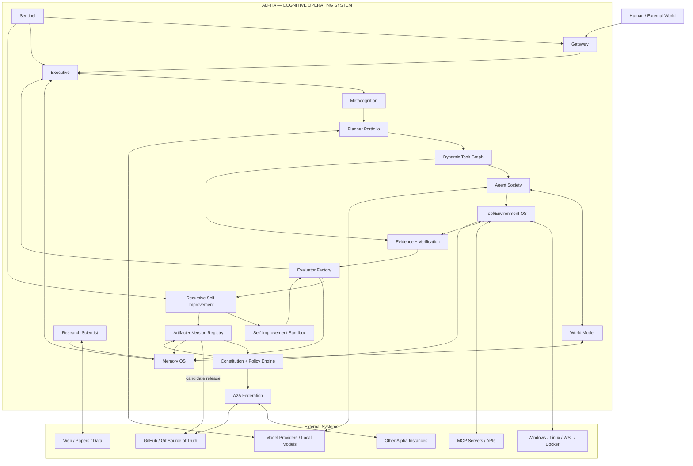

---

# 65. The complete Alpha operating cycle

For every important task:

```text
1. INGEST
   Receive task/event.

2. CLASSIFY
   Determine domain, risk, complexity, resources.

3. REMEMBER
   Retrieve relevant working/episodic/semantic/procedural memory.

4. MODEL
   Build a compact world/task state.

5. PLAN
   Choose reasoning strategy and create task graph.

6. DELEGATE
   Spawn specialists only where useful.

7. ACT
   Use tools in controlled environments.

8. OBSERVE
   Collect tool outputs and world changes.

9. VERIFY
   Test claims and postconditions.

10. REPLAN
    Repair the graph after failures/new evidence.

11. COMPLETE
    Produce proof-of-completion bundle.

12. CONSOLIDATE
    Store useful experience.

13. EVALUATE
    Measure the trajectory and outcome.

14. DIAGNOSE
    Cluster failures and identify root causes.

15. IMPROVE
    Generate candidate changes.

16. SANDBOX
    Test candidate in isolation.

17. RED-TEAM
    Attack the candidate.

18. PROMOTE
    Canary + signed release.

19. MONITOR
    Sentinel watches the new behavior.

20. FEDERATE
    Share verified artifacts with trusted peers.

21. REPEAT
    Start the next capability cycle.
```

This is the core design to implement progressively.

---

# 66. Recommended first engineering order for the current Alpha project

Given the existing Alpha direction, build in this order:

```text
A. Fix runtime/autostart/recovery
        ↓
B. Finish complete tracing + Sentinel
        ↓
C. Build Executive + completion proof
        ↓
D. Stabilize LangGraph + Deep Agents execution
        ↓
E. Build Memory OS
        ↓
F. Build dynamic subagent society
        ↓
G. Add Research Scientist mode
        ↓
H. Add Evaluator Factory
        ↓
I. Add self-debugging code agent
        ↓
J. Add RSI sandbox + candidate archive
        ↓
K. Add canary/promotion/rollback
        ↓
L. Add Alpha federation/A2A
        ↓
M. Add open-ended experiment generation
        ↓
N. Add architecture/evolution search
        ↓
O. Build external benchmark program
```

Do **not** start by making Alpha freely rewrite its production code. Build the evaluation, sandbox and promotion infrastructure first. Otherwise self-improvement becomes difficult to measure and difficult to trust.

---

# 67. Research references

The following sources were used to shape the architecture. The links are included so the engineering team can inspect the primary material directly.

1. **Google DeepMind — Levels of AGI for Operationalizing Progress on the Path to AGI (ICML 2024)**  
   https://deepmind.google/research/publications/66938/

2. **ReAct — Synergizing Reasoning and Acting in Language Models**  
   https://arxiv.org/abs/2210.03629

3. **Reflexion — Language Agents with Verbal Reinforcement Learning**  
   https://arxiv.org/abs/2303.11366

4. **Self-Refine — Iterative Refinement with Self-Feedback**  
   https://arxiv.org/abs/2303.17651

5. **MemGPT — Towards LLMs as Operating Systems**  
   https://arxiv.org/abs/2310.08560

6. **AutoGen — Enabling Next-Gen LLM Applications via Multi-Agent Conversation**  
   https://arxiv.org/abs/2308.08155

7. **Mixture-of-Agents Enhances Large Language Model Capabilities**  
   https://arxiv.org/abs/2406.04692

8. **SWE-agent — Agent-Computer Interfaces Enable Automated Software Engineering**  
   https://arxiv.org/abs/2405.15793

9. **Deep Agents — LangChain**  
   https://docs.langchain.com/oss/javascript/deepagents/overview

10. **Deep Agents architecture — LangChain**  
    https://github.com/langchain-ai/deepagents/blob/main/libs/ARCHITECTURE.md

11. **AlphaEvolve — Google DeepMind**  
    https://deepmind.google/blog/alphaevolve-a-gemini-powered-coding-agent-for-designing-advanced-algorithms/

12. **Darwin Gödel Machine — Open-Ended Evolution of Self-Improving Agents**  
    https://arxiv.org/abs/2505.22954

13. **Gödel Machines — Schmidhuber**  
    https://arxiv.org/abs/cs/0309048

14. **The AI Scientist — Sakana AI**  
    https://sakana.ai/ai-scientist/

15. **OpenAI Agents SDK / agent workflow architecture**  
    https://developers.openai.com/api/docs/guides/agents/sdk

16. **OpenAI — Evaluate agent workflows**  
    https://developers.openai.com/api/docs/guides/agent-evals

17. **OpenTelemetry — GenAI agent semantic conventions**  
    https://github.com/open-telemetry/semantic-conventions-genai/blob/main/docs/gen-ai/gen-ai-agent-spans.md

18. **Arize Phoenix — open-source AI observability/evaluation**  
    https://github.com/Arize-ai/phoenix

19. **Langfuse — self-hosting / open-source observability**  
    https://langfuse.com/self-hosting

20. **DeepEval — agent evaluation**  
    https://deepeval.com/docs/getting-started-agents

21. **Promptfoo — LLM evals and red teaming**  
    https://github.com/promptfoo/promptfoo

22. **Promptfoo — agent red teaming**  
    https://www.promptfoo.dev/docs/red-team/agents/

23. **Model Context Protocol specification**  
    https://github.com/modelcontextprotocol/modelcontextprotocol/blob/main/docs/specification/2025-11-25/basic/index.mdx

24. **A2A — Agent2Agent Protocol**  
    https://a2a-protocol.org/v1.0.0/

25. **Google — Announcing the Agent2Agent Protocol**  
    https://developers.googleblog.com/a2a-a-new-era-of-agent-interoperability/

26. **OWASP Top 10 for Agentic Applications 2026**  
    https://genai.owasp.org/resource/owasp-top-10-for-agentic-applications-for-2026/

27. **NIST AI RMF — Generative AI Profile**  
    https://www.nist.gov/publications/artificial-intelligence-risk-management-framework-generative-artificial-intelligence

28. **ARC-AGI-2 technical report / benchmark**  
    https://arcprize.org/blog/arc-agi-2-technical-report

29. **ARC Prize 2025 results**  
    https://arcprize.org/blog/arc-prize-2025-results-analysis

30. **METR — Task-Completion Time Horizons of Frontier AI Models**  
    https://metr.org/time-horizons/

31. **OpenAI — SWE-bench Verified**  
    https://openai.com/index/introducing-swe-bench-verified/

---

# 68. Final architectural thesis

The practical path for Alpha is not to hard-code a fictional “ASI module.” The engineering path is to construct a system that can:

```text
PERCEIVE
   ↓
UNDERSTAND
   ↓
REASON
   ↓
PLAN
   ↓
DELEGATE
   ↓
ACT
   ↓
OBSERVE
   ↓
VERIFY
   ↓
REMEMBER
   ↓
LEARN
   ↓
RESEARCH
   ↓
DISCOVER WEAKNESSES
   ↓
PROPOSE IMPROVEMENTS
   ↓
EXPERIMENT SAFELY
   ↓
EVALUATE INDEPENDENTLY
   ↓
PROMOTE VERIFIED IMPROVEMENTS
   ↓
MONITOR
   ↓
SHARE VERIFIED KNOWLEDGE
   ↓
REPEAT
```

The strongest architecture therefore becomes a **self-measuring, self-debugging, self-testing, self-researching, bounded self-improving cognitive operating system**.

If future models and research techniques become sufficiently capable, this architecture gives Alpha the runtime mechanisms needed to exploit those capabilities. Whether that eventually crosses any particular definition of AGI or ASI must be determined empirically from broad, independent evaluations; it cannot be guaranteed by the architecture itself.

---

## Appendix A — Minimal event schema

```json
{
  "event_id": "uuid",
  "timestamp": "2026-09-26T12:00:00Z",
  "type": "ToolResult",
  "trace_id": "trace-uuid",
  "parent_id": "span-uuid",
  "agent_id": "alpha-exec",
  "task_id": "task-uuid",
  "version": "alpha-v0.1.0",
  "risk_class": "R1",
  "payload": {},
  "status": "success|failure|partial",
  "provenance": [],
  "metrics": {
    "latency_ms": 0,
    "tokens": 0,
    "cost": 0.0
  }
}
```

## Appendix B — Minimal candidate schema

```yaml
candidate_id: RSI-2026-0001
parent_version: alpha-v0.1.0
change_type: workflow|prompt|skill|tool|code|architecture
hypothesis: "..."
expected_effect: "..."
changed_artifacts: []
required_tests: []
security_tests: []
benchmark_suite: []
sandbox: true
canary: false
status: proposed|testing|rejected|canary|promoted|rolled_back
```

## Appendix C — Minimal promotion policy

```text
PROMOTE only if:

[ ] all required tests pass
[ ] no critical security regression
[ ] held-out evaluation is non-regressive
[ ] intended metric improves or tradeoff is justified
[ ] candidate is reproducible
[ ] artifact is signed/versioned
[ ] canary remains healthy
[ ] rollback path verified
```

## Appendix D — One-line mental model

> **Alpha is not one model. Alpha is the model(s) + executive + memory + tools + agents + world model + research loop + evaluator + Sentinel + sandbox + promotion system + federated artifact network operating as one continuously evaluated cognitive runtime.**
