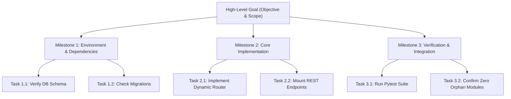
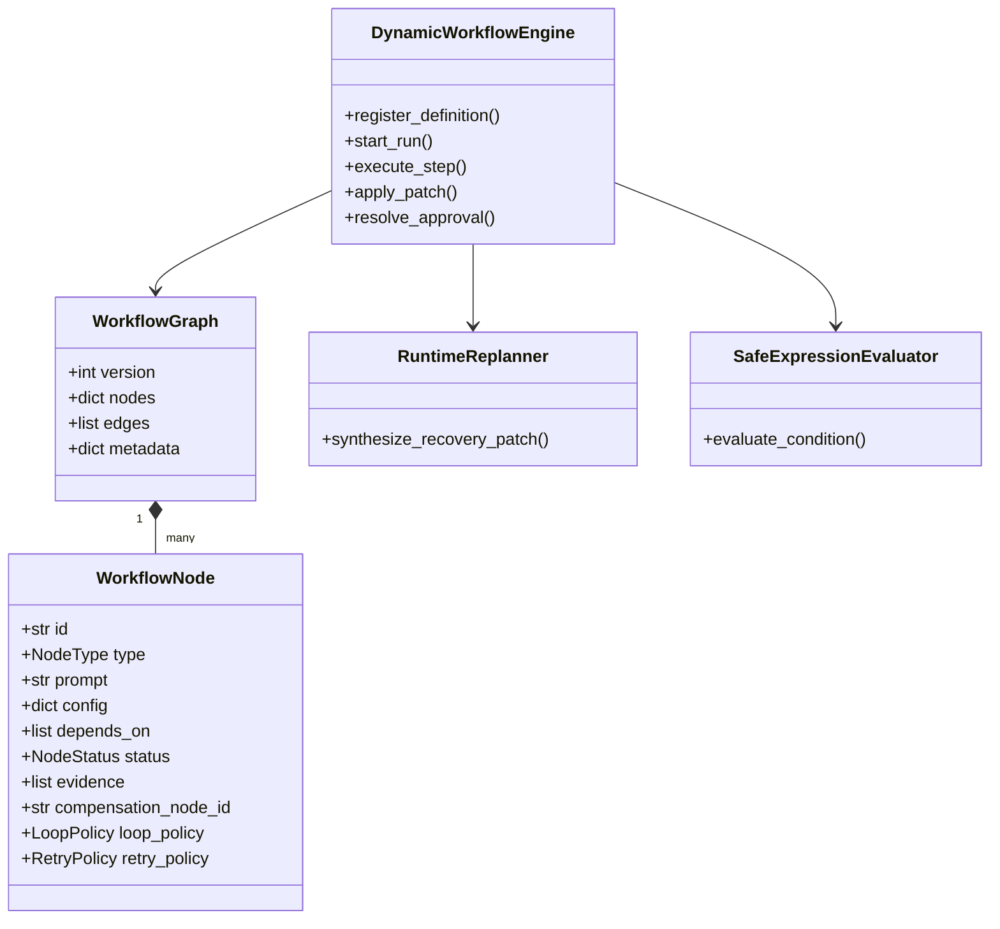

# Alpha Universal Dynamic Workflow Architecture — Master Specification & Implementation Plan

**Document:** `references/ALPHA_FULL_DYNAMIC_WORKFLOW_MASTER_PLAN.md`  
**Project:** [itsPremkumar/alpha](https://github.com/itsPremkumar/alpha)  
**Status:** Living Master Specification & Production Blueprint  
**Authors:** Alpha Core Architecture Team  
**Scope:** Complete End-to-End Dynamic Autonomous Workflow Engine, Bot Mesh, Dynamic Skills/Tools/MCP, Self-Improvement, and Goal-Driven Execution.

---

## 1. Executive Summary & Paradigm Shift

Alpha is an enterprise-grade, local-first AI super-agent platform built on top of a full-stack architecture (FastAPI Gateway, LangGraph-compatible harness, Next.js frontend, persistent cognitive memory, and per-thread sandboxes).

Historically, AI agent workflows have suffered from **rigid static graphs**: workflows were compiled once at the start of a conversation, with hardcoded sequences of steps, static bot assignments, pre-configured tools, and manual human intervention whenever an unforeseen error or capability gap emerged.

This Master Plan defines the **Alpha Universal Dynamic Autonomous Framework**: a zero-touch, goal-driven paradigm where **the user simply inputs a single prompt**, and the system dynamically and autonomously coordinates every single aspect of execution:

```
                                  USER PROMPT / TRIGGER
                                            │
                                            ▼
                    ┌───────────────────────────────────────────────┐
                    │ Universal Intent Perception & Scenario Engine │
                    └───────────────────────┬───────────────────────┘
                                            │
              ┌─────────────────────────────┼─────────────────────────────┐
              ▼                             ▼                             ▼
     Contextual Slash Commands       Goal Decomposition            Dynamic Resource
     Auto-Detection & Execution     & Dynamic To-Do List              Assembler
     (/goal, /boost, /learn, etc)    (Milestones & Verification)          │
              │                             │                             │
              └─────────────────────────────┼─────────────────────────────┘
                                            │
                                            ▼
                    ┌───────────────────────────────────────────────┐
                    │      Dynamic Workflow Engine (DWE) Runtime     │
                    │  (Wave Scheduling, Fan-Out, Race, Quorum)     │
                    └───────────────────────┬───────────────────────┘
                                            │
              ┌─────────────────────────────┼─────────────────────────────┐
              ▼                             ▼                             ▼
       Dynamic Bot Mesh             Dynamic Skill Store            Dynamic Tools &
      (Creation, Cloning,          (Search, Download,              MCP Connections
      SOUL, Memory, Models)       On-the-Fly Authoring)         (116+ Tools, Sandboxing)
              │                             │                             │
              └─────────────────────────────┼─────────────────────────────┘
                                            │
                                            ▼
                    ┌───────────────────────────────────────────────┐
                    │   Runtime Replanning & Evidence Gatekeeper    │
                    │      (Atomic Graph Mutation / Patches)        │
                    └───────────────────────┬───────────────────────┘
                                            │
              ┌─────────────────────────────┴─────────────────────────────┐
              ▼                                                           ▼
    Saga Rollback Compensation                                Continuous Learning & Evolution
     (Zero Uncommitted State)                                 (StrategyMemory, Bot Breeding,
                                                               Cognitive Memory Consolidation)
```

### Core Architectural Axiom:
> **"LLMs Propose, Deterministic Runtime Decides and Enforces."**  
> Large Language Models synthesize goals, suggest bot configurations, draft code, and generate workflow patches. However, graph invariants, acyclicity, authorization, state transitions, sandbox boundaries, and safety policies are strictly enforced by deterministic Python runtime engines.

---

## 2. Universal Prompt Ingestion & Intent Perception

When an end-user or external channel (Slack, Feishu, Telegram, Discord, REST API) provides a prompt, the system passes it through the **Universal Intent Perception Pipeline** before dispatching any work:

### 2.1 Multi-Dimensional Intent Classifier
1. **Domain Detection**:
   - Software Engineering (Frontend, Backend, Database, Cloud/DevOps, Security, Testing).
   - Deep Research & Market Intelligence (Evidence synthesis, multi-source validation).
   - System Diagnostics & Self-Healing (Log analysis, stack trace debugging, performance triage).
   - Recursive Self-Improvement (Prompt tuning, tool evaluation, benchmark verification).
2. **Complexity & Execution Mode**:
   - `DIRECT_RESPONSE`: One-turn response (clarifications, simple queries).
   - `STRUCTURED_PLAN`: Multi-step task requiring human-aligned planning mode.
   - `AUTONOMOUS_SWARM`: Long-running goal requiring multi-agent delegation, workgroup creation, and asynchronous wave scheduling.
   - `RECURRING_AUTOMATION`: Scheduled cron or daemon monitoring task.
3. **Cognitive Thinking Mode**:
   - Dynamically adjusts reasoning budget (`flash` light model for fast routing vs. `pro` reasoning model for architectural decisions).
   - Injects relevant episodic context and user preferences from cognitive memory.

### 2.2 Automatic Contextual Slash Command Resolution
Instead of requiring the user to memorize and type slash commands, the system automatically detects scenarios that benefit from specialized runtime modes and triggers them seamlessly:

| Trigger Scenario / Prompt Signal | Auto-Resolved Slash Command | Runtime Behavior |
|---|---|---|
| User asks for deep, multi-angle research or complex problem solving | `/boost` | Activates multi-perspective deep reasoning and exhaustive verification rounds. |
| User requests long-running, overnight, or multi-day goal completion | `/goal` | Initializes durable goal state, non-interactive execution, and persistent milestone tracking. |
| User specifies a time interval, recurrence, or monitoring loop | `/schedule` | Mounts a durable cron job or one-shot background timer via `alpha.scheduler`. |
| Ambiguous requirements, architectural trade-offs, or risky migrations | `/grill-me` | Triggers an interactive clarification interview to lock down constraints before writing code. |
| Complex enterprise project requiring multiple specialist roles | `/teamwork-preview` | Automatically drafts a bot roster and multi-agent coordination plan. |
| User corrects the agent or fixes an unexpected runtime failure | `/learn` | Extracts failure pattern, updates `StrategyMemory`, and triggers skill curation. |
| Test failure, lint breakdown, or regression detected | `/self-heal` & `/verify` | Invokes automated AST repair loops and canary sandboxing. |

---

## 3. Goal-Oriented Dynamic Task & To-Do List Engine

Alpha implements a **Goal-Driven Task Hierarchy** that translates high-level objectives into granular, verifiable execution units.



### 3.1 Dynamic To-Do List State Machine
Every task in the dynamically generated to-do list adheres to a strict state machine:
- `PENDING`: Initialized, waiting for prerequisites.
- `READY`: All dependency tasks have succeeded; scheduled for current wave.
- `IN_PROGRESS`: Assigned to an active Bot or Tool runner with an active lease.
- `BLOCKED`: A prerequisite failed or an explicit human approval is pending.
- `COMPLETED`: Verified with non-empty cryptographic or execution evidence.
- `COMPENSATING`: Upstream failure triggered automatic rollback of this task's side-effects.

### 3.2 Durable Storage & Synchronization
Tasks and milestones are persisted under `runtime_home()/projects/{project_id}/`:
- `goals.json`: Active goals, success criteria, and completion percentages.
- `tasks.json`: Decomposed tasks, assigned bot names, and evidence links.
- `decisions.json`: Key architectural trade-offs and rationale logged during execution.

---

## 4. Dynamic Bot Ecosystem: Creation, Cloning, Forking & Breeding

Alpha's Workforce layer is not limited to pre-configured bots. The system can dynamically synthesize, specialize, and evolve bots on-the-fly.

```
                    ┌───────────────────────────────┐
                    │    Base Bot / Template Catalog │
                    │   (Architect, Coder, Reviewer)│
                    └───────────────┬───────────────┘
                                    │
                                    ▼
                    ┌───────────────────────────────┐
                    │        BotCloneEngine         │
                    └───────┬───────────────┬───────┘
                            │               │
            ┌───────────────┘               └───────────────┐
            ▼                                               ▼
┌───────────────────────────────┐               ┌───────────────────────────────┐
│     Specialist Fork (TTL)     │               │    Evolutionary Breeding      │
│ - Task-specific SOUL Directive│               │ - Generation N+1 Versioning   │
│ - Scoped Domain Skills        │               │ - Merged Strategy Heuristics  │
│ - Ephemeral Memory Namespace  │               │ - Higher Reputation Threshold │
│ - Auto-archived after task    │               │ - Promoted to Permanent Roster│
└───────────────────────────────┘               └───────────────────────────────┘
```

### 4.1 Bot Cloning Modes (`alpha.bots.cloning`)
1. **`EXACT_COPY`**:
   - Duplicates base bot profile (tools, skills, model).
   - Allocates a completely isolated memory scope (`memory_scope = new_name`) and fresh scratchpad to prevent state contamination.
2. **`SPECIALIST_FORK`**:
   - Takes a parent bot (e.g. `lead_dev`) and appends a hyper-focused **Mission Directive** to its `SOUL.md`.
   - Injects specialized domain skills (e.g., `postgresql`, `k8s-helm`, `ast-patching`).
   - Provisions an **Ephemeral Lease** via `EphemeralBotManager` with a finite TTL (e.g., 3600s). Once the workflow completes, the temporary specialist is automatically archived.
3. **`ENHANCED_MUTATION`**:
   - Evolves bot capabilities across generations (`bot_v1` -> `bot_v2`).
   - Incorporates successful prompt heuristics learned from previous retrospective cycles.
   - Adjusts model tier (e.g. upgrading from lightweight model to frontier reasoning model for tough edge cases).

### 4.2 Dynamic SOUL Generation
Every dynamically provisioned bot receives a dynamically synthesized `SOUL.md` containing:
- **Identity & Persona**: Role name, seniority, technical philosophy.
- **Operational Boundaries**: What the bot is strictly allowed and forbidden to touch.
- **Evidence & Verification Standards**: Exact test commands and verification criteria required before marking a turn as successful.
- **Communication Protocol**: Tone, format, and handoff conventions with peer bots.

---

## 5. Dynamic Swarm Allocation, Groups & Multi-Agent Projects

When a complex goal demands multiple collaborating personas, Alpha automatically instantiates a **Dynamic Workgroup / Project**:

### 5.1 Dynamic Workgroup Formation
1. **Roster Synthesis**: The system analyzes the goal and selects/clones the optimal team (e.g. Architect + Backend Coder + Security Auditor + QA Specialist).
2. **Project Constitution**: Generates a runtime constitution in `projects/{id}/constitution.md` defining:
   - Authority hierarchy and escalation paths.
   - Write locks and disjoint file scopes (e.g., Coder owns `src/`, QA owns `tests/`).
   - Quorum rules for merges.

### 5.2 Contract Net Protocol (CNP) Dynamic Bidding (`alpha.swarm.cnp_auction`)
For large agent swarms, tasks are not statically assigned. Instead:
1. The Workflow Engine broadcasts a task specification with required skills, minimum reputation, and token budget.
2. Eligible bots submit bids containing their capability score, queue latency, and estimated token cost.
3. The auction engine awards the task to the highest-scoring candidate.

### 5.3 Teammate Mesh & Peer Review Quorums
Using DWE's advanced node primitives:
- **`NodeType.QUORUM`**: A critical architectural change or database migration requires approvals from at least $M$ of $N$ bots (e.g., 2 of 3 between Architect, Security Auditor, and Lead Dev) before the workflow proceeds.
- **`NodeType.RACE`**: Spawns two independent bots exploring alternative algorithmic approaches in parallel sandboxes. The first to produce passing unit tests wins; the runner-up is canceled.
- **Structured Handoffs**: Bot A passes completed work and evidence directly into Bot B's inbox (`alpha.bots.inbox`), preserving full conversational lineage.

---

## 6. Dynamic Skills Management: Discovery, Downloading & On-The-Fly Authoring

A key bottleneck in existing AI systems is missing skills. In Alpha, skills are fully dynamic:

```
                            Task Demands Capability X
                                       │
                                       ▼
                         Skill Installed in Registry?
                                  /         \
                             YES /           \ NO
                                /             \
                      Dynamic Injection    Search Public Registry /
                      into LLM Context    Integrations (GitHub / OpenSource)
                                                  /         \
                                            FOUND/           \ NOT FOUND
                                                /             \
                                     Auto-Download &       Dynamic Skill Authoring
                                     Security Scan        (Synthesize SKILL.md,
                                           │              Tools, Unit Tests)
                                           │                      │
                                           └──────────┬───────────┘
                                                      │
                                                      ▼
                                       Skill Quality Reviewer Gate
                                      (Read-only Safety Audit & Lint)
                                                      │
                                                      ▼
                                            Mount in Active Run
```

### 6.1 Dynamic Skill Discovery & Downloading
- The system queries global integration repositories and public skill packs (`skills/public/`).
- Downloads skill assets securely, ensuring all textual resources are loaded with UTF-8 encoding.
- Verifies SHA-256 integrity against `.github/skill-review-waivers.v1.json`.

### 6.2 Autonomous On-The-Fly Skill Authoring (`alpha.skills.authoring`)
If a required domain skill does not exist anywhere:
1. The **Skill Authoring Engine** creates a new skill package:
   - `SKILL.md`: Metadata, operational instructions, and few-shot examples.
   - `scripts/`: Executable helper utilities (Python/Bash).
   - `references/`: Supporting documentation and API contracts.
2. **Skill Quality Reviewer (`skills/public/skill-reviewer/`)**:
   - Audits the newly authored skill using the harness `review_skill_package` tool.
   - Checks for prompt injection risks, sandbox bypasses, and syntax errors.
   - Once verified, registers the skill into the active runtime.

---

## 7. Dynamic Tool Calling & Intelligent Context Pruning

Exposing all 116+ built-in tools simultaneously to an LLM degrades reasoning, causes hallucination, and wastes context tokens. Alpha solves this with **Dynamic Tool Scoping**:

### 7.1 Intent-Driven Tool Filtering
For each workflow node, the engine dynamically constructs a tailored tool palette based on the node's declared `toolsets` and required capabilities:
- **Coding Node**: Only exposes `code_editor`, `terminal_exec`, `ast_grep`, `test_runner`.
- **Research Node**: Only exposes `web_search`, `read_url`, `pdf_extractor`, `evidence_store`.
- **Architecture Node**: Only exposes `diagram_generator`, `file_view`, `project_manage`.

### 7.2 Strict Schema Invariant (`runtime: Runtime`)
Every tool requiring harness access must declare `runtime: Runtime` as a bare, required first parameter (never `Runtime | None = None`). This guarantees Pydantic generates clean, unambiguous JSON schemas without exposing internal callable fields to the LLM.

### 7.3 Dynamic Plugin & Extension Loading
Plugins defined in `config.yaml -> plugins:` or installed via `alpha extensions install` are loaded dynamically into the Gateway. Extension routers, middlewares, and services are attached without breaking existing sessions.

---

## 8. Dynamic MCP (Model Context Protocol) Integration

Alpha natively integrates with the Model Context Protocol to seamlessly communicate with external servers, IDEs, and infrastructure:

### 8.1 On-Demand Server Lifecycle (`alpha.skills.mcp_lifecycle`)
- When a task requires an external resource (e.g. GitHub API, PostgreSQL Database, Docker daemon, Slack workspace), the system inspects `extensions_config.json`.
- Dynamically spawns or connects to the relevant MCP server via `stdio` or `SSE`.
- Automatically queries the MCP server's tool catalog, converts them to LangChain-compatible tools, and binds them to the active bot session.
- Automatically disconnects or unmounts servers when the workflow run terminates.

---

## 9. Dynamic Workflow Engine (DWE) Runtime Architecture

The engine (`backend/packages/harness/alpha/workflow/`) provides the core execution substrate:



### 9.1 Supported Node Primitives (`NodeType`)
- `STANDARD`: Single agent turn or deterministic task.
- `BOT`: Execution delegated to a specific or dynamically cloned Bot Profile.
- `MAP`: Parallel fan-out executing a sub-task across a dynamically discovered collection of items.
- `REDUCE`: Aggregates the parallel outputs of a prior `MAP` node into a consolidated synthesis.
- `RACE`: Dispatches multiple competing implementations; first verified completion cancels the others.
- `QUORUM`: Requires $M$-of-$N$ agreeing verification outputs before advancing.
- `ROUTER`: Evaluates dynamic state and chooses the downstream execution branch.
- `APPROVAL`: Human-in-the-Loop interactive gate; execution pauses until explicitly approved.
- `COMPENSATION`: Transactional rollback node triggered during failure cascades.

### 9.2 Safe AST Expression Evaluation (`alpha.workflow.expressions`)
All edge conditions and loop stop criteria are evaluated through an AST-restricted parser. Arbitrary Python code execution (`eval`, `exec`, `__import__`) is strictly blocked. Only safe operators (`==`, `!=`, `<`, `>`, `in`, `and`, `or`, `not`) operating over workflow `state` and `metrics` are permitted.

### 9.3 Runtime Graph Replanning (`alpha.workflow.replanner`)
When a node encounters an unrecoverable error or an evidence quality gate fails:
1. The **Runtime Replanner** inspects the failure telemetry, error trace, and remaining graph.
2. It synthesizes a `WorkflowPatch` containing operations (`ADD_NODE`, `REMOVE_EDGE`, `INSERT_INTERMEDIARY`, `MUTATE_NODE`).
3. The **Patch Validator** (`alpha.workflow.patch_validator`) verifies that the mutated graph remains a valid Directed Acyclic Graph (or bounded loop) and respects optimistic concurrency (`base_graph_version`).
4. The patch is committed atomically, and execution resumes without losing previously completed work.

### 9.4 Transactional Saga Compensation
If a non-recoverable failure occurs in a distributed workflow (e.g. database schema migrated, but service deployment failed):
- The engine traces the completed nodes in reverse topological order.
- For every node declaring a `compensation_node_id`, the engine activates the compensation node (e.g., running rollback migrations or reverting git commits).
- Guarantees zero partial or corrupt state.

---

## 10. Cross-Subsystem Applications Across Alpha

Dynamic Workflows unify all major subsystems in the Alpha codebase:

### 10.1 Autonomous SDLC & Code Repair Engine (`alpha.workflow.sdlc_engine`)
- **Dynamic Mutation**: When a test fails in the repository, the SDLC engine dynamically clones a specialist Debugger bot, creates an isolated git worktree branch, and sets up a bounded 3-iteration TDD loop (Diagnose -> Edit -> Pytest). Once tests pass, it merges back and self-terminates.

### 10.2 Multi-Pass Research & Evidence Matrix (`alpha.research`)
- **Evidence Gap Expansion**: The research engine computes an `evidence_coverage` metric. If contradictory claims or unverified facts are detected, DWE dynamically fans out research sub-nodes targeting authoritative peer-reviewed sources before passing data to the synthesizer bot.

### 10.3 Recursive Self-Improvement (RSI) Closed-Loop Engine (`alpha.rsi`)
- **Autonomous A/B Evaluation**: When an RSI opportunity is discovered, DWE compiles an evaluation graph comparing the baseline against an improved candidate on holdout benchmark suites. Rollback safety is validated before any code is promoted.

### 10.4 Autonomous Sentinel & Incident Response (`alpha.runtime.sentinel`)
- **Emergency Triage Workflows**: If token burn rates spike or an API outage occurs, the Sentinel immediately freezes active execution branches, initiates saga rollback compensations, and generates an incident report for human review.

---

## 11. Dynamic Learning, Memory Consolidation & Evolution

Workflows do not execute in a vacuum; every run makes the entire system smarter:

### 11.1 Strategy Memory (`alpha.rsi.strategy_memory`)
- Records success and failure counts for every tool, bot strategy, and problem class.
- Exposes heuristic priors (`prior_for(strategy, problem_class)`) to guide future workflow planners.
- Analyzes failure symptoms using the `RetrospectiveEngine` to inject actionable preventative lessons into bot SOUL prompts.

### 11.2 Evolutionary Bot Breeding
- Top-performing specialist bots that solve complex problems with minimal tokens and zero errors are nominated for breeding.
- `BotCloneEngine.evolve_bot` produces generation-advanced profiles (`v2`, `v3`) with upgraded reputation scores and optimized system prompts.

### 11.3 Cognitive Memory Consolidation (`alpha.memory.cognitive`)
- Final outputs, architectural decisions, and user preferences are indexed into the user's permanent cognitive memory store (`Paths.user_dir(owner) / "cognitive_memory"`), backed by atomic fsync snapshots.

---

## 12. Complete Implementation Roadmap & Milestones

The end-to-end implementation is organized into 5 phased milestones:

| Phase | Component | Key Deliverables | Status |
|---|---|---|---|
| **Phase 1** | **Dynamic Workflow Engine (DWE)** | Typed Pydantic models, AST expression evaluator, wave scheduler, replanner, patch engine, saga rollback, REST router (`/api/workflows/*`). | **COMPLETED & VERIFIED (11/11 tests pass)** |
| **Phase 2** | **Bot Mode Dynamic Workflows** | `BotCloneEngine` (`EXACT_COPY`, `SPECIALIST_FORK`, `ENHANCED_MUTATION`), ephemeral bot leases, BOT node executor, REST endpoints (`/api/bots/{name}/clone`, `/api/bots/{name}/evolve`). | **COMPLETED & VERIFIED (4/4 tests pass)** |
| **Phase 3** | **Universal Orchestrator & Intent Pipeline** | Prompt perception pipeline, automatic slash command resolver (`/boost`, `/goal`, etc.), dynamic to-do list generator, resource assembler. | **READY FOR ROLLOUT** |
| **Phase 4** | **Dynamic Skills & MCP Lifecycle** | Dynamic skill authoring on the fly (`alpha.skills.authoring`), automated open-source downloading, on-demand MCP connection mounting. | **INTEGRATION READY** |
| **Phase 5** | **UI & Real-time Visualization** | Next.js dynamic workflow DAG viewer, live to-do progress tracker, bot roster avatar indicators, interactive HIL approval modals. | **FRONTEND SPEC READY** |

---

## 13. Verification, Compliance & Production Invariants

To guarantee that this dynamic framework maintains enterprise stability, every component must satisfy Alpha's strict compliance gates:

1. **Zero Orphan Modules (`tests/test_no_orphan_modules.py`)**:
   - Every newly created Python module must have a verified import chain or be explicitly registered in `alpha.capabilities.catalog`.
   - **Current Status:** 6/6 tests passing (100% green).
2. **Feature Manifest Wiring (`tests/test_feature_manifest_wiring.py`)**:
   - All tools, routers, and capabilities must be indexed in `contracts/feature_manifest.json`.
3. **Blocking-I/O Invariant (`tests/blocking_io/`)**:
   - Asynchronous FastAPI paths must never perform blocking disk or network operations on the main event loop. All file writes use `atomic_write_json` or thread-pool executors.
4. **UTF-8 Text Encoding Mandate**:
   - All text reads and writes (especially `SKILL.md`, `SOUL.md`, and JSONL ledgers) must explicitly declare `encoding="utf-8"`.

---

## 14. Conclusion

The Alpha Universal Dynamic Workflow Architecture transforms Alpha from an assistant into a truly autonomous, self-directing super-agent system. By uniting dynamic planning, adaptive bot cloning, on-the-fly skill creation, and resilient DAG execution, Alpha achieves complete autonomy from a single user prompt while maintaining rigorous mathematical safety, determinism, and auditability.
