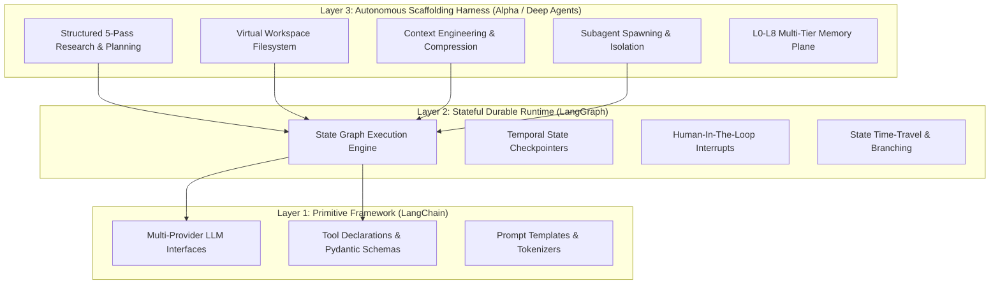

# Alpha Autonomous Agent Architecture & Frontier Research Library

Welcome to the **Alpha Reference Architecture & Frontier Research Library**. This repository directory serves as the centralized technical foundation, containing foundational research, formal architecture specifications, autonomous evolution engines, and frontier benchmarks powering the Alpha autonomous agent harness.

---

## 🧭 Directory Taxonomy & Architecture Map

The library is organized into 5 specialized engineering domains:

```text
references/
├── 01-architectures/                         # Core ASI & Frontier Harness Frameworks
├── 02-avo-and-evolution/                     # Agentic Variation Operators (NVIDIA AVO Loop)
├── 03-rsi-and-self-improvement/              # Recursive Self-Improvement & Safe Evolution
├── 04-frontier-benchmarks-and-deep-research/ # Competitive Analysis, Deep Agents & Agent Studies
└── 05-autonomous-operations-and-execution/   # Autonomous Operations, Swarms & Roadmaps
```

---

## 📚 Complete Document Catalog

### 🏛️ 01. Core Architectures & Frontier Frameworks (`01-architectures/`)

High-level architectural blueprints, unified runtimes, and system topology designs:

- **[ASI-Level Universal Agent Harness Architecture](./01-architectures/ASI-Level%20Universal%20Agent%20Harness%20Architecture.md)**: Universal specification for an ASI-oriented agent harness combining planning, cognitive memory, and verification.
- **[ASI-Oriented World-Class Agent Harness Architecture](./01-architectures/ASI_Agent_World_Class_Harness_Architecture.md)**: Production-grade multi-agent scaffolding, tool-use guarantees, and high-throughput execution engines.
- **[ASI-Oriented Frontier Agent Harness Architecture 2026](./01-architectures/ASI_Frontier_Agent_Harness_Architecture_2026.md)**: Next-generation specifications incorporating 2026 state-of-the-art context engineering and runtime durability.
- **[Universal ASI-Oriented Agent Harness — Final Architecture](./01-architectures/Universal%20ASI-Oriented%20Agent%20Harness%20—%20Final%20Architecture.md)**: Definitive architecture detailing the core harness engine, protocol interfaces, and execution contracts.
- **[Autonomous Self-Configuring ASI-Oriented Agent Harness v2](./01-architectures/Autonomous%20Self-Configuring%20ASI-Oriented%20Agent%20Harness%20—%20Final%20Architecture%20v2.md)**: Dynamic agent self-configuration, runtime schema adaptation, and autonomous capability expansion.
- **[Astra-Inspired Adaptive Autonomous Agent Runtime](./01-architectures/Astra_Inspired_Agentic_Harness_Architecture.md)**: Adaptive runtime patterns inspired by OpenAI Astra, featuring proactive interaction and real-time execution.
- **[OpenAI Astra — Publicly-Informed Agentic Harness Architecture](./01-architectures/OpenAI_Astra_Agentic_Harness_Architecture.md)**: Deep-dive analysis of public research and engineering patterns derived from OpenAI's Astra initiative.
- **[Antigravity 2.0-Inspired Advanced Harness Guide](./01-architectures/antigravity_2_harness_architecture_guide.md)**: Advanced subagent orchestration, tool sandboxing, and hierarchical workflow coordination.
- **[The Keel Architecture](./01-architectures/keel-architecture-rsi-conceptual-design.md)**: Conceptual framework for resilient, self-stabilizing agent loops under high operational uncertainty.
- **[Swarm Agent Harness Architecture](./01-architectures/swarm-agent-harness-architecture.md)**: Decentralized multi-agent swarm coordination, consensus voting, and distributed task routing.
- **[Zero-Cost High-End Architecture](./01-architectures/zero-cost-high-end-architecture.md)**: Blueprint for building enterprise-grade agent capabilities using open-weights models and local infrastructure.
- **[Alpha Next-Gen Harness Innovations & Design Proposals](./01-architectures/alpha-nextgen-agent-harness-innovations-and-design-proposals.md)**: Proprietary architectural innovations synthesizing Dual-Scale AST Repo Twins, Speculative Multi-Drafting, Canary Shadow Execution, and L0-L8 Cognitive Memory Dreaming.

---

### 🧬 02. Agentic Variation Operators & Evolution (`02-avo-and-evolution/`)

Autonomous evolutionary optimization, prompt genome variation, and grounded R&D loops:

- **[AVO — Agentic Variation Operators](./02-avo-and-evolution/AVO_Agentic_Variation_Operators_Architecture.md)**: Core theory and architecture elevating LLMs from passive candidate generators to active variation operators.
- **[AVO High-End Agentic System Architecture (v1)](./02-avo-and-evolution/AVO_High_End_Agentic_System_Architecture.md)**: Concrete implementation blueprint for self-directed evolutionary search in complex software systems.
- **[AVO High-End Agentic System Architecture (v2)](./02-avo-and-evolution/AVO_High_End_Agentic_System_Architecture_v2.md)**: Extended edition covering hardware-in-the-loop profiling, compiler grounding, and automated test synthesis.
- **[Frontier General-Purpose Autonomous AI Agent Harness](./02-avo-and-evolution/AVO_Inspired_Frontier_AI_Agent_Architecture.md)**: Hybrid harness design unifying AVO evolutionary optimization with multi-turn task execution.
- **[NVIDIA AVO Architecture & High-End Harness Blueprint](./02-avo-and-evolution/NVIDIA_AVO_Architecture_Harness_Deep_Research.md)**: Exhaustive breakdown of NVIDIA's AVO breakthrough (ARC-AGI-3 100% milestones, FlashAttention-4 kernel discovery).

---

### 🔄 03. Recursive Self-Improvement & Self-Evolution (`03-rsi-and-self-improvement/`)

Safe, bounded self-modification, mutation verification gates, and recursive optimization:

- **[Controlled Recursive Self-Improvement (RSI) Architecture](./03-rsi-and-self-improvement/RSI_Architecture.md)**: Foundational safety boundaries, formal verification gates, and rollback guarantees for self-modifying agents.
- **[RSI Evolution Architecture for an Advanced AI Agent Harness](./03-rsi-and-self-improvement/RSI_Agent_Harness_ASI_Architecture.md)**: End-to-end evolutionary pipeline managing prompt mutation, tool generation, and memory refinement.
- **[RSI Architecture Plan for a Hermes-Based Agent Harness](./03-rsi-and-self-improvement/RSI_ARCHITECTURE_PLAN.md)**: Concrete execution plan integrating recursive self-improvement into tool-using agent loops.
- **[Advanced RSI Harness Architecture — v2 (Synthesis Edition)](./03-rsi-and-self-improvement/advanced-rsi-harness-architecture-v2.md)**: Consolidated RSI synthesis combining AST mutation guards, shadow evaluation, and canary rollouts.
- **[Recursive Self-Improving AI Agent Harness Research](./03-rsi-and-self-improvement/recursive_self_improving_ai_agent_harness_research.md)**: Academic literature review and empirical engineering considerations for safe recursive self-improvement.
- **[RSI-Enabled AI Agent Harness — ASI-Oriented Architecture](./03-rsi-and-self-improvement/rsi.md)**: Comprehensive harness specification featuring dual-mode execution (Production Plane vs. Evolution Plane).
- **[RSI Architecture Diagram](./03-rsi-and-self-improvement/rsi.png)**: Visual architectural schematic illustrating the safe mutation and verification cycle.
- **[Self-Improving Agent Harness — Full Architecture](./03-rsi-and-self-improvement/self-improving-harness-architecture.md)**: Complete system design for automated self-evaluation, error harvesting, and persistent capability upgrades.
- **[Self-Improving Agent Harness — Reference Specification](./03-rsi-and-self-improvement/self-improving-agent-harness-architecture.md)**: Reference schemas, event payloads, and interface contracts for self-improvement components.
- **[Self-Improvement System for Your Harness](./03-rsi-and-self-improvement/self-improvement-system.md)**: Practical implementation guide for integrating safe self-improvement into existing agent runtimes.
- **[Recursive Self-Development Engine (RSD Engine)](./03-rsi-and-self-improvement/recursive-self-development-engine.md)**: Concrete code patterns and reference execution engines for iterative self-development.

---

### 🔬 04. Frontier Benchmarks & Deep Research (`04-frontier-benchmarks-and-deep-research/`)

Competitive intelligence, deep research methodologies, and comparative harness analyses:

- **[Top AI Agents & Agentic Architectures — September 2026](./04-frontier-benchmarks-and-deep-research/Top_AI_Agents_2026_September_Deep_Research.md)**: SOTA state of the industry surveying Devin, OpenClaw, Hermes, Deep Agents, and enterprise systems.
- **[Deep Research: Astra, Fable 5.1, AVO, Kimi K3](./04-frontier-benchmarks-and-deep-research/agent-harness-deep-research-v2.md)**: Multi-model comparative study and synthesized lessons for world-class harness engineering.
- **[Frontier Agent Architectures Research](./04-frontier-benchmarks-and-deep-research/frontier-agent-architectures-research.md)**: In-depth analysis of emerging agent architectures, execution loops, and runtime scaffolds.
- **[Anthropic Frontier Agent Harness Analysis](./04-frontier-benchmarks-and-deep-research/anthropic-fable-frontier-harness.md)**: Detailed breakdown of Anthropic's agent harness design, computer use, and safety primitives.
- **[Hermes Agent Architecture](./04-frontier-benchmarks-and-deep-research/hermes-agent-architecture.md)**: Architectural analysis of Nous Research's Hermes agent, function calling mechanics, and local reasoning.
- **[Hermes 1,393-Agent Swarm Run Analysis](./04-frontier-benchmarks-and-deep-research/hermes-1393-agent-swarm-analysis.md)**: Empirical post-mortem of massive multi-agent coordination, emergent behaviors, and failure modes.
- **[OpenClaw Real Architecture](./04-frontier-benchmarks-and-deep-research/openclaw-architecture.md)**: Engineering breakdown of OpenClaw's execution model, sandbox boundaries, and tool orchestration.
- **[OpenClaw Agent Core Architecture](./04-frontier-benchmarks-and-deep-research/openclaw-core-architecture.md)**: Key architectural innovations worth adopting from the OpenClaw core agent engine.
- **[Exa Intelligence Harness](./04-frontier-benchmarks-and-deep-research/exa-intelligence-harness.md)**: Neural search integration, semantic web gathering, and automated evidence retrieval.
- **[Notable Open-Source Agent Projects Study](./04-frontier-benchmarks-and-deep-research/notable-oss-agent-projects.md)**: Curated survey of top open-source agent projects and their respective architectural strengths.
- **[Memory Architecture Benchmarks & Taxonomy](./04-frontier-benchmarks-and-deep-research/memory-architecture-benchmarks.md)**: Comprehensive evaluation of vector stores, graph stores, full-text search, and multi-tier memory backends.
- **[SOTA Coding Agents & Frontier Harness Comparative Study (2026)](./04-frontier-benchmarks-and-deep-research/sota-coding-agents-and-harness-comparative-study-2026.md)**: Exhaustive comparative analysis of Claude Code, Devin, OpenHands, Aider, Cursor, and Deep Agents with SWE-bench benchmarks and architectural matrices.

---

### 💼 05. Autonomous Operations & Execution Runbooks (`05-autonomous-operations-and-execution/`)

Autonomous enterprise operations, business goal trees, multi-agent workflows, and roadmaps:

- **[Autonomous AI Company — Long-Term Continuous Operation Plan](./05-autonomous-operations-and-execution/Autonomous%20AI%20Company%20—%20Complete%20Long-Term%20Continuous%20Operation%20Plan.md)**: Blueprint for operating an autonomous AI enterprise with finance, engineering, marketing, and HR agent departments.
- **[Full Autonomous Agent Goal List — Company Creation Demo](./05-autonomous-operations-and-execution/Full%20Autonomous%20Agent%20Goal%20List%20—%20Company%20Creation%20as%20a%20Demonstration.md)**: End-to-end decomposed goal tree guiding an agent swarm from incorporation to customer delivery.
- **[Enterprise Swarm and Workflow Plan](./05-autonomous-operations-and-execution/enterprise-swarm-and-workflow-plan.md)**: Enterprise workflow integration combining OMO (One-Model-Orchestrator) and Hermes execution swarms.
- **[Project Goal — Autonomous AI Execution Platform for Windows](./05-autonomous-operations-and-execution/PROJECT_GOAL.md)**: Core project charter, target capabilities, and operational requirements for the desktop execution platform.
- **[Subagent Card Runtime Metadata](./05-autonomous-operations-and-execution/subagent-card-runtime-metadata.md)**: Runtime schema specification for subagent introspection, capability discovery, and dynamic routing.
- **[Complete AI Harness Capability Map](./05-autonomous-operations-and-execution/ai-harness-capability-map.md)**: Exhaustive capability matrix mapping cognitive engines, safety guards, and tool interfaces across the Alpha platform.
- **[AI Agent Harness Consolidated Project Discussion](./05-autonomous-operations-and-execution/AI_AGENT_HARNESS_CONSOLIDATED_DISCUSSION.md)**: Architectural decisions, rationale, and consolidated technical design records.
- **[Ultimate Harness Implementation Plan](./05-autonomous-operations-and-execution/ultimate-harness-implementation-plan.md)**: Phased delivery roadmap for implementing the complete world-class autonomous agent harness.

---

## ⚡ 2026 State-of-the-Art (SOTA) Architectural Synthesis

To inform future engineering on Alpha, the following architectural paradigms represent the cutting-edge standard in 2026:

### 1. The 3-Tier Agentic System Hierarchy
In 2026, modern agentic systems are cleanly decoupled into three distinct architectural layers:



- **Layer 1: Framework (LangChain)**: Provides raw building blocks: model adapters, prompt abstractions, and tool schema definitions.
- **Layer 2: Stateful Runtime (LangGraph)**: Provides the durable execution substrate: cyclical graphs, checkpointers for persistence, and human-in-the-loop interrupts.
- **Layer 3: Autonomous Scaffolding Harness (Alpha)**: Provides the operational intelligence: active context management, virtual workspace filesystems, structured research engines, and subagent delegation.

### 2. NVIDIA AVO: Autonomous Evolutionary Optimization
The **Agentic Variation Operators (AVO)** breakthrough demonstrates that treating the LLM as an active evolutionary operator—rather than a passive generator in a fixed loop—enables super-human optimization:
- **Active R&D Loop**: The agent inspects code, proposes mutations, runs compiler/profiler tests, reads telemetry logs, and refines hypotheses iteratively.
- **Persistent Lineage Memory**: Evolutions maintain an explicit mutation lineage tree, avoiding re-exploring failed branches.
- **Empirical Breakthroughs**: Solved 100% of ARC-AGI-3 tasks through autonomous environment exploration and discovered GPU attention kernels outperforming `FlashAttention-4`.

### 3. The 9-Tier Cognitive Memory Plane (L0 to L8)
Alpha implements a cognitive memory continuum designed to prevent context saturation while guaranteeing perfect long-term recall:

| Level | Name | Storage Mechanism | Retention Policy | Purpose |
| :--- | :--- | :--- | :--- | :--- |
| **L0** | Epistemic Working Context | Active Context Window | Single Turn | Immediate reasoning, active scratchpad, current tool output. |
| **L1** | FTS Session Recall | SQLite FTS5 Full-Text | Thread Lifetime | Fast token-level text search across earlier turns in current thread. |
| **L2** | Entity Knowledge Graph | SQLite Graph / NetworkX | Durable Across Threads | Relationships between persons, projects, code files, and concepts. |
| **L3** | Semantic Vector Index | HNSW / Vector Embeddings | Durable Across Threads | Dense similarity search for concepts and thematic documentation. |
| **L4** | Procedural Rules & Skills | Markdown Skill Files | Immutable / Versioned | Executable SOPs, formatting rules, and tool invocation contracts. |
| **L5** | Hierarchical Summaries | Compressed Rollups | Thread Lifetime | Rolling summaries replacing truncated conversation history. |
| **L6** | Dreaming & Consolidation | Background Offline Job | Periodic Cron | Background synthesis of insights, pruning obsolete contradictions. |
| **L7** | Cross-Thread Lineage | SQLite Run Ledger | Organization Lifetime | Provenance tracking across parent and delegated subagent runs. |
| **L8** | Collective Fleet Memory | Shared Central Database | Global Lifetime | Organizational knowledge shared across all user and team agents. |

### 4. Safe Recursive Self-Improvement (RSI) Invariants
When agents modify their own tools, prompts, or workflows, strict safety invariants must hold:
1. **Isolated Evolution Plane**: All mutations occur in an ephemeral sandbox environment, never directly in the live production plane.
2. **AST Invariant Enforcement**: Proposed code modifications undergo static AST parsing to verify safety rules (no unauthorized network calls, no privilege escalation).
3. **Automated Canary Benchmarking**: Before a mutation is adopted, the agent must pass a deterministic test regression suite with zero degradation.
4. **Deterministic Rollback Checkpoints**: Every adopted mutation creates a temporal checkpoint allowing instant rollback upon anomalous failure spikes.
