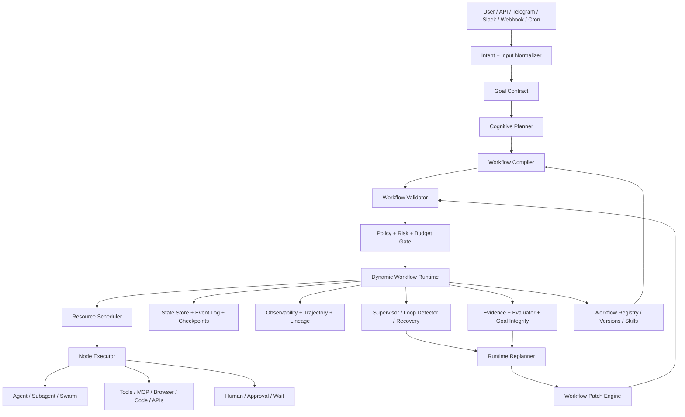

# Alpha Dynamic Workflow Engine — Complete Architecture, Feature Specification & Implementation Plan

**Document:** `details.md`  
**Project:** [itsPremkumar/alpha](https://github.com/itsPremkumar/alpha)  
**Scope:** Dynamic, adaptive, durable, policy-controlled workflows for the Alpha autonomous multi-agent harness  
**Research date:** 2026-09-23  
**Target:** Production-grade implementation on top of Alpha's existing orchestration, planning, LangGraph agent loop, persistence, jobs, events, subagent control, goals, governance, tools, MCP, A2A, memory, and UI layers.

---

## 1. Executive Summary

Alpha already contains the major primitives needed for dynamic workflows: a LangGraph-based agent loop, a workflow DAG engine, mission/work-queue DAGs, autonomous planning, subagent batching and concurrency control, durable checkpointing, event streaming, goal/integrity gates, security/policy controls, lineage, jobs, scheduled automations, and the `workflow_dag_manage` tool.

The missing architectural idea is to make workflow execution **adaptive at runtime** rather than treating the plan/DAG as immutable after compilation.

A Dynamic Workflow Engine (DWE) for Alpha should therefore support this lifecycle:

```text
User / Event / Schedule / Webhook
          |
          v
   Intent + Goal Contract
          |
          v
  Cognitive Planner
          |
          v
 Initial Workflow Plan
          |
          v
 Workflow Compiler + Validator
          |
          v
 Policy / Safety / Budget Gate
          |
          v
 Dynamic Workflow Runtime
   |        |        |
   |        |        +--> Agent / Subagent / Swarm
   |        +-----------> Tool / MCP / API / Code
   +--------------------> Human / Event / Timer
          |
          v
 State + Event Log + Checkpoint
          |
          +------> Evaluator / Evidence / Goal Gate
          |
          +------> Supervisor / Loop Detector
          |
          +------> Runtime Replanner
                        |
                        v
                 Workflow Patch
                        |
                  Validate / Simulate
                        |
                   Policy Approval
                        |
                  Atomic Patch Commit
                        |
                        +------> Continue
                                 |
                                 v
                              Complete
```

The central design rule is:

> **The LLM may propose workflow decisions and graph mutations, but it must never directly control execution.**

The deterministic runtime owns validation, authorization, scheduling, persistence, idempotency, side-effect control, retries, checkpoints, and final completion.

This model combines the strongest ideas visible in current workflow/agent systems:

- LangGraph supports runtime routing through `Command` and dynamic fan-out through `Send`, with checkpoint-based persistence for human-in-the-loop, memory, time travel, and fault tolerance.
- Microsoft Agent Framework models workflows as explicit graph execution with executors, edges, conditions, fan-out/fan-in, events, state, checkpoints, visualization, and human-in-the-loop; its declarative workflow mode uses YAML.
- OpenAI Agents SDK emphasizes agents, tools, handoffs, sessions, guardrails, human review, and tracing.
- CrewAI Flows provide start/listen routing and persisted flow state.
- AutoGen GraphFlow supports sequential, parallel, conditional, and looping graph execution.
- JiuwenSwarm's SwarmFlow demonstrates on-the-fly workflow-script generation, phase/node execution, human nodes, budgets, run-tree monitoring, and reusable workflow skills.
- Mastra provides suspend/resume snapshots for durable human-in-the-loop and long-running workflows.
- n8n provides conditional branching, looping, waiting, sub-workflows, tool approvals, and human fallbacks.
- Dify provides iteration/sub-workflow patterns and variable aggregation across exclusive branches.
- Temporal demonstrates durable workflow execution, event history, signals/updates, and continuation strategies for long-lived workflows.

Alpha should absorb these **patterns**, not become dependent on all of these frameworks.

---

## 2. What “Dynamic Workflow” Means in Alpha

A static workflow is approximately:

```text
A -> B -> C -> D
```

A dynamic workflow is:

```text
A
 |
 +--> classifier says "research" ------> B -> C
 |
 +--> classifier says "code" ----------> D -> E -> review
 |
 +--> uncertainty high ----------------> research -> B -> C
 |
 +--> risk high ------------------------> human approval
 |
 +--> failure --------------------------> retry / fallback / repair
 |
 +--> result incomplete ---------------> insert new tasks -> verify
```

The workflow graph is therefore a **runtime state machine plus dependency graph**.

Dynamic behavior can change:

1. Which node executes next.
2. Which agent/model/tool executes it.
3. How many subagents are spawned.
4. Whether work is parallel or sequential.
5. Whether a new task is inserted.
6. Whether an existing task is skipped.
7. Whether a task is repeated.
8. Whether the workflow enters a review loop.
9. Whether the workflow waits for a human/event/timer.
10. Whether a failed node is retried, replaced, compensated, or escalated.
11. Whether the workflow's resource budget changes within policy limits.
12. Whether the workflow branches into a child workflow.
13. Whether a new skill is discovered and loaded.
14. Whether additional evidence/research is required.
15. Whether the workflow terminates, pauses, resumes, or is forked.

### 2.1 Dynamic does not mean uncontrolled

Alpha must keep a hard distinction between:

- **Planning freedom:** the planner can propose multiple strategies.
- **Routing freedom:** the router can choose among validated paths.
- **Graph mutation freedom:** the replanner can request typed mutations.
- **Execution authority:** only the deterministic runtime may commit those mutations.
- **Side-effect authority:** tools still go through the existing policy/approval/security stack.

This is essential for safe long-running autonomy.

---

## 3. Alpha-Specific Architecture Mapping

The public Alpha architecture already describes these relevant engines:

- `agent` — LangGraph agent loop and state transitions.
- `agents` — subagent definitions, persona/model/capability isolation.
- `planning` — autonomous planning and cognitive planning.
- `missions` — hierarchical mission trees and work queues.
- `orchestration` / `orchestrator` — swarm coordination and delegation.
- `workflow` — workflow DAG execution.
- `events` — centralized event bus.
- `persistence` — durable state/checkpointing.
- `jobs` — asynchronous background execution.
- `subagent_control` — concurrency, turn, and budget control.
- `goals` / `goal_integrity` — verifiable completion.
- `governance` / `policy` / `authz` / `guardrails` — permissions and safety.
- `context` / `memory` / `blackboard` — shared and persistent information.
- `lineage` / `trajectory` / `ledger` — provenance and execution audit.
- `coding` / `action` — side-effecting execution, rollback, testing, repair.
- `mcp` / `extensions` — dynamic tool integration.
- `learning` / `evolution` / `avo` / `evaluation` — optimization and improvement.

**Recommended approach:** extend these systems instead of creating a second competing orchestrator.

### 3.1 Target responsibility split

```text
planning/
    Decide what should happen.

workflow/
    Define what is currently allowed to happen and execute the graph.

orchestration/
    Decide who/which worker executes ready work and manage distributed coordination.

orchestrator/
    Coordinate high-level multi-agent delegation and supervisor behavior.

agent/
    Execute one agent's reasoning/tool loop.

jobs/
    Run durable/background work.

persistence/
    Persist workflow state, checkpoints and event history.

events/
    Publish every lifecycle transition.

governance/ authz/ policy/
    Decide what is allowed.

goals/ evidence/ evaluation/
    Decide whether the objective has actually been satisfied.
```

---

## 4. Core Dynamic Workflow Architecture

### 4.1 Major runtime components



### 4.2 Runtime loop

The runtime should operate as:

```python
while run.status in RUNNABLE_STATES:
    restore_latest_checkpoint()
    ingest_pending_events()
    reconcile_external_events()

    ready = graph.compute_ready_nodes(state)
    ready = policy.filter_allowed(ready, state)
    ready = scheduler.rank(ready, resources, budgets)

    if not ready:
        if state.requires_human:
            suspend()
        elif state.waiting_for_event:
            wait_for_event()
        elif graph.is_complete(state):
            verify_goal_and_finish()
        else:
            request_replan(reason="no_ready_progress")
        continue

    batch = scheduler.select_batch(ready)

    for node in batch:
        execute_idempotently(node, state)
        publish_events()
        checkpoint()

    evaluate_progress()

    if supervisor.detects_loop_or_thrashing():
        request_replan(reason="supervision_signal")

    if goal_gap_detected():
        request_replan(reason="goal_gap")

    if evidence_gap_detected():
        request_replan(reason="evidence_gap")
```

The important difference from a conventional DAG executor is the explicit **replan/patch cycle** inside the runtime.

---

## 5. Workflow Domain Model

### 5.1 WorkflowDefinition

Recommended top-level schema:

```yaml
api_version: alpha.ai/v1
kind: Workflow
metadata:
  id: research-and-build
  name: Research and Build
  version: 1.4.0
  description: Adaptive research -> implementation -> verification workflow
  labels:
    domain: engineering
    dynamic: true

inputs:
  - name: objective
    type: string
    required: true

variables:
  - name: requirements
    type: object
  - name: evidence
    type: array
  - name: artifacts
    type: array

policies:
  max_nodes: 200
  max_depth: 12
  max_runtime_seconds: 86400
  max_llm_cost_usd: 2.00
  allow_dynamic_graph_mutation: true
  allow_dynamic_agent_creation: true
  require_approval_for:
    - external_write
    - destructive_command
    - credential_access

triggers:
  - type: manual
  - type: webhook
  - type: schedule

graph:
  nodes: []
  edges: []

completion:
  required:
    - goal_integrity
    - required_tests
    - evidence_contract
```

### 5.2 Node schema

Every node must have:

```yaml
id: implement_feature
type: agent
executor: alpha.agent
agent_profile: coding-agent
input:
  objective: "{{ state.requirements.objective }}"
output_schema: implementation_result
when: "state.plan.phase == 'implementation'"
retry:
  max_attempts: 3
  backoff: exponential
timeout_seconds: 1800
policy:
  risk_class: medium
resources:
  cpu: 1
  memory_mb: 512
  max_concurrency: 1
```

### 5.3 Node types

Alpha should support at least these built-in node kinds:

| Type | Purpose |
|---|---|
| `agent` | Run one autonomous agent loop |
| `subagent` | Run bounded delegated work |
| `swarm` | Parallel/collaborative multi-agent execution |
| `tool` | Deterministic or external tool call |
| `mcp_tool` | MCP tool execution |
| `a2a` | Agent-to-agent request |
| `function` | Pure deterministic function |
| `transform` | Map state/data fields |
| `router` | Choose next route based on state |
| `classifier` | Classify input/output for routing |
| `condition` | Boolean branching |
| `parallel` | Fan-out |
| `map` | Apply a node/workflow over items |
| `reduce` | Aggregate parallel outputs |
| `join` | Barrier/fan-in |
| `race` | First successful result |
| `quorum` | Complete after N-of-M agreement |
| `loop` | Repeat until a termination condition |
| `retry` | Retry with policy |
| `fallback` | Explicit alternative path |
| `review` | Critique/evaluate artifact |
| `approval` | Human or system approval gate |
| `human` | Human task/input |
| `wait` | Time-based suspension |
| `event_wait` | Wait for external event |
| `webhook` | External callback boundary |
| `subworkflow` | Execute another workflow |
| `checkpoint` | Explicit durable snapshot |
| `rollback` | Restore/revert according to policy |
| `compensation` | Saga/undo operation |
| `goal_gate` | Validate completion conditions |
| `evidence_gate` | Require empirical evidence |
| `security_gate` | Policy/security decision |
| `model_select` | Choose model/provider |
| `skill_select` | Discover/select a skill |
| `artifact` | Publish/version an artifact |
| `schedule` | Schedule future execution |
| `terminate` | End a branch/run |

---

## 6. Dynamic Graph Model

### 6.1 Graph state

Do not store the entire world in one giant LLM context. Use a typed state object and references to durable artifacts.

Recommended state layers:

```text
Run State
 ├── identity
 ├── objective
 ├── status
 ├── graph_version
 ├── active_nodes
 ├── completed_nodes
 ├── failed_nodes
 ├── waiting_nodes
 ├── budgets
 ├── resources
 ├── decisions
 ├── variables
 ├── goal_state
 ├── evidence_state
 ├── policy_state
 └── parent/child relationships

Node State
 ├── input_ref
 ├── output_ref
 ├── status
 ├── attempts
 ├── idempotency_key
 ├── timestamps
 ├── executor
 ├── model
 ├── tool_calls
 └── failure

Artifact State
 ├── artifact_id
 ├── content/location
 ├── content_hash
 ├── schema
 ├── producer_node
 ├── parent_artifacts
 └── lineage
```

### 6.2 Immutable event log + materialized state

Use an event-oriented design:

```text
WorkflowCreated
WorkflowCompiled
NodeReady
NodeStarted
NodeProgress
NodeCompleted
NodeFailed
NodeRetryScheduled
BranchSelected
HumanApprovalRequested
HumanApprovalGranted
HumanApprovalDenied
WorkflowSuspended
WorkflowResumed
PatchProposed
PatchValidated
PatchRejected
PatchCommitted
CheckpointCreated
ReplanRequested
ReplanCompleted
GoalGapDetected
EvidenceGapDetected
WorkflowCompleted
WorkflowFailed
WorkflowCancelled
```

The current state is a materialized view of the event stream plus checkpoints.

This makes debugging, replay, audit, and time-travel practical.

---

## 7. Runtime Dynamic Routing

### 7.1 Router contract

A router must return a typed decision, not unconstrained text:

```json
{
  "decision": "route",
  "target": "deep_research",
  "reason": "Evidence coverage is below the required threshold",
  "confidence": 0.91,
  "signals": {
    "evidence_coverage": 0.43,
    "goal_progress": 0.58
  }
}
```

The runtime then validates that `deep_research` is a legal next destination.

### 7.2 Router modes

Support:

1. Deterministic expression router.
2. Rule-based router.
3. LLM structured router.
4. Score-based router.
5. Policy-constrained model router.
6. Multi-model router.
7. Human router.
8. Hybrid router: deterministic guard + LLM choice.

### 7.3 Recommended routing priority

```text
Safety / policy gate
      > hard dependency constraints
      > explicit user constraints
      > goal/evidence requirements
      > resource availability
      > deterministic rules
      > workflow heuristics
      > model decision
```

An LLM must never be allowed to override a higher-priority constraint.

---

## 8. Dynamic Workflow Mutation

This is the most important new capability.

### 8.1 Typed workflow patch

Use a custom typed patch object rather than exposing raw graph internals:

```json
{
  "workflow_run_id": "run_01J...",
  "base_graph_version": 17,
  "reason": "Implementation uncovered missing database migration requirement",
  "proposed_by": "runtime_replanner",
  "operations": [
    {
      "op": "add_node",
      "node": {
        "id": "migration_design",
        "type": "agent",
        "executor": "alpha.agent",
        "agent_profile": "database-specialist"
      }
    },
    {
      "op": "add_edge",
      "from": "requirements_review",
      "to": "migration_design"
    },
    {
      "op": "add_edge",
      "from": "migration_design",
      "to": "implementation"
    }
  ]
}
```

### 8.2 Allowed operations

Implement these first:

```text
add_node
remove_node
replace_node
update_node_config
add_edge
remove_edge
update_edge_condition
set_route
insert_before
insert_after
fan_out
fan_in
create_loop
set_loop_limit
retry_node
replace_executor
replace_model
replace_agent
set_timeout
set_budget
pause_branch
resume_branch
skip_node
spawn_subworkflow
request_human
request_research
request_review
checkpoint
```

### 8.3 Patch validation pipeline

```text
LLM / Supervisor Proposal
          |
          v
Schema Validation
          |
          v
Reference Validation
          |
          v
Graph Invariants
          |
          v
Dependency Analysis
          |
          v
Loop Safety Analysis
          |
          v
Resource / Budget Check
          |
          v
Security / Policy Check
          |
          v
Side-effect Risk Check
          |
          v
Dry-run / Simulation
          |
          v
Approval Policy
          |
          v
Atomic Commit
          |
          v
Checkpoint + Event
```

### 8.4 Graph invariants

Reject a patch when any invariant is violated:

- Node IDs must be unique.
- Every referenced node must exist.
- Every edge must point to valid nodes.
- Start/end semantics must remain valid.
- Unbounded loops are forbidden.
- Recursive subworkflow depth must be bounded.
- Fan-out concurrency must stay inside limits.
- Dynamic agent creation must have a bounded budget.
- A sensitive side effect cannot bypass its policy gate.
- A patch must not silently delete a required goal/evidence gate.
- An active run may only mutate from the expected graph version (optimistic concurrency).
- Patch commit must be atomic.
- A patch must be recorded in lineage and audit events.

---

## 9. Adaptive Planning and Replanning

Alpha's existing planner should compile an **initial graph** but remain available during execution.

### 9.1 Replanning triggers

Trigger a replan when:

- A task fails repeatedly.
- A required dependency is unavailable.
- Evidence is insufficient.
- A newly discovered requirement changes the solution.
- The user's objective changes.
- A human adds a constraint.
- The selected model/tool becomes unavailable.
- A resource budget changes.
- A security policy changes.
- A loop detector reports thrashing.
- Goal progress is below the expected trajectory.
- The same node has been revisited too often.
- A subagent reports a blocker.
- A child workflow fails.
- New external information invalidates an assumption.
- An artifact fails evaluation.
- Tests expose an architectural issue.

### 9.2 Replanning input

The replanner should receive a compact structured snapshot:

```json
{
  "objective": "...",
  "goal_contract": "...",
  "completed": [...],
  "failed": [...],
  "active": [...],
  "evidence": {...},
  "artifacts": [...],
  "failures": [...],
  "constraints": [...],
  "budget": {...},
  "resources": {...},
  "graph_summary": {...},
  "recent_events": [...],
  "available_agents": [...],
  "available_tools": [...]
}
```

Never provide the full event history blindly to the model.

### 9.3 Replan output

```json
{
  "status": "patch_required",
  "assessment": "Current path cannot satisfy database migration constraint",
  "missing_capabilities": ["database-specialist"],
  "patch": {...},
  "expected_improvement": {
    "goal_progress": "+0.25",
    "risk": "+0.03",
    "cost_usd": "+0.08"
  }
}
```

---

## 10. Parallelism, Map/Reduce, Race and Quorum

Dynamic workflows should support multiple execution semantics.

### 10.1 Fan-out/fan-in

```text
             +--> research_us -->+
Input -> Router                    -> Synthesis
             +--> research_eu -->+
             +--> research_in -->+
```

### 10.2 Dynamic map

Given an array discovered at runtime:

```text
items = [A, B, C, D, E, ...]

map(task=item) -> dynamic subnodes
                       |
                       v
                    reduce()
```

This is conceptually similar to LangGraph dynamic `Send` and Dify iteration/sub-workflow patterns.

### 10.3 Race / first-success

Useful for multiple providers/tools:

```text
          +--> provider A --+
Request --+--> provider B ---+--> first valid result
          +--> provider C --+
```

Cancel losers where possible.

### 10.4 Quorum

```text
5 reviewers -> require 3 agreeing evaluations -> continue
```

Support:

- majority quorum
- weighted quorum
- threshold score
- consensus with mandatory dissent record

### 10.5 Resource-aware concurrency

The runtime must consider:

- CPU
- RAM
- GPU/VRAM
- model rate limits
- browser slots
- tool limits
- subprocess capacity
- token budget
- monetary budget
- agent-specific concurrency
- project-level concurrency

Alpha's existing `subagent_control` should become the resource admission controller for dynamic workflow fan-out.

---

## 11. Loops and Termination Safety

Loops are powerful and dangerous.

### 11.1 Required loop contract

Every dynamic loop must declare at least:

```yaml
loop:
  max_iterations: 10
  max_runtime_seconds: 1800
  stop_condition: "state.tests.passed == true"
  progress_metric: "state.goal.progress"
  min_progress_delta: 0.02
  stagnation_limit: 3
```

### 11.2 Loop protection

Detect:

- same node repeated without state change
- same tool calls with same inputs
- alternating A -> B -> A cycles
- repeated replan patches
- budget burn without progress
- output regeneration without evaluator improvement
- prompt drift

When detected:

```text
observe -> classify -> checkpoint -> recover strategy -> replan
```

Escalation:

```text
retry -> alternate strategy -> alternate agent -> alternate model -> human -> fail
```

Do not silently fall back.

---

## 12. Human-in-the-Loop and Suspension

The runtime should support first-class suspension, not a fake blocking request.

### 12.1 Suspension states

```text
WAITING_FOR_HUMAN
WAITING_FOR_EVENT
WAITING_FOR_TIMER
WAITING_FOR_RESOURCE
WAITING_FOR_EXTERNAL_SYSTEM
```

### 12.2 Approval object

```json
{
  "approval_id": "appr_01...",
  "workflow_run_id": "run_01...",
  "node_id": "deploy_production",
  "risk": "high",
  "requested_action": "Deploy generated artifact",
  "evidence": ["artifact_sha", "tests_report"],
  "expires_at": "...",
  "decision": null
}
```

### 12.3 Resume behavior

On approval/resume:

1. Load durable checkpoint.
2. Validate approval freshness.
3. Re-evaluate current policy.
4. Apply human input as typed state.
5. Increment workflow state revision.
6. Continue from the suspended node.

Do not assume that policy is unchanged merely because the user previously approved the workflow.

---

## 13. Durable Execution

Alpha already advertises Boulder checkpoints and durable orchestration. Dynamic workflows should unify those mechanisms.

### 13.1 Checkpoint policy

Checkpoint at minimum:

- before sensitive side effects
- after every completed node
- after every dynamic patch
- before/after approval
- before entering a long loop
- after a child workflow completes
- on graceful shutdown
- on recoverable failure

### 13.2 Checkpoint contents

```text
workflow definition version
workflow graph version
run state
node states
pending queue
active leases
budgets
random seeds where relevant
provider/model selections
external operation ids
artifact references
event cursor
parent/child run ids
policy version
```

### 13.3 Exactly-once caveat

Do not claim universal exactly-once side effects.

Target:

- durable orchestration
- idempotent task execution
- deduplicated event handling
- atomic local state transitions
- transactional actions where supported
- compensating actions for non-transactional side effects

Each side-effecting node should get an idempotency key:

```text
{workflow_run_id}:{graph_version}:{node_id}:{attempt}:{input_hash}
```

---

## 14. Retry, Fallback, Repair and Recovery

### 14.1 Error taxonomy

Classify failures before selecting recovery:

```text
TRANSIENT_NETWORK
RATE_LIMIT
AUTHENTICATION
AUTHORIZATION
BAD_INPUT
MODEL_ERROR
TOOL_ERROR
DEPENDENCY_MISSING
RESOURCE_EXHAUSTED
TIMEOUT
CRASH
DATA_VALIDATION
QUALITY_FAILURE
POLICY_BLOCK
HUMAN_REJECTION
ARCHITECTURE_FAILURE
UNKNOWN
```

### 14.2 Retry policy

```yaml
retry:
  max_attempts: 3
  strategy: exponential_jitter
  initial_delay_seconds: 2
  max_delay_seconds: 120
  retry_on:
    - transient_network
    - rate_limit
    - timeout
```

### 14.3 Explicit fallback

Fallbacks must be visible in the trace:

```text
primary_model failed
    -> fallback model selected
    -> reason = rate_limit
    -> policy check = allowed
    -> cost delta = +$0.00
```

Never hide fallback decisions in a generic catch block.

### 14.4 Repair path

For code workflows:

```text
failed test
   -> traceback classification
   -> root-cause hypothesis
   -> patch in Repo Twin
   -> static/AST validation
   -> tests
   -> review
   -> merge to working tree
```

Integrate Alpha's existing `auto_test_and_repair`, Git checkpoints, AST validation, Repo Twin, and Hashline capabilities.

---

## 15. Goal-Driven Dynamic Workflow

The workflow must be goal-driven, not step-driven.

A workflow is complete only when:

```text
all mandatory milestones complete
AND
required outputs exist
AND
goal integrity passes
AND
evidence requirements pass
AND
no unresolved blockers remain
AND
required tests/quality gates pass
AND
no mandatory human approval is pending
```

This connects directly to Alpha's existing Goal Engine and Goal Integrity mechanisms.

### 15.1 Progress state

Use explicit progress dimensions:

```json
{
  "goal_progress": 0.74,
  "evidence_coverage": 0.82,
  "quality": 0.79,
  "risk": 0.21,
  "unresolved_blockers": 2,
  "confidence": 0.77
}
```

These are runtime control signals, not an LLM's arbitrary opinion.

---

## 16. Evidence-Aware Routing

For research and knowledge workflows, dynamic routing should be driven by evidence gaps.

Example:

```text
research topic
     |
     v
source discovery
     |
     v
primary evidence
     |
     v
fact extraction
     |
     v
contradiction detection
     |
     v
coverage check
  /         \\
low        sufficient
 |              |
more search    synthesis
```

Alpha already has a multi-pass research engine and evidence matrix. Expose evidence coverage to the workflow router.

Suggested routing features:

- source diversity requirement
- primary-source minimum
- freshness requirement
- claim confidence
- contradiction threshold
- unresolved claim count
- citation coverage
- domain-specific evidence policy

---

## 17. Dynamic Model and Agent Selection

A workflow node should not necessarily hardcode a model.

Use:

```yaml
model_policy:
  class: reasoning_medium
  constraints:
    max_cost_usd: 0.10
    latency_ms: 15000
    supports_tools: true
    supports_json: true
    supports_vision: false
    locality: preferred_local
```

The model router selects from Alpha's provider registry.

### 17.1 Dynamic model selection factors

- task complexity
- context size
- tool requirements
- structured output capability
- latency
- cost
- provider health
- model availability
- quality history for task category
- local vs cloud preference
- privacy requirements
- user/project policy

### 17.2 Learning loop

Use evaluation history to update model routing recommendations, but do not silently mutate production routing policies from a single trace.

Recommended:

```text
trace -> evaluation -> aggregate evidence -> candidate policy -> benchmark -> approval -> deploy policy version
```

---

## 18. Dynamic Skill and Tool Discovery

When a workflow encounters a capability gap:

```text
capability missing
      |
      v
catalog_tool_search / skills search
      |
      v
candidate capabilities
      |
      v
security + compatibility check
      |
      +----> use existing capability
      |
      +----> install/load quarantined extension
      |
      +----> ask human
```

Never allow an arbitrary discovered tool to execute directly.

Required checks:

- trust source
- manifest/schema
- permissions
- filesystem/network scope
- secret access
- process/sandbox policy
- version compatibility
- signature/hash where available
- test in isolated environment

This should reuse Alpha's `extensions`, `skills`, `community`, `authz`, `guardrails`, and policy systems.

---

## 19. Event-Driven Dynamic Workflows

Workflows must not rely solely on direct request/response execution.

### Triggers

Support:

- manual
- chat message
- slash command
- schedule
- cron
- webhook
- GitHub event
- agent event
- workflow completion
- child workflow result
- file change
- CI result
- system alert
- human approval
- external API callback

### Event routing

```text
Event Bus
   |
   +--> workflow trigger matcher
   |
   +--> existing run correlation
   |
   +--> create new run
   |
   +--> signal waiting node
   |
   +--> update running workflow
```

Do not create duplicate runs for the same event without an explicit policy.

Use event idempotency keys:

```text
source:event_type:event_id
```

---

## 20. Subworkflow Architecture

A workflow should be composable.

Example:

```text
Main Workflow
  |
  +--> Requirements Subworkflow
  |
  +--> Research Subworkflow
  |
  +--> Implementation Subworkflow
  |
  +--> Verification Subworkflow
```

Child workflows need:

- parent run ID
- child run ID
- input/output contract
- timeout
- budget
- cancellation propagation policy
- failure propagation policy
- retry policy
- artifact handoff

Modes:

```text
WAIT      parent waits for child
ASYNC     parent continues
OPTIONAL  child failure does not fail parent
CRITICAL  child failure fails parent
RACE      first child result wins
QUORUM    wait for N children
```

---

## 21. Workflow Versioning

Dynamic workflows need two version concepts:

```text
Workflow Definition Version
    = version of reusable template

Workflow Graph Version
    = version of the graph inside one running execution
```

Example:

```text
Definition: research-build@2.0.0
Run Graph: v14 -> v15 -> v16
```

Every dynamic patch increments graph version.

### Versioning rules

- Published definitions are immutable.
- New versions create new immutable revisions.
- Active runs keep their own graph revision history.
- Runtime patches become append-only graph revisions.
- Replays reference exact graph + state versions.
- Rollback can restore a prior graph revision where no irreversible side effects prevent it.

---

## 22. Simulation and Dry Run

Before executing a dynamic patch, Alpha should be able to simulate it.

Simulation modes:

```text
STRUCTURAL
  Validate graph only.

POLICY
  Evaluate permissions and risk.

COST
  Estimate model/tool/budget usage.

RESOURCE
  Estimate concurrency and resource needs.

SHADOW
  Run read-only/tool-mocked execution.

FULL_SANDBOX
  Execute against an isolated workspace.
```

This is especially important for autonomous code changes and external actions.

---

## 23. Workflow Transactions and Compensation

Not every side effect can be rolled back technically.

Use a Saga-like model:

```text
Step A -> side effect A
Step B -> side effect B
Step C -> side effect C fails

Compensation:
undo C (if needed)
undo B
undo A
```

Every side-effecting node may declare:

```yaml
transaction:
  mode: transactional | idempotent | compensatable | irreversible
  compensation_node: undo_x
  approval_required: true
```

The policy engine should treat `irreversible` actions as higher risk.

---

## 24. Security Architecture

Dynamic graph mutation expands the attack surface.

### 24.1 Security boundaries

```text
LLM / Planner
    |
    X cannot directly execute arbitrary operations
    |
Typed Decision/Patch
    |
Policy Engine
    |
AuthZ
    |
Sandbox / Tool Gate
    |
Side Effect
```

### 24.2 Dynamic workflow security controls

Implement:

- node-level permissions
- workflow-level permissions
- project-level permissions
- per-tool ACLs
- model capability restrictions
- network allowlists
- filesystem allowlists
- secret scopes
- tenant scopes
- child workflow permission inheritance
- approval policies
- patch approval policies
- maximum mutation rate
- maximum recursive depth
- tool-call budgets
- data classification
- prompt injection filtering
- untrusted artifact quarantine
- output validation
- audit logs
- emergency stop

### 24.3 Emergency stop

Emergency stop must be able to stop:

- new node scheduling
- pending patch commits
- active agent loops
- subprocesses
- browsers
- background jobs
- child workflows
- outbound side effects where cancellable

After stop:

```text
STOPPED -> checkpoint -> reconcile -> human/system resume
```

---

## 25. Observability

Every dynamic decision should be visible.

### 25.1 Trace hierarchy

```text
WorkflowRun
 ├── Replan
 │    ├── Planner generation
 │    ├── Decision validation
 │    └── Patch validation
 ├── Node
 │    ├── Agent turn
 │    ├── Tool calls
 │    └── Outputs
 ├── Checkpoint
 ├── Policy decision
 └── Evaluation
```

### 25.2 Required metrics

- workflow success rate
- time to completion
- active workflows
- queued nodes
- dynamic patches per run
- patch acceptance rate
- replan frequency
- average branch count
- loop depth
- retry count
- fallback count
- model/provider usage
- token usage
- cost
- CPU/RAM/VRAM
- tool latency
- agent latency
- human wait time
- approval rate
- error classes
- unresolved blockers
- goal progress velocity
- evidence coverage

### 25.3 Explainability

For each route/patch show:

```text
Decision
Reason
Signals
Policy checks
Alternative paths considered
Selected executor
Selected model
Expected cost
Actual cost
Result
```

Do not expose private chain-of-thought. Store concise, structured decision metadata and tool/state traces instead.

---

## 26. Frontend / Workflow Builder

Alpha's web UI should add a dedicated Workflow workspace.

### 26.1 Views

```text
Workflow Library
Workflow Designer
Run Monitor
Live Graph
Run Timeline
Node Detail
Patch Review
Approvals
Artifacts
Events
Metrics
Replay / Fork
```

### 26.2 Live graph

Node status colors/statuses should be semantic:

```text
READY
RUNNING
SUCCEEDED
FAILED
RETRYING
WAITING
BLOCKED
SKIPPED
CANCELLED
SUSPENDED
COMPENSATING
```

### 26.3 Dynamic patch visualization

When the graph changes, show:

```text
Graph v14
   |
   +--- added migration_design
   +--- rerouted implementation
   +--- inserted database_review
   |
Graph v15
```

### 26.4 Human interaction

Approval panel should show:

- what will happen
- why it is needed
- affected resources
- expected cost
- security classification
- files/artifacts affected
- rollback/compensation strategy
- evidence supporting the action
- approve/deny/edit options

---

## 27. Suggested Alpha Code Structure

Do not duplicate existing modules. Extend the current `backend/packages/harness/alpha/` layout.

Recommended additions inside the existing `workflow/` subsystem:

```text
backend/packages/harness/alpha/workflow/
├── __init__.py
├── models.py
├── state.py
├── events.py
├── registry.py
├── compiler.py
├── validator.py
├── invariants.py
├── runtime.py
├── scheduler.py
├── router.py
├── replanner.py
├── patch.py
├── patch_validator.py
├── executor.py
├── nodes/
│   ├── base.py
│   ├── agent.py
│   ├── subagent.py
│   ├── tool.py
│   ├── mcp.py
│   ├── router.py
│   ├── condition.py
│   ├── parallel.py
│   ├── map.py
│   ├── reduce.py
│   ├── race.py
│   ├── quorum.py
│   ├── loop.py
│   ├── review.py
│   ├── approval.py
│   ├── wait.py
│   ├── event_wait.py
│   ├── subworkflow.py
│   ├── checkpoint.py
│   ├── compensation.py
│   └── goal_gate.py
├── expressions.py
├── leases.py
├── idempotency.py
├── compensation.py
├── simulator.py
├── replay.py
├── lineage.py
└── migrations.py
```

### 27.1 Other subsystem changes

```text
planning/
  add workflow_plan_adapter.py

orchestration/
  add workflow_resource_scheduler.py

persistence/
  add workflow_event_store.py
  add workflow_checkpoint_store.py

jobs/
  integrate workflow run workers

events/
  add workflow event schemas

goals/
  add workflow completion adapter

evidence/
  expose evidence coverage signals

governance/
  add workflow patch policy

authz/
  add workflow node permissions

subagent_control/
  become workflow-aware resource admission controller

learning/
  consume workflow traces for optimization candidates

evaluation/
  add workflow-level evaluation suites

frontend/
  add workflow designer + live execution graph
```

---

## 28. Pydantic Model Sketch

Start with strongly typed models.

```python
from enum import Enum
from typing import Any, Literal
from pydantic import BaseModel, Field

class NodeStatus(str, Enum):
    PENDING = "pending"
    READY = "ready"
    RUNNING = "running"
    WAITING = "waiting"
    SUCCEEDED = "succeeded"
    FAILED = "failed"
    RETRYING = "retrying"
    SKIPPED = "skipped"
    CANCELLED = "cancelled"

class WorkflowNode(BaseModel):
    id: str
    type: str
    executor: str
    config: dict[str, Any] = Field(default_factory=dict)
    condition: str | None = None
    timeout_seconds: float | None = None
    retry_policy: dict[str, Any] = Field(default_factory=dict)
    resource_policy: dict[str, Any] = Field(default_factory=dict)
    security_policy: dict[str, Any] = Field(default_factory=dict)

class WorkflowEdge(BaseModel):
    source: str
    target: str
    condition: str | None = None
    priority: int = 0
    mode: Literal["normal", "conditional", "barrier"] = "normal"

class WorkflowGraph(BaseModel):
    version: int
    nodes: dict[str, WorkflowNode]
    edges: list[WorkflowEdge]

class PatchOperation(BaseModel):
    op: Literal[
        "add_node", "remove_node", "replace_node",
        "update_node_config", "add_edge", "remove_edge",
        "update_edge_condition", "set_route", "insert_before",
        "insert_after", "fan_out", "fan_in", "create_loop",
        "set_loop_limit", "retry_node", "replace_executor",
        "replace_model", "replace_agent", "set_timeout",
        "set_budget", "pause_branch", "resume_branch",
        "skip_node", "spawn_subworkflow", "request_human",
        "request_research", "request_review", "checkpoint"
    ]
    args: dict[str, Any] = Field(default_factory=dict)

class WorkflowPatch(BaseModel):
    workflow_run_id: str
    base_graph_version: int
    reason: str
    proposed_by: str
    operations: list[PatchOperation]
    expected_effects: dict[str, Any] = Field(default_factory=dict)
```

The actual Alpha implementation should add strict validators, resource validation, authorization context, policy versioning, trace IDs, and schema versioning.

---

## 29. Expression Engine

Conditional workflows need a safe expression language.

Do **not** evaluate arbitrary Python from workflow conditions.

Recommended options:

- a constrained JSON-expression AST
- CEL-like expressions
- JMESPath for data selection plus a boolean predicate layer
- an internal typed expression AST

Example:

```yaml
condition: "state.evidence.coverage < 0.8 && state.risk < 0.4"
```

The compiler converts it to a safe AST.

### Expression restrictions

Expressions may read:

- workflow state
- node outputs
- artifact metadata
- metrics
- goal state
- policy state

Expressions must not directly:

- invoke arbitrary tools
- access secrets
- write files
- spawn processes
- perform network calls

---

## 30. Scheduler Design

Use a priority/admission scheduler rather than simply iterating over ready nodes.

### 30.1 Scheduling score

A deterministic score can combine:

```text
priority
+ deadline urgency
+ dependency criticality
+ goal contribution
+ resource availability
+ fairness
- estimated cost
- estimated risk
```

The scheduler should use this only to order eligible nodes, not to override policy.

### 30.2 Queue classes

```text
interactive
urgent
normal
background
scheduled
maintenance
learning
```

### 30.3 Fairness

Prevent one workflow from consuming all available agents.

Use:

- per-run limit
- per-project limit
- per-user limit
- global limit
- per-agent limit
- provider limit

---

## 31. Durable Leases and Worker Recovery

For long-running local/desktop operation, a worker can crash at any time.

Each running node should have a lease:

```text
node_id
worker_id
lease_id
started_at
expires_at
heartbeat_at
attempt
```

On stale lease:

```text
detect -> mark orphaned -> checkpoint -> decide retry/recover/compensate
```

Do not let two workers execute the same non-idempotent side effect simultaneously.

---

## 32. Local-First / Zero-Cost Friendly Design

Alpha should remain functional without a paid workflow infrastructure service.

Recommended baseline:

```text
SQLite
  + local event store
  + local checkpoint store
  + local job runner
  + local scheduler
  + local Ollama model
  + local sandbox
```

Optional production backends:

```text
PostgreSQL
Redis
external object storage
distributed worker queue
Temporal-like durable backend
OpenTelemetry backend
```

Do not force external infrastructure on the Windows desktop build.

### 32.1 Offline behavior

When the model provider is unavailable:

- continue deterministic nodes
- continue local models
- pause nodes requiring unavailable capabilities
- retain queued work
- surface provider outage explicitly

Do not silently switch to an unrelated capability.

---

## 33. Dynamic Workflow Creation from One Prompt

Alpha should support:

```text
User:
"Research this technology, compare alternatives, build a proof of concept,
run tests, and give me a deployment-ready package."
```

The pipeline becomes:

```text
Prompt
  -> intent extraction
  -> constraints
  -> goal contract
  -> capability discovery
  -> decomposition
  -> initial workflow
  -> validation
  -> execution
  -> runtime adaptation
  -> verification
  -> deliverable
```

### 33.1 Planner contract

The planner must generate:

- objective
- assumptions
- constraints
- milestones
- node descriptions
- dependencies
- route conditions
- success criteria
- evidence requirements
- budget
- risk classes
- likely agents/tools
- replan triggers

The output must be machine-readable.

---

## 34. Natural Language Workflow Editing

Users should be able to say:

```text
"Add a security review before deployment."
"Run research and documentation in parallel."
"Use the cheapest capable model for summarization."
"Do not publish anything without my approval."
"Retry network failures up to five times."
"Fork this workflow and test an alternative implementation."
"Run all UI tests before declaring completion."
```

Pipeline:

```text
Natural language edit
  -> parse intent
  -> workflow diff proposal
  -> typed patch
  -> preview
  -> policy validation
  -> user confirmation if required
  -> commit
```

This is safer than letting the LLM mutate internal JSON directly.

---

## 35. Workflow Templates / Skills

A successful workflow should be reusable.

Use:

```text
Workflow Template
      |
      +--> parameters
      +--> required skills
      +--> required tools
      +--> model policy
      +--> security policy
      +--> completion contract
```

A workflow can be published into Alpha's Skills ecosystem as:

```text
skill/
  SKILL.md
  workflow.yaml
  schemas/
  tests/
  examples/
  policy.yaml
```

### 35.1 Workflow promotion lifecycle

```text
Generated
  -> Sandboxed
  -> Tested
  -> Reviewed
  -> Candidate
  -> Published
  -> Versioned
  -> Observed
  -> Improved candidate
```

This connects naturally with Alpha's `forge_skill_from_trace`, skill review, learning, evaluation, and evolution systems.

---

## 36. Self-Improving Workflows

Dynamic workflow execution creates training/evaluation data for improving the harness.

### 36.1 Signals to learn from

- successful route choices
- failed route choices
- unnecessary steps
- repeated retries
- common blockers
- expensive nodes
- low-quality models
- human overrides
- rejected patches
- evaluator feedback
- time-to-completion
- resource contention

### 36.2 Safe optimization loop

```text
Execution traces
    |
    v
Evaluation / benchmark
    |
    v
Pattern mining
    |
    v
Candidate workflow change
    |
    v
Offline replay
    |
    v
Benchmark suite
    |
    v
Human/policy approval
    |
    v
Versioned workflow update
```

Never allow one successful run to directly rewrite the global production workflow.

---

## 37. Workflow Replay, Forking and Debugging

Because Alpha already maintains durable state/trajectory concepts, add:

### Replay

Run the same graph version with the same relevant inputs/state.

### Fork

```text
Checkpoint v31
   |
   +--> Experiment A
   |
   +--> Experiment B
```

Useful for comparing models, agents, prompts, tools, or strategies.

### Time travel

Allow an operator to inspect:

```text
what state existed before node X?
why did route Y execute?
what changed between graph v12 and v13?
which tool call caused this artifact?
```

The lineage graph should connect:

```text
Prompt -> Plan -> Patch -> Node -> Tool -> Artifact -> Evaluation
```

---

## 38. Failure Recovery Matrix

| Failure | Default response |
|---|---|
| Network timeout | Retry with backoff |
| Provider rate limit | Retry / provider route change |
| Provider unavailable | Explicit fallback if policy allows |
| Invalid structured output | Repair/retry with schema feedback |
| Tool schema mismatch | Re-resolve tool / fail explicitly |
| Agent loops | Supervisor stop -> replan |
| No progress | Replan |
| Evidence insufficient | Research insertion |
| Test failure | Repair loop |
| Resource exhaustion | Queue / reduce concurrency |
| Human rejection | Revise or terminate according to policy |
| Security block | Stop action and request approval/replan |
| Worker crash | Lease recovery + checkpoint restart |
| Workflow corruption | Load last valid graph revision |
| Side-effect failure | Idempotent retry or compensation |
| Unknown failure | Capture full diagnostics and escalate |

---

## 39. API Design

Create a workflow-focused router, or extend existing run/mission routers where appropriate.

Recommended endpoints:

```text
POST   /api/workflows
GET    /api/workflows
GET    /api/workflows/{workflow_id}
POST   /api/workflows/{workflow_id}/validate
POST   /api/workflows/{workflow_id}/publish
POST   /api/workflows/{workflow_id}/clone
GET    /api/workflows/{workflow_id}/versions

POST   /api/workflow-runs
GET    /api/workflow-runs/{run_id}
GET    /api/workflow-runs/{run_id}/graph
GET    /api/workflow-runs/{run_id}/timeline
GET    /api/workflow-runs/{run_id}/events
GET    /api/workflow-runs/{run_id}/state

POST   /api/workflow-runs/{run_id}/pause
POST   /api/workflow-runs/{run_id}/resume
POST   /api/workflow-runs/{run_id}/cancel
POST   /api/workflow-runs/{run_id}/replan
POST   /api/workflow-runs/{run_id}/patch
POST   /api/workflow-runs/{run_id}/checkpoint
POST   /api/workflow-runs/{run_id}/replay
POST   /api/workflow-runs/{run_id}/fork

GET    /api/workflow-runs/{run_id}/approvals
POST   /api/workflow-runs/{run_id}/approvals/{approval_id}

GET    /api/workflow-runs/{run_id}/artifacts
GET    /api/workflow-runs/{run_id}/metrics
GET    /api/workflow-runs/{run_id}/lineage
```

### SSE/WebSocket events

The UI should subscribe to the existing event/run streaming layer.

Example:

```json
{
  "event": "workflow.graph.changed",
  "run_id": "run_01...",
  "graph_version": 18,
  "added_nodes": ["security_review"],
  "removed_nodes": [],
  "timestamp": "..."
}
```

---

## 40. Example Dynamic Workflow

### Goal

```text
Research a new API platform, build a sample integration, test it,
compare against alternatives, and prepare a deployment package.
```

### Initial graph

```text
Input
 |
 +--> requirement_analysis
 |
 +--> capability_discovery
          |
          v
       research
          |
          v
       compare
          |
          v
       implementation
          |
          v
        tests
          |
          v
        review
          |
          v
       package
```

### Runtime discovery

Implementation finds:

```text
"Authentication requires a special OAuth flow not covered by the initial plan."
```

### Dynamic patch

```text
compare
   |
   +--> oauth_research
            |
            v
       oauth_design
            |
            v
      implementation
```

### Later failure

Tests fail because environment variables are missing.

Runtime inserts:

```text
failure
  -> diagnose_environment
  -> configure_test_environment
  -> rerun_tests
```

### Quality failure

Review says security evidence is insufficient.

Runtime inserts:

```text
security_research
  -> secret_scan
  -> dependency_audit
  -> security_review
  -> package
```

The final workflow is not the same graph that was initially planned.

---

## 41. Example Dynamic Coding Workflow

```text
Task
 |
 v
Repo inspection
 |
 v
Architecture plan
 |
 v
Implementation
 |
 +--> tests
 |
 +--> static checks
 |
 +--> security scan
 |
 v
Quality gate
 |
 +--> pass --> package
 |
 +--> fail --> classify failure
                 |
                 +--> test failure -> repair loop
                 +--> architecture failure -> replan
                 +--> missing dependency -> dependency node
                 +--> security failure -> security remediation
                 +--> ambiguous -> human review
```

This is the ideal place to reuse Alpha's existing code-agent capabilities.

---

## 42. Workflow Governance Policies

Every workflow should have limits.

Recommended default limits:

```yaml
limits:
  max_nodes_total: 500
  max_dynamic_patches: 100
  max_patch_depth: 20
  max_loop_iterations: 20
  max_replan_count: 20
  max_subworkflow_depth: 8
  max_parallel_nodes: 8
  max_active_agents: 8
  max_tool_calls: 500
  max_runtime_seconds: 86400
  max_idle_seconds: 3600
  max_model_cost_usd: 5
  max_artifact_bytes: 1073741824
```

These should be configurable per user/project/workflow/environment.

---

## 43. Implementation Roadmap

### Phase 0 — Inventory and safety baseline

Before changing behavior:

1. Inspect the existing `workflow`, `orchestration`, `planning`, `runs`, `jobs`, `persistence`, `events`, `governance`, `subagent_control`, and frontend code.
2. Identify duplicate DAG/queue/checkpoint implementations.
3. Add feature flag:

```yaml
dynamic_workflow:
  enabled: false
```

4. Add tests around existing behavior so dynamic mode cannot regress static workflows.

### Phase 1 — Typed workflow model

Implement:

- `WorkflowDefinition`
- `WorkflowGraph`
- `WorkflowNode`
- `WorkflowEdge`
- `WorkflowRun`
- `WorkflowState`
- `WorkflowEvent`
- `WorkflowPatch`
- schemas/versioning

Acceptance:

- workflow can be serialized/deserialized
- schema validation is deterministic
- existing DAGs can be represented

### Phase 2 — Deterministic runtime

Implement:

- ready-node calculation
- scheduling
- execution adapters
- state transitions
- event emission
- checkpoints
- node leases
- idempotency
- cancellation

Acceptance:

- simple DAG runs end-to-end
- restart resumes correctly
- duplicate event does not duplicate execution

### Phase 3 — Dynamic routing

Implement:

- condition node
- router node
- safe expression engine
- route decision schema
- dynamic `goto`/branch semantics

Acceptance:

- workflow takes different paths based on runtime state
- invalid route targets are rejected

### Phase 4 — Dynamic fan-out/fan-in

Implement:

- map
- reduce
- join
- race
- quorum
- resource-aware concurrency

Acceptance:

- dynamic item lists create runtime tasks
- failed children are handled predictably
- parent completion waits according to join policy

### Phase 5 — Runtime replanning and patch engine

Implement:

- replan triggers
- structured replanner output
- typed patch operations
- graph validators
- optimistic graph-version locking
- patch event history
- dry-run simulation

Acceptance:

- workflow can add/remove/reroute nodes at runtime
- invalid graph changes cannot commit
- every change is replayable

### Phase 6 — Human/event suspension

Implement:

- approval node
- human node
- wait node
- event wait
- resume API
- durable suspension state

Acceptance:

- restart while suspended works
- human input resumes exact run

### Phase 7 — Recovery and compensation

Implement:

- failure taxonomy
- retry policies
- explicit fallbacks
- compensation nodes
- stale lease recovery
- dead-letter handling

Acceptance:

- injected failures recover deterministically
- all fallbacks appear in audit trail

### Phase 8 — Workflow UI

Implement:

- workflow library
- graph designer
- live graph
- patch diff
- approvals
- timeline
- replay/fork
- metrics

Acceptance:

- user can understand every runtime graph mutation

### Phase 9 — Workflow templates/skills

Implement:

- workflow package format
- workflow skill registry
- tests/examples
- publish/version/quarantine

Acceptance:

- successful workflows can be reused safely

### Phase 10 — Evaluation and self-improvement

Implement:

- workflow benchmark suites
- cost/latency/quality evaluation
- route quality analytics
- candidate optimizations
- replay-based regression tests
- controlled promotion of workflow improvements

Acceptance:

- workflow improvement is evidence-driven and versioned

---

## 44. Test Strategy

Dynamic workflows require more than unit tests.

### 44.1 Unit tests

Test:

- graph validator
- expression evaluator
- route selection
- patch operations
- loop limits
- budget calculation
- retry policy
- state reducer
- checkpoint serialization
- idempotency keys
- compensation planning

### 44.2 Property tests

Generate random valid graphs and verify:

- no invalid references
- no illegal loops
- state invariants stay valid
- patch operations preserve safety invariants

### 44.3 Chaos tests

Inject:

- process crash
- network loss
- model outage
- rate limiting
- disk full
- worker death
- duplicate event
- delayed event
- stale lease
- corrupted intermediate artifact

Expected result:

```text
recover / pause / retry / escalate
never silently corrupt or falsely complete
```

### 44.4 Scenario tests

At minimum:

1. Sequential workflow.
2. Conditional workflow.
3. Parallel fan-out/fan-in.
4. Runtime map over unknown list.
5. Loop with successful termination.
6. Loop hitting max iterations.
7. Human approval.
8. Human rejection.
9. External event resume.
10. Child workflow success.
11. Child workflow failure.
12. Dynamic node insertion.
13. Dynamic route change.
14. Dynamic agent replacement.
15. Model fallback.
16. Resource exhaustion.
17. Worker crash during node execution.
18. Patch race from two replanners.
19. Goal-gap-triggered replan.
20. Evidence-gap-triggered replan.
21. Code test/repair loop.
22. Emergency stop.
23. Replay.
24. Fork.
25. Workflow version migration.

### 44.5 Security tests

Attempt:

- unauthorized patch
- tool bypass
- hidden side effect
- arbitrary expression execution
- secret exfiltration
- prompt injection through artifact
- malicious dynamic skill
- privilege escalation through subworkflow
- graph deletion of security gate

Every attempt must be blocked or audited according to policy.

---

## 45. Completion Criteria for Production

Do not mark the Dynamic Workflow Engine complete until all are true:

### Runtime

- deterministic execution engine exists
- static and dynamic graphs both work
- node lifecycle state is durable
- checkpoints and resume work after process restart
- cancellation works
- worker lease recovery works

### Dynamic behavior

- conditional routing works
- runtime graph mutation works
- dynamic fan-out/fan-in works
- bounded loops work
- replanning works
- subworkflows work
- event-driven resume works

### Reliability

- retries are explicit
- fallback is explicit
- idempotency is enforced
- infinite-loop protections work
- patch races are controlled
- partial failure is recoverable

### Governance

- all dynamic mutations are validated
- sensitive nodes pass authorization
- human approvals work
- emergency stop works
- audit trail is complete

### Observability

- live execution graph available
- timeline available
- patch diff available
- lineage available
- metrics available
- replay/fork available

### Quality

- unit tests
- integration tests
- chaos tests
- security tests
- workflow benchmark suite
- regression corpus

### UX

- visual builder
- runtime graph monitor
- approval UI
- failure/recovery explanation
- workflow history

---

## 46. Recommended First Production Slice

Do not attempt all capabilities in one release.

The first production slice should be:

```text
WorkflowDefinition
WorkflowGraph
WorkflowRun
Node/Edge validation
Deterministic scheduler
Checkpointing
Conditional routing
Dynamic add/insert/reroute patches
Retry + explicit fallback
Human approval
Subworkflow
Goal gate
Event stream
Live graph UI
```

Then add:

```text
map/reduce
race/quorum
resource optimizer
replay/fork
workflow skills
learning/evolution
advanced compensation
```

This order gives Alpha a useful dynamic workflow runtime before adding advanced optimization complexity.

---

## 47. Architectural Principles — Non-Negotiable

### Principle 1 — LLMs propose; runtime decides

The model is not the scheduler.

### Principle 2 — State is durable

A workflow must survive process restarts, network failures, and machine reboots where infrastructure permits.

### Principle 3 — Every side effect is explicit

No hidden shell/API/file/credential action.

### Principle 4 — No silent fallback

Every alternate model, tool, agent, or strategy is recorded.

### Principle 5 — Every dynamic mutation is versioned

A run must be reconstructable.

### Principle 6 — Loops must be bounded

No autonomous infinite execution by default.

### Principle 7 — Completion is proven

Goal/evidence gates decide completion.

### Principle 8 — Security survives replanning

A replan cannot weaken policy simply by changing the graph.

### Principle 9 — Runtime adaptation is observable

The user should be able to understand why the graph changed.

### Principle 10 — Keep the local-first path viable

Core workflow execution must work without a paid orchestration service.

---

## 48. Reference Implementation Pseudocode

```python
async def run_workflow(run_id: str) -> None:
    run = await store.load_run(run_id)
    graph = await store.load_graph(run.graph_version)

    while not run.is_terminal:
        await events.publish("workflow.tick", run)

        if await safety.estop_active():
            await runtime.pause(run, reason="emergency_stop")
            return

        await runtime.reconcile(run)

        ready = graph.ready_nodes(run.state)
        ready = await policy.filter_ready_nodes(run, ready)
        batch = await scheduler.schedule(run, ready)

        if not batch:
            if run.waiting:
                await runtime.persist_and_wait(run)
                return

            if graph.completed(run.state):
                result = await completion.verify(run)
                if result.passed:
                    await runtime.complete(run, result)
                    return

            patch = await replanner.propose(
                run_snapshot=runtime.compact_snapshot(run),
                reason=runtime.explain_no_progress(run),
            )

            if patch is None:
                await runtime.fail(run, reason="no_progress")
                return

            validated = await patch_validator.validate(run, graph, patch)
            if not validated.allowed:
                await runtime.record_patch_rejection(run, validated.reason)
                await runtime.fail_or_escalate(run, validated.reason)
                return

            graph = await patch_engine.commit(run, graph, validated.patch)
            run.graph_version = graph.version
            await checkpoints.save(run, graph)
            continue

        for node in batch:
            try:
                await runtime.execute_idempotently(run, node)
            except RetryableError as exc:
                await runtime.retry(node, exc)
            except Exception as exc:
                decision = await recovery.classify(run, node, exc)
                await recovery.apply(run, node, decision)

            await checkpoints.save(run, graph)

        evaluation = await evaluator.observe_progress(run)

        if evaluation.requires_replan:
            await runtime.request_replan(run, evaluation.reason)

        if supervisor.detects_thrashing(run):
            await runtime.request_replan(run, "thrashing_detected")
```

The production implementation should split this into testable services instead of one large loop.

---

## 49. How Alpha Should Integrate Current Framework Ideas

### LangGraph-inspired

Use the concept of typed state + runtime routing + dynamic fan-out + checkpointing. Alpha already uses LangGraph in its core agent loop, so these concepts fit naturally.

### Microsoft Agent Framework-inspired

Adopt explicit executors, graph edges, events, state, checkpoints, fan-out/fan-in, subworkflows, visualization, and declarative workflow definitions. Do not require Microsoft's runtime for Alpha.

### OpenAI Agents SDK-inspired

Use typed tools, agent handoffs, sessions, guardrails, approvals, and tracing as integration patterns. Keep Alpha's own provider abstraction.

### CrewAI-inspired

Use event/listener-style flow triggering and persisted flow state for reusable workflows.

### AutoGen-inspired

Use graph execution for sequential, parallel, conditional, and loop semantics.

### JiuwenSwarm-inspired

Allow the planner to generate a concrete workflow definition at runtime and turn successful workflows into reusable skills, with phase/node monitoring and budgets.

### Mastra-inspired

Treat suspend/resume as a durable runtime primitive, not an ad-hoc UI feature.

### n8n-inspired

Support visual nodes, loops, waits, subworkflows, explicit tool approval, and human fallbacks.

### Dify-inspired

Use iteration as a real child-workflow primitive and use explicit aggregation at branch convergence.

### Temporal-inspired

Use durable event history, workflow messages/events, worker leases, restart recovery, and long-running execution semantics. Alpha can retain a local-first implementation and optionally add a stronger external durability adapter later.

---

## 50. Research Sources

The following public documentation was consulted for architectural patterns. Feature availability and APIs can change; verify the referenced documentation before binding Alpha to an external implementation.

1. LangGraph — dynamic `Send`: https://langchain-ai.github.io/langgraphjs/reference/classes/langgraph.Send.html
2. LangGraph — `Command` routing/state updates: https://langchain-ai.github.io/langgraphjs/reference/classes/langgraph.Command.html
3. LangGraph — persistence/checkpoints: https://github.com/langchain-ai/docs/blob/main/src/oss/langgraph/persistence.mdx
4. LangGraph — workflows and agents: https://github.com/langchain-ai/docs/blob/main/src/oss/langgraph/workflows-agents.mdx
5. Microsoft Agent Framework — workflows: https://learn.microsoft.com/en-us/agent-framework/workflows/workflows
6. Microsoft Agent Framework — workflow concepts: https://learn.microsoft.com/en-us/agent-framework/concepts/workflows/
7. Microsoft Agent Framework — workflow capabilities: https://learn.microsoft.com/en-us/agent-framework/workflows/
8. Microsoft Agent Framework — declarative workflows: https://learn.microsoft.com/en-us/agent-framework/workflows/declarative
9. OpenAI Agents SDK — overview: https://openai.github.io/openai-agents-python/
10. OpenAI Agents SDK — handoffs: https://openai.github.io/openai-agents-python/handoffs/
11. OpenAI Agents SDK — tracing: https://openai.github.io/openai-agents-python/tracing/
12. CrewAI — Flows: https://github.com/crewAIInc/crewAI/blob/main/docs/v1.14.7/en/concepts/flows.mdx
13. AutoGen — GraphFlow: https://microsoft.github.io/autogen/dev/user-guide/agentchat-user-guide/graph-flow.html
14. Mastra — workflow suspend/resume: https://mastra.ai/en/reference/workflows/snapshots
15. Mastra — agent/workflow capabilities: https://mastra.ai/ai-agent-framework
16. n8n — workflow logic: https://github.com/n8n-io/n8n-docs/blob/main/docs/build/flow-logic/loop.md
17. n8n — Loop Over Items: https://github.com/n8n-io/n8n-docs/blob/main/docs/integrations/builtin/core-nodes/n8n-nodes-base.splitinbatches.md
18. n8n — sub-workflows: https://github.com/n8n-io/n8n-docs/blob/main/docs/integrations/builtin/core-nodes/n8n-nodes-base.executeworkflow.md
19. n8n — human fallback: https://github.com/n8n-io/n8n-docs/blob/main/docs/build/integrate-ai/ai-examples/set-a-human-fallback-for-ai-workflows.md
20. n8n — human approval for tools: https://github.com/n8n-io/n8n-docs/blob/main/docs/build/integrate-ai/ai-examples/human-in-the-loop-for-tools.md
21. Dify — iteration workflows: https://dify.ai/blog/dify-ai-blog-workflow-major-update-workflows-as-tools
22. Dify — variable aggregation: https://github.com/langgenius/dify-docs/blob/main/en/cloud/use-dify/nodes/variable-aggregator.mdx
23. Temporal — architecture/durable workflows: https://github.com/temporalio/temporal/blob/main/docs/architecture/README.md
24. Temporal — message passing: https://github.com/temporalio/documentation/blob/main/docs/encyclopedia/workflow-message-passing/workflow-message-passing.mdx
25. Temporal — Continue-As-New: https://github.com/temporalio/documentation/blob/main/docs/develop/typescript/workflows/continue-as-new.mdx
26. JiuwenSwarm — SwarmFlow guide: https://github.com/openJiuwen-ai/jiuwenswarm/blob/develop/docs/en/TUISwarmFlowGuide.md
27. JiuwenSwarm — project capabilities: https://github.com/openJiuwen-ai/jiuwenswarm
28. Alpha repository: https://github.com/itsPremkumar/alpha

---

## 51. Alpha Repository Alignment Notes

The public Alpha repository currently documents:

- a LangGraph agent loop,
- a workflow DAG engine,
- autonomous planning and a mission/work-queue DAG,
- durable checkpoint/replay capabilities,
- a centralized event bus,
- subagent batching and dynamic concurrency/budget control,
- goal integrity and evidence-oriented completion,
- dynamic MCP/tool cataloging,
- workflow/automation APIs and tools,
- live run streaming,
- a self-healing harness/Ralph loop,
- supervision/loop detection,
- workflow-related frontend and operational infrastructure.

That means Dynamic Workflow should be implemented as an **evolution of the current Alpha execution model**, not as a completely independent workflow product.

The first engineering task should therefore be to inventory the actual current `workflow/`, `orchestration/`, `planning/`, `runs.py`, `jobs`, `events`, `persistence`, `subagent_control`, and frontend implementations and consolidate duplicate concepts before adding new runtime behavior.

---

## 52. Final Target Architecture

```text
                     ALPHA DYNAMIC WORKFLOW PLATFORM

      +------------------------------------------------------+
      |                    INPUT / TRIGGERS                   |
      | Chat | API | Telegram | Slack | Cron | Webhook | GitHub |
      +----------------------------+-------------------------+
                                   |
                                   v
      +------------------------------------------------------+
      |                 INTENT + GOAL CONTRACT               |
      | Objective | Constraints | Evidence | Risk | Budget   |
      +----------------------------+-------------------------+
                                   |
                                   v
      +------------------------------------------------------+
      |                 ADAPTIVE PLANNER                      |
      | Plan | Decompose | Discover capabilities | Propose   |
      +----------------------------+-------------------------+
                                   |
                                   v
      +------------------------------------------------------+
      |             WORKFLOW COMPILER / VALIDATOR            |
      | Typed graph | schemas | invariants | policies       |
      +----------------------------+-------------------------+
                                   |
                                   v
      +------------------------------------------------------+
      |                 DYNAMIC RUNTIME                       |
      | Scheduler | Router | Executor | Loops | Fanout       |
      | Retry | Fallback | Race | Quorum | Subworkflow      |
      +-----------+-------------+-------------+--------------+
                  |             |             |
                  v             v             v
             Agents        Tools/MCP       Humans/Events
                  |             |             |
                  +-------------+-------------+
                                |
                                v
      +------------------------------------------------------+
      |           STATE / EVENT / CHECKPOINT PLANE           |
      | State Store | Event Log | Checkpoints | Idempotency  |
      +------------------------+-----------------------------+
                               |
              +----------------+----------------+
              |                                 |
              v                                 v
      +----------------------+         +----------------------+
      | EVALUATION / GOALS   |         | SUPERVISION / RECOVERY|
      | Evidence | Quality   |         | Loop | Failure | RSI  |
      +----------+-----------+         +----------+-----------+
                 |                                |
                 +---------------+----------------+
                                 v
                       +--------------------+
                       | RUNTIME REPLANNER  |
                       | Propose Patch      |
                       +---------+----------+
                                 |
                                 v
                       +--------------------+
                       | PATCH GOVERNANCE   |
                       | Validate | Simulate |
                       | Authorize | Commit  |
                       +---------+----------+
                                 |
                                 +------> New Graph Version

      +------------------------------------------------------+
      | OBSERVABILITY / LINEAGE / UI                          |
      | Timeline | Live Graph | Patch Diff | Metrics | Replay |
      +------------------------------------------------------+
```

The resulting system should feel like a single autonomous harness to the user, while internally remaining deterministic, inspectable, durable, resource-aware, and policy-controlled.

---

## 53. Definition of Done

The Dynamic Workflow Engine is complete when a user can submit one complex objective and Alpha can:

```text
understand objective
      -> create goal contract
      -> build initial workflow
      -> validate it
      -> execute it
      -> dynamically branch
      -> dynamically parallelize
      -> dynamically create tasks
      -> dynamically delegate to agents
      -> dynamically select tools/models
      -> pause for humans/events
      -> recover from failures
      -> replan when assumptions change
      -> revise the graph safely
      -> checkpoint continuously
      -> verify evidence and quality
      -> prove completion
      -> publish a reproducible artifact
```

And an operator can answer:

```text
What is Alpha doing now?
Why is it doing this?
Why did the workflow change?
Which agent/model/tool executed it?
What evidence caused the decision?
What failed?
What was retried or replaced?
What permissions were checked?
What changed in the graph?
What is the current cost/resource usage?
Can I pause it?
Can I approve/deny the next action?
Can I resume after a restart?
Can I replay or fork the run?
Can I turn this successful workflow into a reusable skill?
```

That is the target architecture for a genuinely dynamic, adaptive workflow layer in Alpha.
